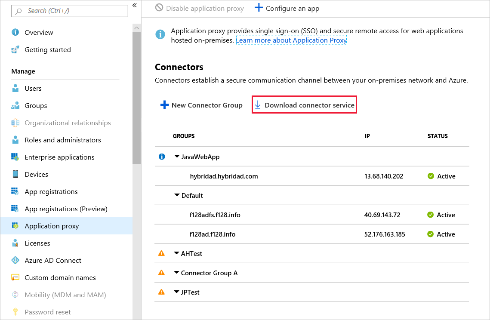
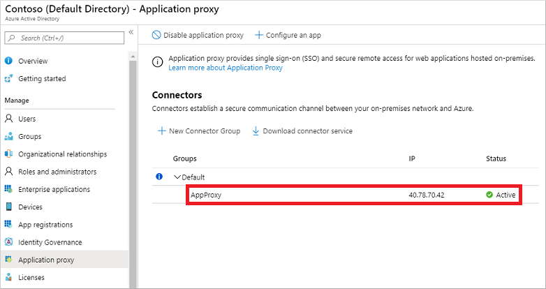
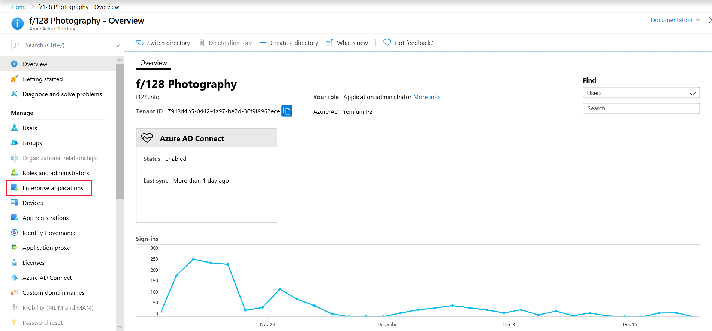

# Integrate with Microsoft Entra application proxy on a Network Device Enrollment Service (NDES) server

Learn how to use Microsoft Entra application proxy to protect your Network Device Enrollment Service (NDES).

## Install and register the connector on the NDES server

1. Sign in to the [Microsoft Entra admin center](https://entra.microsoft.com) as at least an [Application Administrator](~/identity/role-based-access-control/permissions-reference.md#application-administrator).
1. Select your username in the upper-right corner. Verify you're signed in to a directory that uses application proxy. If you need to change directories, select **Switch directory** and choose a directory that uses application proxy.
1. Browse to **Entra ID** > **Enterprise apps** > **Application proxy**.
1. Select **Download connector service**.
    
1. Read the Terms of Service. When you're ready, select **Accept terms & Download**.
1. Copy the Microsoft Entra private network connector setup file to your NDES server. 
   > You install the connector on any server within your corporate network with access to NDES. You don't have to install it on the NDES server itself.
1. Run the setup file, such as *MicrosoftEntraPrivateNetworkConnectorInstaller.exe*. Accept the software license terms.
1. During the install, you're prompted to register the connector with application proxy in your Microsoft Entra directory.
    Provide the credentials for an Application Administrator in your Microsoft Entra directory. The Microsoft Entra Application Administrator credentials are often different from your Azure credentials in the portal.

    > [!NOTE]
    > The account with the Application Administrator role used to register the connector must belong to the same directory where you enable the application proxy service.
    >
    > For example, if the Microsoft Entra domain is *contoso.com*, the Application Administrator should be `admin@contoso.com` or another valid alias on that domain.

   If Internet Explorer Enhanced Security Configuration is turned on for the server where you install the connector, the registration screen might be blocked. To allow access, follow the instructions in the error message, or turn off Internet Explorer Enhanced Security during the install process.
   
    If connector registration fails, see [Troubleshoot application proxy](application-proxy-troubleshoot.md).
1. At the end of the setup, a note is shown for environments with an outbound proxy. To configure the Microsoft Entra private network connector to work through the outbound proxy, run the provided script, such as `C:\Program Files\Microsoft Entra private network connector\ConfigureOutBoundProxy.ps1`.
1. On the Application proxy page in the Microsoft Entra admin center, the new connector is listed with a status of *Active*, as shown in the example.
    
    > [!NOTE]
    > To provide high availability for applications authenticating through the Microsoft Entra application proxy, you can install connectors on multiple VMs. Repeat the same steps listed in the previous section to install the connector on other servers joined to the Microsoft Entra Domain Services managed domain.
1. After successful installation, go back to the Microsoft Entra admin center.
1. Select **Enterprise applications**.
   
1. Select **+New Application**, and then select **On-premises application**. 
1. On the **Add your own on-premises application**, configure the fields.
   
    **Name**: Enter a name for the application.
   
    **Internal Url**: Enter the internal URL/FQDN of your NDES server on which you installed the connector.

    **Pre Authentication**: Select **Passthrough**. It’s not possible to use any form of pre authentication. The protocol used for certificate requests, Simple Certificate Enrollment Protocol (SCEP), doesn't provide such option.

    Copy the provided **External URL** to your clipboard.
1. Select **+Add** to save your application.
1. Test whether you can access your NDES server via the Microsoft Entra application proxy by pasting the link you copied in step 15 into a browser. You should see a default Internet Information Services (IIS) welcome page.
1. As a final test, add the *mscep.dll* path to the existing URL you pasted in the previous step.
    `https://scep-test93635307549127448334.msappproxy.net/certsrv/mscep/mscep.dll`
1. You should see an **HTTP Error 403 – Forbidden** response.
1. Change the NDES URL provided (via Microsoft Intune) to devices. This change could either be in Microsoft Configuration Manager or the Microsoft Intune admin center.
    - For Configuration Manager, go to the certificate registration point and adjust the URL. This URL is what devices call out to and present their challenge.
    - For Intune standalone, either edit or create a new SCEP policy and add the new URL.

## Next steps

- [Tutorial: Add an on-premises application for remote access through application proxy in Microsoft Entra ID](./application-proxy-add-on-premises-application.md)
