# Using Application Gateway WAF to protect your applications

Add Web Application Firewall (WAF) protection for apps published with Microsoft Entra application proxy.

To learn more about Web Application Firewall, see  [What is Azure Web Application Firewall on Azure Application Gateway?][waf-overview].

## Deployment steps

This article provides the steps to securely expose a web application on the Internet using Microsoft Entra application proxy with Azure WAF on Application Gateway.

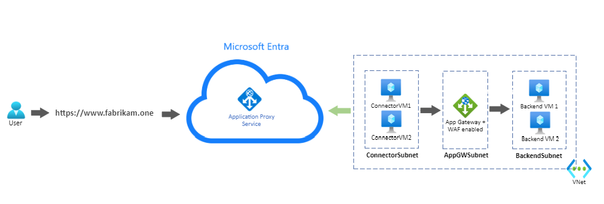

### Configure Azure Application Gateway to send traffic to your internal application

Some steps of the Application Gateway configuration are omitted in this article. For a detailed guide on creating and configuring an Application Gateway, see [Quickstart: Direct web traffic with Azure Application Gateway - Microsoft Entra admin center][appgw_quick].

### 1. Create a private-facing HTTPS listener

Create a listener so users can access the web application privately when connected to the corporate network.

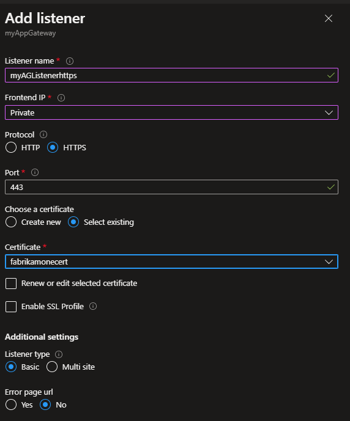

### 2. Create a backend pool with the web servers

In this example, the backend servers have Internet Information Services (IIS) installed. 

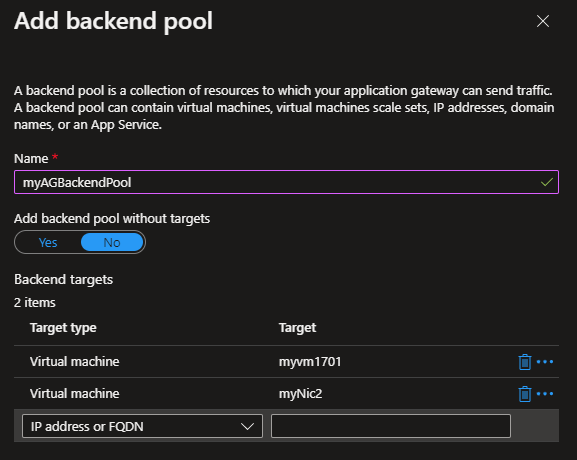

### 3. Create a backend setting

A backend setting determines how requests reach the backend pool servers.

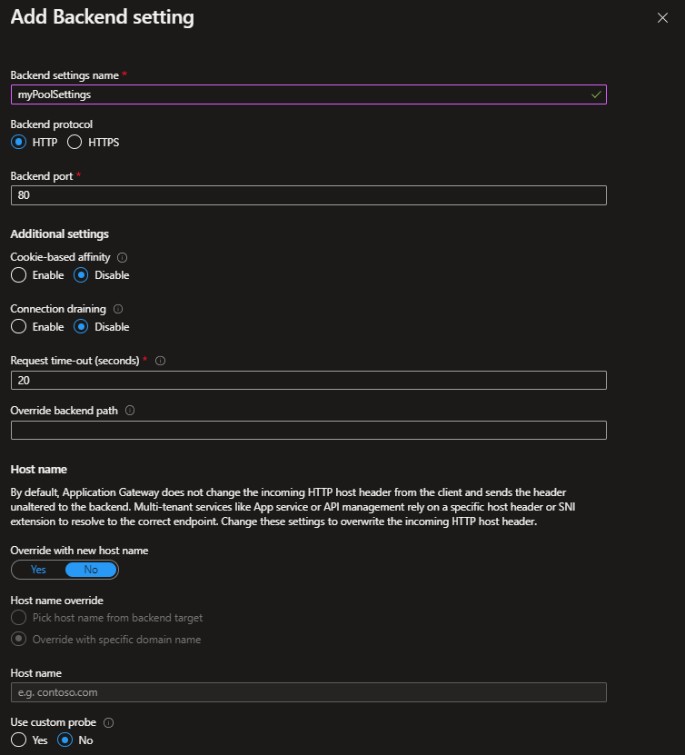
 
 ### 4. Create a routing rule that ties the listener, the backend pool, and the backend setting created in the previous steps
 
 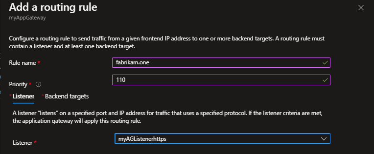
 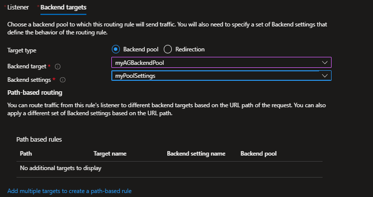
 
 ### 5. Enable the WAF in the Application Gateway and set it to Prevention mode
 
 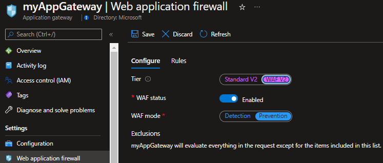
 
 

## Configure your application to be remotely accessed through application proxy in Microsoft Entra ID
 
Both connector VMs, the Application Gateway, and the backend servers are deployed in the same virtual network in Azure. The setup also applies to applications and connectors deployed on-premises. 

For a detailed guide on how to add your application to application proxy in Microsoft Entra ID, see [Tutorial: Add an on-premises application for remote access through application proxy in Microsoft Entra ID][appproxy-add-app]. For more information about performance considerations concerning the private network connectors, see [Optimize traffic flow with Microsoft Entra application proxy][appproxy-optimize]. 
 
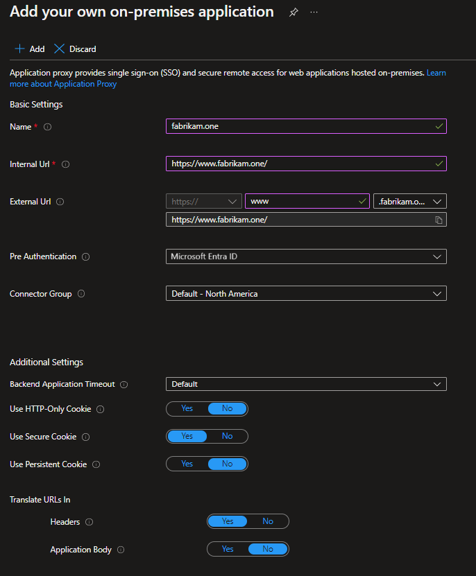

In this example, the same URL was configured as the internal and external URL. Remote clients access the application over the Internet on port 443, through the application proxy. A client connected to the corporate network accesses the application privately. Access is through the Application Gateway directly on port 443. For a detailed step on configuring custom domains in application proxy, see [Configure custom domains with Microsoft Entra application proxy][appproxy-custom-domain].

An [Azure Private Domain Name System (DNS) zone][private-dns] is created with an A record. The A record points `www.fabrikam.one` to the private frontend IP address of the Application Gateway. The record ensures the connector VMs send requests to the Application Gateway.

## Test the application

After [adding a user for testing](./application-proxy-add-on-premises-application.md#add-a-user-for-testing), you can test the application by accessing https://www.fabrikam.one. The user is prompted to authenticate in Microsoft Entra ID, and upon successful authentication, accesses the application. 

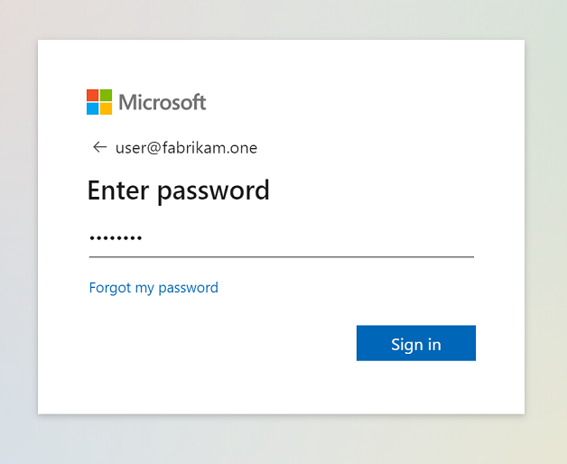
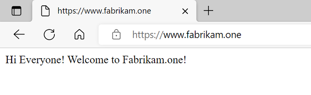

## Simulate an attack

To test if the WAF is blocking malicious requests, you can simulate an attack using a basic SQL injection signature. For example, "https://www.fabrikam.one/api/sqlquery?query=x%22%20or%201%3D1%20--".

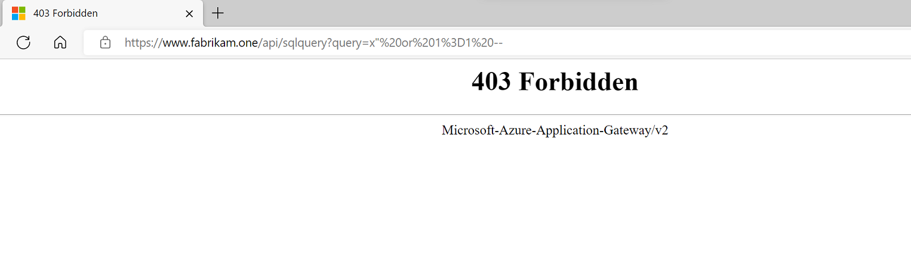

An HTTP 403 response confirms that WAF blocked the request.

The Application Gateway [Firewall logs][waf-logs] provide more details about the request and why WAF is blocking it.

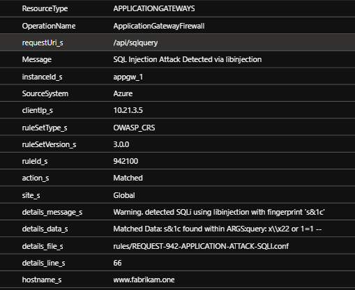

## Next steps

- [Web Application Firewall rules](/azure/web-application-firewall/ag/application-gateway-customize-waf-rules-portal)
- [Web Application Firewall exclusion lists](/azure/web-application-firewall/ag/application-gateway-waf-configuration?tabs=portal)
- [Web Application Firewall custom rules](/azure/web-application-firewall/ag/create-custom-waf-rules)

[waf-overview]: /azure/web-application-firewall/ag/ag-overview
[appgw_quick]: /azure/application-gateway/quick-create-portal
[appproxy-add-app]: ./application-proxy-add-on-premises-application.md
[appproxy-optimize]: ./application-proxy-network-topology.md
[appproxy-custom-domain]: ./how-to-configure-custom-domain.md
[private-dns]: /azure/dns/private-dns-getstarted-portal
[waf-logs]: /azure/application-gateway/application-gateway-diagnostics#firewall-log
