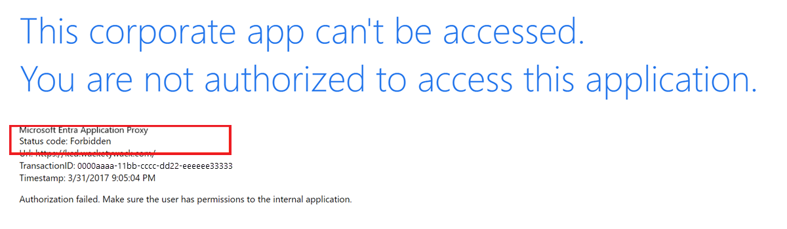

# Troubleshoot Kerberos Constrained Delegation (KCD) configurations with Microsoft Entra application proxy

Single sign-on methods vary from one application to another. Microsoft Entra application proxy provides Kerberos Constrained Delegation (KCD) by default. Users authenticate to private applications using Kerberos. 

This article provides a single point of reference to troubleshoot the most common issues. It also covers diagnosis of more complex implementation problems.

This article makes the following assumptions.
- Deployment of Microsoft Entra application proxy and general access to non-KCD applications. For more information, see [Get started with application proxy](application-proxy-add-on-premises-application.md).
- Published application is based on Internet Information Services (IIS) and the Microsoft implementation of Kerberos.
- Server and application hosts reside in a single Microsoft Entra domain. For more information on cross-domain and forest scenarios, see [KCD white paper](https://aka.ms/KCDPaper).
- Application is published in a Microsoft Entra tenant with preauthentication enabled. Users are expected to authenticate using forms-based authentication. Rich client authentication scenarios aren't covered by this article.

## Prerequisites

Simple misconfigurations or general mistakes cause most issues. Check all prerequisites in [Using KCD single sign-on with the application proxy](how-to-configure-sso-with-kcd.md) before troubleshooting.

Connector hosts aren't restricted to communication with only a specific local site Domain Controller (DC). Check the DC being used as it could change.

Cross-domain scenarios rely on referrals that direct a connector host to DCs that might be outside of the local network perimeter. In these cases, it's equally important to also send traffic onward to DCs that represent other respective domains. If not, delegation fails.

Avoid active Intrusion Prevention System (IPS) or Intrusion Detection System (IDS) devices between connector hosts and DCs. These devices are too intrusive and interfere with core Remote Procedure Call (RPC) traffic.

Test delegation in simple scenarios. The more variables you introduce, the more you might have to contend with. To save time, limit your testing to a single connector. Add more connectors after the issue is resolved.

Some environmental factors might also contribute to an issue. To avoid these factors, minimize architecture as much as possible during testing. For example, misconfigured internal firewall Access Control Lists (ACLs) are common. If possible, send all traffic from a connector straight through to the DCs and back-end application.

The best place to position connectors is as close as possible to their targets. A firewall that sits inline when testing adds unnecessary complexity and can prolong your investigations.

What shows a KCD problem? There are several common indications that KCD single sign-on is failing. The first signs of an issue appear in the browser.


Both images show the same symptom: single sign-on failure. User access to the application is denied.

## Troubleshooting

Separate troubleshooting into the three stages.

### Client pre authentication

The external user authenticating via a browser. The ability to pre authenticate to Microsoft Entra ID is necessary for KCD single sign-on (SSO) to function. Test and address this ability if there are any issues. The pre authentication stage isn't related to KCD or the published application. It's easy to correct any discrepancies by checking that the subject account exists in Microsoft Entra ID. Check that the application not disabled or blocked. The error response in the browser is descriptive enough to explain the cause.

### Delegation service

The private network connector that gets a Kerberos service ticket for users from a Kerberos Key Distribution Center (KCD).

The external communications between the client and the Azure front end have no bearing on KCD. These communications only make sure that KCD works. The application proxy service is provided a valid user ID that is used to get a Kerberos ticket. Without this ID, KCD isn't possible and fails.

The browser error messages provide some good clues about why things fail. Record the `activity ID` and `timestamp` fields in the response. The information helps correlate the behavior to actual events in the application proxy event log.


The corresponding entries seen in the event log show as events 13019 or 12027. Find the connector event logs in **Applications and Services Logs** &gt; **Microsoft** &gt; **Microsoft Entra private network** &gt; **Connector** &gt; **Admin**.

1. Use an **A** record in your internal Domain Name System (DNS) for the application’s address, not a **`CName`**.
1. Reconfirm that the connector host has the right to delegate to the designated target account’s Service Principal Name (SPN). Reconfirm that **Use any authentication protocol** is selected. For more information, see the [SSO configuration article](how-to-configure-sso-with-kcd.md).
1. Verify that there's only one instance of the SPN in existence in Microsoft Entra ID. Issue `setspn -x` from a command prompt on any domain member host.
1. Check that a domain policy is enforced that limits the [maximum size of issued Kerberos tokens](/archive/blogs/askds/maxtokensize-and-windows-8-and-windows-server-2012). The policy stops the connector from getting a token if it's excessive.

A network trace that captures exchanges between the connector host and a domain Kerberos Constrained Delegation (KDC) is the next best step to get more low-level detail on the issues. For more information, see the [deep dive Troubleshoot paper](https://aka.ms/proxytshootpaper).

If ticketing looks good, you see an event in the logs stating that authentication failed because the application returned a 401. This event indicates that the target application rejected your ticket. Go to the next stage.

### Target application

The consumer of the Kerberos ticket the connector provided. At this stage, expect the connector sent a Kerberos service ticket to the back end. The ticket is a header in the first application request.

1. By using the application’s internal URL defined in the portal, validate that the application is accessible directly from the browser on the connector host. Then you can sign in successfully. Details can be found on the connector **Troubleshoot** page.
1. Confirm that authentication between the browser and the application uses Kerberos.
1. Run DevTools (**F12**) in Internet Explorer, or use [Fiddler](https://blogs.msdn.microsoft.com/crminthefield/2012/10/10/using-fiddler-to-check-for-kerberos-auth/) from the connector host. Go to the application by using the internal URL. To make sure that either negotiate or Kerberos is present, inspect the offered web authorization headers returned in the response from the application.

   - The next Kerberos blob that is returned in the response from the browser to the application starts with **YII**. These letters tell you that Kerberos is running. Microsoft NT LAN Manager (NTLM), on the other hand, always starts with **TlRMTVNTUAAB**, which reads NTLM Security Support Provider (NTLMSSP) when decoded from Base64. If you see **TlRMTVNTUAAB** at the start of the blob, Kerberos isn't available. If you don’t see **TlRMTVNTUAAB**, Kerberos is likely available.

      > [!NOTE]
      > If you use Fiddler, this method requires that you temporarily disable extended protection on the application’s configuration in IIS.

      

   - The blob in this figure doesn't start with **TIRMTVNTUAAB**. So in this example, Kerberos is available, and the Kerberos blob doesn’t start with **YII**.

1. Temporarily remove NTLM from the providers list on the IIS site. Access the app directly from Internet Explorer on the connector host. NTLM is no longer in the providers list. You can access the application by using Kerberos only. If access fails, there might be a problem with the application’s configuration. Kerberos authentication isn't functioning.

   - If Kerberos isn't available, check the application’s authentication settings in IIS. Make sure **Negotiate** is listed at the top, with NTLM just beneath it. If you see **Not Negotiate**, **Kerberos or Negotiate**, or **PKU2U**, continue only if Kerberos is functional.

     

   - With Kerberos and NTLM in place, temporarily disable preauthentication for the application in the portal. Try to access it from the internet by using the external URL. You're prompted to authenticate. You're able to do so with the same account used in the previous step. If not, there's a problem with the back-end application, not KCD.

   - Re-enable preauthentication in the portal. Authenticate through Azure by attempting to connect to the application via its external URL. If SSO fails, you see a forbidden error message in the browser and event 13022 in the log:

     *Microsoft Entra private network connector can't authenticate the user because the backend server responds to Kerberos authentication attempts with an HTTP 401 error.*

      

   - Check the IIS application. Make sure that the configured application pool and the SPN are configured to use the same account in Microsoft Entra ID. Navigate in IIS as shown in the following illustration.

      

      After you know the identity, make sure this account is configured with the SPN in question. An example is `setspn –q http/spn.wacketywack.com`. Enter the following text in a command prompt.

      

   - Check the SPN defined against the application’s settings in the portal. Make sure that the same SPN configured against the target Microsoft Entra account is used by the application’s app pool.

   - Go into IIS and select the **Configuration Editor** option for the application. Navigate to **system.webServer/security/authentication/windowsAuthentication**. Make sure the value **UseAppPoolCredentials** is **True**.

      

      Change the value to **True**. Remove all cached Kerberos tickets from the back-end server by running the command.

      ```powershell
      Get-WmiObject Win32_LogonSession | Where-Object {$_.AuthenticationPackage -ne 'NTLM'} | ForEach-Object {klist.exe purge -li ([Convert]::ToString($_.LogonId, 16))}
      ```

If you leave Kernel mode enabled, it improves the performance of Kerberos operations. But it also causes the ticket for the requested service to be decrypted by using the machine account. This account is also called the Local system. Set this value to **True** to break KCD when the application is hosted across more than one server in a farm.

- As another check, disable **Extended** protection too. In some scenarios, **Extended** protection broke KCD when it was enabled in specific configurations. In those cases, an application was published as a subfolder of the default website. This application is configured for anonymous authentication only. All the dialogs are grayed out, which suggests child objects wouldn't inherit any active settings. We recommend that you test, but don’t forget to restore this value to **enabled**, where possible.

  This extra check puts you on track to use your published application. You can spin up more connectors that are also configured to delegate. For more information, read the more in-depth technical walk-through, [Troubleshooting the Microsoft Entra application proxy](https://aka.ms/proxytshootpaper).

If you still can't make progress, Microsoft support can assist you. Create a support ticket directly within the portal.

## Other scenarios

Microsoft Entra application proxy requests a Kerberos ticket before sending its request to an application. Some applications don't like this method of authenticating. These applications expect the more conventional negotiations to take place. The first request is anonymous, which allows the application to respond with the authentication types that it supports through a 401. This type of Kerberos negotiation can be enabled using the steps outlined in this document: [Kerberos Constrained Delegation for single sign-on](how-to-configure-sso-with-kcd.md).

Multi-hop authentication is commonly used in scenarios where an application is tiered. The tiers include a back end and front end. Both tiers require authentication. For example, SQL Server Reporting Services. For more information, see [How to configure Kerberos Constrained Delegation for Web Enrollment proxy pages](/troubleshoot/windows-server/identity/configure-kerberos-constrained-delegation).

## Next steps

[Configure KCD on a managed domain](/entra/identity/domain-services/deploy-kcd).
