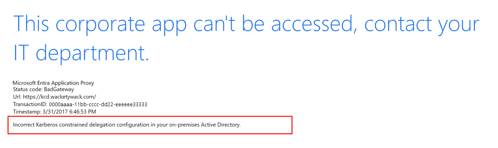
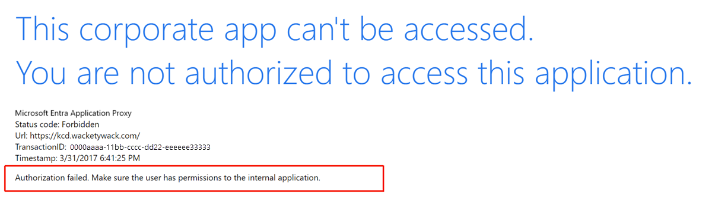

# Troubleshoot Kerberos constrained delegation

Single sign-on (SSO) methods vary between applications. Microsoft Entra application proxy provides Kerberos constrained delegation (KCD) by default. In application proxy, a user authenticates to a private application by using Kerberos.

This article describes how to troubleshoot the most common problems in KCD configuration. It includes diagnostic steps you can take for more complex implementations.

This article makes the following assumptions:

- Microsoft Entra application proxy is deployed and has general access to non-KCD applications.

   For more information, see [Get started with application proxy](application-proxy-add-on-premises-application.md).
- A published application is based on Internet Information Services (IIS) and the Microsoft implementation of Kerberos.
- Server and application hosts are in a single Microsoft Entra domain.

   For more information on cross-domain and forest scenarios, see the white paper [Understanding Kerberos constrained delegation with application proxy](https://aka.ms/KCDPaper).
- The application is published in a Microsoft Entra tenant with preauthentication enabled. Users are expected to authenticate by using forms-based authentication.

   Rich client authentication scenarios aren't covered in this article.

## Considerations

The following list describes foundational considerations for KCD configuration and use with Microsoft Entra application proxy:

- Basic misconfigurations or general mistakes cause most issues. Before you begin to troubleshoot, check all prerequisites in [Use KCD SSO with application proxy](how-to-configure-sso-with-kcd.md).

- Connector hosts aren't restricted to communicate with only a specific local site domain controller (DC). Check the DC you use because it might change.

- Cross-domain scenarios rely on referrals that direct a connector host to DCs that might be outside of the local network perimeter. In these cases, it's equally important to send traffic onward to DCs that represent other respective domains. If you don't, delegation fails.

- Avoidance of active Intrusion Prevention System (IPS) or Intrusion Detection System (IDS) devices between connector hosts and domain controllers (DCs) due to interference with core Remote Procedure Call (RPC) traffic.

- Test delegation in a simple scenario. The more variables you introduce in a scenario, the more complex configuration and troubleshooting is. To save time, limit your testing to a single connector. Add more connectors after the issue is resolved.

- Environmental factors might contribute to the cause of an issue. To avoid these factors, minimize architecture as much as possible during testing. For example, misconfigured internal firewall access control lists (ACLs) are common. If possible, send all traffic from a connector directly to the DCs and back-end application.

- The best place to position connectors is as close as possible to their targets. A firewall that sits inline when you test the connector adds unnecessary complexity and can prolong your investigations.

- What indicates a KCD problem? Several common errors indicate that KCD SSO is failing. The first signs of an issue appear in the browser.

  Both of the following screenshots show the same symptom of SSO failure: User access to the application is denied.

  

  

## Troubleshoot

You can troubleshoot KCD problems in three stages. Check these parts of the KCD process in the following order:

- Client preauthentication
- The delegation service
- The target application

### Client preauthentication

*Client preauthentication* refers to an external user authenticating in an application via a browser. The ability to preauthenticate to Microsoft Entra ID is necessary for KCD SSO to work.

Test client preauthentication first, and resolve any issues. The preauthentication stage isn't related to KCD or to the published application. It's easy to correct any discrepancies by checking that the subject account exists in Microsoft Entra ID. Check that the application isn't unavailable or blocked. The error response in the browser typically is descriptive enough to explain the cause.

### The delegation service

The Kerberos delegation service is the private network connector that gets a Kerberos service ticket from a Kerberos Key Distribution Center (KDC). The app user authenticates with the application via the ticket.

External communications between the client and the Azure front end have no effect on constrained delegation. These communications ensure only that KCD works. The application proxy service is given a valid user ID that gets a Kerberos ticket. Without this ID, KCD can't occur and SSO fails.

Browser error messages provide useful information about why sign-in fails. Record the values for `TransactionID` and `Timestamp` in the response to application sign-in. The information helps correlate the behavior to events that appear in the application proxy event log.


The corresponding entries in the event log are event IDs 13019 or 12027. To view the connector event logs, go to **Applications and Services Logs** > **Microsoft** > **Microsoft Entra private network** > **Connector** > **Admin**.

To troubleshoot a constrained delegation issue:

1. In your internal Domain Name System (DNS) for the application address, use an A record, not a CNAME record.
1. Verify that the connector host is configured with permissions to delegate to the target account’s service principal name (SPN). Verify that **Use any authentication protocol** is selected. For more information, see [SSO configuration](how-to-configure-sso-with-kcd.md).
1. Verify that only one instance of the SPN exists in Microsoft Entra ID. To verify a single SPN, at a command prompt on any domain member host, run `setspn -x`.
1. Check that a domain policy that limits the [maximum size of issued Kerberos tokens](/archive/blogs/askds/maxtokensize-and-windows-8-and-windows-server-2012) is enforced. The policy stops the connector from getting a token if the token size exceeds a set maximum.
1. Running a network trace that captures exchanges between the connector host and a domain KCD is the next best step to get more details about the issue. For more information, you can review the in-depth white paper [Troubleshooting the Microsoft Entra application proxy](https://aka.ms/proxytshootpaper).

If ticketing is working correctly, the logs likely show an event that indicates authentication failed because the application returned a 401 error. This event indicates that the target application rejected the ticket. Go to the next stage of troubleshooting.

### The application

The target application processes the Kerberos ticket provided by the connector. At this stage, the connector includes a Kerberos service ticket as a header in the first application request to the back end.

To troubleshoot an application issue:

1. Ensure the application is accessible. Sign in directly from the browser on the connector host using the internal URL defined in the Azure portal. If the sign-in succeeds, the application is accessible.

1. Check if the browser and application are using Kerberos for authentication. From the connector host, use Internet Explorer's DevTools (press **F12**) or [Fiddler](https://blogs.msdn.microsoft.com/crminthefield/2012/10/10/using-fiddler-to-check-for-kerberos-auth/) to access the application via the internal URL. Look for "Negotiate" or "Kerberos" in the web authorization headers in the application's response.

   The browser response to the application includes a Kerberos blob that starts with `YII`, confirming that Kerberos is running. In contrast, a response from Microsoft NT LAN Manager (NTLM) always begins with `TlRMTVNTUAAB`. When decoded from Base64, this response reads NTLM Security Support Provider (NTLMSSP). If the blobs start with `TlRMTVNTUAAB`, Kerberos isn't available. If it doesn't, Kerberos is likely available.

   > [!NOTE]
   > If you use Fiddler, you must temporarily disable extended protection on the application configuration in IIS.

   

   The blob in this screenshot doesn't start with `TIRMTVNTUAAB`. So in this example, Kerberos is available, and the Kerberos blob doesn’t start with `YII`.

1. On the IIS site, temporarily remove NTLM from the providers list. Access the app directly from Internet Explorer on the connector host. NTLM is no longer in the providers list, so you can access the application only by using Kerberos. If access fails, a problem with the application’s configuration is indicated. The application isn't processing Kerberos authentication.

1. If Kerberos isn't available, check the application’s authentication settings in IIS. Make sure that **Negotiate** is listed at the top, and NTLM is just below it. If you see **Not Negotiate**, **Kerberos or Negotiate**, or **PKU2U**, continue only if Kerberos is functional.

   

1. With Kerberos and NTLM in place, in the portal, temporarily disable preauthentication for the application. Try to access the application in a browser by using the external URL. You're prompted to authenticate. Use the same account that you used in a previous step. If you can't authenticate and sign in, there's a problem with the back-end application, not with KCD.

1. Re-enable preauthentication in the portal. Authenticate through Azure by attempting to connect to the application via its external URL. If SSO fails, you see a "forbidden" error message in the browser and event ID 13022 in the log:

   `Microsoft Entra private network connector can't authenticate the user because the backend server responds to Kerberos authentication attempts with an HTTP 401 error.`

   

1. Check the IIS application. Make sure that the configured application pool and the SPN are configured to use the same account in Microsoft Entra ID. In IIS, go to the folder as shown in the following screenshot:

   

   Check the identity, and then make sure this account is configured with the SPN. At a command prompt, for example, run `setspn –q http/spn.contoso.com`.

   

1. In the portal, check the defined SPN against the application settings. Make sure that the application’s app pool uses the same SPN that is set for the target Microsoft Entra account.

1. In IIS, select the **Configuration Editor** option for the application. Go to **system.webServer/security/authentication/windowsAuthentication**. Make sure that the value for **UseAppPoolCredentials** is **True**.

   

   Change the value to **True** if needed. Remove all cached Kerberos tickets from the back-end server by running the following command:

   ```powershell
   Get-WmiObject Win32_LogonSession | Where-Object {$_.AuthenticationPackage -ne 'NTLM'} | ForEach-Object {klist.exe purge -li ([Convert]::ToString($_.LogonId, 16))}
   ```

1. If Kernel mode is enabled, Kerberos operations improve. But the ticket for the requested service also must be decrypted by using the machine account. This account is also called the *Local system*. Set this value to **True** to break KCD when the application is hosted across more than one server in a farm.

1. As another check, disable extended protection. In some test scenarios, extended protection broke KCD when it was enabled in specific configurations. In those cases, an application was published as a subfolder of the default website. This application is configured for anonymous authentication only. All the dialogs are inactive, with no available selection, which suggests that child objects wouldn't inherit any active settings. We recommend that you test, but don’t forget to restore this value to **enabled** if possible.

   This extra check puts you on track to use your published application. You can generate more connectors that are also configured to delegate. For more information, read the more in-depth technical walkthrough [Troubleshooting the Microsoft Entra application proxy](https://aka.ms/proxytshootpaper).

If you still can't resolve the application authentication issue, create a support ticket directly in the portal.

## Other scenarios

Microsoft Entra application proxy requests a Kerberos ticket before it sends a request to an application. Some applications don't support this method of authenticating. These applications are set up to respond to more conventional authentication steps. The first request is anonymous, which allows the application to respond with the authentication types that it supports through a 401 error. You can set up this type of Kerberos negotiation by completing the steps described in [Kerberos constrained delegation for SSO](how-to-configure-sso-with-kcd.md).

Multi-hop authentication is commonly used when an application is tiered. The tiers include a back end and a front end. Both tiers require authentication. For example, you can create a tiered application by using SQL Server Reporting Services. For more information, see [How to configure Kerberos constrained delegation for web enrollment proxy pages](/troubleshoot/windows-server/identity/configure-kerberos-constrained-delegation).

## Related content

- [Set up KCD on a managed domain](/entra/identity/domain-services/deploy-kcd)
