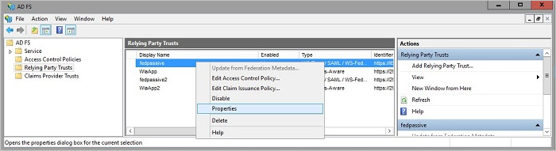
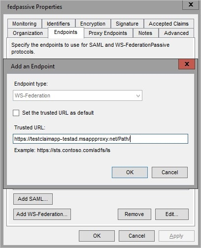

# Working with claims-aware apps in application proxy
[Claims-aware apps](/previous-versions/windows/desktop/legacy/bb736227(v=vs.85)) perform a redirection to the Security Token Service (STS). The STS requests credentials from the user in exchange for a token and then redirects the user to the application. There are a few ways to enable application proxy to work with these redirects. Use this article to configure your deployment for claims-aware apps. 

## Prerequisites
The STS that the claims-aware app redirects to must be available outside of your on-premises network. Expose it through a proxy or by allowing outside connections. 

## Publish your application

1. Publish your application according to the instructions described in [Publish applications with application proxy](~/identity/app-proxy/application-proxy-add-on-premises-application.md).
2. Navigate to the application page in the portal and select **Single sign-on**.
3. If you chose **Microsoft Entra ID** as your **Preauthentication Method**, select **Microsoft Entra single sign-on disabled** as your **Internal Authentication Method**. If you chose **Passthrough** as your **Preauthentication Method**, you don't need to change anything.

## Configure Active Directory Federation Services

You can configure Active Directory Federation Services for claims-aware apps in one of two ways. The first is by using custom domains. The second is with WS-Federation. 

### Option 1: Custom domains

If all the internal URLs for your applications are fully qualified domain names (FQDNs), then you can configure [custom domains](how-to-configure-custom-domain.md) for your applications. Use the custom domains to create external URLs that are the same as the internal URLs. When your external URLs match your internal URLs, then the STS redirections work whether your users are on-premises or remote. 

### Option 2: WS-Federation

1. Open Active Directory Federation Services management.
2. Go to **Relying Party Trusts**, right-click on the app you're publishing with application proxy, and choose **Properties**.  

     

3. On the **Endpoints** tab, under **Endpoint type**, select **WS-Federation**.
4. Under **Trusted URL**, enter the URL you entered in the application proxy under **External URL** and select **OK**.  

     

## Next steps
* [Enable native client apps to interact with proxy applications](application-proxy-configure-native-client-application.md)
