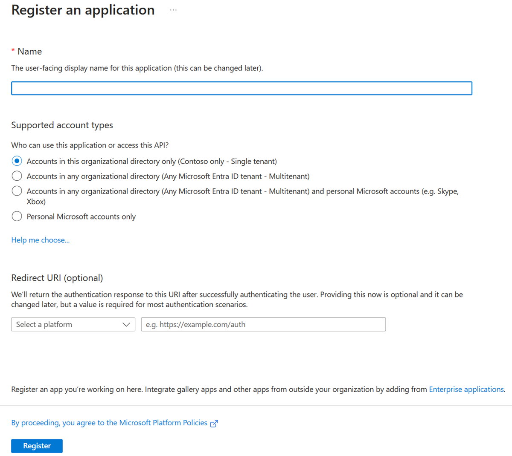

# How to enable native client applications to interact with proxy applications

Microsoft Entra application proxy is used to publish web apps. You can also use it to publish native client applications configured with the Microsoft Authentication Library (MSAL). Client applications differ from web apps because they're installed on a device, while web apps are accessed through a browser.

To support native client applications, application proxy accepts Microsoft Entra ID-issued tokens that are sent in the header. The application proxy service does the authentication for the users. This solution doesn't use application tokens for authentication.


To publish native applications, use the Microsoft Authentication Library, which takes care of authentication and supports many client environments. Application proxy fits into the [Desktop app that calls a web API on behalf of a signed-in user](~/identity-platform/authentication-flows-app-scenarios.md#desktop-app-that-calls-a-web-api-on-behalf-of-a-signed-in-user) scenario.

This article walks you through the four steps to publish a native application with application proxy and the Microsoft Authentication Library (MSAL).

## Step 1: Publish your proxy application

Publish your proxy application as you would any other application and assign users to access your application. For more information, see [Publish applications with application proxy](~/identity/app-proxy/application-proxy-add-on-premises-application.md).

## Step 2: Register your native application

You now need to register your application in Microsoft Entra ID.
1. Sign in to the [Microsoft Entra admin center](https://entra.microsoft.com) as at least an [Application Administrator](~/identity/role-based-access-control/permissions-reference.md#application-administrator).
1. Select your username in the upper-right corner. Verify you're signed in to a directory that uses application proxy. If you need to change directories, select **Switch directory** and choose a directory that uses application proxy.
1. Browse to **Identity** > **Applications** > **App registrations**. The list of all app registrations appears.
1. Select **New registration**. The **Register an application** page appears.

   

1. In the **Name** heading, specify a user-facing display name for your application.
1. Under the **Supported account types** heading, select an access level using these guidelines.

   - To target only accounts that are internal to your organization, select **Accounts in this organizational directory only**.
   - To target only business or educational customers, select **Accounts in any organizational directory**.
   - To target the widest set of Microsoft identities, select **Accounts in any organizational directory and personal Microsoft accounts**.
1. Under **Redirect URI**, select **Public client (mobile & desktop)**, and then type the redirect URI `https://login.microsoftonline.com/common/oauth2/nativeclient` for your application.
1. Select and read the **Microsoft Platform Policies**, and then select **Register**. An overview page for the new application registration is created and displayed.

For more detailed information about creating a new application registration, see [Integrating applications with Microsoft Entra ID](~/identity-platform/quickstart-register-app.md).

## Step 3: Grant access to your proxy application

Your native application is registered. Give it access to the proxy application:

1. In the sidebar of the new application registration page, select **API permissions**. The **API permissions** page for the new application registration appears.
1. Select **Add a permission**. The **Request API permissions** page appears.
1. Under the **Select an API** setting, select **APIs my organization uses**. A list appears, containing the applications in your directory that expose APIs.
1. Type in the search box or scroll to find the proxy application that you published in [Step 1: Publish your proxy application](#step-1-publish-your-proxy-application), and then select the proxy application.
1. In the **What type of permissions does your application require?** heading, select the permission type. If your native application needs to access the proxy application API as the signed-in user, choose **Delegated permissions**.
1. In the **Select permissions** heading, select the desired permission, and select **Add permissions**. The **API permissions** page for your native application now shows the proxy application and permission API that you added.

## Step 4: Add the Microsoft Authentication Library to your code (.NET C# sample)

Edit the native application code in the authentication context of the Microsoft Authentication Library (MSAL) to include the following text: 

```         
// Acquire access token from Microsoft Entra ID for proxy application
IPublicClientApplication clientApp = PublicClientApplicationBuilder
.Create(<App ID of the Native app>)
.WithDefaultRedirectUri() // will automatically use the default Uri for native app
.WithAuthority("https://login.microsoftonline.com/{<Tenant ID>}")
.Build();

AuthenticationResult authResult = null;
var accounts = await clientApp.GetAccountsAsync();
IAccount account = accounts.FirstOrDefault();

IEnumerable<string> scopes = new string[] {"<Scope>"};

try
 {
    authResult = await clientApp.AcquireTokenSilent(scopes, account).ExecuteAsync();
 }
    catch (MsalUiRequiredException ex)
 {
     authResult = await clientApp.AcquireTokenInteractive(scopes).ExecuteAsync();                
 }

if (authResult != null)
 {
  //Use the Access Token to access the Proxy Application

  HttpClient httpClient = new HttpClient();
  httpClient.DefaultRequestHeaders.Authorization = new AuthenticationHeaderValue("Bearer", authResult.AccessToken);
  HttpResponseMessage response = await httpClient.GetAsync("<Proxy App Url>");
 }
```

The required info in the sample code can be found in the Microsoft Entra admin center, as follows:

| Info required | How to find it in the Microsoft Entra admin center |
| --- | --- |
| \<Tenant ID> | **Identity** > **Overview** > **Properties** |
| \<App ID of the Native app> | **Application registration** > *your native application* > **Overview** > **Application ID** |
| \<Scope> | **Application registration** > *your native application* > **API permissions** > select on the Permission API (user_impersonation) > A panel with the caption **user_impersonation** appears on the right hand side. > The scope is the URL in the edit box.
| \<Proxy App URL> | the External URL and path to the API

After you edit the MSAL code with these parameters, your users can authenticate to native client applications even when they're outside of the corporate network.

## Next steps

For more information about the native application flow, see [mobile](~/identity-platform/authentication-flows-app-scenarios.md#mobile-app-that-calls-a-web-api-on-behalf-of-an-interactive-user) and [desktop](~/identity-platform/authentication-flows-app-scenarios.md#desktop-app-that-calls-a-web-api-on-behalf-of-a-signed-in-user) apps in Microsoft Entra ID.

Learn about setting up [Single sign-on to applications in Microsoft Entra ID](~/identity/enterprise-apps/plan-sso-deployment.md#choosing-a-single-sign-on-method).
