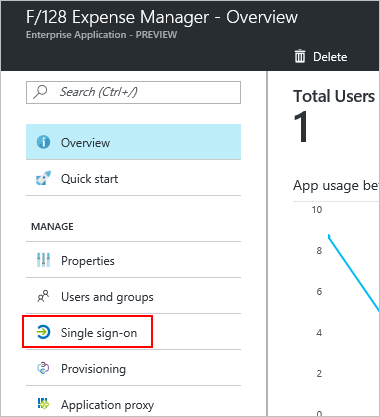
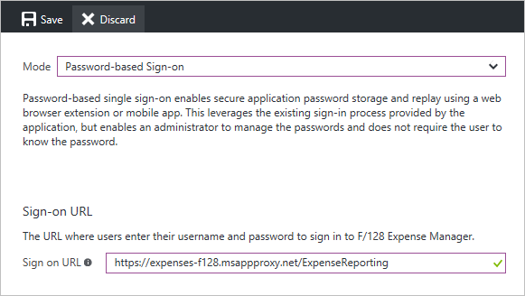

# Password vaulting for single sign-on with application proxy

Microsoft Entra application proxy helps you improve productivity by publishing on-premises applications so that remote employees can securely access them. In the Microsoft Entra admin center, you can also set up single sign-on (SSO) to these apps. Your users only need to authenticate with Microsoft Entra ID, and they can access your enterprise application without having to sign in again.

Application proxy supports several [single sign-on modes](~/identity/enterprise-apps/plan-sso-deployment.md#choosing-a-single-sign-on-method). Password-based sign-on is intended for applications that use a username and password combination for authentication. Microsoft Entra ID stores the sign-in information and automatically provides it to the application when your users access it remotely.

## Prerequisites

This article requires that an app is published and tested with application proxy. To learn more, see [Publish applications using Microsoft Entra application proxy](application-proxy-add-on-premises-application.md).

## Set up password vaulting for your application

1. Sign in to the [Microsoft Entra admin center](https://entra.microsoft.com) as at least an [Application Administrator](~/identity/role-based-access-control/permissions-reference.md#application-administrator).
1. Browse to **Entra ID** > **Enterprise apps** > **All applications**.
1. From the list, select the app that you want to set up with SSO.  
1. Select **application proxy**. 
1. Change the **Pre Authentication type** to **Passthrough** and select **Save**. Later you can switch back to **Microsoft Entra ID** type again.
1. Select **Single sign-on**.

   

1. For the SSO mode, choose **Password-based Sign-on**.
1. For the Sign-on URL, enter the URL for the page where users enter their username and password to sign in to your app outside of the corporate network. The page could be the External URL that you created when you published the app through application proxy.

   

1. Select **Save**.
1. Select **application proxy**. 
1. Change the **Pre Authentication type** to **Microsoft Entra ID** and select **Save**. 
1. Select **Users and Groups**.
1. Assign users to the application.
1. Select **Add user**. 
1. If you want to predefine credentials for a user, check the box in front of the user name and select **Update credentials**.
1. Browse to **Entra ID** > **App registrations** > **All applications**.
1. From the list, select the app that you configured with Password SSO.
1. Select **Branding**. 
1. Update the **Home page URL** with the **Sign on URL** from the password SSO page and select **Save**.  

<!-- Need to repro?
7. The page should tell you that a sign-in form was successfully detected at the provided URL. If it doesn't, select **Configure [your app name] Password Single Sign-on Settings** and choose **Manually detect sign-in fields**. Follow the instructions to point out where the sign-in credentials go. 
-->

## Test your app

Go to the My Apps portal. Sign in with your credentials (or the credentials for a test account that you set up with access). Once signed in successfully, select the icon of the app. Opening the My Apps portal might trigger the installation of the My Apps Secure Sign-in browser extension. If credentials are predefined, the authentication to the app should happen automatically, otherwise you must specify the user name or password for the first time. 

## Next steps

- Read about other ways to implement [Single sign-on](~/identity/enterprise-apps/what-is-single-sign-on.md)
- Learn about [Security considerations for accessing apps remotely with Microsoft Entra application proxy](application-proxy-security.md)
