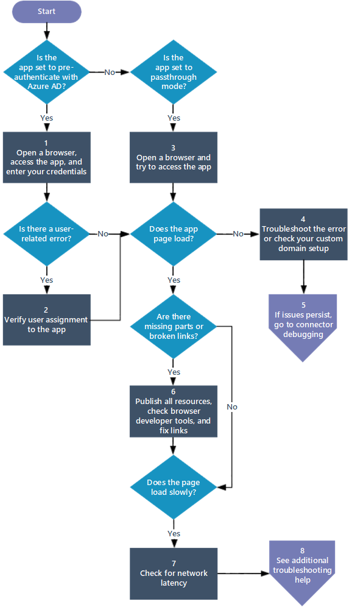

# Debug application proxy issues

This article explains how to troubleshoot issues with Microsoft Entra application proxy. Use the flowchart to fix remote access issues for an on-premises web application.

## Before you begin

First, check the connector. Learn how in [Debug private network connector issues](application-proxy-debug-connectors.md).

## Flowchart for application issues

This flowchart helps you debug and fix common issues with the Microsoft Entra application proxy.

The table after the flowchart contains details about each step.

| Step | Goal | Action |
|---------|---------|---------|
|1 | Sign in and check for user-related errors | Open a browser and sign into the app with your username and password. Check for errors like [This corporate app can't be accessed](application-proxy-sign-in-bad-gateway-timeout-error.md). |
|2 | Verify user permissions and test app access | Make sure your user account has permissions for the app from inside the corporate network. Then test signing into the app by following the steps in [Test the application](application-proxy-add-on-premises-application.md#test-the-application). If sign-in issues continue, check [Troubleshoot sign-in errors](~/identity/monitoring-health/concept-provisioning-logs.md?context=azure/active-directory/manage-apps/context/manage-apps-context). |
|3 | Confirm correct application proxy configuration | Open a browser and use the app. If an error appears immediately, check if the application proxy is set up correctly. For details about specific error messages, see [Troubleshoot application proxy problems and error messages](application-proxy-troubleshoot.md). |
|4 | Ensure custom domain setup is correct or troubleshoot errors | If the page doesn't display, check if your custom domain is set up correctly. Review the information in [Work with custom domains](how-to-configure-custom-domain.md).  If the page doesn't load and an error message appears, troubleshoot the error using the information in [Troubleshoot application proxy problems and error messages](application-proxy-troubleshoot.md).  If it takes longer than 20 seconds before an error message appears, there might be a connectivity issue. Follow the steps in [Debug private network connectors](application-proxy-debug-connectors.md). |
|5 | Debug connectivity issues between the proxy and the connector | If issues persist, try connector debugging. Complete the steps described in [Debug private network connectors](application-proxy-debug-connectors.md). |
|6 | Publish all resources and resolve publishing issues | Ensure the publishing path includes all the necessary images, scripts, and style sheets for your application. For details, see [Add an on-premises app to Microsoft Entra ID](application-proxy-add-on-premises-application.md).  Use the browser's developer tools (F12 tools in Internet Explorer or Microsoft Edge) for troubleshooting publishing issues. See [Application page doesn't display correctly](application-proxy-page-appearance-broken-problem.md).  Review options to fix broken links in [Links on the page don't work](application-proxy-page-links-broken-problem.md). |
|7 | Minimize network latency | If the page loads slowly, explore ways to reduce network latency in [Considerations for reducing latency](application-proxy-network-topology.md#considerations-for-reducing-latency). |
|8 | Access more troubleshooting resources | If issues persist, review more articles about [troubleshooting application proxy](application-proxy-troubleshoot.md). |

## Related content

- [Understand private network connectors](application-proxy-connectors.md).
- [Work with existing on-premises proxy servers](application-proxy-configure-connectors-with-proxy-servers.md).
- [Troubleshoot application proxy and connector errors](application-proxy-troubleshoot.md).
