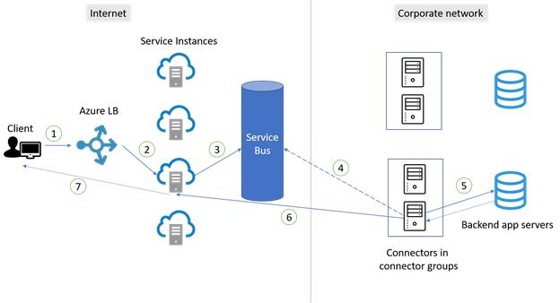
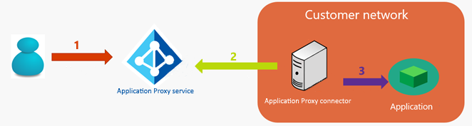

# High availability and load balancing of your private network connectors and applications

This article explains how traffic distribution works with your application proxy deployment. Learn how traffic is distributed among users and connectors, along with tips for optimizing connector performance. Learn how traffic flows between connectors and back-end app servers, with recommendations for load balancing among multiple back-end servers.

## Traffic distribution across connectors

Connectors establish their connections based on principles for high availability. There's no guarantee that traffic is evenly distributed across connectors and there's no session affinity. However, usage varies and requests are randomly sent to application proxy service instances. As a result, traffic is typically distributed almost evenly across the connectors. The diagram and steps illustrate how connections are established between users and connectors.

1. A user on a client device tries to access an on-premises application published through application proxy.
2. The request goes through an Azure Load Balancer to determine which application proxy service instance should take the request. There are tens of instances available to accept the requests for all traffic in the region. This method helps to evenly distribute the traffic across the service instances.
3. The request is sent to [Service Bus](/azure/service-bus-messaging/).
4. Service Bus signals to an available connector. The connector then picks up the request from Service Bus.
   - In step 2, requests go to different application proxy service instances, so connections are more likely to be made with different connectors. As a result, connectors are almost evenly used within the group.
5. The connector passes the request to the application’s back-end server. Then the application sends the response back to the connector.
6. The connector completes the response by opening an outbound connection to the service instance from where the request came. Then this connection is immediately closed. By default, each connector is limited to 200 concurrent outbound connections.
7. The response is then passed back to the client from the service instance.
8. Subsequent requests from the same connection repeat the steps.

An application often has many resources and opens multiple connections when under load. Each connection goes through the steps to become allocated to a service instance. If the connection isn't paired with a connector, select a new available connector.

## Best practices for high availability of connectors

- Because of the way traffic is distributed among connectors for high availability, it's essential to always have at least two connectors in a connector group. Three connectors are preferred to provide extra buffer among connectors. To determine the correct number of connectors you needed, follow capacity planning documentation.

- Place connectors on different outbound connections to avoid a single point of failure. If connectors use the same outbound connection, a network problem with the connection impacts all connectors using it.

- Avoid forcing connectors to restart when connected to production applications. Doing so could negatively affect the distribution of traffic across connectors. Restarting connectors causes more connectors to be unavailable and forces connections to the remaining available connector. The result is an uneven use of the connectors initially.

- Avoid all forms of inline inspection on outbound Transport Layer Security (TLS) communications between connectors and Azure. This type of inline inspection causes degradation to the communication flow.

- Make sure to keep automatic updates running for your connectors. If the private network connector Updater service is running, your connectors update automatically and receive the latest upgraded. If you don’t see the Connector Updater service on your server, you need to reinstall your connector to get any updates.

## Traffic flow between connectors and back-end application servers

Another key area where high availability is a factor is the connection between connectors and the back-end servers. When an application is published through Microsoft Entra application proxy, traffic from the users to the applications flows through three hops:

1. The user connects to the Microsoft Entra application proxy service public endpoint on Azure. The connection is established between the originating client IP address (public) of the client and the IP address of the application proxy endpoint.
2. The private network connector pulls the HTTP request of the client from the application proxy Service.
3. The private network connector connects to the target application. The connector uses its own IP address for establishing the connection.

### X-Forwarded-For header field considerations
In some situations (like auditing, load balancing, and so on), sharing the originating IP address of the external client with the on-premises environment is a requirement. To address the requirement, Microsoft Entra private network connector adds the X-Forwarded-For header field with the originating client IP address (public) to the HTTP request. The appropriate network device (load balancer, firewall) or the web server or back-end application can then read and use the information.

## Best practices for load balancing among multiple application servers
Load balancing is important when the connector group assigned to the application proxy application has two or more connectors. Load balancing is also important when you’re running the back-end web application on multiple servers.

### Scenario 1: Back-end application doesn't require session persistence
The simplest scenario is where the back-end web application doesn’t require session stickiness (session persistence). A back-end application instance handles user requests in the server farm. You can use a layer 4 load balancer and configure it with no affinity. Some options include  Microsoft Network Load Balancing and Azure Load Balancer or a load balancer from another vendor. Alternatively, configure a round-robin Domain Name System (DNS) strategy.
### Scenario 2: Back-end application requires session persistence
In this scenario, the back-end web application requires session stickiness (session persistence) during the authenticated session. The back-end application instance handles user requests. The requests run on the same server in the server farm.
This scenario can be more complicated because the client usually establishes multiple connections to the application proxy service. Requests over different connections might arrive at different connectors and servers in the farm. Because each connector uses its own IP address for this communication, the load balancer can't ensure session stickiness based on the IP address of the connectors. Source IP Affinity can't be used either.
Here are some options for scenario 2:

- Option 1: Base the session persistence on a session cookie set by the load balancer. This option is recommended because it allows the load to be spread more evenly among the back-end servers. It requires a layer 7 load balancer with this capability and that can handle the HTTP traffic and terminate the TLS connection. You can use Azure Application Gateway (Session Affinity) or a load balancer from another vendor.

- Option 2: Base the session persistence on the X-Forwarded-For header field. This option requires a layer 7 load balancer with this capability and that can handle the HTTP traffic and terminate the TLS connection.  

- Option 3: Configure the back-end application to not require session persistence.

To understand the load-balancing requirements of the back-end application, refer to your software vendor's documentation.

## Next steps

- [Enable application proxy](application-proxy-add-on-premises-application.md)
- [Enable single-sign on](how-to-configure-sso-with-kcd.md)
- [Enable Conditional Access](./application-proxy-integrate-with-sharepoint-server.md)
- [Troubleshoot issues you're having with application proxy](application-proxy-troubleshoot.md)
- [Learn how Microsoft Entra architecture supports high availability](~/architecture/architecture.md)
