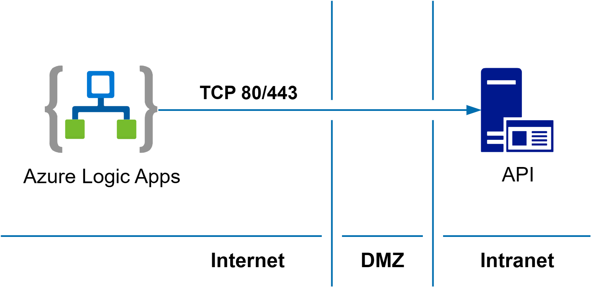
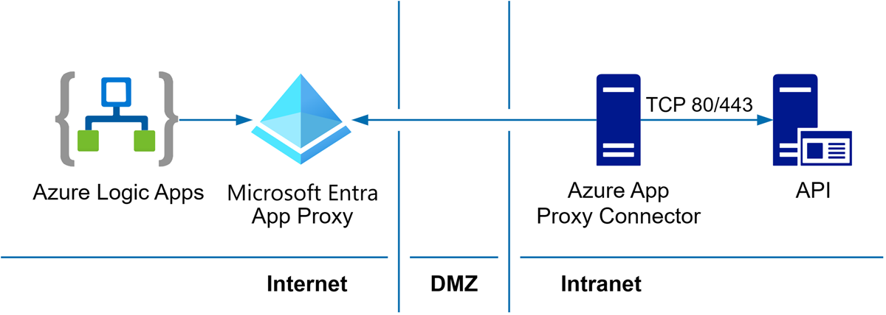
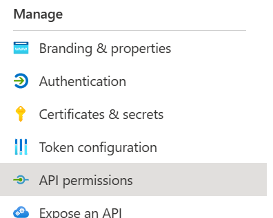
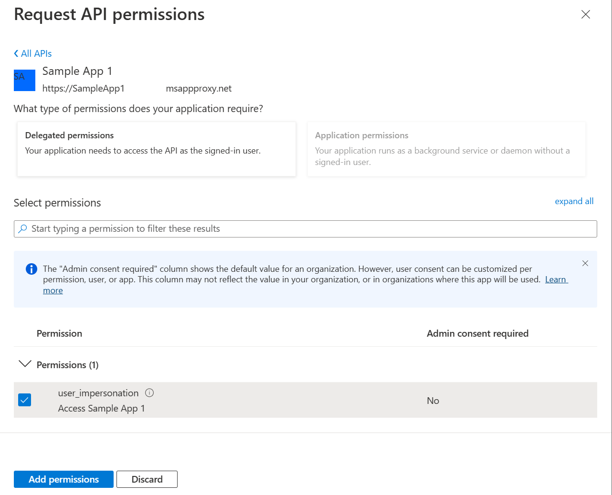
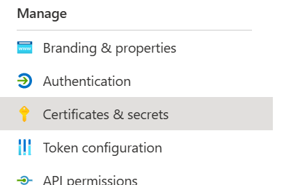
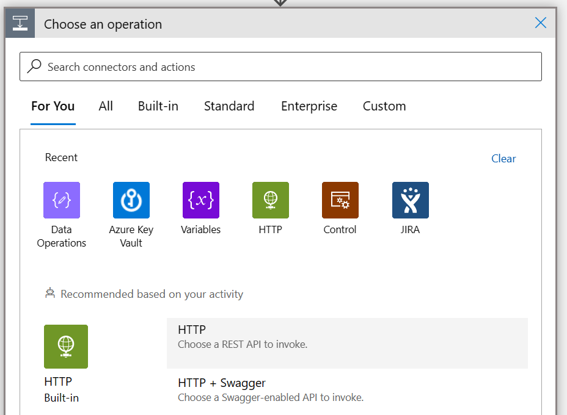

# Securely integrate Azure Logic Apps with on premises  APIs using Microsoft Entra application proxy

Azure Logic Apps is a service allowing easy creation of managed workflows in a no-code environment that can integrate with various external services and systems. Workflows help automate a wide range of business processes, such as data integration, data processing, and event-driven scenarios.
Logic Apps integrates with other public and cloud-based services. Or, utilize Logic Apps with on premises applications and services. Private network integration doesn't expose the service to the public with port forwarding or a traditional reverse proxy.

This article describes the steps necessary to utilize the Microsoft Entra application proxy solution to provide secure access to a Logic App, while protecting the internal application from unwanted actors. The process and end result is similar to [Access on premises APIs with Microsoft Entra application proxy](./application-proxy-secure-api-access.md) with special attention paid to utilizing the API from within a Logic App.

## Overview

The following diagram shows a traditional way to publish on premises  APIs for access from Azure Logic Apps. This approach requires opening incoming Transmission Control Protocol (TCP) ports 80 and/or 443 to the API service.

The following diagram shows how you can use Microsoft Entra application proxy to securely publish APIs for use with Logic Apps (or other Azure Cloud services) without opening any incoming ports:

The Microsoft Entra application proxy and associated connector facilitate secure authorization and integration to your on premises services without more configurations to your network security infrastructure.  

## Prerequisites

To follow this tutorial, you need:

- Admin access to an Azure directory, with an account that can create and register apps
- The *Logic App Contributor* role (or higher) in an active tenant
- Azure private network connector deployed and an application configured as detailed in [Add an on premises  app - application proxy in Microsoft Entra ID](./application-proxy-add-on-premises-application.md)

> [!NOTE]
> Granting a user entitlement and testing the sign-on is recommended but not required for this guide.

## Configure the Application Access

When a new Enterprise Application is created, a matching App Registration is also created. The App Registration allows configuration of secure programmatic access using certificates, secrets, or federated credentials. For integration with a Logic App, configure a client secret key, and configure the API permissions.

1. Sign in to the [Microsoft Entra admin center](https://entra.microsoft.com) as at least an [Application Administrator](~/identity/role-based-access-control/permissions-reference.md#application-administrator).

1. Browse to **Entra ID** > **App registrations**.

1. From the *App Registrations* window, select the **All applications** tab option.

1. Navigate to the application with a matching name to your deployed application proxy application. For example, if you deployed *Sample App 1* as an Enterprise Application, select the **Sample App 1** registration item.

    > [!NOTE]
    > An associated application might be deleted or not automatically created if it can't be found. A registration can be created using the **New Registration** button.

1. From the *Sample App 1* detail page, record the *Application (client) ID* and *Directory (tenant) ID* fields.

1. Select the **API permissions** menu item from the navigation pane.

    

    1. Select the **Add a permission** button.

        1. Select the **APIs my organization uses** tab.

        2. Search for your app by name (for example, *Sample App 1*) and select the item.

        3. Ensure *Delegated Permissions* is **selected**, then **check** the box for *user_impersonation*.

        4. Select **Add permissions**.

    3. Verify the configured permission appears.

        

1. Select the **Certificates & secrets** menu item from the navigation pane.

    

    1. Select the **Client secrets** tab item.

    2. Select the **New client secret** button.

    3. From the *Add a client secret* pop-up.

        1. Enter a **Description** and desired expiration.

        2. Select **Add**.

    4. Verify the new client secret appears.

    5. Select the **Copy** button for the *Value* of the newly created secret. Save the secret securely for use later, this value is only shown one time.

## Configure the Logic App

1. From the Logic App, open the **Designer** view.

2. Select a desired trigger (if prompted).

3. Add a new step and select the **HTTP** operation.

    

    1. *Method*: Select the desired HTTP method to be sent to the internal API.

    2. *URI*: Fill in with the *public* Fully Qualified Domain Name (FQDN) of your application registered in Microsoft Entra ID, along with the other URI required for API access (for example, *sampleapp1.msappproxy.net/api/1/status*).

        > [!NOTE]
        > Specific values for API depend on your internal application.

    3. *Headers*: Enter any desired headers to be sent to the internal API.

    4. *Queries*: Enter any desired queries to be sent to the internal API.

    5. *Body*: Enter any desired body contents to be sent to the internal API.

    6. *Cookie*: Enter any desired cookies to be sent to the internal API.

    7. Select *Add new parameter*, then check *Authentication*.

    8. From the *Authentication type*, select *Microsoft Entra ID OAuth*.

    9. For the authentication, fill the following details.

        1. *Authority*: Enter *https://login.windows.net*.

        2. *Tenant*: Enter the **Directory (tenant) ID** noted in *Configure the Application Access*.

        3. *Audience*: Enter the *public* FQDN of your application registered in Microsoft Entra ID (for example, *sampleapp1.msappproxy.net*).

        4. *Client ID*: Enter the **Application (client) ID** noted in *Configure the Application Access*.

        5. *Credential Type*: **Secret**.

        6. *Secret*: Enter the **secret value** noted in *Configure the Application Access*.

5. Save the logic app and test with your trigger.

## Caveats

APIs that require authentication/authorization require special handling when using this method. Since Microsoft Entra ID OAuth is being used for access, the requests sent already contain an *Authorization* field that the internal API can't utilize (unless single sign-on is configured). As a workaround, some applications offer authentication or authorization that uses methods other than an *Authorization* header. For example, GitLab allows for a header titled *PRIVATE-TOKEN*, and Atlassian Jira allows for requesting a Cookie that can be used in later requests.

The Logic App HTTP action shows clear text values. However, store the App Registration Secret Key in Azure Key Vault for secure retrieval and use.

## See also

- [Configure an application proxy application](application-proxy-add-on-premises-application.md)
- [Access on premises APIs with Microsoft Entra application proxy](./application-proxy-secure-api-access.md)
- [Learn about common scenarios, examples, tutorials, and walkthroughs for Azure Logic Apps](/azure/logic-apps/logic-apps-examples-and-scenarios)
