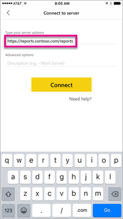

# Enable remote access to Power BI Mobile with Microsoft Entra application proxy

This article discusses how to use Microsoft Entra application proxy to enable the Power BI mobile app to connect to Power BI Report Server (PBIRS) and SQL Server Reporting Services (SSRS) 2016 and later. Through this integration, users who are away from the corporate network can access their Power BI reports from the Power BI mobile app and be protected by Microsoft Entra authentication. This protection includes [security benefits](application-proxy-security.md#security-benefits) such as Conditional Access and multifactor authentication.

## Prerequisites

- Deploy Reporting Services in your environment.
- Enable [Microsoft Entra application proxy](application-proxy-add-on-premises-application.md).
- When possible, use the same internal and external domains for Power BI. To learn more about custom domains, see [Working with custom domains in application proxy](how-to-configure-custom-domain.md).

## Step 1: Configure Kerberos Constrained Delegation (KCD)

For on-premises applications that use Windows authentication, you can achieve single sign-on (SSO) with the Kerberos authentication protocol and a feature called Kerberos constrained delegation (KCD). The private network connector uses KCD to obtain a Windows token for a user, even if the user isn't signed into Windows directly. To learn more about KCD, see [Kerberos Constrained Delegation Overview](/previous-versions/windows/it-pro/windows-server-2012-R2-and-2012/jj553400(v=ws.11)) and [Kerberos Constrained Delegation for single sign-on to your apps with application proxy](how-to-configure-sso-with-kcd.md).

There isn’t much to configure on the Reporting Services side. A valid Service Principal Name (SPN) is required for proper Kerberos authentication to occur. Enable the Reporting Services server for `Negotiate` authentication.

### Configure the Service Principal Name (SPN)

The SPN is a unique identifier for a service that uses Kerberos authentication. A proper HTTP SPN is required for the report server. For information on how to configure the proper Service Principal Name (SPN) for your report server, see [Register a Service Principal Name (SPN) for a Report Server](/sql/reporting-services/report-server/register-a-service-principal-name-spn-for-a-report-server).
Verify the SPN was added by running the `Setspn` command with the `-L` option. To learn more about the command, see [Setspn](https://social.technet.microsoft.com/wiki/contents/articles/717.service-principal-names-spn-setspn-syntax.aspx).

### Enable Negotiate authentication

To enable a report server to use Kerberos authentication, configure the Authentication Type of the report server to be RSWindowsNegotiate. Configure this setting using the rsreportserver.config file.

```xml
<AuthenticationTypes>
    <RSWindowsNegotiate />
    <RSWindowsKerberos />
    <RSWindowsNTLM />
</AuthenticationTypes>
```

For more information, see [Modify a Reporting Services Configuration File](/sql/reporting-services/report-server/modify-a-reporting-services-configuration-file-rsreportserver-config) and [Configure Windows Authentication on a Report Server](/sql/reporting-services/security/configure-windows-authentication-on-the-report-server).

### Ensure the connector is trusted for delegation to the SPN added to the Reporting Services application pool account
Configure KCD so that the Microsoft Entra application proxy service can delegate user identities to the Reporting Services application pool account. Configure the private network connector to retrieve Kerberos tickets for Microsoft Entra ID authenticated users. The server passes the context to the Reporting Services application.

To configure KCD, repeat the following steps for each connector machine:

1. Sign in to a domain controller as a domain administrator, and then open **Active Directory Users and Computers**.
2. Find the computer that the connector is running on.
3. Select the computer by double clicking, and then select the **Delegation** tab.
4. Set the delegation settings to **Trust this computer for delegation to the specified services only**. Then, select **Use any authentication protocol**.
5. Select **Add**, and then select **Users or Computers**.
6. Enter the service account you set up for Reporting Services.
7. Select **OK**. To save the changes, select **OK** again.

For more information, see [Kerberos Constrained Delegation for single sign-on to your apps with application proxy](how-to-configure-sso-with-kcd.md).

<a name='step-2-publish-report-services-through-azure-ad-application-proxy'></a>

## Step 2: Publish Reporting Services through Microsoft Entra application proxy

Now you're ready to configure Microsoft Entra application proxy.

1. Publish Reporting Services through application proxy with the following settings. For step-by-step instructions on how to publish an application through application proxy, see [Publishing applications using Microsoft Entra application proxy](~/identity/app-proxy/application-proxy-add-on-premises-application.md).
   - **Internal URL**: Enter the URL to the Report Server that the connector can reach in the corporate network. Make sure this URL is reachable from the server the connector is installed on. A best practice is using a top-level domain such as `https://servername/` to avoid issues with subpaths published through application proxy. For example, use `https://servername/` and not `https://servername/reports/` or `https://servername/reportserver/`.
     > [!NOTE]
     > Use a secure HTTPS connection to the Report Server. For more information on configuring a secure connection, See [Configure secure connections on a native mode report server](/sql/reporting-services/security/configure-ssl-connections-on-a-native-mode-report-server).
   - **External URL**: Enter the public URL the Power BI mobile app connects to. For example, it looks like `https://reports.contoso.com` if a custom domain is used. To use a custom domain, upload a certificate for the domain, and point a Domain Name System (DNS) record to the default `msappproxy.net` domain for your application. For detailed steps, see [Working with custom domains in Microsoft Entra application proxy](how-to-configure-custom-domain.md).

   - **Pre-authentication Method**: Microsoft Entra ID.

2. Once your app is published, configure the single sign-on settings with the following steps:

   a. On the application page in the portal, select **Single sign-on**.

   b. For **Single Sign-on Mode**, select **Integrated Windows Authentication**.

   c. Set **Internal Application SPN** to the value that you set earlier.

   d. Choose the **Delegated Login Identity** for the connector to use on behalf of your users. For more information, see [Working with different on-premises and cloud identities](how-to-configure-sso-with-kcd.md#working-with-different-on-premises-and-cloud-identities).

   e. Select **Save** to save your changes.

To finish setting up your application, go to **the Users and groups** section and assign users to access this application.

## Step 3: Modify the reply Uniform Resource Identifier (URI) for the application

Configure the Application Registration that was automatically created in step 2.

1. On the Microsoft Entra ID **Overview** page, select **App registrations**.
2. On the **All applications** tab, search for the application you created in step 2.
3. Select the application, then select **Authentication**.
4. Add the redirect URI for the platform.

   When configuring the app for Power BI Mobile on **iOS**, add the redirect Uniform Resource Identifiers (URIs) of type `Public Client (Mobile & Desktop)`.
   - `msauth://code/mspbi-adal%3a%2f%2fcom.microsoft.powerbimobile`
   - `msauth://code/mspbi-adalms%3a%2f%2fcom.microsoft.powerbimobilems`
   - `mspbi-adal://com.microsoft.powerbimobile`
   - `mspbi-adalms://com.microsoft.powerbimobilems`

   When configuring the app for Power BI Mobile on **Android**, add the redirect Uniform Resource Identifiers (URIs) of type `Public Client (Mobile & Desktop)`.
   - `urn:ietf:wg:oauth:2.0:oob`
   - `mspbi-adal://com.microsoft.powerbimobile`
   - `msauth://com.microsoft.powerbim/g79ekQEgXBL5foHfTlO2TPawrbI%3D`
   - `msauth://com.microsoft.powerbim/izba1HXNWrSmQ7ZvMXgqeZPtNEU%3D`

   > [!IMPORTANT]
   > The redirect URIs must be added for the application to work correctly. If you're configuring the app for both Power BI Mobile iOS and Android, add the redirect URI of type Public Client (Mobile & Desktop) to the list of redirect URIs configured for iOS: `urn:ietf:wg:oauth:2.0:oob`.

## Step 4: Connect from the Power BI Mobile App

1. In the Power BI mobile app, connect to your Reporting Services instance. Enter the **External URL** for the application you published through application proxy.

   

2. Select **Connect**. The Microsoft Entra sign-in page loads.

3. Enter valid credentials for your user and select **Sign in**. The elements from the Reporting Services server are displayed.

## Step 5: Configure Intune policy for managed devices (optional)

You can use Microsoft Intune to manage the client apps that your company's workforce uses. Intune provides capabilities such as data encryption and access requirements. Enable the Power BI mobile application with the Intune policy.

1. Browse to **Entra ID** > **App registrations**.
1. Select the application configured in Step 3 when registering your native client application.
1. On the application’s page, select **API Permissions**.
1. Select **Add a permission**.
1. Under **APIs my organization uses**, search for and select *Microsoft Mobile Application Management*.
1. Add the **DeviceManagementManagedApps.ReadWrite** permission to the application.
1. Select **Grant admin consent** to grant the permission access to the application.
1. Configure the Intune policy you want by referring to [How to create and assign app protection policies](/mem/intune/apps/app-protection-policies).

## Troubleshooting

If the application returns an error page after trying to load a report for more than a few minutes, you might need to change the time-out setting. By default, application proxy supports applications that take up to 85 seconds to respond to a request. To lengthen this setting to 180 seconds, select the back-end time-out to **Long** in the application proxy settings page for the application. For tips on how to create fast and reliable reports see [Power BI Reports Best Practices](/power-bi/guidance/power-bi-optimization).

Using Microsoft Entra application proxy to enable the Power BI mobile app to connect to on premises Power BI Report Server isn't supported with Conditional Access policies that require the Microsoft Power BI app as an approved client app.

## Next steps

- [Enable native client applications to interact with proxy applications](application-proxy-configure-native-client-application.md)
- [View on-premises report server reports and KPIs in the Power BI mobile apps](/power-bi/consumer/mobile/mobile-app-ssrs-kpis-mobile-on-premises-reports)
