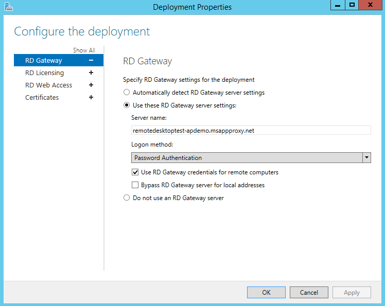

# Publish Remote Desktop with Microsoft Entra application proxy

Remote Desktop Service and Microsoft Entra application proxy work together to improve the productivity of workers who are away from the corporate network. 

The intended audience for this article is:
- Current application proxy customers who want to offer more applications to their end users by publishing on-premises applications through Remote Desktop Services.
- Current Remote Desktop Services customers who want to reduce the attack surface of their deployment by using Microsoft Entra application proxy. This scenario gives a set of two-step verification and Conditional Access controls to RDS.

## How application proxy fits in the standard RDS deployment

A standard RDS deployment includes various Remote Desktop role services running on Windows Server. Multiple deployment options exist in the [Remote Desktop Services architecture](/windows-server/remote/remote-desktop-services/Desktop-hosting-logical-architecture). Unlike other RDS deployment options, the [RDS deployment with Microsoft Entra application proxy](/windows-server/remote/remote-desktop-services/Desktop-hosting-logical-architecture) (shown in the following diagram) has a permanent outbound connection from the server running the connector service. Other deployments leave open inbound connections through a load balancer.


In an RDS deployment, the Remote Desktop (RD) Web role and the RD Gateway role run on Internet-facing machines. These endpoints are exposed for the following reasons:
- RD Web provides the user a public endpoint to sign in and view the various on-premises applications and desktops they can access. When you select a resource, a Remote Desktop Protocol (RDP) connection is created using the native app on the OS.
- RD Gateway comes into the picture once a user launches the RDP connection. The RD Gateway handles encrypted RDP traffic coming over the internet and translates it to the on-premises server that the user is connecting to. In this scenario, the traffic the RD Gateway is receiving comes from the Microsoft Entra application proxy.

>[!TIP]
>For more information, see [how to seamlessly deploy RDS with Azure Resource Manager and Azure Marketplace](/windows-server/remote/remote-desktop-services/rds-in-azure).

## Requirements

- Both the RD Web and RD Gateway endpoints must be located on the same machine, and with a common root. RD Web and RD Gateway are published as a single application with application proxy so that you can have a single sign-on experience between the two applications.
- [Deploy RDS](/windows-server/remote/remote-desktop-services/rds-in-azure), and [enabled application proxy](~/identity/app-proxy/application-proxy-add-on-premises-application.md). Enable application proxy and open required ports and URLs, and enabling Transport Layer Security (TLS) 1.2 on the server. To learn which ports need to be opened, and other details, see [Tutorial: Add an on-premises application for remote access through application proxy in Microsoft Entra ID](application-proxy-add-on-premises-application.md).
- Your end users must use a compatible browser to connect to RD Web or the RD Web client. For more information, see [Support for client configurations](#support-for-other-client-configurations).
- When publishing RD Web, use the same internal and external Fully Qualified Domain Name (FQDN) when possible. If the internal and external Fully Qualified Domain Names (FQDNs) are different, disable Request Header Translation to avoid the client receiving invalid links.
- If you're using the RD Web client, you *must* use the same internal and external FQDN. If the internal and external FQDNs are different, you encounter websocket errors when making a RemoteApp connection through the RD Web client.
- If you're using RD Web on Internet Explorer, you need to enable the RDS ActiveX add-on.
- If you're using the RD Web client, you'll need to use the application proxy [connector version 1.5.1975 or later](./application-proxy-release-version-history.md).
- For the Microsoft Entra pre authentication flow, users can only connect to resources published to them in the **RemoteApp and Desktops** pane. Users can't connect to a desktop using the **Connect to a remote PC** pane.
- If you're using Windows Server 2019, you need to disable HTTP2 protocol. For more information, see [Tutorial: Add an on-premises application for remote access through application proxy in Microsoft Entra ID](~/identity/app-proxy/application-proxy-add-on-premises-application.md).

## Deploy the joint RDS and application proxy scenario

After setting up RDS and Microsoft Entra application proxy for your environment, follow the steps to combine the two solutions. These steps walk through publishing the two web-facing RDS endpoints (RD Web and RD Gateway) as applications, and then directing traffic on your RDS to go through application proxy.

### Publish the RD host endpoint

1. [Publish a new application proxy application](~/identity/app-proxy/application-proxy-add-on-premises-application.md) with the values.
   - Internal URL: `https://<rdhost>.com/`, where `<rdhost>` is the common root that RD Web and RD Gateway share.
   - External URL: This field is automatically populated based on the name of the application, but you can modify it. Your users go to this URL when they access RDS.
   - Pre authentication method: Microsoft Entra ID.
   - Translate URL headers: No.
   - Use HTTP-Only Cookie: No.
1. Assign users to the published RD application. Make sure they all have access to RDS, too.
1. Leave the single sign-on method for the application as **Microsoft Entra single sign-on disabled**.

   >[!Note]
   >Your users are asked to authenticate once to Microsoft Entra ID and once to RD Web, but they have single sign-on to RD Gateway.

1. Browse to **Entra ID** > **App registrations**. Choose your app from the list.
1. Under **Manage**, select **Branding**.
1. Update the **Home page URL** field to point to your RD Web endpoint (like `https://<rdhost>.com/RDWeb`).

### Direct RDS traffic to application proxy

Connect to the RDS deployment as an administrator and change the RD Gateway server name for the deployment. This configuration ensures that connections go through the Microsoft Entra application proxy service.

1. Connect to the RDS server running the RD Connection Broker role.
2. Launch **Server Manager**.
3. Select **Remote Desktop Services** from the pane on the left.
4. Select **Overview**.
5. In the Deployment Overview section, select the drop-down menu and choose **Edit deployment properties**.
6. In the RD Gateway tab, change the **Server name** field to the External URL that you set for the RD host endpoint in application proxy.
7. Change the **Logon method** field to **Password Authentication**.

   

8. Run this command for each collection. Replace *\<yourcollectionname\>* and *\<proxyfrontendurl\>* with your own information. This command enables single sign-on between RD Web and RD Gateway, and optimizes performance.

   ```
   Set-RDSessionCollectionConfiguration -CollectionName "<yourcollectionname>" -CustomRdpProperty "pre-authentication server address:s:<proxyfrontendurl>`nrequire pre-authentication:i:1"
   ```

   **For example:**
   ```
   Set-RDSessionCollectionConfiguration -CollectionName "QuickSessionCollection" -CustomRdpProperty "pre-authentication server address:s:https://remotedesktoptest-aadapdemo.msappproxy.net/`nrequire pre-authentication:i:1"
   ```
   >[!NOTE]
   >The command uses a backtick in \``nrequire`.

9. To verify the modification of the custom RDP properties and view the RDP file contents that are downloaded from RDWeb for this collection, run the following command.
    ```
    (get-wmiobject -Namespace root\cimv2\terminalservices -Class Win32_RDCentralPublishedRemoteDesktop).RDPFileContents
    ```

Now that Remote Desktop is configured, Microsoft Entra application proxy takes over as the internet-facing component of RDS. Remove the other public internet-facing endpoints on your RD Web and RD Gateway machines.

### Enable the RD Web Client
If you want users to use the RD Web Client follow the steps at [Set up the Remote Desktop web client for your users](/windows-server/remote/remote-desktop-services/clients/remote-desktop-web-client-admin).

The Remote Desktop web client provides access for your organization's Remote Desktop infrastructure. An HTML5-compatible web browser such as Microsoft Edge, Google Chrome, Safari, or Mozilla Firefox (v55.0 and later) is required.

## Test the scenario

Test the scenario with Internet Explorer on a Windows 7 or 10 computer.

1. Go to the external URL you set up, or find your application in the [MyApps panel](https://myapps.microsoft.com).
2. Authenticate to Microsoft Entra ID. Use an account that you assigned to the application.
3. Authenticate to RD Web.
4. Once your RDS authentication succeeds, you can select the desktop or application you want, and start working.

## Support for other client configurations

The configuration outlined in this article is for access to RDS via RD Web or the RD Web Client. If you need to, however, you can support other operating systems or browsers. The difference is in the authentication method that you use.

| Authentication method | Supported client configuration |
| --------------------- | ------------------------------ |
| Pre authentication    | RD Web-  Windows 7/10/11 using [`Microsoft Edge Chromium IE mode`](/deployedge/edge-ie-mode) + RDS ActiveX add-on |
| Pre authentication    | RD Web Client- HTML5-compatible web browser such as Microsoft Edge, Internet Explorer 11, Google Chrome, Safari, or Mozilla Firefox (v55.0 and later) |
| Passthrough | Any other operating system that supports the Microsoft Remote Desktop application |

> [!NOTE]
> `Microsoft Edge Chromium IE` mode is required when the My Apps portal is used for accessing the Remote Desktop app.  

The pre authentication flow offers more security benefits than the passthrough flow. With pre authentication you can use Microsoft Entra authentication features like single sign-on, Conditional Access, and two-step verification for your on-premises resources. You also ensure that only authenticated traffic reaches your network.

To use passthrough authentication, there are just two modifications to the steps listed in this article:
1. In [Publish the RD host endpoint](#publish-the-rd-host-endpoint) step 1, set the Preauthentication method to **Passthrough**.
2. In [Direct RDS traffic to application proxy](#direct-rds-traffic-to-application-proxy), skip step 8 entirely.

## Next steps
- [Enable remote access to SharePoint with Microsoft Entra application proxy](application-proxy-integrate-with-sharepoint-server.md)
- [Security considerations for accessing apps remotely by using Microsoft Entra application proxy](application-proxy-security.md)
- [Best practices for load balancing multiple app servers](application-proxy-high-availability-load-balancing.md)
