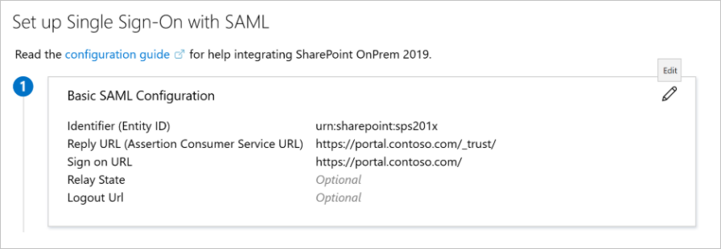
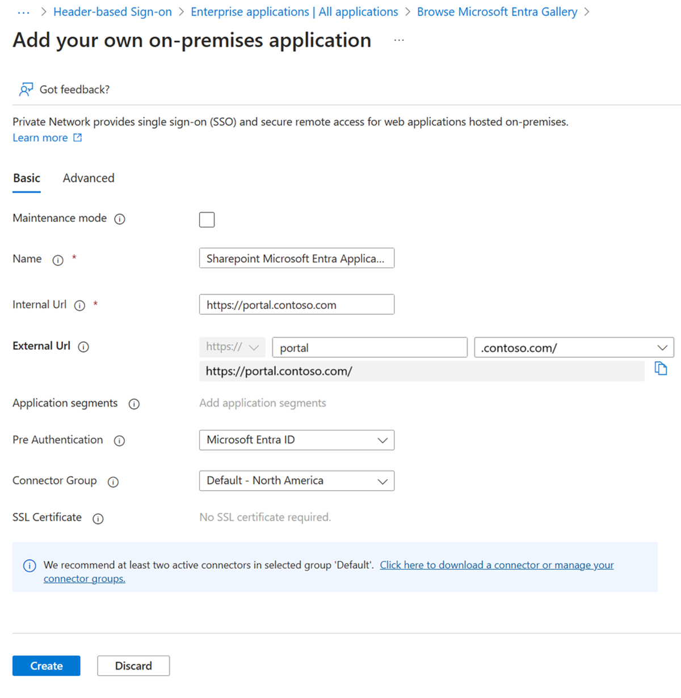
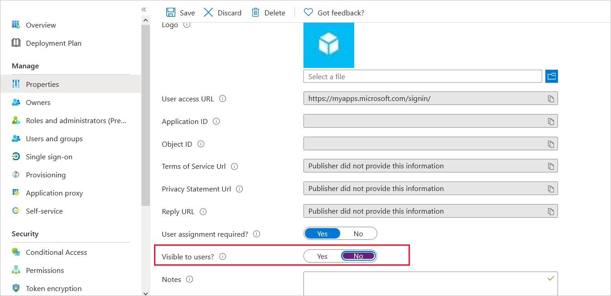

# Integrate Microsoft Entra application proxy with SharePoint using Security Assertion Markup Language (SAML)

This step-by-step guide explains how to secure the access to the [Microsoft Entra integrated on premises SharePoint (SAML)](~/identity/saas-apps/sharepoint-on-premises-tutorial.md) using Microsoft Entra application proxy, where users in your organization (Microsoft Entra ID, B2B) connect to SharePoint through the Internet.

> [!NOTE]
> If you're new to Microsoft Entra application proxy and want to learn more, see [Remote access to on premises applications through Microsoft Entra application proxy](overview-what-is-app-proxy.md).

There are three primary advantages of this setup:

- Microsoft Entra application proxy ensures that authenticated traffic can reach your internal network and SharePoint.
- Your users can access SharePoint sites as usual without using VPN.
- You can control the access by user assignment on the Microsoft Entra application proxy level and you can increase the security with Microsoft Entra features like Conditional Access and multifactor authentication (MFA).

This process requires two Enterprise Applications. One is a SharePoint on premises instance that you publish from the gallery to your list of managed SaaS apps. The second is an on premises application (non-gallery application) you use to publish the first Enterprise Gallery Application.

## Prerequisites

- A SharePoint 2013 farm or newer. The SharePoint farm must be [integrated with Microsoft Entra ID](~/identity/saas-apps/sharepoint-on-premises-tutorial.md).
- A Microsoft Entra tenant with a plan that includes application proxy. Learn more about [Microsoft Entra ID plans and pricing](https://www.microsoft.com/security/business/identity-access-management/azure-ad-pricing).
- A Microsoft Office Web Apps Server farm to properly launch Office files from the on premises SharePoint farm.
- A [custom, verified domain](~/fundamentals/add-custom-domain.yml) in the Microsoft Entra tenant. The verified domain must match the SharePoint URL suffix.
- A Transport Layer Security (TLS) certificate is required. See the details in [custom domain publishing](./how-to-configure-custom-domain.md).
- a private network connector installed and running on a machine within the corporate domain.

The list includes more prerequisites.
- On-premises Active Directory users must be synchronized with Microsoft Entra Connect, and must be configured to [sign in to Azure](~/identity/hybrid/connect/plan-connect-user-signin.md). 
- Cloud-only and B2B guest users must be [granted access to a guest account to SharePoint on premises in the Microsoft Entra admin center](~/identity/saas-apps/sharepoint-on-premises-tutorial.md#manage-guest-users-access).

## Step 1: Integrate SharePoint on premises with Microsoft Entra ID

1. Configure the SharePoint on premises application. For more information, see [Tutorial: Microsoft Entra single sign-on integration with SharePoint on-premises](~/identity/saas-apps/sharepoint-on-premises-tutorial.md).
2. Access SharePoint on premises from the internal network and confirm it's accessible internally.

## Step 2: Publish the SharePoint on premises application with application proxy

In this step, you create an application in your Microsoft Entra tenant that uses application proxy. You set the external URL and specify the internal URL, both of which are used later in SharePoint.

> [!NOTE]
> The Internal and External URLs must match the **Sign on URL** in the SAML Based Application configuration in Step 1.

   

 1. Create a new Microsoft Entra application proxy application with custom domain. For step-by-step instructions, see [Custom domains in Microsoft Entra application proxy](./how-to-configure-custom-domain.md).

    - Internal URL: 'https://portal.contoso.com/'
    - External URL: 'https://portal.contoso.com/'
    - Pre-Authentication: Microsoft Entra ID
    - Translate URLs in Headers: No
    - Translate URLs in Application Body: No

        

2. Assign the [same groups](~/identity/saas-apps/sharepoint-on-premises-tutorial.md#grant-permissions-to-a-security-group) you assigned to the on premises SharePoint Gallery Application.

3. Finally, go to the **Properties** section and set **Visible to users?** to **No**. This option ensures that only the icon of the first application appears on the My Apps Portal (https://myapplications.microsoft.com).

   
 
## Step 3: Test your application

Using a browser from a computer on an external network, navigate to the link that you configured during the publish step. Make sure you can sign in with the test account that you set up.
