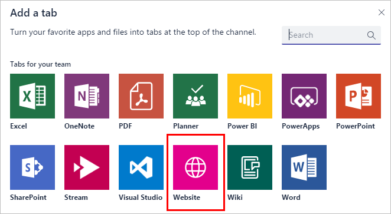
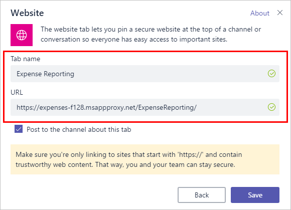

# Access your on-premises applications through Microsoft Teams with Microsoft Entra application proxy

Microsoft Entra application proxy gives you single sign-on to on-premises applications no matter where you are. Microsoft Teams streamlines your collaborative efforts in one place. Integrating the two together means that your users can be productive with their teammates in any situation.

Your users can add cloud apps to their Teams channels [using tabs](https://support.office.com/article/Video-Using-Tabs-7350a03e-017a-4a00-a6ae-1c9fe8c497b3?ui=en-US&rs=en-US&ad=US), but what about the SharePoint sites or planning tool that are hosted on-premises? Application proxy is the solution. They can add apps published through application proxy to their channels using the same external URLs they always use to access their apps remotely. And because application proxy authenticates through Microsoft Entra ID, your users get a single sign-on experience.

## Install the private network connector and publish your app

If you haven't already, [configure application proxy for your tenant and install the connector](~/identity/app-proxy/application-proxy-add-on-premises-application.md). Then, publish your on-premises application for remote access. Make note of the external URL because you use it to add the app to Teams.

If you already have your apps published but don't remember their external URLs, look them up in the [Microsoft Entra admin center](https://entra.microsoft.com). Sign in, then browse to **Identity** > **Applications** > **Enterprise applications** > select your app > **Application proxy**.

## Add your app to Teams

Let users know they add it as a tab directly in their Teams channels. The app is available for everyone in the team to use.

1. Navigate to the Teams channel where you want to add this app and select **+** to add a tab.

   

1. Select **Website** from the tab options.

   

1. Give the tab a name and set the URL to the application proxy external URL.

   

Once one member of a team adds the tab, it shows up for everyone in the channel. Any users who have access to the app get single sign-on access with the credentials they use for Microsoft Teams. Any users who don't have access to the app can see the tab in Teams, but are blocked until you give them permissions to the on-premises app and the Microsoft Entra admin center published version of the app.

## Next steps

- Learn how to [publish on-premises SharePoint sites](application-proxy-integrate-with-sharepoint-server.md) with application proxy.
- Configure your apps to use [custom domains](how-to-configure-custom-domain.md) for their external URL.
