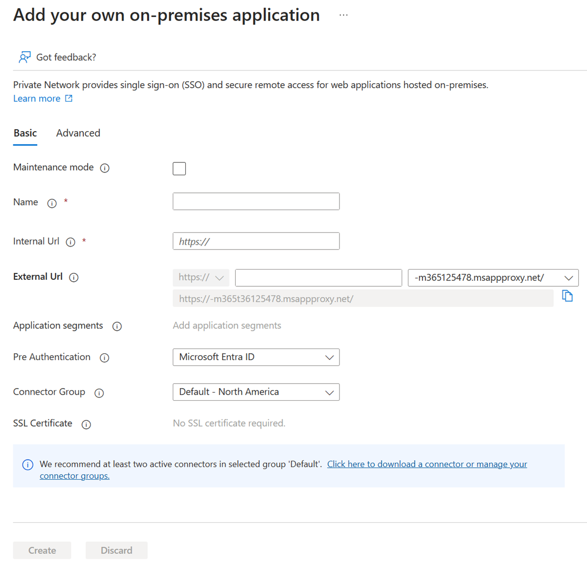
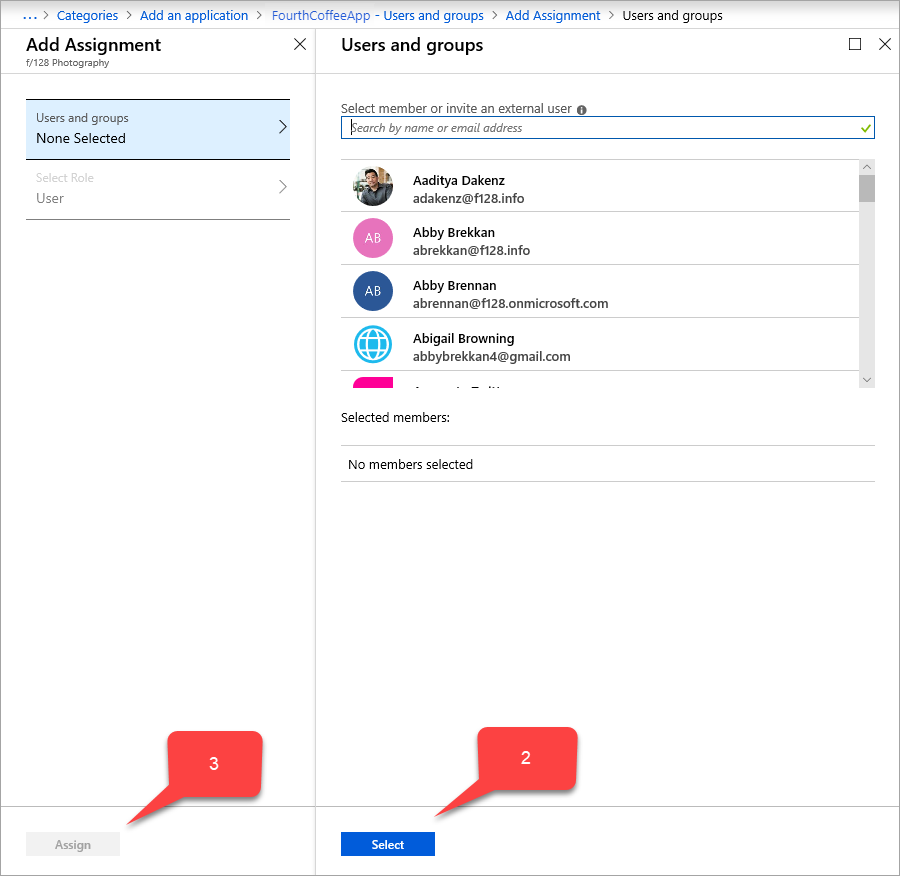
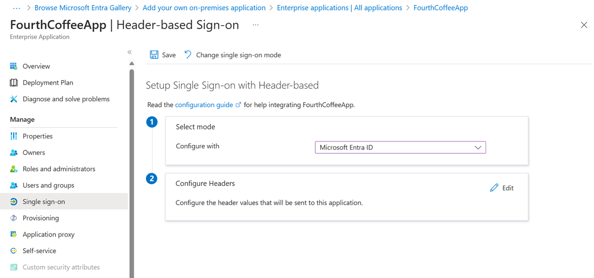
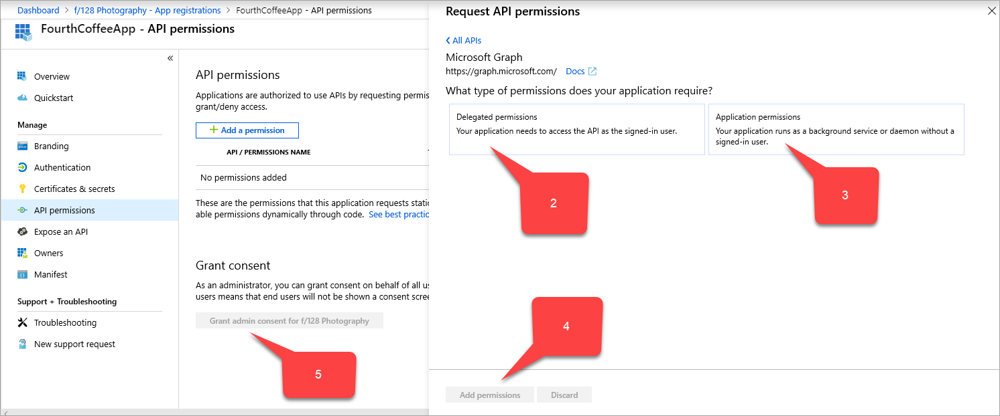
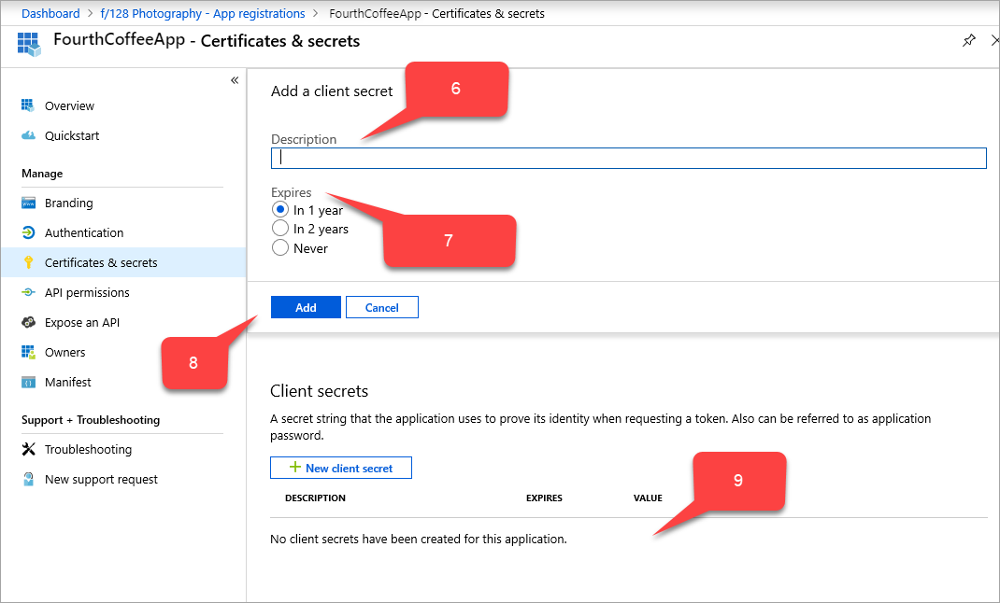

# Header based authentication for single sign-on with application proxy and PingAccess

Microsoft partnered with PingAccess to provide more access applications. PingAccess provides another option beyond integrated [header-based single sign-on](application-proxy-configure-single-sign-on-with-headers.md).

## What's PingAccess for Microsoft Entra ID?

With PingAccess for Microsoft Entra ID, you give users access and single sign-on (SSO) to applications that use headers for authentication. Application proxy treats these applications like any other, using Microsoft Entra ID to authenticate access and then passing traffic through the connector service. PingAccess sits in front of the applications and translates the access token from Microsoft Entra ID into a header. The application then receives the authentication in the format it can read.

Users don't notice anything different when they sign in to use corporate applications. Applications still work from anywhere on any device. The private network connectors direct remote traffic to all apps without regard to their authentication type, so they still balance loads automatically.

## How do I get access?

You need a license for PingAccess and Microsoft Entra ID. However, Microsoft Entra ID P1 or P2 subscriptions include a basic PingAccess license that covers up to 20 applications. If you need to publish more than 20 header-based applications, you can purchase more licenses from PingAccess.

For more information, see [Microsoft Entra editions](~/fundamentals/whatis.md).

## Publish your application in Microsoft Entra

This article outlines the steps to publish an application for the first time. The article provides guidance for both application proxy and PingAccess.

> [!NOTE]
> Some of the instructions exist on the Ping Identity site.

### Install a private network connector

The private network connector is a Windows Server service that directs traffic from your remote employees to your published applications. For more detailed installation instructions, see [Tutorial: Add an on-premises application for remote access through application proxy in Microsoft Entra ID](application-proxy-add-on-premises-application.md).

1. Sign in to the [Microsoft Entra admin center](https://entra.microsoft.com) as at least an [Application Administrator](~/identity/role-based-access-control/permissions-reference.md#application-administrator).
1. Browse to **Entra ID** > **Enterprise apps** > **Application proxy**.
1. Select **Download connector service**.
1. Follow the installation instructions.

Downloading the connector should automatically enable application proxy for your directory, but if not, you can select **Enable application proxy**.

### Add your application to Microsoft Entra ID with application proxy

There are two steps to add your application to Microsoft Entra ID. First, you need to publish your application with application proxy. Then, you need to collect information about the application that you can use during the PingAccess steps.

#### Publish your application

First, publish your application. This action involves:

- Adding your on-premises application to Microsoft Entra ID.
- Assigning a user for testing the application and choosing header-based single sign-on.
- Setting up the application's redirect URL.
- Granting permissions for users and other applications to use your on-premises application.

To publish your own on-premises application:

1. Sign in to the [Microsoft Entra admin center](https://portal.azure.com) as an Application Administrator.
1. Browse to **Enterprise applications** > **New application** > **Add an on-premises application**. The **Add your own on-premises application** page appears.

   
1. Fill in the required fields with information about your new application. Use the guidance for the settings.

   > [!NOTE]
   > For a more detailed walkthrough of this step, see [Add an on-premises app to Microsoft Entra ID](~/identity/app-proxy/application-proxy-add-on-premises-application.md).

   1. **Internal URL**: Normally you provide the URL that takes you to the app's sign-in page when you're on the corporate network. For this scenario, the connector needs to treat the PingAccess proxy as the front page of the application. Use this format: `https://<host name of your PingAccess server>:<port>`. The port is 3000 by default, but you can configure it in PingAccess.

      > [!WARNING]
      > For this type of single sign-on, the internal URL must use `https` and not `http`. Also, no two applications should have the same internal URL so application proxy can maintain a distinction between them.

   1. **Pre authentication method**: Choose **Microsoft Entra ID**.
   1. **Translate URL in Headers**: Choose **No**.

   > [!NOTE]
   > For the first application, use port 3000 to start and come back to update this setting if you change your PingAccess configuration. For subsequent applications, the port needs to match the Listener configured in PingAccess.

1. Select **Add**. The overview page for the new application appears.

Now assign a user for application testing and choose header-based single sign-on:

1. From the application sidebar, select **Users and groups** > **Add user** > **Users and groups (\<Number> Selected)**. A list of users and groups appears for you to choose from.

   

1. Select a user for application testing, and select **Select**. Make sure the test account has access to the on-premises application.
1. Select **Assign**.
1. From the application sidebar, select **Single sign-on** > **Header-based**.

   > [!TIP]
   > Install PingAccess the first time you use header-based single sign-on. To make sure your Microsoft Entra subscription is automatically associated with your PingAccess installation, use the link on the single sign-on page to download PingAccess. You can open the download site now, or come back to this page later.

   

1. Select **Save**.

Then make sure your redirect URL is set to your external URL:

1. Browse to **Entra ID** > **App registrations** and select your application.
1. Select the link next to **Redirect URIs**. The link shows the amount of redirect Uniform Resource Identifiers (URIs) setup for web and public clients. The **\<application name> - Authentication** page appears.
1. Check whether the external URL that you assigned to your application earlier is in the **Redirect URIs** list. If it isn't, add the external URL now, using a redirect URI type of **Web**, and select **Save**.

In addition to the external URL, an authorize endpoint of Microsoft Entra ID on the external URL should be added to the Redirect URIs list.

`https://*.msappproxy.net/pa/oidc/cb`
`https://*.msappproxy.net/`

Finally, set up the on-premises application so that users have `read` access and other applications have `read/write` access:

1. From the **App registrations** sidebar for your application, select **API permissions** > **Add a permission** > **Microsoft APIs** > **Microsoft Graph**. The **Request API permissions** page for **Microsoft Graph** appears, which contains the permissions for Microsoft Graph.

   

1. Select **Delegated permissions** > **User** > **User.Read**.
1. Select **Application permissions** > **Application** > **Application.ReadWrite.All**.
1. Select **Add permissions**.
1. In the **API permissions** page, select **Grant admin consent for \<your directory name>**.

#### Collect information for the PingAccess steps

Collect three Globally Unique Identifiers (GUIDs). Use the GUIDs to set up your application with PingAccess. 

| Name of Microsoft Entra field | Name of PingAccess field | Data format |
| --- | --- | --- |
| **Application (client) ID** | **Client ID** | GUID |
| **Directory (tenant) ID** | **Issuer** | GUID |
| `PingAccess key` | **Client Secret** | Random string |

To collect this information:

1. Browse to **Entra ID** > **App registrations** and select your application.
1. Next to the **Application (client) ID** value, select the **Copy to clipboard** icon, then copy and save it. You specify this value later as PingAccess's client ID.
1. Next the **Directory (tenant) ID** value, also select **Copy to clipboard**, then copy and save it. You specify this value later as PingAccess's issuer.
1. From the sidebar of the **App registrations** for your application, select **Certificates and secrets** > **New client secret**. The **Add a client secret** page appears.

   

1. In **Description**, type `PingAccess key`.
1. Under **Expires**, choose how to set the PingAccess key: **In 1 year**, **In 2 years**, or **Never**.
1. Select **Add**. The PingAccess key appears in the table of client secrets, with a random string that autofills in the **VALUE** field.
1. Next to the PingAccess key's **VALUE** field, select the **Copy to clipboard** icon, then copy and save it. You specify this value later as PingAccess's client secret.

**Update the `acceptMappedClaims` field:**

1. Sign in to the [Microsoft Entra admin center](https://entra.microsoft.com) as at least an [Application Administrator](~/identity/role-based-access-control/permissions-reference.md#application-administrator).
1. Select your username in the upper-right corner. Verify you're signed in to a directory that uses application proxy. If you need to change directories, select **Switch directory** and choose a directory that uses application proxy.
1. Browse to **Entra ID** > **App registrations** and select your application.
1. From the sidebar of the **App registrations** page for your application, select **Manifest**. The manifest JSON code for your application's registration appears.
1. Search for the `acceptMappedClaims` field, and change the value to `True`.
1. Select **Save**.

### Use of optional claims (optional)

Optional claims allow you to add standard-but-not-included-by-default claims that every user and tenant has. 
You can configure optional claims for your application by modifying the application manifest. For more info, see the [Understanding the Microsoft Entra application manifest article](~/identity-platform/reference-app-manifest.md).

Example to include email address into the access_token that PingAccess consumes:

```json
    "optionalClaims": {
        "idToken": [],
        "accessToken": [
            {
                "name": "email",
                "source": null,
                "essential": false,
                "additionalProperties": []
            }
        ],
        "saml2Token": []
    },
```

### Use of claims mapping policy (optional)

Claims mapping lets you migrate old on-premises apps to the cloud by adding more custom claims that back your Active Directory Federation Services (ADFS) or user objects. For more information, see [Claims Customization](/entra/identity-platform/reference-claims-mapping-policy-type#claims-customization-using-a-policy).

To use a custom claim and include more fields in your application. [Created a custom claims mapping policy and assigned it to the application](~/identity-platform/saml-claims-customization.md).

> [!NOTE]
> To use a custom claim, you must also have a custom policy defined and assigned to the application. The policy should include all required custom attributes.
>
> You can do policy definition and assignment through PowerShell or Microsoft Graph. If you're doing them in PowerShell, you need to first use `New-AzureADPolicy` and then assign it to the application with `Add-AzureADServicePrincipalPolicy`. For more information, see [Claims mapping policy assignment](~/identity-platform/saml-claims-customization.md).

Example:
```powershell
$pol = New-AzureADPolicy -Definition @('{"ClaimsMappingPolicy":{"Version":1,"IncludeBasicClaimSet":"true", "ClaimsSchema": [{"Source":"user","ID":"employeeid","JwtClaimType":"employeeid"}]}}') -DisplayName "AdditionalClaims" -Type "ClaimsMappingPolicy"

Add-AzureADServicePrincipalPolicy -Id "<<The object Id of the Enterprise Application you published in the previous step, which requires this claim>>" -RefObjectId $pol.Id
```

### Enable PingAccess to use custom claims

Enabling PingAccess to use custom claims is optional, but required if you expect the application to consume more claims.

When you configure PingAccess in the following step, the Web Session you create (Settings->Access->Web Sessions) must have **Request Profile** deselected and **Refresh User Attributes** set to **No**.

## Download PingAccess and configure your application

The detailed steps for the PingAccess part of this scenario continue in the Ping Identity documentation.

To create a Microsoft Entra ID OpenID Connect (OIDC) connection, set up a token provider with the **Directory (tenant) ID** value that you copied from the Microsoft Entra admin center. Create a web session on PingAccess. Use the `Application (client) ID` and `PingAccess key` values. Set up identity mapping and create a virtual host, site, and application.

### Test your application
The application is up and running. To test it, open a browser and navigate to the external URL that you created when you published the application in Microsoft Entra. Sign in with the test account you assigned to the application.

## Next steps
- [Single sign-on to applications in Microsoft Entra ID](~/identity/enterprise-apps/what-is-single-sign-on.md)
- [Troubleshoot application proxy problems and error messages](application-proxy-troubleshoot.md)
