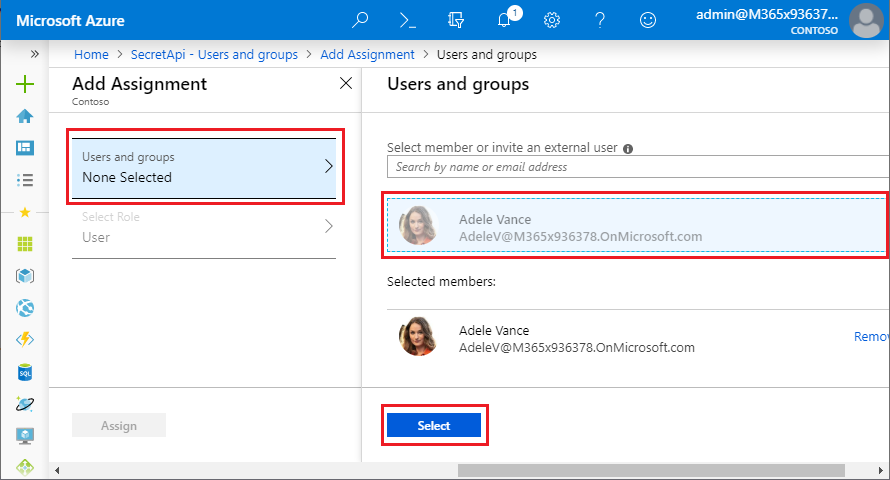

# Use Microsoft Entra application proxy to provide secure access to an Application Programming Interface (API) hosted in a private cloud or on premises

Business logic often lives in a private Application Programming Interface (API). The API runs on premises or in a private cloud. Your native Android, iOS, Mac, or Windows apps need to interact with the API endpoints to use data or provide user interaction. Microsoft Entra application proxy and the [Microsoft Authentication Library (MSAL)](~/identity-platform/reference-v2-libraries.md) let your native apps securely access your private cloud APIs. Microsoft Entra application proxy is a faster and more secure solution than opening firewall ports and controlling authentication and authorization at the app layer.

> [!TIP]
> The term "on premises" is a legacy term dating back to the time when physical servers were located on the premises of the corporate office. Now days, many self-hosted workloads run on a virtual machine in a datacenter. The terms on premises and private cloud are used interchangeably.

This article walks you through setting up a Microsoft Entra application proxy solution for hosting a web API service that native apps can access.

## Overview

The following diagram shows a traditional way to publish on-premises APIs. This approach requires opening incoming ports 80 and 443.

The following diagram shows how you can use Microsoft Entra application proxy to securely publish APIs without opening any incoming ports:

The Microsoft Entra application proxy forms the backbone of the solution, working as a public endpoint for API access, and providing authentication and authorization. You can access your APIs from a vast array of platforms by using the [Microsoft Authentication Library (MSAL)](~/identity-platform/reference-v2-libraries.md) libraries.

Since Microsoft Entra application proxy authentication and authorization are built on top of Microsoft Entra ID, you can use Microsoft Entra Conditional Access to ensure only trusted devices can access APIs published through application proxy. Use Microsoft Entra join or Microsoft Entra hybrid joined for desktops, and Intune Managed for devices. You can also take advantage of Microsoft Entra ID P1 or P2 features like Microsoft Entra multifactor authentication, and the machine learning-backed security of [Microsoft Entra ID Protection](~/id-protection/overview-identity-protection.md).

## Prerequisites

To follow this walkthrough, you need:

- Admin access to an Azure directory, with an account that can create and register apps
- The sample web API and native client apps from the [Microsoft Authentication Library (MSAL)](~/identity-platform/msal-overview.md)

## Publish the API through application proxy

To publish an API outside of your intranet through application proxy, you follow the same pattern as for publishing web apps. For more information, see [Tutorial: Add an on-premises application for remote access through application proxy in Microsoft Entra ID](application-proxy-add-on-premises-application.md).

To publish the SecretAPI web API through application proxy:

1. Build and publish the sample SecretAPI project as an ASP.NET web app on your local computer or intranet. Make sure you can access the web app locally.

1. Sign in to the [Microsoft Entra admin center](https://entra.microsoft.com) as at least an [Application Administrator](~/identity/role-based-access-control/permissions-reference.md#application-administrator).

1. Browse to **Entra ID** > **Enterprise apps**.

1. At the top of the **Enterprise applications - All applications** page, select **New application**.

1. On the **Browse Microsoft Entra Gallery** page, locate section **On-premises applications** and select **Add an on-premises application**. The **Add your own on-premises application** page appears.

1. If you don't have a private network connector installed, you're prompted to install it. Select **Download private network connector** to download and install the connector.

1. Add information on the **Add your own on-premises application** page.

   1. Next to **Name**, enter *SecretAPI*.

   1. Next to **Internal Url**, enter the URL you use to access the API from within your intranet.

   1. Make sure **Pre-Authentication** is set to **Microsoft Entra ID**.

   1. Select **Create**, and wait for the app to be created.

   

1. On the **Enterprise applications - All applications** page, select the **SecretAPI** app.

1. On the **SecretAPI - Overview** page, select **Properties** in the left navigation.

1. You don't want APIs to be available to end users in the **MyApps** panel, so set **Visible to users** to **No** at the bottom of the **Properties** page, and then select **Save**.

   

The web API is now published through Microsoft Entra application proxy. Next, add users who can access the app.

1. On the **SecretAPI - Overview** page, select **Users and groups** in the left navigation.

1. On the **Users and groups** page, select **Add user**.

1. On the **Add assignment** page, select **Users and groups**.

1. On the **Users and groups** page, search for and select users who can access the app, including at least yourself. After selecting all users, select **Select**.

   

1. On the **Add Assignment** page, select **Assign**.

> [!NOTE]
> APIs that use integrated Windows authentication might require [extra steps](./how-to-configure-sso-with-kcd.md).

## Register the native app and grant access to the API

Native apps are programs developed to use on a particular platform or device. Before your native app can connect and access an API, you must register it in Microsoft Entra ID. The following steps show how to register a native app and give it access to the web API you published through application proxy.

To register the AppProxyNativeAppSample native app:
1. Sign in to the [Microsoft Entra admin center](https://entra.microsoft.com) as at least an [Application Administrator](~/identity/role-based-access-control/permissions-reference.md#application-administrator).

1. Browse to **Entra ID** > **Enterprise apps** > **App registrations**.

1. Select **New registration**.

1. Enter information on the **Register an application** page.

   1. Under **Name**, enter *AppProxyNativeAppSample*.

   1. Under **Supported account types**, select **Accounts in this organizational directory only (Contoso only - Single tenant)**.

   1. Under **Redirect URL**, drop down and select **Public client/native (mobile & desktop)**, and then enter *https://login.microsoftonline.com/common/oauth2/nativeclient    *.

   1. Select **Register**, and wait for the app to be successfully registered.

      

The `AppProxyNativeAppSample` app is now registered in Microsoft Entra ID. Give your native app access to the `SecretAPI` web API:

1. On the **App registrations** page, select the **AppProxyNativeAppSample** app.

1. On the **AppProxyNativeAppSample** page, select **API permissions** in the left navigation.

1. On the **API permissions** page, select **Add a permission**.

1. On the first **Request API permissions** page, select the **APIs my organization uses** tab, and then search for and select **SecretAPI**.

1. On the next **Request API permissions** page, select the check box next to **user_impersonation**, and then select **Add permissions**.

    

1. Back on the **API permissions** page, you can select **Grant admin consent for Contoso** to prevent other users from having to individually consent to the app.

## Configure the native app code

The last step is to configure the native app. The code must be added to the `Form1.cs` file in the `NativeClient` sample app. The code uses the [MSAL library](~/identity-platform/reference-v2-libraries.md) to acquire the token. The token requests the API call and attaches it to the header in the request. The token is attached as a bearer certificate. For more information about MSAL, see [Add MSAL to your project](~/identity-platform/tutorial-v2-windows-desktop.md#add-msal-to-your-project) and [Add the reference to MSAL](~/identity-platform/tutorial-v2-windows-desktop.md#add-the-code-to-initialize-msal).

1. In *Form1.cs*, add the namespace `using Microsoft.Identity.Client;` to the code. 

1. Edit the native application code in the authentication context of the Microsoft Authentication Library (MSAL) to include this [customized code sample](application-proxy-configure-native-client-application.md#step-4-add-the-microsoft-authentication-library-to-your-code-net-c-sample). 

Configure the native app to connect to Microsoft Entra ID and call the API using application proxy. Then, update the placeholder values in the `App.config` file of the `NativeClient sample app` with values from Microsoft Entra ID.

1. Paste the **Directory (tenant) ID** in the `<add key="ida:Tenant" value="" />` field. You can find and copy this value (a GUID) from the **Overview** page of either of your apps.

1. Paste the AppProxyNativeAppSample **Application (client) ID** in the `<add key="ida:ClientId" value="" />` field. You can find and copy this value (a GUID) from the AppProxyNativeAppSample's **Overview** page, in the left navigation under **Manage**.

1. Paste the AppProxyNativeAppSample **Redirect URI** in the `<add key="ida:RedirectUri" value="" />` field. You can find and copy this value (a URI) from the AppProxyNativeAppSample's **Authentication** page, in the left navigation under **Manage**. This step is optional as MSAL uses the method `PublicClientApplicationBuilder.WithDefaultRedirectUri()` to insert the recommended reply Uniform Resource Identifier (URI). 

1. Paste the SecretAPI **Application ID URI** in the `<add key="todo:TodoListResourceId" value="" />` field. The value is the same as `todo:TodoListBaseAddress`. The URI value is located on the **Expose an API** page of the `SecretAPI` application. Look in the left navigation under **Manage**.

1. Paste the SecretAPI **Home Page URL** in the `<add key="todo:TodoListBaseAddress" value="" />` field. You can find and copy this value (a URL) from the SecretAPI **Branding & properties** page, in the left navigation under **Manage**.

> [!NOTE]
> If the solution doesn't build and reports the error `invalid Resx file`, in Solution Explorer, expand **Properties**, right-click *Resources.resx*, and then select **View Code**. Comment lines 121 to 123.

After you configure the parameters, build and run the native app. When you select the **Sign In** button, the app lets you sign in, and then displays a success screen to confirm that it successfully connected to the SecretAPI.

## Next steps
- [Add an on-premises application for remote access through application proxy in Microsoft Entra ID](application-proxy-add-on-premises-application.md)
- [Configure a client application to access web APIs](~/identity-platform/quickstart-configure-app-access-web-apis.md)
- [Enable native client applications to interact with proxy applications](application-proxy-configure-native-client-application.md)
