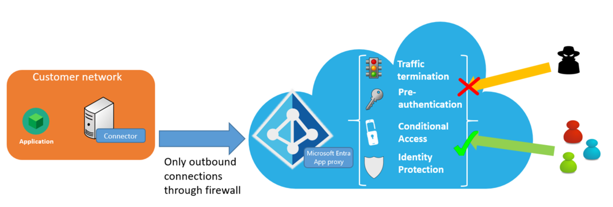

# Security considerations for accessing apps remotely with Microsoft Entra application proxy

This article explains the components that work to keep your users and applications safe when you use Microsoft Entra application proxy.

The following diagram shows how Microsoft Entra ID enables secure remote access to your on-premises applications.

 

## Security benefits

Microsoft Entra application proxy offers many security benefits. The list of benefits are:
- Authenticated access
- Conditional access
- Traffic termination
- All outbound access
- Cloud scale analytics and machine learning
- Remote access as a service
- Microsoft Distributed Denial of Service (DDoS) protection service

### Authenticated access 

Only authenticated connections can access your network when you use Microsoft Entra pre authentication.

Microsoft Entra application proxy relies on the Microsoft Entra security token service (STS) for all authentication. Pre authentication, by its very nature, blocks a significant number of anonymous attacks, because only authenticated identities can access the back-end application.

If you choose Passthrough as your pre authentication method, you don't get this benefit. 

### Conditional Access

Apply richer policy controls before connections to your network are established.

With [Conditional Access](~/identity/conditional-access/concept-conditional-access-cloud-apps.md), you can define restrictions on how users are allowed to access your applications. You can create policies that restrict sign-ins based on location, strength of authentication, and user risk profile.

You can also use Conditional Access to configure multifactor authentication policies, adding another layer of security to your user authentications. Additionally, your applications can also be routed to Microsoft Defender for Cloud Apps via Microsoft Entra Conditional Access to provide real-time monitoring and controls, via [access](/defender-cloud-apps/access-policy-aad) and [session](/defender-cloud-apps/session-policy-aad) policies.

### Traffic termination

All traffic is terminated in the cloud.

Because Microsoft Entra application proxy is a reverse-proxy, all traffic to back-end applications is terminated at the service. The session can get reestablished only with the back-end server, which means that your back-end servers aren't exposed to direct HTTP traffic. The configuration means that you're better protected from targeted attacks.

### All access is outbound 

You don't need to open inbound connections to the corporate network.

private network connectors only use outbound connections to the Microsoft Entra application proxy service. There's no need to open firewall ports for incoming connections. Traditional proxies require a perimeter network (also known as *DMZ*, *demilitarized zone*, or *screened subnet*) and allow access to unauthenticated connections at the network edge. With application proxy, you don't need a perimeter network because all connections are outbound and take place over a secure channel.

For more information about connectors, see [Understand Microsoft Entra private network connectors](application-proxy-connectors.md).

### Cloud-scale analytics and machine learning 

Get cutting-edge security protection.

Because it's part of Microsoft Entra ID, application proxy uses [Microsoft Entra ID Protection](~/id-protection/overview-identity-protection.md), with data from the Microsoft Security Response Center and Digital Crimes Unit. Together we proactively identify compromised accounts and offer protection from high-risk sign-ins. We take into account numerous factors to determine which sign-in attempts are high risk. These factors include flagging infected devices, anonymizing networks, and atypical or unlikely locations.

Many of these reports and events are already available through an API for integration with your security information and event management (SIEM) systems.

### Remote access as a service

You don’t have to worry about maintaining and patching on-premises servers.

Unpatched software still accounts for a large number of attacks. Microsoft Entra application proxy is an Internet-scale service that Microsoft owns, so you always get the latest security patches and upgrades.

To improve the security of applications published by Microsoft Entra application proxy, we block web crawler robots from indexing and archiving your applications. Each time a web crawler robot tries to retrieve the robot's settings for a published app, application proxy replies with a robots.txt file that includes `User-agent: * Disallow: /`.

#### Microsoft Distributed Denial of Service (DDoS) protection service

Applications published through application proxy are protected against Distributed Denial of Service (DDoS) attacks. Microsoft automatically enables this protection in all datacenters. The Microsoft DDoS protection service provides always-on traffic monitoring and real-time mitigation of common network-level attacks. 

## Under the hood

Microsoft Entra application proxy consists of two parts:

* The cloud-based service: This service runs in the Microsoft cloud, and is where the external client/user connections are made.
* [The on-premises connector](application-proxy-connectors.md): An on-premises component, the connector listens for requests from the Microsoft Entra application proxy service and handles connections to the internal applications. 

A flow between the connector and the application proxy service is established when:

* The connector is first set up.
* The connector pulls configuration information from the application proxy service.
* A user accesses a published application.

>[!NOTE]
>All communications occur over TLS, and they always originate at the connector to the application proxy service. The service is outbound only.

The connector uses a client certificate to authenticate to the application proxy service for nearly all calls. The only exception to this process is the initial setup step, where the client certificate is established.

### Installing the connector

When the connector is first set up, the following flow events take place:

1. The connector registration to the service happens as part of the installation of the connector. Users are prompted to enter their Microsoft Entra admin credentials. The token acquired from this authentication is then presented to the Microsoft Entra application proxy service.
2. The application proxy service evaluates the token. It checks whether the user is at least an Application Administrator in the tenant. If the user isn't, the process is terminated.
3. The connector generates a client certificate request and passes it, along with the token, to the application proxy service. The service in turn verifies the token and signs the client certificate request.
4. The connector uses the client certificate for future communication with the application proxy service.
5. The connector performs an initial pull of the system configuration data from the service using its client certificate, and it's now ready to take requests.

### Updating the configuration settings

Whenever the application proxy service updates the configuration settings, the following flow events take place:

1. The connector connects to the configuration endpoint within the application proxy service by using its client certificate.
1. The client certificate is validated.
1. The application proxy service returns configuration data to the connector (for example, the connector group that the connector should be part of).
1. The connector generates a new certificate request if the current certificate is more than 180 days old.

### Accessing published applications

When users access a published application, the following events take place between the application proxy service and the private network connector:

1. The service authenticates the user for the app
2. The service places a request in the connector queue
3. A connector processes the request from the queue
4. The connector waits for a response
5. The service streams data to the user

To learn more about what takes place in each of these steps, keep reading.

#### 1. The service authenticates the user for the app

If the application uses passthrough as its pre authentication method, the steps in this section are skipped.

Users are redirected to the Microsoft Entra STS to authenticate if the application is configured to pre authenticate with Microsoft Entra ID. The following steps take place:

1. Application proxy checks for Conditional Access policy requirements. The step ensures the user is assigned to the application. If two-step verification is required, the authentication sequence prompts the user for a second authentication method.
2. The Microsoft Entra STS issues a signed token for the application and redirects the user back to the application proxy service.
3. Application proxy verifies that the token was issued to the correct application, signed, and is valid.
4. Application proxy sets an encrypted authentication cookie to indicate successful authentication to the application. The cookie includes an expiration timestamp based on the token from Microsoft Entra ID. The cookie also includes the user name that the authentication is based on. The cookie is encrypted with a private key known only to the application proxy service.
5. Application proxy redirects the user back to the originally requested URL.

If any part of the pre authentication steps fails, the user’s request is denied, and the user is shown a message indicating the source of the problem.

#### 2. The service places a request in the connector queue

Connectors keep an outbound connection open to the application proxy service. When a request comes in, the service queues up the request on one of the open connections for the connector to pick up.

The request includes request headers, data from the encrypted cookie, the user making the request, and the request ID. Although data from the encrypted cookie is sent with the request, the authentication cookie itself isn't.

#### 3. The connector processes the request from the queue. 

Based on the request, application proxy performs one of the following actions:

* If the request is a simple operation (for example, there's no data within the body as is with a RESTful API `GET` request), the connector makes a connection to the target internal resource and then waits for a response.

* If the request has data associated with it in the body (for example, a RESTful API `POST` operation), the connector makes an outbound connection by using the client certificate to the application proxy instance. It makes this connection to request the data and open a connection to the internal resource. After it receives the request from the connector, the application proxy service begins accepting content from the user and forwards data to the connector. The connector, in turn, forwards the data to the internal resource.

#### 4. The connector waits for a response.

After the request and transmission of all content to the back end is complete, the connector waits for a response.

After it receives a response, the connector makes an outbound connection to the application proxy service, to return the header details and begin streaming the return data.

#### 5. The service streams data to the user. 

Some processing of the application occurs at this time. For example, application proxy translates headers or URLs.

## Next steps
- [Application proxy network topology](application-proxy-network-topology.md)
- [private network connectors](application-proxy-connectors.md)
