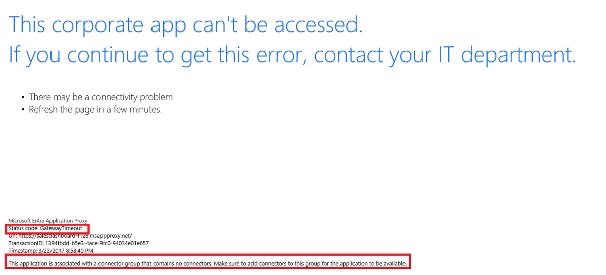

# Troubleshoot "corporate app can't be accessed" error in application proxy

This article helps you troubleshoot common issues for the `This corporate app can't be accessed` error in a Microsoft Entra application proxy application.

When you see this error, find the status code on the error page:

- **Gateway time-out**: The application proxy service can't reach the connector. The error typically indicates a problem with the connector assignment, the connector, or the networking rules for the connector.
- **Bad gateway**: The connector can't reach the back-end application. The error might indicate a misconfiguration of the application.
- **Forbidden**: The user isn't authorized to access the application. The error might occur when the user isn't assigned to the application in Microsoft Entra ID. The error can also happen if the user doesn't have permissions to access the application on the back end.

To find the error code, look at the text at the bottom-left corner of the error message under `Status Code`.

## "Gateway time-out" errors

A *gateway time-out* error occurs when the service tries to reach the connector and fails within the time-out window that is set. The error is seen when an application is assigned to a connector group that has no working connectors. The error is also seen when the required ports aren't open.

## "Bad gateway" errors

A *bad gateway* error indicates that the connector is can't reach the back-end application. Common mistakes that cause this error are:

- A typo or mistake is in the internal URL.
- The root of the application isn't published. An example is publishing `http://expenses/reimbursement` but trying to access `http://expenses`.
- Problems exist with the Kerberos constrained delegation (KCD) configuration.
- Problems exist with the back-end application.

## "Forbidden" errors

If you see a *forbidden* error, the user isn't assigned to the application. This error might be either in Microsoft Entra ID or on the back-end application.

To learn how to assign users to the application in Azure, see the [Test the configuration](application-proxy-add-on-premises-application.md#test-the-application).

## Check the application's internal URL

As a quick first step, double-check the internal URL by opening the application through **Enterprise Applications** > **Application proxy**. Verify that the internal URL of the application is the one that's used from your on-premises network. If the URL is incorrect, fix it and save the changes.

## Check that the application is assigned to a working connector group

Verify that the application is assigned to a working connector group.

For more information, see [Tutorial: Add an on-premises application for remote access through application proxy in Microsoft Entra ID](application-proxy-add-on-premises-application.md).

## Check that all required ports are open

Verify that all required ports are open. For required ports, see the open ports section of [Tutorial: Add an on-premises application for remote access through application proxy in Microsoft Entra ID](application-proxy-add-on-premises-application.md). If all the required ports are open, go to the next section.

## Check for other connector errors

Look for issues or errors with the connector itself. For more information about common errors, see [Application proxy troubleshooting](application-proxy-troubleshoot.md).

Look directly at the connector logs to identify any errors. Many of the error messages share specific recommendations for fixes. To view the logs, view the [private network connectors](application-proxy-connectors.md).

## Common solutions

If your application is configured to use integrated Windows authentication (IWA), test the application without single sign-on (SSO). To check the application without SSO, open your application through **Enterprise Applications** and go to the **Single Sign-On** menu. Change the drop-down from **Integrated Windows authentication** to **Microsoft Entra single sign-on disabled**.

Next, open a browser and try again to access the application. You should be prompted for authentication and be able to sign in the application. If you can authenticate, the problem is with the KCD configuration that enables SSO.

If the error persists, use the computer where the connector is installed to open a browser and try accessing the application's internal URL. If the application can't be reached, check why that machine can't connect, or use a connector on a server that can.

## Related content

- [Understand Microsoft Entra private network connectors](../../global-secure-access/concept-connectors.md)
