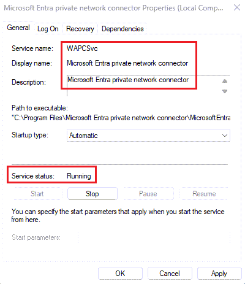

# Troubleshoot application proxy problems and error messages

First, make sure the application proxy connectors are configured correctly. For more information, see [Debug application proxy connector issues](application-proxy-debug-connectors.md) and [Debug application proxy application issues](./application-proxy-debug-apps.md).

If errors occur in accessing a published application or in publishing applications, check the following options to see if Microsoft Entra application proxy is working correctly:

* Open the Windows Services console. Verify that the **Microsoft Entra application proxy connector** service is enabled and running. Look at the application proxy service properties page, as shown in the image:  
  
* Open Event Viewer and look for application proxy connector events in **Applications and Services Logs** > **Microsoft** > **AadApplicationProxy** > **Connector** > **Admin**.
* Review detailed logs by [turning on the application proxy connector session logs](application-proxy-connectors.md#under-the-hood).

## The page isn't rendered correctly
You have problems with your application rendering or functioning incorrectly without receiving specific error messages. The problem occurs if you published the article path, but the application requires content that exists outside that path.

For example, if you publish the path `https://yourapp/app` but the application calls images in `https://yourapp/media`, they aren't rendered. Make sure that you publish the application using the highest level path you need to include all relevant content. In this example, it would be `http://yourapp/`.

## I can load my application, but something on the page looks broken
[I can get to my application, but the application page isn't displaying correctly](application-proxy-page-appearance-broken-problem.md).

[I can get to my application, but the application takes too long to load](application-proxy-page-load-speed-problem.md).

[I can get to my application, but the links on the application page don't work](application-proxy-page-links-broken-problem.md).

## I'm having a connectivity problem with my application
[I don't know what ports to open for my application](application-proxy-add-on-premises-application.md).

## I'm having a problem configuring the Microsoft Entra application proxy in the admin portal
[I don't know how to configure single sign-on to my application Proxy application](how-to-configure-sso.md).

## I'm having a problem setting up back-end authentication to my application
[I don't know how to configure Kerberos Constrained Delegation](application-proxy-back-end-kerberos-constrained-delegation-how-to.md).
[I don't know how to configure my application with PingAccess](application-proxy-ping-access-publishing-guide.md).

## I'm having a problem when signing in to my application
I get the error `Can't Access this Corporate Application`. To solve this issue, see [Bad gateway timeout error](application-proxy-sign-in-bad-gateway-timeout-error.md).

## I'm having a problem with the application proxy connector
[I have issues installing the application proxy connector](application-proxy-connector-installation-problem.md).

## Connector errors

If registration fails during the connector wizard installation, there are two ways to view the reason for the failure. Either look in the event log under `Windows Logs\Application (filter by Source = "Microsoft Entra application proxy connector"` , or run the following Windows PowerShell command:

```powershell
Get-EventLog application –source "Microsoft AAD Application Proxy Connector" –EntryType "Error" –Newest 1
```

Once you find the connector error from the event log, use this table of common errors to resolve the problem:

| Error | Recommended steps |
| ----- | ----------------- |
| `Connector registration failed: Make sure you enabled application proxy in the Azure Management Portal and that you entered your Active Directory user name and password correctly. Error: 'One or more errors occurred.'` | If you closed the registration window without signing in to Microsoft Entra ID, run the connector wizard again and register the connector. <br><br> If the registration window opens and then immediately closes without allowing you to sign in, you get the error. The error occurs when there's a networking error on your system. Make sure you can connect from a browser to a public website and that the ports are open as specified in [application proxy prerequisites](application-proxy-add-on-premises-application.md#prepare-your-on-premises-environment). |
| `Clear error is presented in the registration window. Cannot proceed` | If you see the error and then the window closes, you entered the wrong username or password. Try again. |
| `Connector registration failed: Make sure you enabled application proxy in the Azure Management Portal and that you entered your Active Directory user name and password correctly. Error: 'AADSTS50059: No tenant-identifying information found in either the request or implied by any provided credentials and search by service principal URI has failed.` | You're trying to sign in using a Microsoft Account and not a domain that is part of the organization ID of the directory you're trying to access. The admin must be part of the same domain name as the tenant domain. For example, if the Microsoft Entra domain is `contoso.com`, the admin should be `admin@contoso.com`. |
| `Failed to retrieve the current execution policy for running PowerShell scripts.` | If the connector installation fails, check to make sure that PowerShell execution policy isn't disabled. <br><br>1. Open the Group Policy Editor.<br>2. Go to **Computer Configuration** > **Administrative Templates** > **Windows Components** > **Windows PowerShell** and double-click **Turn on Script Execution**.<br>3. The execution policy can be set to either **Not Configured** or **Enabled**. If set to **Enabled**, make sure that under Options, the Execution Policy is set to either **Allow local scripts and remote signed scripts** or to **Allow all scripts**. |
| `Connector failed to download the configuration.` | The connector’s client certificate, which is used for authentication, expired. The issue occurs if you have the connector installed behind a proxy. In this case, the connector can't access the internet and isn't able to provide applications to remote users. Renew trust manually using the `Register-AppProxyConnector` cmdlet in Windows PowerShell. If your connector is behind a proxy, it's necessary to grant internet access to the connector accounts “network services” and “local system.” Granting access is accomplished by granting access to the proxy or bypassing the proxy. |
| `Connector registration failed: Make sure you are an Application Administrator of your Active Directory to register the connector. Error: 'The registration request was denied.'` | The alias you're trying to sign in with isn't an admin on this domain. Your connector is always installed for the directory that owns the user’s domain. Make sure that the admin account you're trying to sign in with has at least application administrator permissions to the Microsoft Entra tenant. |
| `The connector was unable to connect to the service due to networking issues. The connector tried to access the following URL.` | The connector is unable to connect to the application proxy cloud service. The issue happens if you have a firewall rule blocking the connection. Allow access to the correct ports and URLs listed in [application proxy prerequisites](application-proxy-add-on-premises-application.md#prepare-your-on-premises-environment). |

## Kerberos errors

This table covers the more common errors that come from Kerberos setup and configuration, and includes suggestions for resolution.

| Error | Recommended steps |
| ----- | ----------------- |
| `Failed to retrieve the current execution policy for running PowerShell scripts.` | If the connector installation fails, check to make sure that PowerShell execution policy isn't disabled.<br><br>1. Open the Group Policy Editor.<br>2. Go to **Computer Configuration** > **Administrative Templates** > **Windows Components** > **Windows PowerShell** and double-click **Turn on Script Execution**.<br>3. The execution policy can be set to either **Not Configured** or **Enabled**. If set to **Enabled**, make sure that under Options, the Execution Policy is set to either **Allow local scripts and remote signed scripts** or to **Allow all scripts**. |
| `12008 - Microsoft Entra exceeded the maximum number of permitted Kerberos authentication attempts to the backend server.` | This error indicates incorrect configuration between Microsoft Entra ID and the backend application server, or a problem in time and date configuration on both machines. The backend server declined the Kerberos ticket created by Microsoft Entra ID. Verify that Microsoft Entra ID and the backend application server are configured correctly. Make sure that the time and date configuration on the Microsoft Entra ID and the backend application server are synchronized. |
| `13016 - Microsoft Entra ID cannot retrieve a Kerberos ticket on behalf of the user because there is no UPN in the edge token or in the access cookie.` | There's a problem with the Security Token Service (STS) configuration. Fix the User Principal Name (UPN) claim configuration in the STS. |
| `13019 - Microsoft Entra ID cannot retrieve a Kerberos ticket on behalf of the user because of the following general API error.` | This event indicates incorrect configuration between Microsoft Entra ID and the domain controller server, or a problem in time and date configuration on both machines. The domain controller declined the Kerberos ticket created by Microsoft Entra ID. Verify that Microsoft Entra ID and the backend application server are configured correctly, especially the Service Principal Name (SPN) configuration. Make sure the domain controller establishes trust with Microsoft Entra ID. Both should use the same domain. Make sure the time and date configuration on the Microsoft Entra ID and the domain controller are synchronized. |
| `13020 - Microsoft Entra ID cannot retrieve a Kerberos ticket on behalf of the user because the backend server SPN is not defined.` | This event indicates incorrect configuration between Microsoft Entra ID and the domain controller server, or a problem in time and date configuration on both machines. The domain controller declined the Kerberos ticket created by Microsoft Entra ID. Verify that Microsoft Entra ID and the backend application server are configured correctly, especially the SPN configuration. Make sure the domain controller establishes trust with Microsoft Entra ID. Both should use the same domain. Make sure that the time and date configuration on the Microsoft Entra ID and the domain controller are synchronized. |
| `13022 - Microsoft Entra ID cannot authenticate the user because the backend server responds to Kerberos authentication attempts with an HTTP 401 error.` | This event indicates incorrect configuration between Microsoft Entra ID and the backend application server, or a problem in time and date configuration on both machines. The backend server declined the Kerberos ticket created by Microsoft Entra ID. Verify that Microsoft Entra ID and the backend application server are configured correctly. Make sure that the time and date configuration on the Microsoft Entra ID and the backend application server are synchronized. For more information, see [Troubleshoot Kerberos Constrained Delegation Configurations for application proxy](application-proxy-back-end-kerberos-constrained-delegation-how-to.md).  |

## End-user errors

This list covers errors that your end users might encounter when they try to access the app and fail. 

| Error | Recommended steps |
| ----- | ----------------- |
| `The website cannot display the page.` | Your user gets this error when trying to access the app you published if the application is an Integrated Windows Authentication (IWA) application. The defined SPN for this application is incorrect. For IWA apps, make sure that the SPN configured for this application is correct. |
| `The website cannot display the page.` | Your user gets this error when trying to access the app you published if the application is an Outlook Web Application (OWA) application. The issue results from: <br><li>The defined SPN for this application is incorrect. Make sure that the SPN configured for this application is correct.</li><li>The user who tried to access the application is using a Microsoft account rather than the proper corporate account to sign in, or the user is a guest user. Make sure the user signs in using their corporate account that matches the domain of the published application. Microsoft Account users and guest can't access IWA applications.</li><li>The user who tried to access the application isn't properly defined for this application on the on premises side. Make sure that this user has the proper permissions as defined for this backend application on the on premises machine. |
| `This corporate app can’t be accessed. You are not authorized to access this application. Authorization failed. Make sure to assign the user with access to this application.` | Your user gets this error when trying to access the app you published if they use Microsoft accounts instead of their corporate account to sign in. Guest users get this error. Microsoft Account users and guests can't access IWA applications. Make sure the user signs in using their corporate account that matches the domain of the published application.<br><br>You must assign the user for this application. Go to the **Application** tab, and under **Users and Groups**, assign this user or user group to this application.|
| `This corporate app can’t be accessed right now. Please try again later… The connector timed out. ` | Your user gets this error when trying to access the app you published if they aren't properly defined for this application on the on-premises side. Make sure that your users have the proper permissions as defined for this backend application on the on premises machine. |
| `This corporate app can’t be accessed. You are not authorized to access this application. Authorization failed. Make sure that the user has a license for Microsoft Entra ID P1 or P2.` | Your user gets this error when trying to access the app you published if they weren't explicitly assigned with a Premium license by the subscriber’s administrator. Go to the subscriber’s Active Directory **Licenses** tab and make sure that this user or user group is assigned a Premium license. |
| `A server with the specified host name could not be found.` | Your user gets this error when trying to access the app you published if the application's custom domain isn't configured correctly. Check the certificate for the domain and configure the Domain Name System (DNS) record correctly. For more information, see [Working with custom domains in Microsoft Entra application proxy](./how-to-configure-custom-domain.md). |
| `Forbidden: This corporate app can't be accessed OR The user could not be authorized. Make sure the user is defined in your on-premises AD and that the user has access to the app in your on-premises AD.` | The issue could be a problem with access to authorization information, see [Some applications and APIs require access to authorization information on account objects](https://support.microsoft.com/help/331951/some-applications-and-apis-require-access-to-authorization-information). In a nutshell, add the app proxy connector machine account to the "Windows Authorization Access Group" builtin domain group to resolve. |
| `InternalServerError: This corporate app can’t be accessed right now. Please try again later… ConnectorError:Unauthorized.` | The connector secures outbound connections to the Microsoft Entra application proxy cloud service endpoints using a client certificate. The error occurs when the client certificate fails to reach the endpoint. For example, a network device performing Transport Layer Security (TLS) inspection or breaking the TLS connection. Avoid all forms of inline inspection and termination on outbound TLS communications between Microsoft Entra application proxy connectors and Microsoft Entra application proxy cloud services.|


## See also
* [Enable application proxy for Microsoft Entra ID](application-proxy-add-on-premises-application.md)
* [Publish applications with application proxy](application-proxy-add-on-premises-application.md)
* [Enable single sign-on](how-to-configure-sso-with-kcd.md)
* [Enable Conditional Access](./application-proxy-integrate-with-sharepoint-server.md)
