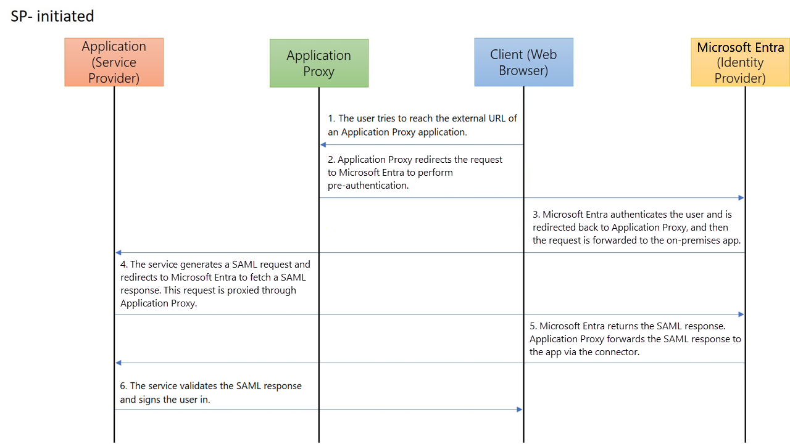
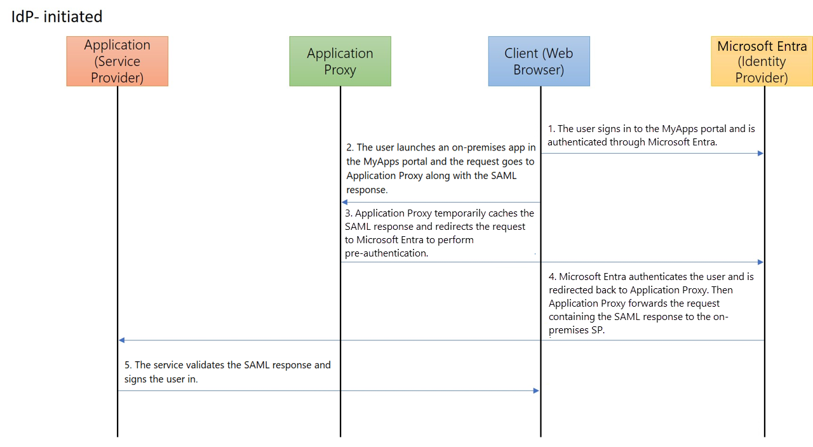

# Security Assertion Markup Language (SAML) single sign-on (SSO) for on-premises applications with application proxy

Provide single sign-on (SSO) to on-premises applications secured with Security Assertion Markup Language (SAML) authentication. Provide remote access to SAML based SSO applications through application proxy. With SAML single sign-on, Microsoft Entra authenticates to the application using the user's Microsoft Entra account. Microsoft Entra ID communicates the sign-on information to the application through a connection protocol. You can also map users to specific application roles based on rules you define in your SAML claims. By enabling application proxy in addition to SAML SSO, your users have external access to the application and a seamless SSO experience.

The applications must be able to consume SAML tokens issued by **Microsoft Entra ID**. 
This configuration doesn't apply to applications using an on-premises identity provider. For these scenarios, we recommend reviewing [Resources for migrating applications to Microsoft Entra ID](~/identity/enterprise-apps/migration-resources.md).

SAML SSO with application proxy also works with the SAML token encryption feature. For more info, see [Configure Microsoft Entra SAML token encryption](~/identity/enterprise-apps/howto-saml-token-encryption.md).

The protocol diagrams describe the single sign-on sequence for both a service provider-initiated (SP-initiated) flow and an identity provider-initiated (IdP-initiated) flow. Application proxy works with SAML SSO by caching the SAML request and response to and from the on-premises application.

  

  

## Create an application and set up SAML SSO

1. In the Microsoft Entra admin center, select **Microsoft Entra ID > Enterprise applications** and select **New application**.

2. Enter the display name for your new application. Select **Integrate any other application you don't find in the gallery**, then select **Create**.

3. On the app's **Overview** page, select **Single sign-on**.

4. Select **SAML** as the single sign-on method.

5. First set up SAML SSO to work while on the corporate network, see the basic SAML configuration section of [Configure SAML-based single sign-on](~/identity-platform/single-sign-on-saml-protocol.md) to configure SAML-based authentication for the application.

6. Add at least one user to the application and make sure the test account has access to the application. While connected to the corporate network, use the test account to see if you have single sign-on to the application. 

   > [!NOTE]
   > After you set up application proxy, you'll come back and update the SAML **Reply URL**.

## Publish the on-premises application with application proxy

Before you provide SSO for on-premises applications, enable application proxy and install a connector. Learn more about [how to prepare your on-premises environment, install and register a connector, and test the connector](application-proxy-add-on-premises-application.md). Once you have the connector set up, follow these steps to publish your new application with application proxy.

1. With the application still open in the Microsoft Entra admin center, select **application proxy**. Provide the **Internal URL** for the application. If you're using a custom domain, you also need to upload the Transport Layer Security (TLS) certificate for your application. 
   > [!NOTE]
   > As a best practice, use custom domains whenever possible for an optimized user experience. Learn more about [Working with custom domains in Microsoft Entra application proxy](how-to-configure-custom-domain.md).

2. Select **Microsoft Entra ID** as the **Pre Authentication** method for your application.

3. Copy the **External URL** for the application. You need this URL to complete the SAML configuration.

4. Using the test account, try to open the application with the **External URL** to validate that application proxy is set up correctly. If there are issues, see [Troubleshoot application proxy problems and error messages](application-proxy-troubleshoot.md).

## Update the SAML configuration

1. With the application still open in the Microsoft Entra admin center, select **Single sign-on**. 

2. In the **Set up Single Sign-On with SAML** page, go to the **Basic SAML Configuration** heading, and select its **Edit** icon (a pencil). Make sure the **External URL** you configured in application proxy is populated in the **Identifier**, **Reply URL**, and **Logout URL** fields. These URLs are required for application proxy to work correctly. 

3. Edit the **Reply URL** configured earlier so that its domain reachable on the internet via application proxy. For example, if your **External URL** is `https://contosotravel-f128.msappproxy.net` and the original **Reply URL** was `https://contosotravel.com/acs`, you need to update the original **Reply URL** to `https://contosotravel-f128.msappproxy.net/acs`.

4. Select the checkbox next to the updated **Reply URL** to mark it as the default.

   * After marking the required **Reply URL** as default, you can also delete the previously configured **Reply URL** that used the internal URL.

   * For an SP-initiated flow, make sure the back-end application specifies the correct **Reply URL** or Assertion Consumer Service URL for receiving the authentication token.

    > [!NOTE]
    > If the back-end application expects the **Reply URL** to be the Internal URL, you need to either use [custom domains](how-to-configure-custom-domain.md) to have matching internal and external URLs or install the My Apps secure sign-in extension on users' devices. This extension will automatically redirect to the appropriate application proxy Service. To install the extension, see [My Apps secure sign-in extension](https://support.microsoft.com/account-billing/sign-in-and-start-apps-from-the-my-apps-portal-2f3b1bae-0e5a-4a86-a33e-876fbd2a4510#download-and-install-the-my-apps-secure-sign-in-extension).
    
## Test your app

Your app is up and running. To test the app:

1. Open a browser and navigate to the **External URL** that you created when you published the app. 
1. Sign in with the test account that you assigned to the app. You should be able to load the application and have SSO into the application.

## Next steps

- [How does Microsoft Entra application proxy provide single sign-on?](~/identity/enterprise-apps/what-is-single-sign-on.md)
- [Troubleshoot application proxy](application-proxy-troubleshoot.md)
