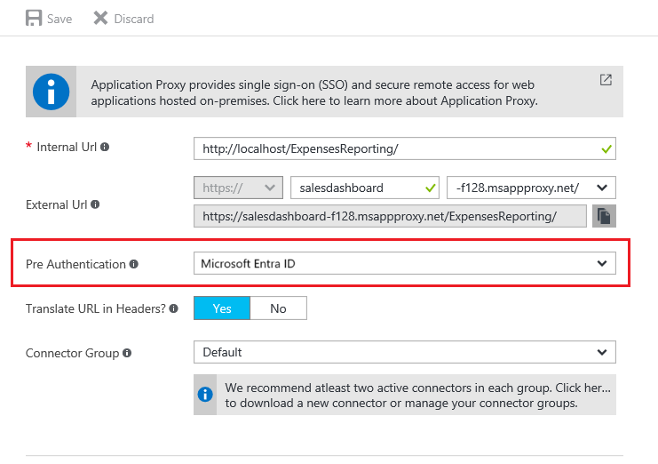

# How to configure single sign-on to an application proxy application

Single sign-on (SSO) allows your users to access an application without authenticating multiple times. It allows the single authentication to occur in the cloud, against Microsoft Entra ID, and allows the service or Connector to impersonate the user to complete any more authentication challenges from the application.

## How to configure single-sign on
To configure SSO, first make sure that your application is configured for Pre-Authentication through Microsoft Entra ID.

1. Sign in to the [Microsoft Entra admin center](https://entra.microsoft.com) as at least an [Application Administrator](~/identity/role-based-access-control/permissions-reference.md#application-administrator).
1. Select your username in the upper-right corner. Verify you're signed in to a directory that uses application proxy. If you need to change directories, select **Switch directory** and choose a directory that uses application proxy.
1. Browse to **Entra ID** > **Enterprise apps** > **Application proxy**.

 Look for the `Pre Authentication` field, and make sure that is set. 

For more information on the Pre-Authentication methods, see step 4 of the [app publishing document](application-proxy-add-on-premises-application.md).

   

## Configuring single sign-on modes for application proxy Applications
Configure the specific type of single sign-on. The sign-on methods are classified based on what type of authentication the backend application uses. Application proxy applications support three types of sign-on:

-   **Password-based sign-on:** Password-based sign-on can be used for any application that uses username and password fields to sign on. Configuration steps are in [Configure password Single sign-on for a Microsoft Entra gallery application](~/identity/enterprise-apps/configure-password-single-sign-on-non-gallery-applications.md).

-   **Integrated Windows authentication:** For applications using integrated Windows authentication (IWA), single sign-on is enabled through Kerberos Constrained Delegation (KCD). This method gives private network connectors permission in Active Directory to impersonate users, and to send and receive tokens on their behalf. Details on configuring KCD can be found in the [Single sign-on with KCD documentation](how-to-configure-sso-with-kcd.md).

-   **Header-based sign-on:** Header-based sign-on is used to provide single sign-on capabilities using HTTP headers. To learn more, see [Header-based single sign-on](application-proxy-configure-single-sign-on-with-headers.md).

-   **SAML single sign-on:** With Security Assertion Markup Language (SAML) single sign-on, Microsoft Entra authenticates to the application by using the user's Microsoft Entra account. Microsoft Entra ID communicates the sign-on information to the application through a connection protocol. With SAML-based single sign-on, you can map users to specific application roles based on rules you define in your SAML claims. For information about setting up SAML single sign-on, see [SAML for single sign-on with application proxy](conceptual-sso-apps.md).

Each of these options can be found by going to your application in **Enterprise Applications**, and opening the **single sign-on** page on the left menu. If your application was created in the old portal, you might not see all these options.

On this page, you also see one more Sign-On option: Linked Sign-On. Application proxy supports this option. However, this option doesn't add single sign-on to the application. That said the application might already have single sign-on implemented using another service such as Active Directory Federation Services. 

This option allows an admin to create a link to an application that users first land on when accessing the application. For example, an application that is configured to authenticate users using Active Directory Federation Services 2.0 can use the **Linked Sign-On** option to create a link to it on the My Apps page.

## Next steps
- [Password vaulting for single sign-on with application proxy](application-proxy-configure-single-sign-on-password-vaulting.md)
- [Kerberos Constrained Delegation for single sign-on with application proxy](how-to-configure-sso-with-kcd.md)
- [Header-based authentication for single sign-on with application proxy](application-proxy-configure-single-sign-on-with-headers.md) 
- [SAML for single sign-on with application proxy](conceptual-sso-apps.md).
