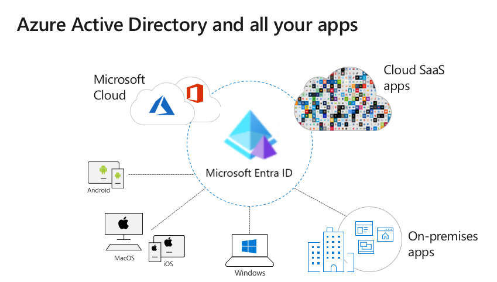
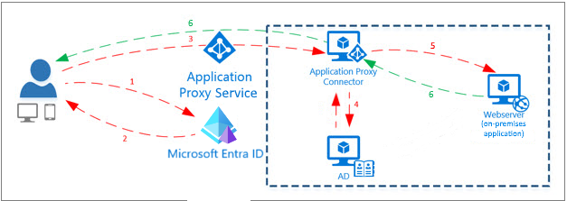
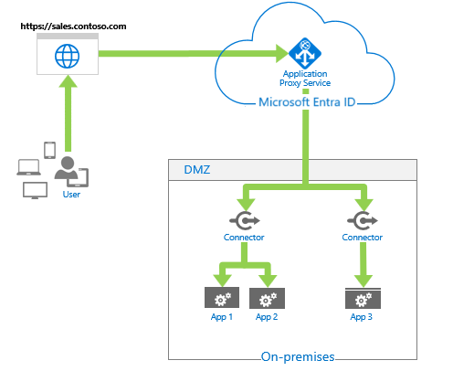
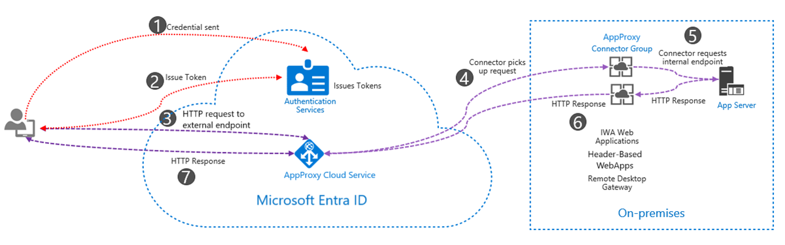

# Microsoft Entra application proxy

## Overview

Microsoft Entra application proxy provides secure remote access to on-premises web applications for remote users. After single sign-on (SSO) to Microsoft Entra ID, users can access both cloud and on-premises applications through an external URL or an internal application portal. For example, application proxy can provide remote access and SSO to Remote Desktop, SharePoint, Teams, Tableau, Qlik, and line-of-business (LOB) applications.

Microsoft Entra application proxy is:

- **Simple to use**. Users can access your on-premises applications the same way that they access Microsoft 365 and other software-as-a-service (SaaS) apps integrated with Microsoft Entra ID. You don't need to change or update your applications to work with application proxy.

- **Secure**. On-premises applications can use the authorization controls and security analytics in Microsoft Entra. For example, on-premises applications can use Microsoft Entra Conditional Access and multifactor authentication. Application proxy doesn't require you to open inbound connections through your firewall.

- **Cost-effective**. On-premises solutions typically require you to set up and maintain perimeter networks (also known as demilitarized zones or DMZs), edge servers, or other complex infrastructures. Application proxy runs in the cloud. To use it, you don't need to change the network infrastructure or install more appliances in your on-premises environment.

> [!TIP]
> If you already have Microsoft Entra ID, you can use it as one control plane to allow seamless and secure access to your on-premises applications.

Here are some examples of using application proxy in a hybrid coexistence scenario:

- Publish on-premises web apps externally in a simplified way without a perimeter network.
- Support SSO across devices, resources, and apps in the cloud and on-premises.
- Support multifactor authentication for apps in the cloud and on-premises.
- Quickly use cloud features with the security of the Microsoft cloud.
- Centralize user account management.
- Centralize control of identity and security.
- Automatically add or remove user access to applications based on group membership.

This article explains how application proxy brings cloud capabilities and security to your on-premises web applications, and describes the supported architecture and topologies.

## Remote access in the past vs. the present

Previously, your control plane for protecting internal resources from attackers while facilitating access by remote users was all in the perimeter network. But the VPN and reverse proxy solutions that are deployed in the perimeter network and that external clients use to access corporate resources aren't suited to the cloud world. They typically:

- Increase hardware costs.
- Require ongoing security maintenance, including patching and port monitoring.
- Authenticate users at the edge.
- Authenticate users to web servers in the perimeter network.
- Require distributing and configuring VPN client software to maintain remote access.
- Maintain domain-joined servers in the perimeter network, which can be vulnerable to outside attacks.

In today's digital workplace, users access apps and work from anywhere by using multiple devices. The constant factor is user identity.

You can use Microsoft Entra ID to control who and what gets into your network. Microsoft Entra application proxy integrates with modern authentication and cloud-based technologies, like SaaS applications and identity providers. This integration enables users to access apps from anywhere.

Not only is application proxy better suited for today's digital workplace, it's more secure than VPN and reverse proxy solutions. It's also easier to implement. Remote users can access your on-premises applications the same way that they access Microsoft and other SaaS apps integrated with Microsoft Entra ID. You don't need to change or update your applications to work with application proxy. Application proxy also doesn't require you to open inbound connections through your firewall.

You can start securing your network by using [Microsoft Entra identity management](/azure/security/fundamentals/identity-management-overview) as your security control plane. This identity-based model includes these components:

- An identity provider to keep track of users and user-related information.
- A device directory to maintain a list of devices that have access to corporate resources. This directory includes corresponding device information (for example, type of device and integrity).
- The policy evaluation service, which checks if users and devices meet the security policies that admins set.
- The ability to grant or deny access to organizational resources.

Microsoft Entra ID tracks users who access web apps published on-premises and in the cloud. It provides a central point to manage these apps.

To enhance security, enable Microsoft Entra Conditional Access. This feature ensures that only the right people access your applications by setting conditions for authentication and access.

> [!NOTE]
> Microsoft Entra application proxy replaces VPNs or reverse proxies for remote users who access internal resources. It isn't designed for internal users on the corporate network. When internal users use application proxy unnecessarily, it can cause unexpected performance problems.

## Overview of how application proxy works

Application proxy includes both the *application proxy service* and the *private network connector*. The application proxy service runs in the cloud, and the private network connector operates as a lightweight agent on an on-premises server. Microsoft Entra ID acts as the identity provider.

The following diagram shows how Microsoft Entra ID, the application proxy service, and the private network connector work together to enable users to access on-premises web applications with a seamless SSO experience.

1. The user accesses the application through an endpoint and is redirected to the Microsoft Entra sign-in page.
1. Microsoft Entra ID sends a token to the user's client device after a successful sign-in.
1. The client sends the token to the application proxy service. The service retrieves the user principal name (UPN) and security principal name (SPN) from the token. The application proxy service then sends the request to the connector.
1. The connector performs required SSO authentication on behalf of the user.
1. The connector sends the request to the on-premises application.
1. The connector and application proxy service send the response to the user.

> [!NOTE]
> Like most Microsoft Entra hybrid agents, the private network connector doesn't require you to open inbound connections through your firewall. User traffic in step 3 ends at the application proxy service. The private network connector, which resides in your private network, is responsible for the rest of the communication.

| Component | Description |
| --------- | ----------- |
| Endpoint | The endpoint is a URL or a [user portal](~/identity/enterprise-apps/end-user-experiences.md). Users can reach the application from outside your network by using an external URL. Users within your network can access the application through a URL or a user portal.   When users go to one of these endpoints, they authenticate in Microsoft Entra ID and then are routed through the connector to the on-premises application. |
| Microsoft Entra ID | Microsoft Entra ID performs the authentication by using the tenant directory stored in the cloud. |
| Application proxy service | The application proxy service runs in the cloud as part of Microsoft Entra ID. It passes the sign-on token from the user to the private network connector.   The service forwards any accessible headers on the request and sets the headers (according to its protocol) to the client IP address. If the incoming request to the proxy already has that header, the client IP address is added to the end of the comma-separated list that is the value of the header. |
| Private network connector | The connector is a lightweight agent that runs on Windows Server inside your network. The connector manages communication between the application proxy service in the cloud and the on-premises application. The connector listens for requests from the application proxy service and handles connections to the application.   The connector uses only outbound connections, so you don't have to open inbound ports in internet-facing networks. Microsoft Entra Private Access uses the same connector.   Connectors are stateless and pull information from the cloud as necessary. For more information about connectors, like how they load-balance and authenticate, see [Microsoft Entra private network connectors](application-proxy-connectors.md). |
| Active Directory | Active Directory runs on-premises to perform authentication for domain accounts. When SSO is configured, the connector communicates with Active Directory to perform any extra authentication that's required. |
| On-premises application | Finally, the user can access an on-premises application. |

You configure the application proxy service in the Microsoft Entra admin center. You can use the service to publish an external public HTTP/HTTPS URL endpoint in Azure, which connects to an internal application server URL in your organization. These on-premises web apps can be integrated with Microsoft Entra ID to support SSO. Users can then access on-premises web apps in the same way that they access Microsoft 365 and other SaaS apps.

After authentication, external users can access on-premises web apps by using a display URL or [My Apps](https://support.microsoft.com/account-billing/sign-in-and-start-apps-from-the-my-apps-portal-2f3b1bae-0e5a-4a86-a33e-876fbd2a4510) from their desktop or iOS devices. For example, application proxy can provide remote access and SSO to Remote Desktop, SharePoint sites, Tableau, Qlik, Outlook on the web, and LOB applications.

### Authentication

There are several ways to configure an application for SSO. The method that you select depends on the authentication that your application uses. Application proxy supports the following types of applications:

- Web applications that use [Integrated Windows Authentication (IWA)](./how-to-configure-sso-with-kcd.md) as the native authentication protocol. For IWA, the private network connectors use Kerberos Constrained Delegation (KCD) to authenticate users to the Kerberos application.
- Web applications that use form-based or [header-based](./application-proxy-configure-single-sign-on-with-headers.md) access. Header-based authentication uses PingAccess, a non-Microsoft partner service, to handle authentication for applications that rely on headers.
- Web APIs that you want to expose to rich applications on various devices.
- Applications hosted behind [Remote Desktop Gateway](./application-proxy-integrate-with-remote-desktop-services.md).
- Rich client apps that are integrated with the Microsoft Authentication Library (MSAL).

Application proxy also supports authentication protocols with non-Microsoft partners in specific configuration scenarios:

- [Password-based authentication](./application-proxy-configure-single-sign-on-password-vaulting.md). With this authentication method, users sign in to the application by using a username and password the first time that they access it. After the first sign-in, Microsoft Entra ID supplies the username and password to the application. In this scenario, Microsoft Entra ID handles authentication.
- [Security Assertion Markup Language (SAML) authentication](./conceptual-sso-apps.md). SAML-based SSO is supported for applications that use either SAML 2.0 or WS-Federation protocols. With SAML SSO, Microsoft Entra ID authenticates to the application by using the user's Microsoft Entra account.

For more information on supported methods, see [Single sign-on options](~/identity/enterprise-apps/plan-sso-deployment.md#choosing-a-single-sign-on-method).

### Security benefits

The remote access solution that application proxy and Microsoft Entra offer supports several security benefits:

- **Authenticated access**. Application proxy uses [preauthentication](./application-proxy-security.md#authenticated-access) to help ensure that only authenticated connections reach your network. It blocks all traffic without a valid token for applications configured with preauthentication. This approach significantly reduces targeted attacks by allowing only verified identities to access back-end applications.

- **Conditional Access**. You can apply richer policy controls before connections to your network are established. With Conditional Access, you can define restrictions on the traffic that you allow to reach your back-end application. You create policies that restrict sign-ins based on location, the strength of authentication, and user risk profile.

  For more security, Conditional Access also integrates with Microsoft Defender for Cloud Apps. With this integration, you can configure an on-premises application for [real-time monitoring](./application-proxy-integrate-with-microsoft-cloud-application-security.md) based on Conditional Access policies.

- **Traffic termination**. All traffic to the back-end application is terminated at the application proxy service in the cloud while the session is re-established with the back-end server. This connection strategy means that your back-end servers aren't exposed to direct HTTP traffic. They're better protected against targeted denial-of-service (DoS) attacks because your firewall isn't under attack.

- **Outbound-only access**. The private network connectors use only outbound connections to the application proxy service in the cloud over ports 80 and 443. With no inbound connections, there's no need to open firewall ports for incoming connections or components in the perimeter network. All the outbound connections are over a secure channel.

- **Intelligence based on security analytics and machine learning**. Because application proxy is part of Microsoft Entra ID, it can use [Microsoft Entra ID Protection](~/id-protection/overview-identity-protection.md). Microsoft Entra ID Protection combines machine-learning security intelligence with data feeds from Microsoft's [Digital Crimes Unit](https://news.microsoft.com/stories/cybercrime/index.html) and the [Microsoft Security Response Center](https://www.microsoft.com/msrc) to proactively identify compromised accounts. It requires [Premium P2 licensing](https://www.microsoft.com/security/business/microsoft-entra-pricing).

  Microsoft Entra ID Protection offers real-time protection from high-risk sign-ins. It considers factors like access attempts from infected devices, through anonymizing networks, or from atypical and unlikely locations to increase the risk profile of a session. This risk profile is used for real-time protection. Many of these reports and events are already available through an API for integration with your security information and event management (SIEM) systems.

- **Remote access as a service**. You don't have to worry about maintaining and patching on-premises servers to enable remote access. Application proxy is an internet-scale, Microsoft-managed service, so you always get the latest security patches and upgrades.

  Unpatched software still accounts for a large number of attacks. According to the Cybersecurity and Infrastructure Security Agency (CISA), as many as [85 percent of targeted attacks are preventable](https://www.cisa.gov/news-events/alerts/2015/04/29/top-30-targeted-high-risk-vulnerabilities). With this service model, you don't have to carry the burden of managing your edge servers anymore and scramble to patch them as needed.

### Roadmap to the cloud

Another major benefit of implementing application proxy is extending Microsoft Entra ID to your on-premises environment. Implementing application proxy can be a key step in moving your organization and apps to the cloud. By moving to the cloud and away from on-premises authentication, you reduce your on-premises footprint and use Microsoft Entra identity management capabilities as your control plane.

With minimal or no updates to existing applications, you have access to cloud capabilities such as SSO, multifactor authentication, and central management. Installing the necessary components for application proxy is straightforward. And by moving to the cloud, you have access to the latest Microsoft Entra features, updates, and functionality, such as high availability and disaster recovery.

To learn more about migrating your apps to Microsoft Entra ID, see [Resources for migrating applications to Microsoft Entra ID](~/identity/enterprise-apps/migration-resources.md).

## Architecture

The following diagram illustrates, in general, how Microsoft Entra authentication services and application proxy work together to provide SSO for on-premises applications.

1. The user accesses the application through an endpoint and is redirected to the Microsoft Entra sign-in page. Conditional Access policies check specific conditions to ensure compliance with your organization's security requirements.
1. Microsoft Entra ID sends a token to the user's client device.
1. The client sends the token to the application proxy service, which extracts the UPN and SPN from the token.
1. The application proxy service forwards the request to the [private network connector](./application-proxy-connectors.md).
1. The connector handles any additional authentication that's required (*optional based on the authentication method*), retrieves the internal endpoint of the application server, and sends the request to the on-premises application.
1. The application server responds, and the connector sends the response back to the application proxy service.
1. The application proxy service delivers the response to the user.

All communications occur over Transport Layer Security (TLS), and they always originate from the connector to the application proxy service. The connector uses a client certificate to authenticate to the application proxy service for all calls. The only exception to the connection security is the initial setup step where the client certificate is established.

For more information, see [Security considerations for accessing apps remotely with Microsoft Entra application proxy](./application-proxy-security.md#under-the-hood).

## Other use cases

This article focuses on using application proxy to publish on-premises apps externally and enable SSO for all cloud and on-premises apps. However, application proxy also supports other use cases, including:

- **Securely publish REST APIs**. Use application proxy to create a public endpoint for your on-premises or cloud-hosted APIs. Control authentication and authorization without opening inbound ports. Learn more in [Enable native client applications to interact with proxy applications](./application-proxy-configure-native-client-application.md) and [Protect an API in Azure API Management using OAuth 2.0 authorization with Microsoft Entra ID](/azure/api-management/api-management-howto-protect-backend-with-aad).
- **Publish applications through Remote Desktop Services (RDS)**. Standard RDS deployments require open inbound connections. However, the [RDS deployment with application proxy](./application-proxy-integrate-with-remote-desktop-services.md) has a permanent outbound connection from the server running the connector service. This way, you can offer more applications to users by publishing on-premises applications through RDS. You can also reduce the attack surface of the deployment with a limited set of multifactor authentication and Conditional Access controls to RDS.
- **Publish applications that connect through WebSockets**. Support with [Qlik Sense](./application-proxy-qlik.md) is in preview.
- **Enable native client applications to interact with proxy applications**. You can use Microsoft Entra application proxy to publish web apps, but you can also use it to publish [native client applications](./application-proxy-configure-native-client-application.md) that are configured with MSAL. Client applications are installed on a device, whereas web apps are accessed through a browser.

## Conclusion

Organizations adapt to rapid changes in work and tools. Employees use their own devices and rely on SaaS applications. Data now moves across on-premises and cloud environments, far beyond traditional borders. This shift boosts productivity and collaboration but also makes protecting sensitive data harder.

Microsoft Entra application proxy reduces your on-premises footprint by offering remote access as a service. Whether you already use Microsoft Entra ID to manage users in a hybrid setup or plan to start your cloud journey, application proxy simplifies remote access and enhances security.

Organizations can use application proxy to take advantage of these benefits:

- Publish on-premises apps externally without the overhead of maintaining traditional VPN or other on-premises web publishing solutions and perimeter network approaches.
- Enable SSO to all applications, including Microsoft 365, other SaaS apps, and on-premises applications.
- Provide cloud-scale security where Microsoft Entra ID helps prevent unauthorized access.
- Centralize user account management.
- Receive automatic updates to ensure that you have the latest security patches.
- Access new features as they're released, such as support for SAML SSO and more granular management of application cookies.

## Related content

- [Tutorial: Add an on-premises application for remote access through application proxy in Microsoft Entra ID](application-proxy-add-on-premises-application.md)
