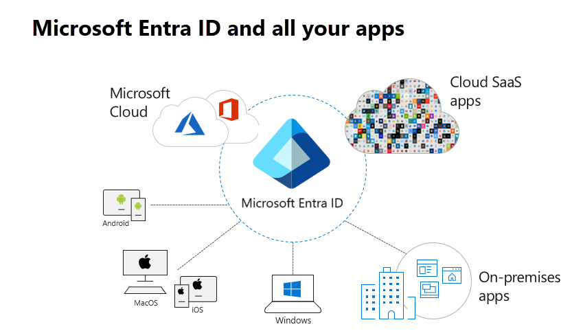

# Using Microsoft Entra application proxy to publish on-premises apps for remote users

Microsoft Entra application proxy provides secure remote access to on-premises web applications. After a single sign-on to Microsoft Entra ID, users can access both cloud and on-premises applications through an external URL or an internal application portal. For example, application proxy can provide remote access and single sign-on to Remote Desktop, SharePoint, Teams, Tableau, Qlik, and line of business (LOB) applications.

Microsoft Entra application proxy is:

- **Simple to use**. Users can access your on-premises applications the same way they access Microsoft 365 and other SaaS apps integrated with Microsoft Entra ID. You don't need to change or update your applications to work with application proxy.

- **Secure**. On-premises applications can use Azure's authorization controls and security analytics. For example, on-premises applications can use Conditional Access and two-step verification. Application proxy doesn't require you to open inbound connections through your firewall.

- **Cost-effective**. On-premises solutions typically require you to setup and maintain demilitarized zones (DMZs), edge servers, or other complex infrastructures. Application proxy runs in the cloud, which makes it easy to use. To use application proxy, you don't need to change the network infrastructure or install more appliances in your on-premises environment.

> [!TIP]
> If you already have Microsoft Entra ID, you can use it as one control plane to allow seamless and secure access to your on-premises applications.

While not comprehensive, the list illustrates examples of using application proxy in a hybrid coexistence scenario:

* Publish on-premises web apps externally in a simplified way without a DMZ
* Support single sign-on (SSO) across devices, resources, and apps in the cloud and on-premises
* Support multifactor authentication for apps in the cloud and on-premises
* Quickly use cloud features with the security of the Microsoft Cloud
* Centralize user account management
* Centralize control of identity and security
* Automatically add or remove user access to applications based on group membership

This article explains how Microsoft Entra ID and application proxy give remote users a single sign-on (SSO) experience. Users securely connect to on-premises apps without a VPN or dual-homed servers and firewall rules. This article helps you understand how application proxy brings the capabilities and security advantages of the cloud to your on-premises web applications. It also describes the architecture and topologies that are possible.

> [!TIP]
> Application proxy includes both the application proxy service, which runs in the cloud, and the private network connector, which runs on an on-premises server. Microsoft Entra ID, the application proxy service, and the private network connector work together to securely pass the user sign-on token from Microsoft Entra ID to the web application.

Application proxy works with:

* Web applications that use [Integrated Windows authentication](./how-to-configure-sso-with-kcd.md) for authentication
* Web applications that use form-based or [header-based](./application-proxy-configure-single-sign-on-with-headers.md) access
* Web APIs that you want to expose to rich applications on different devices
* Applications hosted behind a [Remote Desktop Gateway](./application-proxy-integrate-with-remote-desktop-services.md)
* Rich client apps that are integrated with the Microsoft Authentication Library (MSAL)

Application proxy supports single sign-on. For more information on supported methods, see [Choosing a single sign-on method](~/identity/enterprise-apps/plan-sso-deployment.md#choosing-a-single-sign-on-method).

## Remote access in the past

Previously, your control plane for protecting internal resources from attackers while facilitating access by remote users was all in the DMZ or perimeter network. But the VPN and reverse proxy solutions deployed in the DMZ used by external clients to access corporate resources aren't suited to the cloud world. They typically suffer from the following drawbacks:

* Increase hardware costs
* Maintain security (patching, monitoring ports, and so on)
* Authenticate users at the edge
* Authenticate users to web servers in the perimeter network
* Maintain VPN access for remote users with the distribution and configuration of VPN client software. Also, maintaining domain-joined servers in the DMZ, which can be vulnerable to outside attacks.

In today's cloud-first world, Microsoft Entra ID is best suited to control who and what gets into your network. Microsoft Entra application proxy integrates with modern authentication and cloud-based technologies, like SaaS applications and identity providers. This integration enables users to access apps from anywhere. Not only is application proxy more suited for today's digital workplace, it's more secure than VPN and reverse proxy solutions and easier to implement. Remote users can access your on-premises applications the same way they access Microsoft and other SaaS apps integrated with Microsoft Entra ID. You don't need to change or update your applications to work with application proxy. Furthermore, application proxy doesn't require you to open inbound connections through your firewall. With application proxy, you simply set it and forget it.

## The future of remote access

In today's digital workplace, users access apps and work from anywhere using multiple devices. The constant factor is user identity. Start securing your network by using [Microsoft Entra identity management](/azure/security/fundamentals/identity-management-overview) as your security control plane. This identity-based model includes these components:

* An identity provider to keep track of users and user-related information.
* Device directory to maintain a list of devices that have access to corporate resources. This directory includes corresponding device information (for example, type of device, integrity, and so on).
* The policy evaluation service checks if users and devices meet the security policies set by admins.
* The ability to grant or deny access to organizational resources.
Microsoft Entra ID tracks users who access web apps published on-premises and in the cloud. It provides a central point to manage these apps. To enhance security, enable Microsoft Entra Conditional Access. This feature ensures only the right people access your applications by setting conditions for authentication and access.

> [!NOTE]
> Microsoft Entra application proxy replaces VPNs or reverse proxies for remote users accessing internal resources. It isn't designed for internal users on the corporate network. When internal users use application proxy unnecessarily, it can cause unexpected performance issues.

### Overview of how application proxy works

The diagram shows how Microsoft Entra ID and application proxy work together to provide single sign-on to on-premises applications.

1. A user is directed to the Microsoft Entra sign-in page after accessing the application through an endpoint.
2. Microsoft Entra ID sends a token to the user's client device after a successful sign-in.
3. The client sends the token to the application proxy service. The service retrieves the user principal name (UPN) and security principal name (SPN) from the token. Application proxy then sends the request to the connector.
4. The connector performs single sign-on (SSO) authentication required on behalf of the user.
5. The connector sends the request to the on-premises application.
6. The response is sent through the connector and application proxy service to the user.

> [!NOTE]
> Like most Microsoft Entra hybrid agents, the private network connector doesn't require you to open inbound connections through your firewall. User traffic in step 3 terminates at the application proxy service. The private network connector, which resides in your private network, is responsible for the rest of the communication.

| Component | Description |
| --------- | ----------- |
| Endpoint  | The endpoint is a URL or an [end-user portal](~/identity/enterprise-apps/end-user-experiences.md). Users can reach applications while outside of your network by accessing an external URL. Users within your network can access the application through a URL or an end-user portal. When users go to one of these endpoints, they authenticate in Microsoft Entra ID and then are routed through the connector to the on-premises application.|
| Microsoft Entra ID | Microsoft Entra ID performs the authentication using the tenant directory stored in the cloud. |
| Application proxy service | This application proxy service runs in the cloud as part of Microsoft Entra ID. It passes the sign-on token from the user to the private network connector. Application proxy forwards any accessible headers on the request and sets the headers as per its protocol, to the client IP address. If the incoming request to the proxy already has that header, the client IP address is added to the end of the comma separated list that is the value of the header.|
| Private network connector | The connector is a lightweight agent that runs on a Windows Server inside your network. The connector manages communication between the application proxy service in the cloud and the on-premises application. The connector only uses outbound connections, so you don't have to open inbound ports in internet facing networks. The connectors are stateless and pull information from the cloud as necessary. For more information about connectors, like how they load-balance and authenticate, see [Understand Microsoft Entra private network connectors](application-proxy-connectors.md).|
| Active Directory (AD) | Active Directory runs on-premises to perform authentication for domain accounts. When single sign-on is configured, the connector communicates with AD to perform any extra authentication required.|
| On-premises application | Finally, the user is able to access an on-premises application.|

Application proxy is a Microsoft Entra service you configure in the Microsoft Entra admin center. It enables you to publish an external public HTTP/HTTPS URL endpoint in the Azure Cloud, which connects to an internal application server URL in your organization. These on-premises web apps can be integrated with Microsoft Entra ID to support single sign-on. Users can then access on-premises web apps in the same way they access Microsoft 365 and other SaaS apps.

The application proxy service runs in the cloud, the private network connector operates as a lightweight agent on an on-premises server, and Microsoft Entra ID acts as the identity provider. Together, these components enable users to access on-premises web applications with a seamless single sign-on experience.

After a user authenticates, external users can access on-premises web applications by using a display URL or [My Apps](https://support.microsoft.com/account-billing/sign-in-and-start-apps-from-the-my-apps-portal-2f3b1bae-0e5a-4a86-a33e-876fbd2a4510) from their desktop or iOS/MAC devices. For example, application proxy can provide remote access and single sign-on to Remote Desktop, SharePoint sites, Tableau, Qlik, Outlook on the web, and line-of-business (LOB) applications.

### Authentication

There are several ways to configure an application for single sign-on, and the method you select depends on the authentication your application uses. Application proxy supports the following types of applications:

* Web applications
* Web APIs that you want to expose to rich applications on different devices
* Applications hosted behind a Remote Desktop Gateway
* Rich client apps that are integrated with the [Microsoft Authentication Library (MSAL)](~/identity-platform/v2-overview.md)

Application proxy works with apps that use the following native authentication protocol:

* [**Integrated Windows Authentication (IWA)**](./how-to-configure-sso-with-kcd.md). For Integrated Windows Authentication (IWA), the private network connectors use Kerberos Constrained Delegation (KCD) to authenticate users to the Kerberos application.

Application proxy also supports authentication protocols with non-Microsoft partners in specific configuration scenarios:

* [**Header-based authentication**](./application-proxy-configure-single-sign-on-with-headers.md). This method uses PingAccess, a non-Microsoft partner service, to handle authentication for applications that rely on headers.
* [**Forms- or password-based authentication**](./application-proxy-configure-single-sign-on-password-vaulting.md). With this authentication method, users sign on to the application with a username and password the first time they access it. After the first sign-on, Microsoft Entra ID supplies the username and password to the application. In this scenario, Microsoft Entra ID handles authentication.
* [**SAML authentication**](./conceptual-sso-apps.md). SAML-based single sign-on is supported for applications that use either Security Assertion Markup Language (SAML) 2.0 or WS-Federation protocols. With SAML single sign-on, Microsoft Entra authenticates to the application by using the user's Microsoft Entra account.

For more information on supported methods, see [Choosing a single sign-on method](~/identity/enterprise-apps/plan-sso-deployment.md#choosing-a-single-sign-on-method).

### Security benefits

The remote access solution offered by application proxy and Microsoft Entra support several security benefits customers might take advantage of, including:

* **Authenticated access**. Application proxy uses [preauthentication](./application-proxy-security.md#authenticated-access) to ensure only authenticated connections reach your network. It blocks all traffic without a valid token for applications configured with preauthentication. This approach significantly reduces targeted attacks by allowing only verified identities to access backend applications.
* **Conditional Access**. Richer policy controls can be applied before connections to your network are established. With Conditional Access, you can define restrictions on the traffic that you allow to hit your backend application. You create policies that restrict sign-ins based on location, the strength of authentication, and user risk profile. As Conditional Access evolves, more controls are being added to provide more security such as integration with Microsoft Defender for Cloud Apps. Defender for Cloud Apps integration enables you to configure an on-premises application for [real-time monitoring](./application-proxy-integrate-with-microsoft-cloud-application-security.md) by using Conditional Access to monitor and control sessions in real-time based on Conditional Access policies.
* **Traffic termination**. All traffic to the backend application is terminated at the application proxy service in the cloud while the session is re-established with the backend server. This connection strategy means that your backend servers aren't exposed to direct HTTP traffic. They're better protected against targeted DoS (denial-of-service) attacks because your firewall isn't under attack.
* **All access is outbound**. The private network connectors only use outbound connections to the application proxy service in the cloud over ports 80 and 443. With no inbound connections, there's no need to open firewall ports for incoming connections or components in the DMZ. All connections are outbound and over a secure channel.
* **Security Analytics and Machine Learning (ML) based intelligence**. Because it's part of Microsoft Entra ID, application proxy can use [Microsoft Entra ID Protection](~/id-protection/overview-identity-protection.md) (requires [Premium P2 licensing](https://www.microsoft.com/security/business/identity-access-management/azure-ad-pricing)). Microsoft Entra ID Protection combines machine-learning security intelligence with data feeds from Microsoft's [Digital Crimes Unit](https://news.microsoft.com/stories/cybercrime/index.html) and [Microsoft Security Response Center](https://www.microsoft.com/msrc) to proactively identify compromised accounts. Microsoft Entra ID Protection offers real-time protection from high-risk sign-ins. It takes into consideration factors like accesses from infected devices, through anonymizing networks, or from atypical and unlikely locations to increase the risk profile of a session. This risk profile is used for real-time protection. Many of these reports and events are already available through an API for integration with your Security Information and Event Management (SIEM) systems.

* **Remote access as a service**. You don't have to worry about maintaining and patching on-premises servers to enable remote access. Application proxy is an internet scale service that Microsoft owns, so you always get the latest security patches and upgrades. Unpatched software still accounts for a large number of attacks. According to the Department of Homeland Security, as many as [85 percent of targeted attacks are preventable](https://www.us-cert.gov/ncas/alerts/TA15-119A). With this service model, you don't have to carry the heavy burden of managing your edge servers anymore and scramble to patch them as needed.

* **Intune integration**. With Intune, corporate traffic is routed separately from personal traffic. Application proxy ensures that the corporate traffic is authenticated. [Application proxy and the Intune Managed Browser](/mem/intune/apps/manage-microsoft-edge#how-to-configure-application-proxy-settings-for-protected-browsers) capability can also be used together to enable remote users to securely access internal websites from iOS and Android devices.

### Roadmap to the cloud

Another major benefit of implementing application proxy is extending Microsoft Entra ID to your on-premises environment. In fact, implementing application proxy is a key step in moving your organization and apps to the cloud. By moving to the cloud and away from on-premises authentication, you reduce your on-premises footprint and use Microsoft Entra identity management capabilities as your control plane. With minimal or no updates to existing applications, you have access to cloud capabilities such as single sign-on, multifactor authentication, and central management. Installing the necessary components to application proxy is a simple process for establishing a remote access framework. And by moving to the cloud, you have access to the latest Microsoft Entra features, updates, and functionality, such as high availability and the disaster recovery.

To learn more about migrating your apps to Microsoft Entra ID, see the [Migrating Your Applications to Microsoft Entra ID](~/identity/enterprise-apps/migration-resources.md).

## Architecture

The diagram illustrates in general how Microsoft Entra authentication services and application proxy work together to provide single sign-on to on-premises applications to users.

1. The user accesses the application through an endpoint and is redirected to the Microsoft Entra sign-in page. Conditional Access policies check specific conditions to ensure compliance with your organization's security requirements.
2. Microsoft Entra ID sends a token to the user's client device.
3. The client sends the token to the application proxy service, which extracts the user principal name (UPN) and security principal name (SPN) from the token.
4. The application proxy forwards the request to the [private network connector](./application-proxy-connectors.md).
5. The connector handles any more authentication required (*optional based on the authentication method*), retrieves the internal endpoint of the application server, and sends the request to the on-premises application.
6. The application server responds, and the connector sends the response back to the application proxy service.
7. The application proxy service delivers the response to the user.

Microsoft Entra application proxy consists of the cloud-based application proxy service and an on-premises connector. The connector listens for requests from the application proxy service and handles connections to the internal applications. It's important to note that all communications occur over Transport Layer Security (TLS), and always originate at the connector to the application proxy service. That is, communications are outbound only. The connector uses a client certificate to authenticate to the application proxy service for all calls. The only exception to the connection security is the initial setup step where the client certificate is established. For more information, see [application proxy under the hood](./application-proxy-security.md#under-the-hood).

### Microsoft Entra private network connector
Application proxy uses the Microsoft Entra private network connector. The same connector is used by Microsoft Entra Private Access. To learn more about connectors, see [Microsoft Entra private network connector](../../global-secure-access/concept-connectors.md).

## Other use cases

So far, we focus on using application proxy to publish on-premises apps externally and enable single sign-on for all cloud and on-premises apps. However, application proxy also supports other use cases, including:

* **Securely publish REST APIs**. Use application proxy to create a public endpoint for your on-premises or cloud-hosted APIs. Control authentication and authorization without opening inbound ports. Learn more in [Enable native client applications to interact with proxy applications](./application-proxy-configure-native-client-application.md) and [Protect an API using OAuth 2.0 with Microsoft Entra ID and API Management](/azure/api-management/api-management-howto-protect-backend-with-aad).
* **Remote Desktop Services** **(RDS)**. Standard Remote Desktop Services (RDS) deployments require open inbound connections. However, the [RDS deployment with application proxy](./application-proxy-integrate-with-remote-desktop-services.md) has a permanent outbound connection from the server running the connector service. This way, you can offer more applications to users by publishing on-premises applications through Remote Desktop Services. You can also reduce the attack surface of the deployment with a limited set of two-step verification and Conditional Access controls to RDS.
* **Publish applications that connect using WebSockets**. Support with [Qlik Sense](./application-proxy-qlik.md) is in Public Preview and will be expanded to other apps in the future.
* **Enable native client applications to interact with proxy applications**. You can use Microsoft Entra application proxy to publish web apps, but it also can be used to publish [native client applications](./application-proxy-configure-native-client-application.md) that are configured with Microsoft Authentication Library (MSAL). Client applications differ from web apps because they're installed on a device, while web apps are accessed through a browser.

## Conclusion

Organizations adapt to rapid changes in work and tools. Employees use their own devices and rely on Software-as-a-Service (SaaS) applications. As a result, managing and securing data becomes more complex. Data now moves across on-premises and cloud environments, far beyond traditional borders. This shift boosts productivity and collaboration but also makes protecting sensitive data harder.

Microsoft Entra application proxy reduces your on-premises footprint by offering remote access as a service. Whether you already use Microsoft Entra ID to manage users in a hybrid setup or plan to start your cloud journey, application proxy simplifies remote access and enhances security.

Organizations should begin taking advantage of application proxy today to take advantage of the following benefits:

* Publish on-premises apps externally without the overhead associated with maintaining traditional VPN or other on-premises web publishing solutions and DMZ approach
* Single sign-on to all applications, be they Microsoft 365 or other SaaS apps and including on-premises applications
* Cloud scale security where Microsoft Entra uses Microsoft 365 to prevent unauthorized access
* Intune integration to ensure corporate traffic is authenticated
* Centralization of user account management
* Automatic updates to ensure you have the latest security patches
* New features as they're released; the most recent being support for SAML single sign-on and more granular management of application cookies

## Next steps
- [Tutorial: Add an on-premises application for remote access through application proxy](application-proxy-add-on-premises-application.md)
