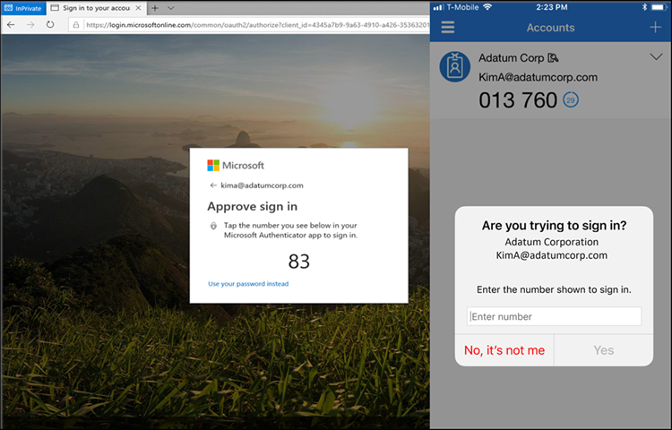
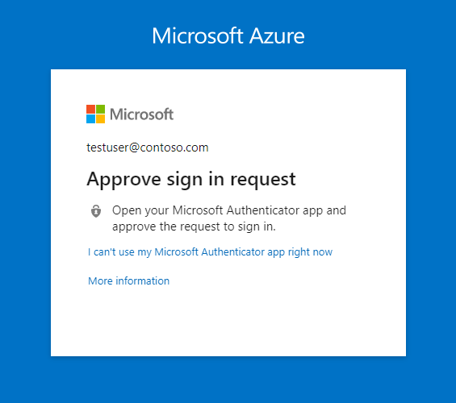

# Authentication methods in Microsoft Entra ID - Microsoft Authenticator app

Microsoft Authenticator provides another level of security to your Microsoft Entra work or school account or your Microsoft account and is available for [Android](https://go.microsoft.com/fwlink/?linkid=866594) and [iOS](https://go.microsoft.com/fwlink/?linkid=866594). With the Microsoft Authenticator app, users can authenticate in a passwordless way during sign-in, or use it as another verification option during self-service password reset (SSPR) or multifactor authentication events.

Microsoft Authenticator supports passkeys for user authentication. Users can then receive a notification on their mobile device to approve or deny the sign-in attempt. If they approve, Authenticator generates an OATH verification code. This code can then be entered in a sign-in interface. If you enable both a notification and verification code, users who register the Authenticator app can use either method to verify their identity using passkeys.

To enable users to sign in with Authenticator instead of their username and password, see [Enable passwordless sign-in with the Microsoft Authenticator](howto-authentication-passwordless-phone.md).

> [!NOTE]
> - Users don't have the option to register their mobile app when they enable SSPR. Instead, users can register their mobile app at [https://aka.ms/mfasetup](https://aka.ms/mfasetup) or as part of the combined security info registration at [https://aka.ms/setupsecurityinfo](https://aka.ms/setupsecurityinfo).
> - The Authenticator app may not be supported on beta versions of iOS and Android. In addition, starting October 20th, 2023 the Authenticator app on Android no longer supports older versions of the Android Company Portal. Android users with Company Portal versions below 2111 (5.0.5333.0) can't re-register or register new instances of Authenticator until they update their Company Portal application to a newer version.

## Passkey sign-in

Authenticator is a free passkey solution that lets users do passwordless phishing-resistant authentications from their own phones. Some key benefits to using passkeys in the Authenticator app:

- Passkeys can be easily deployed at scale. Then passkeys are available on a user’s phone for both mobile device management (MDM) and bring your own device (BYOD) scenarios.
- Passkeys in Authenticator come at no more cost and travel with the user wherever they go.
- Passkeys in Authenticator are device-bound which ensures the passkey doesn’t leave the device on which it was created.
- Users stay up-to-date with latest passkey innovation based upon open WebAuthn standards.
- Enterprises can layer other capabilities on top of authentication flows such as [FIPS 140 compliance](#fips-140-compliant-for-microsoft-entra-authentication).

### Device-bound passkey

Passkeys in the Authenticator app are device-bound to ensure that they never leave the device they were created on. On an iOS device, Authenticator uses the Secure Enclave to create the passkey. On Android, we create the passkey in the Secure Element on devices that support it, or fall back to the Trusted Execution Environment (TEE).

### How passkey attestation works with Authenticator

When attestation is enabled in the passkey (FIDO) policy, Microsoft Entra ID tries to verify the legitimacy of the passkey being created. When the user is registering a passkey in the Authenticator, attestation verifies that the legitimate Microsoft Authenticator app created the passkey by using Apple and Google services. Here’s more details: 

- iOS: Authenticator attestation uses the [iOS App Attest service](https://developer.apple.com/documentation/devicecheck/preparing-to-use-the-app-attest-service) to ensure the legitimacy of the Authenticator app before registering the passkey.  

- Android: 
  - For Play Integrity attestation, Authenticator attestation uses the [Play Integrity API](https://developer.android.com/google/play/integrity/overview) to ensure the legitimacy of the Authenticator app before registering the passkey.  
  - For Key attestation, Authenticator attestation uses [key attestation by Android](https://developer.android.com/privacy-and-security/security-key-attestation) to verify that the passkey being registered is hardware-backed.     

>[!NOTE]
>For both iOS and Android, Authenticator attestation relies upon Apple and Google servers to verify the authenticity of the Authenticator app. Heavy server usage can make passkey registration fail, and users may need to try again. If Apple and Google servers are down, Authenticator attestation blocks registrations that require attestation until servers are restored. To monitor the status of Google Play Integrity service, see [Google Play Status Dashboard](https://status.play.google.com/).

For more information about how to configure attestation, see [How to enable passkeys in Microsoft Authenticator for Microsoft Entra ID](how-to-enable-authenticator-passkey.md).

### Back up and restore passkeys in Authenticator

Passkeys in Authenticator aren't backed up and can't be restored on a new device. To create passkeys on a new device, use the passkey on an older device, or use another authentication method to re-create the passkey.

## Passwordless sign-in

Instead of seeing a prompt for a password after entering a username, users who enable phone sign-in from the Authenticator app sees a message to enter a number in their app. When the correct number is selected, the sign-in process is complete.

This authentication method provides a high level of security, and removes the need for the user to provide a password at sign-in. 

To get started with passwordless sign-in, see [Enable passwordless sign-in with the Microsoft Authenticator](howto-authentication-passwordless-phone.md).

## Notification through mobile app

The Authenticator app can help prevent unauthorized access to accounts and stop fraudulent transactions by pushing a notification to your smartphone or tablet. Users view the notification, and if it's legitimate, select **Verify**. Otherwise, they can select **Deny**.

> [!NOTE]
> Starting in August, 2023, anomalous sign-ins don't generate notifications, similarly to how sign-ins from unfamiliar locations don't generate notifications. To approve an anomalous sign-in, users can open Microsoft Authenticator, or Authenticator Lite in a relevant companion app like Outlook. Then they can either pull down to refresh or tap **Refresh**, and approve the request. 

In China, the *Notification through mobile app* method on Android devices doesn't work because as Google play services (including push notifications) are blocked in the region. However, iOS notifications do work. For Android devices, alternate authentication methods should be made available for those users.

## Verification code from mobile app

The Authenticator app can be used as a software token to generate an OATH verification code. After entering your username and password, you enter the code provided by the Authenticator app into the sign-in interface. The verification code provides a second form of authentication.

> [!NOTE]
> OATH verification codes generated by Authenticator aren't supported for certificate-based authentication.

Users can have a combination of up to five OATH hardware tokens or authenticator applications, such as the Authenticator app, configured for use at any time.

## FIPS 140 compliant for Microsoft Entra authentication

Consistent with the guidelines outlined in [NIST SP 800-63B](https://pages.nist.gov/800-63-3/sp800-63b.html?azure-portal=true), authenticators used by US government agencies are required to use FIPS 140 validated cryptography. This guideline helps US government agencies meet the requirements of [Executive Order (EO) 14028](https://www.whitehouse.gov/briefing-room/presidential-actions/2021/05/12/executive-order-on-improving-the-nations-cybersecurity/?azure-portal=true). Additionally, this guideline helps other regulated industries such as healthcare organizations working with [Electronic Prescriptions for Controlled Substances (EPCS)](/azure/compliance/offerings/offering-epcs-us) meet their regulatory requirements.

FIPS 140 is a US government standard that defines minimum security requirements for cryptographic modules in information technology products and systems. The [Cryptographic Module Validation Program (CMVP)](https://csrc.nist.gov/Projects/cryptographic-module-validation-program?azure-portal=true) maintains the testing against the FIPS 140 standard.

### Microsoft Authenticator for iOS

Beginning with version 6.6.8, Microsoft Authenticator for iOS uses the native Apple CoreCrypto module for FIPS validated cryptography on Apple iOS FIPS 140 compliant devices. All Microsoft Entra authentications using phishing-resistant device-bound passkeys, push multifactor authentications (MFA), passwordless phone sign-in (PSI), and time-based one-time passcodes (TOTP) use the FIPS cryptography.

For more information about the FIPS 140 validated cryptographic modules being used and compliant iOS devices, see [Apple iOS security certifications](https://support.apple.com/guide/certifications/ios-security-certifications-apc3fa917cb49/1/web/1.0).

>[!NOTE]
>Microsoft Authenticator is working to add support for a FIPS 140 validated cryptography module on Android. Microsoft plans to release an application update with FIPS support, estimated by October 2024.

## Determining Microsoft Authenticator registration type in Security info 
Users can access [My Security info](https://aka.ms/mysecurityinfo) (see the URLs in the next section) or by selecting Security info from MyAccount to manage and add more Microsoft Authenticator registrations. Specific icons are used to differentiate whether the Microsoft Authenticator registration is passwordless phone sign-in or MFA. 

Authenticator registration type | Icon
------ | ------
Microsoft Authenticator: Passwordless phone sign-in   |   
Microsoft Authenticator: (Notification/Code) | 

### MySecurityInfo links

Cloud | MySecurityInfo URL | 
------ | ------ | ------
Azure commercial (includes GCC)   | https://aka.ms/MySecurityInfo 
Azure for US Government (includes GCC High and DoD) | https://aka.ms/MySecurityInfo-us 

## Updates to Authenticator

Microsoft continuously updates Authenticator to maintain a high level of security. To ensure that your users are getting the best experience possible, we recommend having them continuously update their Authenticator App. In the case of critical security updates, app versions that aren't up to date may cease to work and may block users from completing their authentications. If a user is using a version of the app that is not supported, they will be prompted to upgrade to the latest version before being able to proceed with authentications.

Microsoft will also periodically retire older versions of the Authenticator App to maintain a high security bar for your organization. If a user’s device doesn't support modern versions of the Microsoft Authenticator App, they can't sign with the app. We recommend having these users use an OATH verification code in the Microsoft Authenticator App to complete two-factor authentication.

## Next steps

- To get started with passkeys, see [How to enable passkeys in Microsoft Authenticator for Microsoft Entra ID](how-to-enable-authenticator-passkey.md).

- For more information about passwordless sign-in, see [Enable passwordless sign-in with the Microsoft Authenticator](howto-authentication-passwordless-phone.md).

- Learn more about configuring authentication methods using the [Microsoft Graph REST API](/graph/api/resources/authenticationmethods-overview).
