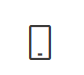
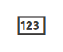

# Authentication methods in Microsoft Entra ID - OATH tokens 

OATH time-based one-time password (TOTP) is an open standard that specifies how one-time password (OTP) codes are generated. OATH TOTP can be implemented using either software or hardware to generate the codes. Microsoft Entra ID doesn't support OATH HOTP, a different code generation standard.

## OATH software tokens

Software OATH tokens are typically applications such as the Microsoft Authenticator app and other authenticator apps. Microsoft Entra ID generates the secret key, or seed, that's input into the app and used to generate each OTP.

The Authenticator app automatically generates codes when set up to do push notifications so a user has a backup even if their device doesn't have connectivity. Third-party applications that use OATH TOTP to generate codes can also be used.

Some OATH TOTP hardware tokens are programmable, meaning they don't come with a secret key or seed preprogrammed. These programmable hardware tokens can be set up using the secret key or seed obtained from the software token setup flow. Customers can purchase these tokens from the vendor of their choice and use the secret key or seed in their vendor's setup process.

## OATH hardware tokens (Preview)

Microsoft Entra ID supports the use of OATH-TOTP SHA-1 tokens that refresh codes every 30 or 60 seconds. Customers can purchase these tokens from the vendor of their choice. Hardware OATH tokens are available for users with a Microsoft Entra ID P1 or P2 license.  

> [!IMPORTANT]
> The preview is only supported in Azure Global and Azure Government clouds.

OATH TOTP hardware tokens typically come with a secret key, or seed, pre-programmed in the token. These keys must be input into Microsoft Entra ID as described in the following steps. Secret keys are limited to 128 characters, which is not compatible with some tokens. The secret key can only contain the characters *a-z* or *A-Z* and digits *2-7*, and must be encoded in *Base32*.

Programmable OATH TOTP hardware tokens that can be reseeded can also be set up with Microsoft Entra ID in the software token setup flow.

In this preview, we are introducing a new Hardware OATH token inventory. Global Administrator is no longer required to assign a token to a user when they upload the token information to Microsoft Entra ID. 
You can delegate a lower privileged role to assign and activate the token.

Here are the different features of the preview:

Feature | Description | API/Portal support | Role requirement
--------|-------------|--------------------|-----------------
[Authentication method policy for hardware OATH tokens](#authentication-method-policy-for-hardware-oath-tokens) | You can scope the **Hardware OATH** method to specific users and groups. No need to use the legacy tenant-level setting that applies to both hardware and software OATH tokens. | API - Available<br>UX – During the private preview. | Global Administrator<br>Authentication Policy Administrator
[Authentication devices](#authentication-devices) | A new option in the Microsoft Entra admin center to manage the hardware token inventory in your tenant. You can upload tokens to Microsoft Entra ID without assigning them to users. | API – Available<br>UX – Upload and edit are available, and more functionality will be added during the preview. | Global Administrator<br>Authentication Policy Administrator<br>If you want to upload a token AND assign it to a user, you can assign the following roles to the same user:<br>Authentication Policy Administrator<br>Authentication Administrator<br>Privileged Authentication Administrator is needed in order to assign token to privileged users
[User authentication methods in the Entra admin center and APIs](#user-authentication-methods-in-the-entra-admin-center-and-apis) | Assign and activate a token from the tenant inventory to a specific user under the user’s authentication method in the Microsoft Entra admin center. | API, UX – available. | Global Administrator<br>Authentication Administrator<br>Privileged Authentication Administrator (to assign a token to a privileged user)
[User self-assignment and activation](#user-self-assignment-and-activation) | Users can assign and activate token on themselves from the security info flow. | API – Available.<br>Security Info UX – will be become available during the preview. | Users manage themselves 


### Authentication method policy for hardware OATH tokens

1. You can view the Hardware OATH tokens policy status using the APIs


   `https://developer.microsoft.com/graph/graph-explorer?request=policies%2FauthenticationMethodsPolicy%2FauthenticationMethodConfigurations%2FhardwareOath&method=GET&version=beta&GraphUrl=https://graph.microsoft.com`

1. Start by enabling Hardware OATH tokens policy using the APIs.


1. If you enabled the HW OATH authentication method policy above, we recommend that you clear the **Verification code from mobile app or hardware token** setting. To verify this setting: Azure AD portal > Security > MFA > Additional cloud-based multifactor authentication settings.

Note: there might be some delays in the policy propagation(up to 20 mins). This can impact the 
user’s ability to sign-in with HW OATH token and showing HW OATH token in the “Security Info” 
page. Please allow an hour or so for this policy to get updated.


### Authentication devices

Use the UX flag and go to Protect and Secure > Authentication methods > Authentication 
devices.
2. Upload a CSV with up to 50 tokens at a time.
a. Note: User assignment is currently not available via CSV and will become available later 
in the preview. 
b. Alternatively, you can use the APIs for either bulk upload tokens or create a single 
token. Both APIs support assignments, using User ObjectID.
Create a single token without assignment:

Create single token:
POST {{graphUrl}}/directory/authenticationMethodDevices/hardwareOathDevices
{
 "serialNumber": "91792950246",
 "manufacturer": "CK Manufacturer",
 "model": "CK1",
 "secretKey": "QTUFKU2O6I3ZJNCU5NCZDV5GICQOOEPZ",
 "timeIntervalInSeconds": 30,
 "hashFunction": "hmacsha1"
}
All properties except hash function are required.

Create a single token with assignment:
To perform assignment the app needs to be assigned the “UserAuthenticationMethod.ReadWrite.All” 
permission.

Create token with assignment 
POST {{graphUrl}}/directory/authenticationMethodDevices/hardwareOathDevices
{
 "serialNumber": "91792950245",
 "manufacturer": "CK Manufacturer",
 "model": "CK1",
 "secretKey": "YGSD2KY7KDLSYM4IIGB74UMXDFL52Q",
 "timeIntervalInSeconds": 30,
 "assignTo": {"id": "eddff067-149a-4959-b81f-312734c7c5c8"}
}
All properties are required 

Bulk upload

Bulk upload
PATCH {{graphUrl}}/directory/authenticationMethodDevices/hardwareOathDevices
{
 "@context":"#$delta",
 "value": [
 {
 "@contentId": "1",
 "serialNumber": "{{serialNumber}}",
 "manufacturer": "{{manufacturer}}",
 "model": "{{model}}",
 "secretKey": "{{secretKey}}",
 "timeIntervalInSeconds": 30,
 "hashFunction": "HMACSHA1"
 },
 {
 "@contentId": "2",
 "serialNumber": "testingCreateFail",
 "manufacturer": "{{manufacturer}}",
 "model": "{{model}}",
 "timeIntervalInSeconds": 30,
 "hashFunction": "HMACSHA1"
 }
 ]
}

What can you do in the Authentication devices blade?
a. Today:
i. View all the HW OATH tokens in the tenant (that are part of the refreshed 
version).
ii. View details of a single token

Note: The above screen is view only and does not support edit yet. 
b. Later in the preview:
i. Edit tokens info.
ii. Assign and activate tokens


### User authentication methods in the Entra admin center and APIs


### User self-assignment and activation


OATH hardware tokens are supported as part of a public preview. For more information about previews, see [Supplemental Terms of Use for Microsoft Azure Previews](https://aka.ms/EntraPreviewsTermsOfUse).

:::image type="content" border="true" source="./media/concept-authentication-methods/oath-tokens.png" alt-text="Screenshot of OATH token management." lightbox="./media/concept-authentication-methods/oath-tokens.png":::

Once tokens are acquired, they must be uploaded in a comma-separated values (CSV) file format. The file should include the UPN, serial number, secret key, time interval, manufacturer, and model, as shown in the following example:

```csv
upn,serial number,secret key,time interval,manufacturer,model
Helga@contoso.com,1234567,2234567abcdef2234567abcdef,60,Contoso,HardwareKey
```

> [!NOTE]
> Make sure you include the header row in your CSV file. 

Once properly formatted as a CSV file, an administrator can then sign in to the Microsoft Entra admin center, navigate to **Protection** > **Multifactor authentication** > **OATH tokens**, and upload the resulting CSV file.

Depending on the size of the CSV file, it can take a few minutes to process. Select the **Refresh** button to get the current status. If there are any errors in the file, you can download a CSV file that lists any errors for you to resolve. The field names in the downloaded CSV file are different than the uploaded version.  

Once any errors are addressed, the administrator then can activate each key by selecting **Activate** for the token and entering the OTP displayed on the token. You can activate a maximum of 200 OATH tokens every 5 minutes. 

Users can have a combination of up to five OATH hardware tokens or authenticator applications, such as the Microsoft Authenticator app, configured for use at any time. Hardware OATH tokens can't be assigned to guest users in the resource tenant. 

> [!IMPORTANT]
> Make sure to only assign each token to a single user.
> In the future, support for the assignment of a single token to multiple users stops to prevent a security risk.

## Troubleshooting a failure during upload processing

At times, there may be conflicts or issues that occur with the processing of an upload of the CSV file. If any conflict or issue occurs, you'll receive a notification similar to the following:  

:::image type="content" border="true" source="./media/concept-authentication-methods/upload-error-example.png" alt-text="Screenshot of upload error example.":::
  
To determine the error message, be sure and select **View Details**. The **Hardware token status** blade opens and provides the summary of the status of the upload. It shows that there's been a failure, or multiple failures, as in the following example:

:::image type="content" border="true" source="./media/concept-authentication-methods/hardware-token-status.png" alt-text="Screenshot of hardware token status example.":::

To determine the cause of the failure listed, make sure to click the checkbox next to the status you want to view, which activates the **Download** option. This downloads a CSV file that contains the error identified. 

:::image type="content" border="true" source="./media/concept-authentication-methods/download-status-example.png" alt-text="Screenshot of download status example.":::

The downloaded file is named **Failures_filename.csv** where *filename* is the name of the file uploaded. It's saved to your default downloads directory for your browser. 

This example shows the error identified as a user who doesn't currently exist in the tenant directory:  

:::image type="content" border="true" source="./media/concept-authentication-methods/error-reason-example.png" alt-text="Screenshot of error reason example.":::

Once you've addressed the errors listed, upload the CSV again until it processes successfully. The status information for each attempt remains for 30 days. The CSV can be manually removed by clicking the checkbox next to the status, then selecting **Delete status** if so desired. 

## Determine OATH token registration type

Users can manage and add OATH token registrations by accessing [mysecurityinfo](https://aka.ms/mysecurityinfo) or by selecting **Security info** from **My account**. Specific icons are used to differentiate whether the OATH token registration is hardware or software based.  

Token registration type | Icon |
------ | ------ |
OATH software token   |   |
OATH hardware token |  |


## Next steps

Learn more about configuring authentication methods using the [Microsoft Graph REST API](/graph/api/resources/authenticationmethods-overview).
Learn about [FIDO2 security key providers](concept-authentication-passwordless.md) that are compatible with passwordless authentication.
