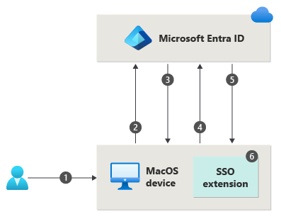

# Passwordless authentication options for Microsoft Entra ID

Features like multifactor authentication (MFA) are a great way to secure your organization, but users often get frustrated with the extra security layer on top of having to remember their passwords. Passwordless authentication methods are more convenient because the password is removed and replaced with something you have or something you are or know.

| Authentication  | Something you have | Something you are or know |
| --- | --- | --- |
| Passwordless | Windows 10 Device, phone, or security key | Biometric or PIN |

Each organization has different needs when it comes to authentication. Microsoft Entra ID and Azure Government integrate the following passwordless authentication options:

- Windows Hello for Business
- Platform Credential for macOS
- Platform single sign-on (PSSO) for macOS with smart card authentication
- Microsoft Authenticator
- Passkeys (FIDO2)
- Certificate-based authentication

## Windows Hello for Business

Windows Hello for Business is ideal for information workers that have their own designated Windows PC. The biometric and PIN credentials are directly tied to the user's PC, which prevents access from anyone other than the owner. With public key infrastructure (PKI) integration and built-in support for single sign-on (SSO), Windows Hello for Business provides a convenient method for seamlessly accessing corporate resources on-premises and in the cloud.

The following steps show how the sign-in process works with Microsoft Entra ID:

1. A user signs into Windows using biometric or PIN gesture. The gesture unlocks the Windows Hello for Business private key and is sent to the Cloud Authentication security support provider, called the *Cloud Authentication Provider (CloudAP)*. For more information about CloudAP, see [What is a Primary Refresh Token?](~/identity/devices/concept-primary-refresh-token.md).
1. The CloudAP requests a nonce (a random arbitrary number that can be used once) from Microsoft Entra ID.
1. Microsoft Entra ID returns a nonce that's valid for 5 minutes.
1. The CloudAP signs the nonce using the user's private key and returns the signed nonce to the Microsoft Entra ID.
1. Microsoft Entra ID validates the signed nonce using the user's securely registered public key against the nonce signature. Microsoft Entra ID validates the signature, and then validates the returned signed nonce. When the nonce is validated, Microsoft Entra ID creates a primary refresh token (PRT) with session key that is encrypted to the device's transport key, and returns it to the CloudAP.
1. The CloudAP receives the encrypted PRT with session key. The CloudAP uses the device's private transport key to decrypt the session key, and protects the session key by using the device's Trusted Platform Module (TPM).
1. The CloudAP returns a successful authentication response to Windows. The user is then able to access Windows and cloud and on-premises applications by using seamless sign-on (SSO).

The Windows Hello for Business [planning guide](/windows/security/identity-protection/hello-for-business/hello-planning-guide) can be used to help you make decisions on the type of Windows Hello for Business deployment and the options you need to consider.

## Platform Credential for macOS

Platform Credential for macOS is a new capability on macOS that is enabled using the Microsoft Enterprise single sign-on Extension (SSOe). It provisions a secure enclave backed hardware-bound cryptographic key that is used for SSO across apps that use Microsoft Entra ID for authentication. The user’s local account password is not affected and is required to log on to the Mac.

Platform Credential for macOS allows users to go passwordless by configuring Touch ID to unlock the device, and uses phish-resistant credentials, based on Windows Hello for Business technology. This saves customer organizations money by removing the need for security keys and advances Zero Trust objectives using integration with the Secure Enclave.

Platform Credential for macOS can also be used as a phishing-resistant credential for use in WebAuthn challenges, including browser re-authentication scenarios. Authentication Policy Administrators need to enable the **Passkey (FIDO2)** authentication method to support Platform Credential for macOS as a phishing-resistant credential. If you use Key Restriction Policies in your FIDO policy, you need to add the AAGUID for the macOS Platform Credential to your list of allowed AAGUIDs: `7FD635B3-2EF9-4542-8D9D-164F2C771EFC`.

1. A user unlocks macOS using fingerprint or password gesture, which unlocks the key bag to provide access to UserSecureEnclaveKey.
1. The macOS requests a nonce (a random arbitrary number that can be used just once) from Microsoft Entra ID.
1. Microsoft Entra ID returns a nonce that's valid for 5 minutes.
1. The operating system (OS) sends a login request to Microsoft Entra ID with an embedded assertion signed with the UserSecureEnclaveKey that resides in the Secure Enclave.
1. Microsoft Entra ID validates the signed assertion using the user's securely registered public key of UserSecureEnclave key. Microsoft Entra ID validates the signature and nonce. Once the assertion is validated, Microsoft Entra ID creates a [primary refresh token (PRT)](../devices/concept-primary-refresh-token.md) encrypted with the public key of the UserDeviceEncryptionKey that is exchanged during registration and sends the response back to the OS.
1. The OS decrypts and validates the response, retrieves the SSO tokens, stores and shares it with the SSO extension for providing SSO. The user is able to access macOS, cloud and on-premises applications by using SSO.

Refer to [macOS Platform SSO](../devices/macos-psso.md) for more information on how to configure and deploy Platform Credential for macOS.

## Platform single sign-on for macOS with SmartCard

Platform single sign-on (PSSO) for macOS allows users to go passwordless using the SmartCard authentication method. The user signs in to the machine using an external smart card, or smart card-compatible hard token (such as Yubikey). Once the device is unlocked, the smart card is used with Microsoft Entra ID to grant SSO across apps that use Microsoft Entra ID for authentication using [certificate-based authentication (CBA)](#certificate-based-authentication). CBA needs to be configured and enabled for users for this feature to work. For configuring CBA, refer to [How to configure Microsoft Entra certificate-based authentication](how-to-certificate-based-authentication.md).

To enable it, an administrator needs to configure PSSO by using Microsoft Intune or another supported Mobile Device Management (MDM) solution. 

1. A user unlocks macOS using smart card pin, which unlocks the smart card and the key bag to provide access to device registration keys present in Secure Enclave.
1. The macOS requests a nonce (a random arbitrary number that can be used only once) from Microsoft Entra ID.
1. Microsoft Entra ID returns a nonce that's valid for 5 minutes.
1. The operating system (OS) sends a login request to Microsoft Entra ID with an embedded assertion signed with the user's Microsoft Entra certificate from the smart card.
1. Microsoft Entra ID validates the signed assertion, signature and nonce. Once the assertion is validated, Microsoft Entra ID creates a [primary refresh token (PRT)](../devices/concept-primary-refresh-token.md) encrypted with the public key of the UserDeviceEncryptionKey that is exchanged during registration and sends the response back to the OS.
1. The OS decrypts and validates the response, retrieves the SSO tokens, stores and shares it with the SSO extension for providing SSO. The user is able to access macOS, cloud and on-premises applications by using SSO.

## Microsoft Authenticator

You can also allow your employee's phone to become a passwordless authentication method. You could already be using the Authenticator app as a convenient multifactor authentication option in addition to a password. You can also use the Authenticator App as a passwordless option.

The Authenticator App turns any iOS or Android phone into a strong, passwordless credential. Users can sign in to any platform or browser by getting a notification to their phone, matching a number displayed on the screen to the one on their phone. Then they can use their biometric (touch or face) or PIN to confirm. For installation details, see [Download and install the Microsoft Authenticator](https://support.microsoft.com/account-billing/download-and-install-the-microsoft-authenticator-app-351498fc-850a-45da-b7b6-27e523b8702a).

Passwordless authentication using Microsoft Authenticator follows the same basic pattern as Windows Hello for Business. It's a little more complicated as the user needs to be identified so that Microsoft Entra ID can find the Authenticator app version being used:

1. The user enters their username.
1. Microsoft Entra ID detects that the user has a strong credential and starts the Strong Credential flow.
1. A notification is sent to the app via Apple Push Notification Service (APNS) on iOS devices, or via Firebase Cloud Messaging (FCM) on Android devices.
1. The user receives the push notification and opens the app.
1. The app calls Microsoft Entra ID and receives a proof-of-presence challenge and nonce.
1. The user completes the challenge by entering their biometric or PIN to unlock private key.
1. The nonce is signed with the private key and sent back to Microsoft Entra ID.
1. Microsoft Entra ID performs public/private key validation and returns a token.

To get started with passwordless sign-in, complete the following how-to:

> [!div class="nextstepaction"]
> [Enable passwordless sign using the Authenticator app](howto-authentication-passwordless-phone.md)

## Passkeys (FIDO2) 

Users can register a passkey (FIDO2) and choose it as their primary sign-in method. With a hardware device that handles the authentication, the security of an account is increased as there's no password that can be exposed or guessed. Currently in preview, an Authentication Administrator can also [provision a FIDO2 security](https://aka.ms/passkeyprovision) on behalf of a user by using Microsoft Graph API and a custom client. Provisioning on behalf of users is currently limited to security keys at this time. 

The FIDO (Fast IDentity Online) Alliance helps to promote open authentication standards and reduce the use of passwords as a form of authentication. FIDO2 is the latest standard that incorporates the web authentication (WebAuthn) standard. FIDO allows organizations to apply the WebAuthn standard by using an external security key, or a platform key built into a device, to sign in without a username or password.

FIDO2 security keys are an unphishable standards-based passwordless authentication method that can come in any form factor. They're commonly USB devices, but they can also use Bluetooth or near-field communication (NFC). Passkeys (FIDO2) are based on the same WebAuthn standard and can be saved in Authenticator, or on mobile devices, tablets, or computers.

FIDO2 security keys can be used to sign in to their Microsoft Entra ID or Microsoft Entra hybrid joined Windows 10 devices and get single-sign on to their cloud and on-premises resources. Users can also sign in to supported browsers. FIDO2 security keys are a great option for enterprises who are very security sensitive or have scenarios or employees who aren't willing or able to use their phone as a second factor.

For more information about passkey (FIDO2) support, see [Support for passkey (FIDO2) authentication with Microsoft Entra ID](fido2-compatibility.md). For developer best practices, see [Support FIDO2 auth in the applications they develop](~/identity-platform/support-fido2-authentication.md).

The following process is used when a user signs in with a FIDO2 security key:

1. The user plugs the FIDO2 security key into their computer.
2. Windows detects the FIDO2 security key.
3. Windows sends an authentication request.
4. Microsoft Entra ID sends back a nonce.
5. The user completes their gesture to unlock the private key stored in the FIDO2 security key's secure enclave.
6. The FIDO2 security key signs the nonce with the private key.
7. The primary refresh token (PRT) token request with signed nonce is sent to Microsoft Entra ID.
8. Microsoft Entra ID verifies the signed nonce using the FIDO2 public key.
9. Microsoft Entra ID returns PRT to enable access to on-premises resources.

For a list FIDO2 security key providers, see [Become a Microsoft-compatible FIDO2 security key vendor](concept-fido2-hardware-vendor.md).

To get started with FIDO2 security keys, complete the following how-to:

> [!div class="nextstepaction"]
> [Enable passwordless sign using FIDO2 security keys](howto-authentication-passwordless-security-key.md)

## Certificate-based authentication

Microsoft Entra certificate-based authentication (CBA) enables customers to allow or require users to authenticate directly with X.509 certificates against their Microsoft Entra ID for applications and browser sign-in. CBA enables customers to adopt phishing-resistant authentication and sign in with an X.509 certificate against their Public Key Infrastructure (PKI).

:::image type="content" border="false" source="./media/concept-certificate-based-authentication/cloud-native-cert.png" alt-text="Diagram of Microsoft Entra certificate-based authentication.":::

### Key benefits of using Microsoft Entra CBA

| Benefits | Description |
|---------|---------|
| Great user experience |- Users who need certificate-based authentication can now directly authenticate against Microsoft Entra ID and not have to invest in federation. - Portal UI enables users to easily configure how to map certificate fields to a user object attribute to look up the user in the tenant ([certificate username bindings](concept-certificate-based-authentication-technical-deep-dive.md#understanding-the-username-binding-policy)) - Portal UI to [configure authentication policies](concept-certificate-based-authentication-technical-deep-dive.md#understanding-the-authentication-binding-policy) to help determine which certificates are single-factor versus multifactor. |
| Easy to deploy and administer |- Microsoft Entra CBA is a free feature, and you don't need any paid editions of Microsoft Entra ID to use it.  - No need for complex on-premises deployments or network configuration. - Directly authenticate against Microsoft Entra ID. |
| Secure |- On-premises passwords don't need to be stored in the cloud in any form. - Protects your user accounts by working seamlessly with Microsoft Entra Conditional Access policies, including Phishing-Resistant [multifactor authentication](concept-mfa-howitworks.md) (MFA requires [licensed edition](concept-mfa-licensing.md)) and blocking legacy authentication. - Strong authentication support where users can define authentication policies through the certificate fields, such as issuer or policy OID (object identifiers), to determine which certificates qualify as single-factor versus multifactor. - The feature works seamlessly with [Conditional Access features](~/identity/conditional-access/overview.md) and authentication strength capability to enforce MFA to help secure your users. |

### Supported scenarios

The following scenarios are supported:

- User sign-ins to web browser-based applications on all platforms.
- User sign-ins to Office mobile apps on iOS/Android platforms and Office native apps in Windows, including Outlook, OneDrive, and so on.
- User sign-ins on mobile native browsers.
- Support for granular authentication rules for multifactor authentication by using the certificate issuer **Subject** and **policy OIDs**.
- Configuring certificate-to-user account bindings by using any of the certificate fields:
  - Subject Alternate Name (SAN) PrincipalName and SAN RFC822Nare
  - Subject Key Identifier (SKI) and SHA1PublicKey
- Configuring certificate-to-user account bindings by using any of the user object attributes:
  - User Principal Name
  - onPremisesUserPrincipalName
  - CertificateUserIds

## Supported scenarios

The following considerations apply:

- Administrators can enable passwordless authentication methods for their tenant.
- Administrators can target all users or select users/Security groups within their tenant for each method.
- Users can register and manage these passwordless authentication methods in their account portal.
- Users can sign in with these passwordless authentication methods:
   - Authenticator app: Works in scenarios where Microsoft Entra authentication is used, including across all browsers, during Windows 10 setup, and with integrated mobile apps on any operating system.
   - Security keys: Work on lock screen for Windows 10 and the web in supported browsers like Microsoft Edge (both legacy and new Edge).
- Users can use passwordless credentials to access resources in tenants where they're a guest, but they could still be required to perform MFA in that resource tenant. For more information, see [Possible double multifactor authentication](~/external-id/current-limitations.md#possible-double-multifactor-authentication).  
- Users can't register passwordless credentials within a tenant where they're a guest, the same way that they don't have a password managed in that tenant.  

## Unsupported scenarios

We recommend no more than 20 sets of keys for each passwordless method for any user account. As more keys are added, the user object size increases, and you could notice degradation for some operations. In that case, you should remove unnecessary keys. For more information and the PowerShell cmdlets to query and remove keys, see 
[Using WHfBTools PowerShell module for cleaning up orphaned Windows Hello for Business Keys](https://support.microsoft.com/topic/using-whfbtools-powershell-module-for-cleaning-up-orphaned-windows-hello-for-business-keys-779d1f3f-bb2d-c495-0f6b-9aeb940eeafb).Use the **/UserPrincipalName** optional parameter to query only keys for a specific user. The permissions required are to run as an administrator or the specified user.

When you use PowerShell to create a CSV file with all of the existing keys, carefully identify the keys that you need to keep, and remove those rows from the CSV. Then use the modified CSV with PowerShell to delete the remaining keys to bring the account key count under the limit.
 
It's safe to delete any key reported as "Orphaned"="True" in the CSV. An orphaned key is one for a device that isn't longer registered in Microsoft Entra ID. If removing all Orphans still doesn't bring the User account below the limit, it's necessary to look at the *DeviceId* and *CreationTime* columns to identify which keys to target for deletion. Be careful to remove any row in the CSV for keys you want to keep. Keys for any DeviceID corresponding to devices the user actively uses should be removed from the CSV before the deletion step.

## Choose a passwordless method

The choice between these three passwordless options depends on your company's security, platform, and app requirements.

Here are some factors for you to consider when choosing Microsoft passwordless technology:

||**Windows Hello for Business**|**Passwordless sign-in with the Authenticator app**|**FIDO2 security keys**|
|:-|:-|:-|:-|
|**Pre-requisite**| Windows 10, version 1809 or later Microsoft Entra ID| Authenticator app Phone (iOS and Android devices)|Windows 10, version 1903 or later Microsoft Entra ID|
|**Mode**|Platform|Software|Hardware|
|**Systems and devices**|PC with a built-in Trusted Platform Module (TPM) PIN and biometrics recognition |PIN and biometrics recognition on phone|FIDO2 security devices that are Microsoft compatible|
|**User experience**|Sign in using a PIN or biometric recognition (facial, iris, or fingerprint) with Windows devices. Windows Hello authentication is tied to the device; the user needs both the device and a sign-in component such as a PIN or biometric factor to access corporate resources.|Sign in using a mobile phone with fingerprint scan, facial or iris recognition, or PIN. Users sign in to work or personal account from their PC or mobile phone.|Sign in using FIDO2 security device (biometrics, PIN, and NFC) User can access device based on organization controls and authenticate based on PIN, biometrics using devices such as USB security keys and NFC-enabled smartcards, keys, or wearables.|
|**Enabled scenarios**| Password-less experience with Windows device. Applicable for dedicated work PC with ability for single sign-on to device and applications.|Password-less anywhere solution using mobile phone. Applicable for accessing work or personal applications on the web from any device.|Password-less experience for workers using biometrics, PIN, and NFC. Applicable for shared PCs and where a mobile phone isn't a viable option (such as for help desk personnel, public kiosk, or hospital team)|

Use the following table to choose which method supports your requirements and users.

|Persona|Scenario|Environment|Passwordless technology|
|:-|:-|:-|:-|
|**Admin**|Secure access to a device for management tasks|Assigned Windows 10 device|Windows Hello for Business and/or FIDO2 security key|
|**Admin**|Management tasks on non-Windows devices| Mobile or non Windows device|Passwordless sign-in with the  Authenticator app|
|**Information worker**|Productivity work|Assigned Windows 10 device|Windows Hello for Business and/or FIDO2 security key|
|**Information worker**|Productivity work| Mobile or non Windows device|Passwordless sign-in with the Authenticator app|
|**Frontline worker**|Kiosks in a factory, plant, retail, or data entry|Shared Windows 10 devices|FIDO2 Security keys|

## Next steps

To get started with passwordless in Microsoft Entra ID, complete one of the following how-tos:

* [Enable FIDO2 security key passwordless sign-in](howto-authentication-passwordless-security-key.md)
* [Enable phone-based passwordless sign-in with the Authenticator app](howto-authentication-passwordless-phone.md)

### External Links

* [FIDO Alliance](https://fidoalliance.org/)
* [FIDO2 Client to Authenticator Protocol (CTAP) specification](https://fidoalliance.org/specs/fido-v2.0-id-20180227/fido-client-to-authenticator-protocol-v2.0-id-20180227.html)
