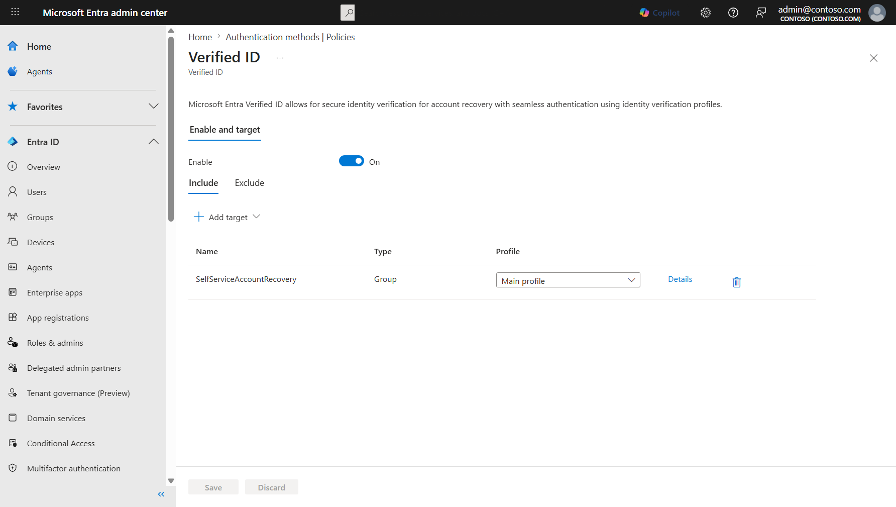
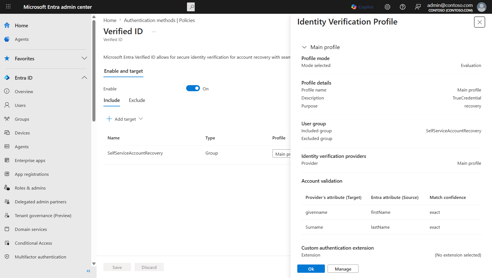

# Verified ID identity verification overview

Verified ID is an identity verification capability in Microsoft Entra ID —  it provides a cryptographic proof of a user's verified identity but can't be used to satisfy authentication requirements like sign-in, MFA, or SSPR. Instead, Verified ID serves as the identity proofing layer for scenarios where a user's identity must be re-established — such as account recovery when all authentication methods are lost.

Identity verification profiles are the policy layer that controls which users can participate in Verified ID flows, which provider performs verification, and how identity claims are validated. Today, Verified ID profiles are used for account recovery — enabling users who lose all authentication methods to regain access through government-issued identity verification. The profile framework is designed to support additional identity verification scenarios in the future.

## Identity verification profiles

An identity verification profile is a configuration object that defines identity verification behavior for a group of users. Profiles specify:

- **Name and description** — A display name and description that identifies the profile's purpose.
- **State** — Whether the profile is enabled or disabled.
- **User group scope** — Which users the profile applies to, defined through group-based assignment.
- **Identity verification provider** — The third-party provider that performs identity proofing, identified by a verifier DID (Decentralized Identifier) — a unique cryptographic identifier for the verifier in the credential exchange.
- **Face Check configuration** — Settings for Microsoft Entra Verified ID Face Check behavior during verification.
- **Profile configuration** — The accepted credential issuer, how identity claims map to user properties, and the credential type for the exchange.
- **Usage configurations** — The scenarios the profile applies to, such as `recovery`. Additional scenarios may be supported in the future.
- **Priority** — The processing order when a user matches multiple profiles.

### Automatic creation through account recovery

Identity verification profiles are automatically created and configured when an [Authentication Administrator](/entra/identity/role-based-access-control/permissions-reference#authentication-administrator) sets up account recovery through the Microsoft Entra admin center (**Entra ID** > **Account recovery**). The Account Recovery setup wizard handles profile creation, provider configuration, user group scoping, and account validation rules.

> [!IMPORTANT]
> Profiles created through account recovery don't require separate management in the authentication method policy settings. We recommend managing Verified ID assignment for recovery purposes through the Account Recovery setup wizard, which provides a guided experience for creating and configuring profiles.

### Profile management in authentication method policy

The Verified ID authentication method policy provides visibility into profiles and user assignments.

From the policy settings, administrators can:

- **View profile details** — See the configuration, provider, state, and priority of each identity verification profile, including the account validation claims mapping and custom authentication extension settings.

   

- **Scope user groups** — Assign a group of users to a specific Verified ID profile, controlling which users can participate in the verified credential flow.
- **Create new assignments** — Add new group-to-profile assignments for users who need access to a specific identity verification profile.
- **Global exclusion** — Exclude specific groups from all identity verification profiles. Excluded users can't participate in any Verified ID-based flow, regardless of which profiles are configured.

> [!TIP]
> The authentication method policy view is useful for auditing profile assignments across the organization. For creating and configuring profiles, use the Account Recovery setup wizard.

### Multiple profiles

Organizations can create multiple identity verification profiles to support different user populations. For example:

- A profile for corporate employees using one identity verification provider with exact name matching
- A profile for frontline workers using a different provider with relaxed matching
- A profile for a pilot group testing a new provider before broad deployment

When a user belongs to groups that match multiple profiles, the system evaluates profiles in priority order and applies the first matching profile.

## Usage scenarios

Each identity verification profile includes one or more usage configurations that define which scenarios the profile applies to.

### Account recovery

Account recovery is the primary usage scenario for Verified ID profiles today. When a user loses all registered authentication methods — such as when a device is lost, stolen, or compromised — account recovery uses the Verified ID profile to determine:

- Which identity verification provider verifies the user's identity
- How identity claims from the provider are matched against the user's Microsoft Entra ID profile
- Whether the profile operates in Evaluation mode (testing) or Production mode (full recovery)

For more information about configuring account recovery, see [Enable and configure account recovery in Microsoft Entra ID](how-to-account-recovery-enable.md).

> [!NOTE]
> Identity verification providers are external services available through the Microsoft Security Store. Review your provider's privacy, data retention, and compliance policies before deploying a profile to production users.

## Profile properties

The following properties define a Verified ID profile:

| Property | Description |
|---|---|
| **name** | Display name for the profile |
| **description** | Description of the profile's purpose |
| **state** | Whether the profile is `enabled` or `disabled` |
| **priority** | Processing order when multiple profiles match a user |
| **verifierDid** | The Decentralized Identifier (DID) representing the verifier in the credential exchange |
| **faceCheckConfiguration** | Settings for Entra Verified ID Face Check behavior |
| **verifiedIdProfileConfiguration** | The accepted issuer, claims binding, and credential type |
| **verifiedIdUsageConfigurations** | The scenarios the profile applies to (such as `recovery`) |
| **lastModifiedDateTime** | When the profile was last modified |

For the full API reference, see [verifiedIdProfile resource type (beta)](/graph/api/resources/verifiedidprofile?view=graph-rest-beta&preserve-view=true).

## Face Check

Verified ID profiles include Face Check configuration to verify proof of presence during identity verification. Face Check compares the photo on the user's government-issued ID to a real-time biometric check, confirming the person presenting the credential is physically present.

Face Check requires a [Face Check license](/entra/verified-id/using-facecheck), available through Entra Suite or as a standalone license.

## Related content

- [Account recovery overview](concept-account-recovery-overview.md)
- [Enable and configure account recovery in Microsoft Entra ID](how-to-account-recovery-enable.md)
- [Frequently asked questions about account recovery](self-service-account-recovery.yml)
- [What is Microsoft Entra Verified ID?](/entra/verified-id/decentralized-identifier-overview)
- [verifiedIdProfile resource type (beta)](/graph/api/resources/verifiedidprofile?view=graph-rest-beta&preserve-view=true)
