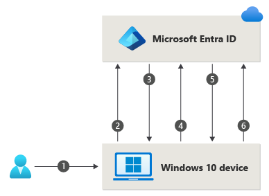

# Authentication methods in Microsoft Entra ID - Windows Hello for Business

Windows Hello for Business is ideal for information workers that have their own designated Windows PC. The biometric and PIN credentials are directly tied to the user's PC, which prevents access from anyone other than the owner. With public key infrastructure (PKI) integration and built-in support for single sign-on (SSO), Windows Hello for Business provides a convenient method for seamlessly accessing corporate resources on-premises and in the cloud.

## How sign-in works for Windows Hello for Business in Microsoft Entra ID

The following steps show how the sign-in process works with Microsoft Entra ID:

1. A user signs into Windows using biometric or PIN gesture. The gesture unlocks the Windows Hello for Business private key and is sent to the Cloud Authentication security support provider, called the *Cloud Authentication Provider (CloudAP)*. For more information about CloudAP, see [What is a Primary Refresh Token?](~/identity/devices/concept-primary-refresh-token.md).
1. The CloudAP requests a nonce (a random arbitrary number that can be used once) from Microsoft Entra ID.
1. Microsoft Entra ID returns a nonce that's valid for 5 minutes.
1. The CloudAP signs the nonce using the user's private key and returns the signed nonce to the Microsoft Entra ID.
1. Microsoft Entra ID validates the signed nonce using the user's securely registered public key against the nonce signature. Microsoft Entra ID validates the signature, and then validates the returned signed nonce. When the nonce is validated, Microsoft Entra ID creates a primary refresh token (PRT) with session key that is encrypted to the device's transport key, and returns it to the CloudAP.
1. The CloudAP receives the encrypted PRT with session key. The CloudAP uses the device's private transport key to decrypt the session key, and protects the session key by using the device's Trusted Platform Module (TPM).
1. The CloudAP returns a successful authentication response to Windows. The user is then able to access Windows and cloud and on-premises applications by using seamless sign-on (SSO).

The Windows Hello for Business [planning guide](/windows/security/identity-protection/hello-for-business/hello-planning-guide) can be used to help you make decisions on the type of Windows Hello for Business deployment and the options you need to consider.

## Related content

- [Windows Hello for Business](/windows/security/identity-protection/hello-for-business/)
- [Plan a Windows Hello for Business deployment](/windows/security/identity-protection/hello-for-business/deploy/)