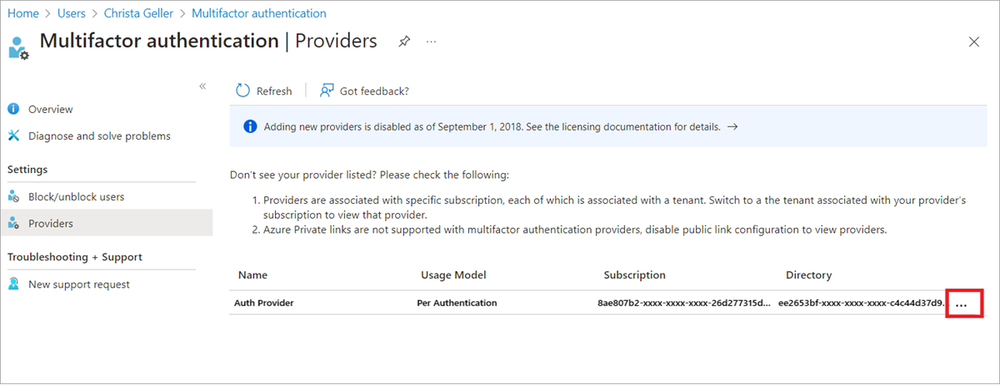

# When to use a Microsoft Entra multifactor authentication provider

> [!IMPORTANT]
> Effective September 1, 2018 new auth providers may no longer be created. Existing auth providers may continue to be used and updated, but migration is no longer possible. Multifactor authentication continues to be available as a feature in Microsoft Entra ID P1 or P2 licenses.

Two-step verification is available by default for administrators in Microsoft Entra ID, and Microsoft 365 users. However, if you wish to take advantage of [advanced features](howto-mfa-mfasettings.md) then you should enable Microsoft Entra multifactor authentication by using Conditional Access. For more information, see [Common Conditional Access policy: Require MFA for all users](~/identity/conditional-access/howto-conditional-access-policy-all-users-mfa.md).

A Microsoft Entra multifactor authentication provider is used to take advantage of features provided by Microsoft Entra multifactor authentication for users who **don't have licenses**.

## Caveats related to the Microsoft Entra multifactor authentication SDK

Note the SDK is deprecated and calls to the SDK fail after November 14, 2018

## What is an MFA provider?

There are two types of Auth providers, and the distinction is around how your Azure subscription is charged. The per-authentication option calculates the number of authentications performed against your tenant in a month. This option is best if some accounts authenticate only occasionally. The per-user option calculates the number of accounts that are eligible to perform MFA, which is all accounts in Microsoft Entra ID, and all enabled accounts in MFA Server. This option is best if some users have licenses but you need to extend MFA to more users beyond your licensing limits.

## Manage your MFA provider

You can't change the usage model (per enabled user or per authentication) after an MFA provider is created.

If you purchased enough licenses to cover all users that are enabled for MFA, you can delete the MFA provider altogether.

If your MFA provider isn't linked to a Microsoft Entra tenant, or you link the new MFA provider to a different Microsoft Entra tenant, user settings and configuration options aren't transferred. Also, existing Microsoft Entra multifactor authentication Servers need to be reactivated using activation credentials generated through the MFA Provider.

### Removing an authentication provider

> [!CAUTION]
> There's no confirmation when deleting an authentication provider. Selecting **Delete** is a permanent process.

Authentication providers can be found in the [Microsoft Entra admin center](https://entra.microsoft.com). Sign in as at least an [Authentication Policy Administrator](~/identity/role-based-access-control/permissions-reference.md#authentication-policy-administrator). Browse to **Protection** > **Multifactor authentication** > **Providers**. Click the listed providers to see details and configurations associated with that provider.

Before removing an authentication provider, take note of any customized settings configured in your provider. Decide what settings need to be migrated to general MFA settings from your provider and complete the migration of those settings. 

Microsoft Entra multifactor authentication Servers linked to providers need to be reactivated using credentials generated under **Server settings**. Before reactivating, the following files must be deleted from the `\Program Files\Multi-Factor Authentication Server\Data\` directory on Microsoft Entra multifactor authentication Servers in your environment:

- caCert
- cert
- groupCACert
- groupKey
- groupName
- licenseKey
- pkey

After you confirm that all settings are migrated, browse to **Providers** and select the ellipses **...** and select **Delete**.

> [!WARNING]
> Deleting an authentication provider deletes any reporting information associated with that provider. You may want to save activity reports before deleting your provider.

> [!NOTE]
> Users with older versions of the Microsoft Authenticator app and Microsoft Entra multifactor authentication Server may need to re-register their app.

## Next steps

[Configure multifactor authentication settings](howto-mfa-mfasettings.md)

[Common Conditional Access policy: Require MFA for all users](~/identity/conditional-access/howto-conditional-access-policy-all-users-mfa.md)
