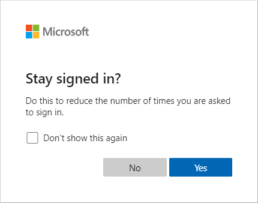
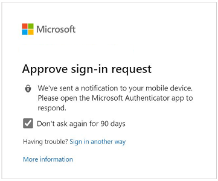
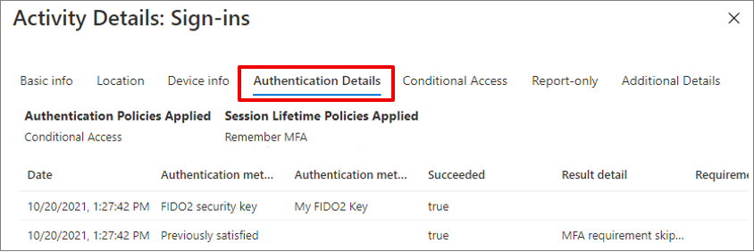

# Optimize reauthentication prompts and understand session lifetime for Microsoft Entra multifactor authentication

Microsoft Entra ID has multiple settings that determine how often users need to reauthenticate. This reauthentication could be with a first factor such as password, Fast IDentity Online (FIDO), or passwordless Microsoft Authenticator. Or it could be to perform multifactor authentication (MFA). You can configure these reauthentication settings as needed for your own environment and the user experience that you want.

The Microsoft Entra ID default configuration for user sign-in frequency is a rolling window of 90 days. Asking users for credentials often seems like a sensible thing to do, but it can backfire. If users are trained to enter their credentials without thinking, they can unintentionally supply them to a malicious credential prompt.

It might sound alarming to not ask for a user to sign back in, though any violation of IT policies revokes the session. Some examples include a password change, an incompliant device, or an operation to disable an account. You can also explicitly [revoke users' sessions by using Microsoft Graph PowerShell](/powershell/module/microsoft.graph.users.actions/revoke-mgusersigninsession).

This article details recommended configurations and how various settings work and interact with each other.

## Recommended settings

To give your users the right balance of security and ease of use by asking them to sign in at the right frequency, we recommend the following configurations:

* If you have Microsoft Entra ID P1 or P2:
  * Enable single sign-on (SSO) across applications by using [managed devices](~/identity/devices/overview.md) or [seamless SSO](~/identity/hybrid/connect/how-to-connect-sso.md).
  * If reauthentication is required, use a Microsoft Entra Conditional Access [Sign-in frequency policy](~/identity/conditional-access/howto-conditional-access-session-lifetime.md) policy.
  * For users who sign in from unmanaged devices or mobile device scenarios, persistent browser sessions might not be preferable. Or you might use Conditional Access to enable persistent browser sessions with the **Sign-in frequency** policy. Limit the duration to an appropriate time based on the sign-in risk, where a user with less risk has a longer session duration.
* If you have Microsoft 365 app licenses or the free Microsoft Entra tier:
  * Enable SSO across applications by using [managed devices](~/identity/devices/overview.md) or [seamless SSO](~/identity/hybrid/connect/how-to-connect-sso.md).
  * Keep the **Show option to remain signed in** option enabled and guide your users to accept **Stay signed in?** at sign-in.
* For mobile devices scenarios, make sure your users use the Microsoft Authenticator app. This app is a broker to other Microsoft Entra ID federated apps, and it reduces authentication prompts on the device.

Our research shows that these settings are right for most tenants. Some combinations of these settings, such as **Remember multifactor authentication** and **Show option to remain signed in**, can result in prompts for your users to authenticate too often. Regular reauthentication prompts are bad for user productivity and can make them more vulnerable to attacks.

## Configure settings for Microsoft Entra session lifetime

To optimize the frequency of authentication prompts for your users, you can configure Microsoft Entra session lifetime options. Understand the needs of your business and users, and configure settings that provide the best balance for your environment.

### Session lifetime policies

Without any session lifetime settings, the browser session has no persistent cookies. Every time users close and open the browser, they get a prompt for reauthentication. In Office clients, the default time period is a rolling window of 90 days. With this default Office configuration, if the user reset the password or inactivity has lasted for more than 90 days, the user must reauthenticate with the required first and second factors.

A user might see multiple MFA prompts on a device that doesn't have an identity in Microsoft Entra ID. Multiple prompts result when each application has its own OAuth Refresh Token that isn't shared with other client apps. In this scenario, MFA prompts multiple times as each application requests an OAuth Refresh Token to be validated with MFA.

In Microsoft Entra ID, the most restrictive policy for session lifetime determines when the user needs to reauthenticate. Consider a scenario in which you enable both of these settings:

* **Show option to remain signed in**, which uses a persistent browser cookie
* **Remember multifactor authentication** with a value of 14 days

In this example scenario, the user needs to reauthenticate every 14 days. This behavior follows the most restrictive policy, even though **Show option to remain signed in** by itself wouldn't require the user to reauthenticate on the browser.

### Managed devices

Devices joined to Microsoft Entra ID through Microsoft Entra join or Microsoft Entra hybrid join receive a [Primary Refresh Token (PRT)](~/identity/devices/concept-primary-refresh-token.md) to use SSO across applications.

This PRT lets a user sign in once on the device and allows IT staff to make sure that the device meets standards for security and compliance. If you need to ask a user to sign in more frequently on a joined device for some apps or scenarios, you can use the Conditional Access [Sign-in frequency](~/identity/conditional-access/howto-conditional-access-session-lifetime.md) policy.

### Option to remain signed in

When a user selects **Yes** on the **Stay signed in?** prompt option during sign-in, the selection sets a persistent cookie on the browser. This persistent cookie remembers both first and second factors, and it applies only for authentication requests in the browser.

If you have a Microsoft Entra ID P1 or P2 license, we recommend using a Conditional Access policy for **Persistent browser session**. This policy overwrites the **Show option to remain signed in** setting and provides an improved user experience. If you don't have a Microsoft Entra ID P1 or P2 license, we recommend enabling the **Show option to remain signed in** setting for your users.

For more information on configuring the option to let users remain signed in, see [Manage the 'Stay signed in?' prompt](~/fundamentals/how-to-manage-stay-signed-in-prompt.yml).

### Option to remember multifactor authentication  

The **Remember multifactor authentication** setting lets you configure a value from 1 to 365 days. It sets a persistent cookie on the browser when a user selects the **Don't ask again for X days** option at sign-in.

Although this setting reduces the number of authentications on web apps, it increases the number of authentications for modern authentication clients, such as Office clients. These clients normally prompt only after password reset or inactivity of 90 days. However, setting this value to less than 90 days shortens the default MFA prompts for Office clients, and it increases reauthentication frequency. When you use this setting in combination with **Show option to remain signed in** or Conditional Access policies, it might increase the number of authentication requests.

If you use **Remember multifactor authentication** and have a Microsoft Entra ID P1 or P2 license, consider migrating these settings to Conditional Access **Sign-in frequency**. Otherwise, consider using **Show option to remain signed in** instead.

More information, see [Remember multifactor authentication](howto-mfa-mfasettings.md#remember-multi-factor-authentication).

### Authentication session management with Conditional Access

The administrator can use the **Sign-in frequency** policy to choose a sign-in frequency that applies for both first and second factor in both the client and the browser. We recommend using these settings, along with using managed devices, in scenarios when you have a need to restrict authentication sessions. For example, you might need restrict an authentication session for critical business applications.

**Persistent browser session** allows users to remain signed in after closing and reopening their browser window. Like the **Show option to remain signed in** setting, it sets a persistent cookie on the browser. But because the admin configures it, it doesn't require the user to select **Yes** in the **Stay signed-in?** option. In that way, it provides a better user experience. If you use the **Show option to remain signed in** option, we recommend that you enable the **Persistent browser session** policy instead.

For more information. see [Configure adaptive session lifetime policies](~/identity/conditional-access/howto-conditional-access-session-lifetime.md).

### Configurable token lifetimes

The **Configurable token lifetimes** setting allows configuration of a lifetime for a token that Microsoft Entra ID issues. **Authentication session management with Conditional Access** replaces this policy. If you're using **Configurable token lifetimes** now, we recommend starting the migration to the Conditional Access policies.

## Review your tenant configuration  

Now that you understand how various settings work and the recommended configuration, it's time to check your tenants. You can start by looking at the sign-in logs to understand which session lifetime policies were applied during sign-in.

Under each sign-in log, go to the **Authentication Details** tab and explore **Session Lifetime Policies Applied**. For more information, see [Learn about the sign-in log activity details](~/identity/monitoring-health/concept-sign-in-log-activity-details.md).

To configure or review the **Show option to remain signed in** option, complete the following steps:

1. [!INCLUDE [Privileged role](../../includes/privileged-role-include.md)]
1. Browse to **Identity** > **Company Branding**. Then, for each locale, select **Show option to remain signed in**.
1. Select **Yes**, and then select **Save**.

To remember multifactor authentication settings on trusted devices, complete the following steps:

1. Sign in to the [Microsoft Entra admin center](https://entra.microsoft.com) as at least an [Authentication Policy Administrator](~/identity/role-based-access-control/permissions-reference.md#authentication-policy-administrator).
1. Browse to **Protection** > **Multifactor authentication**.
1. Under **Configure**, select **Additional cloud-based MFA settings**.
1. On the **Multifactor authentication service settings** pane, scroll to **Remember multifactor authentication settings**. Disable the setting by clearing the checkbox.

To configure Conditional Access policies for sign-in frequency and persistent browser session, complete the following steps:

1. Sign in to the [Microsoft Entra admin center](https://entra.microsoft.com) as at least a [Conditional Access Administrator](~/identity/role-based-access-control/permissions-reference.md#conditional-access-administrator).
1. Browse to **Protection** > **Conditional Access**.
1. Configure a policy by using the recommended session management options detailed in this article.

To review token lifetimes, [use Microsoft Graph PowerShell to query any Microsoft Entra policies](~/identity-platform/configure-token-lifetimes.yml). Disable any policies that you have in place.

If more than one setting is enabled in your tenant, we recommend that you update your settings based on the licensing available for you. For example, if you have a Microsoft Entra ID P1 or P2 license, you should use only the Conditional Access policies of **Sign-in frequency** and **Persistent browser session**. If you have a Microsoft 365 apps or Microsoft Entra ID Free license, you should use the **Show option to remain signed in** configuration.

If you enabled configurable token lifetimes, keep in mind that this capability will be removed soon. Plan a migration to a Conditional Access policy.

The following table summarizes the recommendations based on licenses:

|   Category           | Microsoft Entra ID Free and Microsoft 365 apps | Microsoft Entra ID P1 or P2 |
|------------------------------|-----------------------------------|------------------|
| SSO                      | [Microsoft Entra join](~/identity/devices/concept-directory-join.md) or [Microsoft Entra hybrid join](~/identity/devices/concept-hybrid-join.md), or [seamless SSO](~/identity/hybrid/connect/how-to-connect-sso.md) for unmanaged devices. | Microsoft Entra join Microsoft Entra hybrid join |
| Reauthentication settings | **Show option to remain signed in**                  | Conditional Access policies for sign-in frequency and persistent browser session |

## Related content

* [Tutorial: Secure user sign-in events with Microsoft Entra multifactor authentication](tutorial-enable-azure-mfa.md)
* [Tutorial: Use risk detections for user sign-ins to trigger Microsoft Entra multifactor authentication or password changes](tutorial-risk-based-sspr-mfa.md)
