# Enable and configure account recovery in Microsoft Entra ID

Account recovery is a Microsoft Entra ID feature that helps users regain access to their accounts when they lose all their authentication methods — such as when they lose a phone,  hardware token, or their passkeys. The feature uses third-party identity verification providers to verify a user's identity through government-issued identification, allowing them to recover their account and re-enroll authentication methods.

This article walks through the complete process of enabling and configuring account recovery, from initial setup through creating identity verification profiles and deploying to production.

## Prerequisites

- A Microsoft Entra ID P1 license
- [Verified ID](../../verified-id/verifiable-credentials-configure-tenant-quick.md) enabled and [Face Check](../../verified-id/verify-faces.md) configured in your tenant
- The [Authentication Administrator](/entra/identity/role-based-access-control/permissions-reference#authentication-administrator) role in the Microsoft Entra tenant
- The Contributor or Billing Administrator role for your Azure subscription (required for identity verification provider subscription)

## Open account recovery

1. Sign in to the [Microsoft Entra admin center](https://entra.microsoft.com) as at least an [Authentication Administrator](/entra/identity/role-based-access-control/permissions-reference#authentication-administrator).

1. Go to **Entra ID** > **Account recovery**.

2. If this is your first time opening Account Recovery, you see the **Getting started** page with a setup checklist.

3. After setup is complete, the **Account Recovery** overview page shows the status of each setup task and provides information about the feature.

   [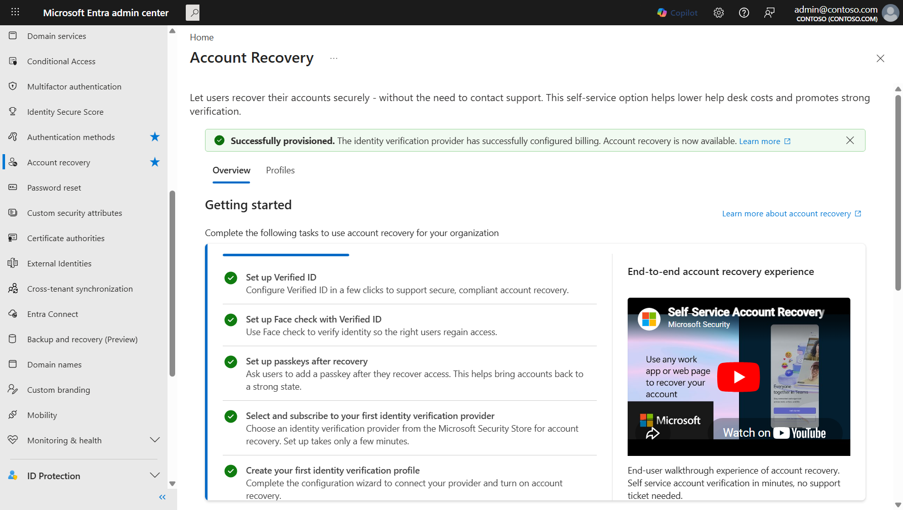](media/how-to-account-recovery-enable/account-recovery-overview.png#lightbox)

The overview page guides you through the required setup tasks:

- **Set up Verified ID** — Configure Verified ID in a few clicks to support secure, compliant account recovery.
- **Set up Face Check with Verified ID** — Use Face Check to verify identity so the right users regain access.
- **Set up passkeys after recovery** — Ask users to add a passkey after they recover access. This helps bring accounts back to a strong state. If passkeys aren't enabled in your Authentication Method Policy, enable passkeys so users can recover. 
- **Select and subscribe to your first identity verification provider** — Choose an identity verification provider from the Microsoft Security Store for account recovery.
- **Create your first identity verification profile** — Complete the configuration wizard to connect your provider and turn on account recovery.

> [!TIP]
> Select **Estimate savings** on the overview page to open the cost savings estimator. This tool helps you project potential savings by comparing the cost of traditional help desk recovery against self-service account recovery.
>
> [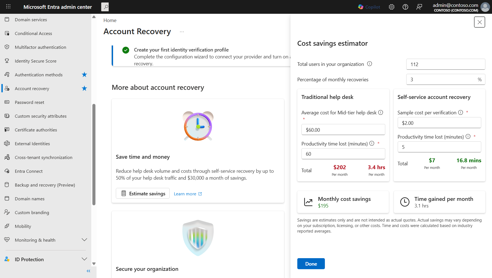](media/how-to-account-recovery-enable/cost-savings-estimator.png#lightbox)

## Subscribe to an identity verification provider

Before you create an identity verification profile, subscribe to at least one identity verification provider through the Microsoft Security Store.

1. On the Account Recovery overview page, select **Select and subscribe to your first identity verification provider**, or select the **Profiles** tab and then select **Add**.

1. In the **Identity verification providers** panel, browse the available providers. You can filter by compliance standard.

   [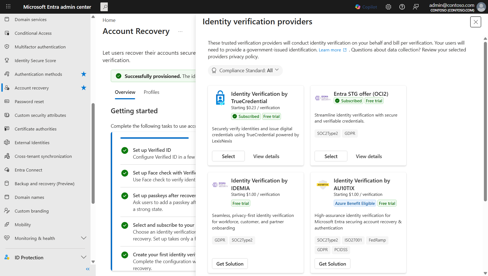](media/how-to-account-recovery-enable/select-idv-provider.png#lightbox)

1. For a provider you haven't subscribed to, select **Get Solution** to open the provider's listing in the Microsoft Security Store.

1. In the Microsoft Security Store:

   1. Under **Account details**, select a **Billing subscription** and **Resource group**, and provide a **Resource name**.
   1. Under **Solution details**, select **Choose plan** and select a pricing plan.
   1. Select **Next**, confirm your order details, and select **Place order**.

1. When your SaaS subscription is ready, select **Configure account now**. You're redirected to the SaaS provider's admin portal to complete activation.

1. On the provider's **General** page, provide the required details (contact name, email, phone number) and select **Activate**.

1. After you see a success confirmation, return to the Account Recovery page in the Microsoft Entra admin center.

For providers you've already subscribed to, select **Select** to use them in a profile.

## Create an identity verification profile

Identity verification profiles define how account recovery works for a specific group of users — which provider performs verification, what recovery mode to use, and how account validation is handled. You can create multiple profiles to support different user populations with different configurations.

1. In the Microsoft Entra admin center, go to **Entra ID** > **Account recovery** and select the **Profiles** tab.

1. Select **Add** to start the profile creation wizard.

### Add profile details

1. On the **Profile details** step, enter a **Name** for the profile and an optional **Description** to help you identify it later.

   [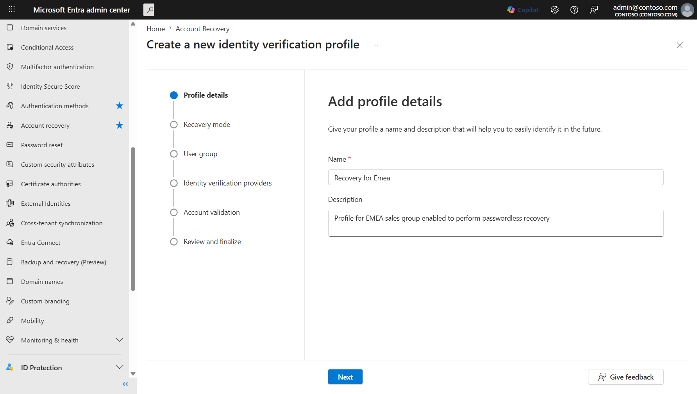](media/how-to-account-recovery-enable/profile-setup-name.png#lightbox)

1. Select **Next**.

### Choose a recovery mode

1. On the **Recovery mode** step, select one of these modes:

   - **Evaluation** — Users can test the identity verification process without actually recovering their accounts. Use this mode to validate the flow before production deployment.
   - **Production** — Users who complete identity verification can fully recover their accounts and re-enroll authentication methods.

   [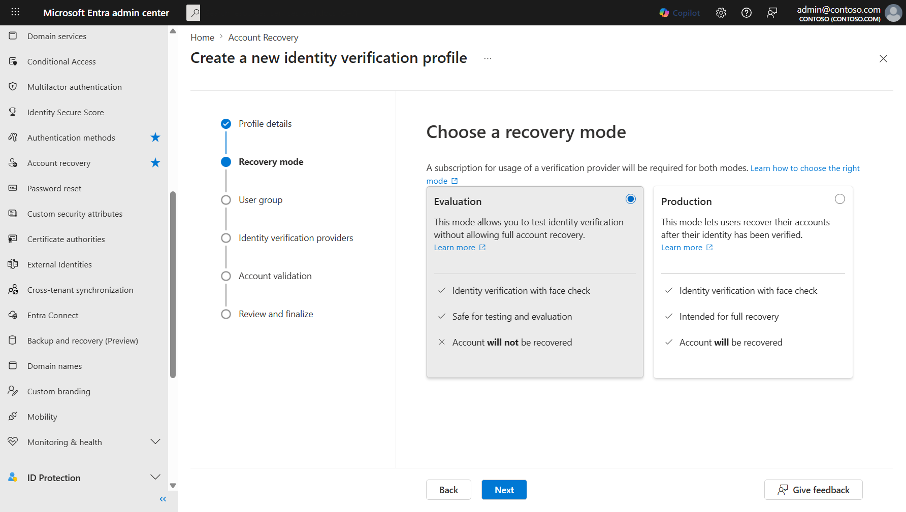](media/how-to-account-recovery-enable/profile-recovery-mode.png#lightbox)

   > [!NOTE]
   > Start with **Evaluation** mode to test the identity verification flow with a small group before enabling full recovery. In Evaluation mode, accounts are **not** recovered — users can only verify the process works.

1. Select **Next**.

### Select user groups

1. On the **User group selection** step, choose which users can use this recovery profile:

   - Select the **Include** tab to target specific groups. Choose **All users** or **Select targets** and then **Select groups** to pick specific groups.
   - Select the **Exclude** tab to exclude specific groups from the profile. Exclusions are feature-wide.

   [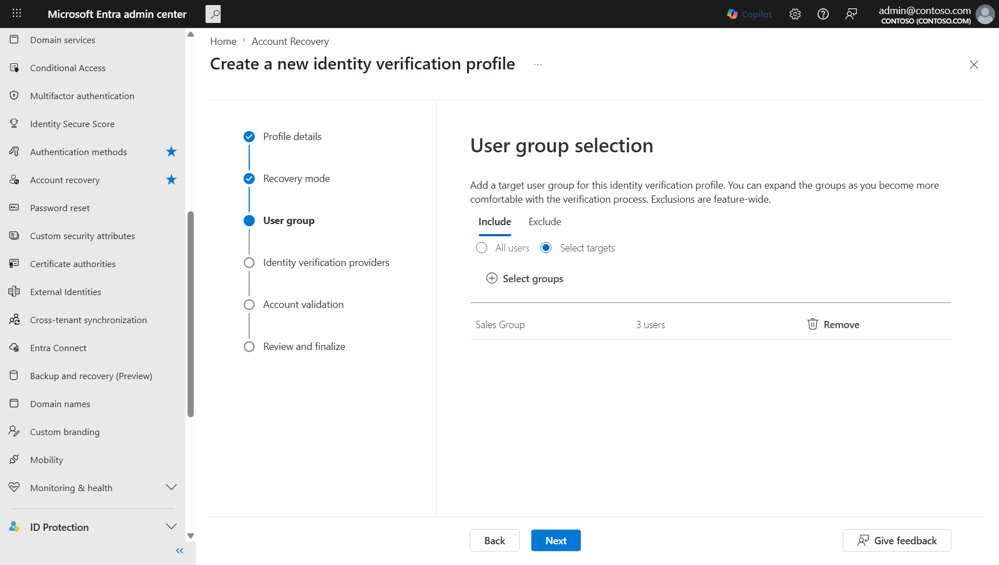](media/how-to-account-recovery-enable/profile-group-selection.png#lightbox)

1. Select **Next**.

### Select an identity verification provider

1. On the **Identity verification providers** step, select a provider to use for this profile. The list shows providers you've already subscribed to and providers available for new subscriptions.

   [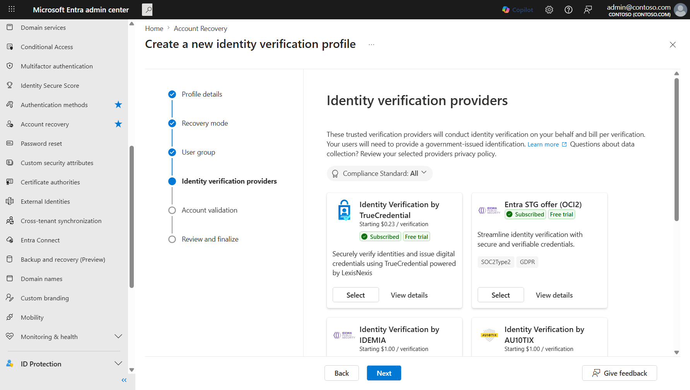](media/how-to-account-recovery-enable/profile-idv-partner.png#lightbox)

   - For subscribed providers, select **Select**.
   - For new providers, select **Get Solution** to subscribe through the Microsoft Security Store first.

1. Select **Next**.

### Configure account validation

1. On the **Account validation** step, configure how identity claims from the verification provider are matched against user properties in Microsoft Entra ID.

   [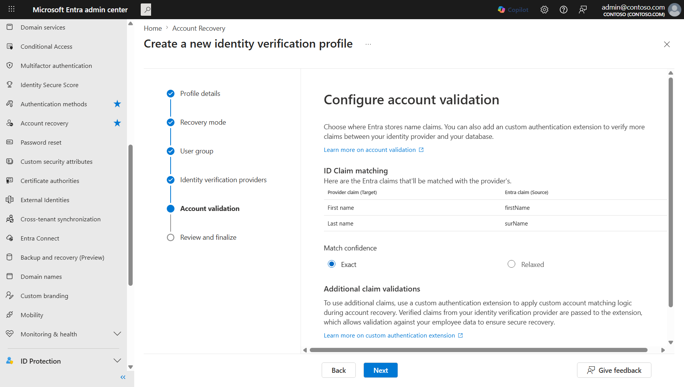](media/how-to-account-recovery-enable/profile-account-validation.png#lightbox)

   **ID Claim matching** shows the default claim mapping between the provider's claims and Entra attributes:

   | Provider claim (Target) | Entra claim (Source) |
   |---|---|
   | First name | firstName |
   | Last name | surName |

1. Under **Match confidence**, select the matching behavior:

   - **Exact** — Claims must match exactly.
   - **Relaxed** — Allows for minor variations in name matching.

1. (Optional) Under **Additional claim validations**, enable a custom authentication extension to add organization-specific account matching logic during recovery.

   This step requires a pre-configured Azure Function, Logic App, or REST endpoint that connects to your organization's data — such as an HRIS system, employee directory, or other authoritative source. During recovery, verified claims from the identity verification provider are passed to your endpoint, which validates them against your organizational data and returns a match decision.

   > [!IMPORTANT]
   > All data processed by the custom authentication extension stays within your organization's trust boundary. No organizational data is shared with Microsoft — only the match result is returned to the account recovery flow.

   To configure additional claim validation:

   1. Set the **Enable** toggle to on.
   1. Select an existing custom authentication extension, or select **Create new extension** to register a new Azure Function, Logic App, or REST API endpoint.

   [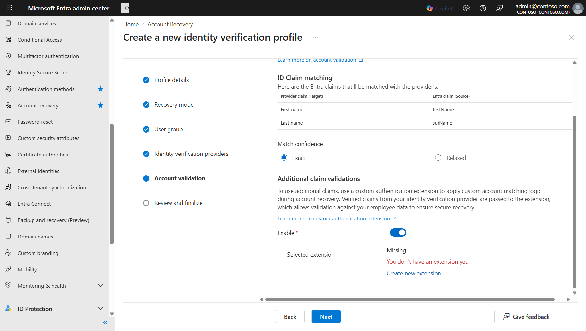](media/how-to-account-recovery-enable/profile-account-validation-scrolled.png#lightbox)

   <!-- TODO: Link to custom authentication extension documentation for account recovery when available. -->

1. Select **Next**.

### Review and finalize

1. On the **Review and finalize** step, review all your configuration choices:

   - **Recovery mode** — Evaluation or Production
   - **User group** — Included and excluded groups
   - **Identity verification providers** — The selected provider
   - **Account validation** — Claim mappings, match confidence, and custom authentication extension settings

   [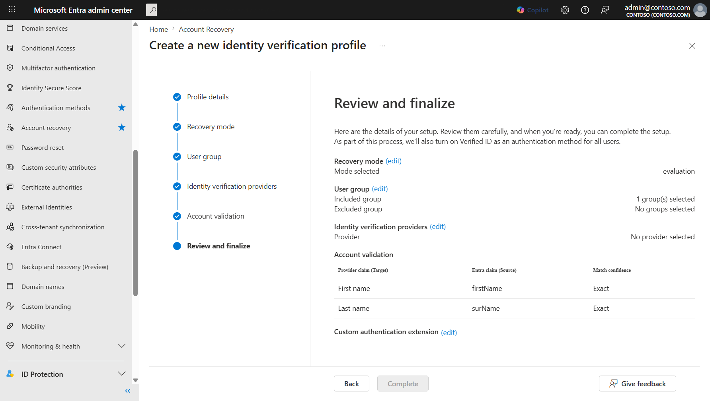](media/how-to-account-recovery-enable/profile-review-create.png#lightbox)

   Select **edit** next to any section to go back and change settings.

1. Select **Complete** to create the profile.

## Manage identity verification profiles

After you create one or more profiles, the **Profiles** tab shows all your identity verification profiles in a table view.

[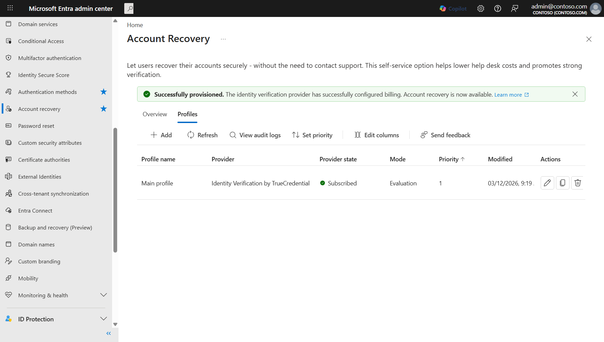](media/how-to-account-recovery-enable/profiles-list.png#lightbox)

From this page, you can:

- **Add** — Create another identity verification profile.
- **Refresh** — Update the profiles list.
- **View audit logs** — Review audit log entries for account recovery changes.
- **Set priority** — Change the order in which profiles are evaluated when a user has access to multiple profiles.
- **Edit columns** — Customize which columns appear in the table.
- **Edit** a profile — Select the edit icon to modify an existing profile's configuration.
- **Copy** a profile — Duplicate an existing profile as a starting point for a new one.
- **Delete** a profile — Remove a profile that is no longer needed.

## Verify user profiles are ready for account recovery

For account recovery to work correctly, user properties must match the claims returned by the identity verification provider.

1. Sign in to the [Microsoft Entra admin center](https://entra.microsoft.com) as at least a [User Administrator](/entra/identity/role-based-access-control/permissions-reference#user-administrator).

1. Go to **Entra ID** > **Users** > **All Users** and select the user you want to verify.

1. Select **Edit properties**.

1. Confirm that the **First Name** and **Last Name** properties are filled in and match the user's government-issued ID. The display name isn't used in the account recovery matching process — only the **First name** and **Last name** properties are used.

> [!IMPORTANT]
> If the First Name or Last Name properties are blank, account recovery can't match the claims from the identity verification provider. The real name on a user's government ID may not match what's listed in their Microsoft Entra ID account — verify and correct these properties before enabling recovery for those users.

## Move a profile from evaluation to production

After you test account recovery in evaluation mode and confirm that identity verification works as expected, update the profile to enable full recovery.

1. In the Microsoft Entra admin center, go to **Entra ID** > **Account recovery** and select the **Profiles** tab.

1. Select the edit icon next to the profile you want to update.

1. On the **Recovery mode** step, select **Production** to enable full account recovery.

1. Review and confirm any other settings, then select **Complete** to apply the changes.

Once a profile is set to Production mode, users in the scoped groups can use account recovery to fully regain access to their accounts. They complete identity verification through the configured provider and receive a Temporary Access Pass to re-enroll their authentication methods.

> [!CAUTION]
> Review which users are in scope for account recovery before switching to Production mode. Confirm that only appropriate user populations have access to this capability based on your organization's security requirements.

## Related content

- [How end users can perform account recovery in Microsoft Entra ID](how-to-account-recovery-for-users.md)
- [FAQ for account recovery](self-service-account-recovery.yml)
