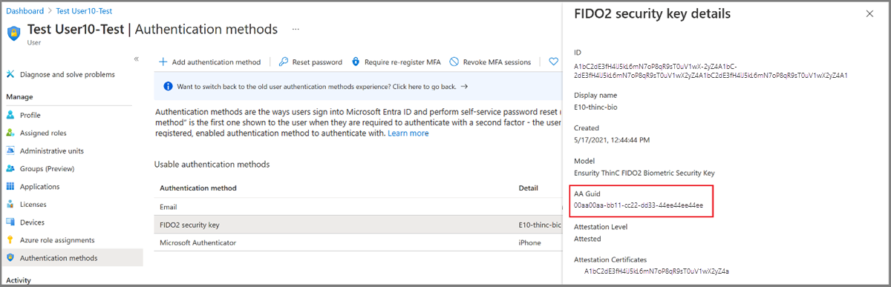

# How to enable passkeys (FIDO2) in Microsoft Entra ID 

For enterprises that use passwords today, passkeys (FIDO2) provide a seamless way for workers to authenticate without entering a username or password. Passkeys (FIDO2) provide improved productivity for workers, and have better security.

This article lists requirements and steps to enable passkeys in your organization. After you complete these steps, users in your organization can then register and sign in to their Microsoft Entra account using a passkey stored on a FIDO2 security key, a native or third-party passkey provider, or in Microsoft Authenticator.

For more information about enabling passkeys in Microsoft Authenticator, see [How to enable passkeys in Microsoft Authenticator](how-to-enable-authenticator-passkey.md).

For more information about passkey authentication, see [Support for FIDO2 authentication with Microsoft Entra ID](~/identity/authentication/concept-fido2-compatibility.md).

> [!NOTE]
> Microsoft Entra ID currently supports
> - synced passkeys
> - device-bound passkeys stored on FIDO2 security keys and in Microsoft Authenticator  
>
> Passkeys (FIDO2) are available in all Microsoft Entra ID editions, including Microsoft Entra ID Free. No extra licenses are required. For more information, see [Passkeys (FIDO2) authentication method in Microsoft Entra ID](concept-authentication-passkeys-fido2.md).

## Get started

To enable passkeys for your organization, complete these steps in order:

1. **[Enable passkey profiles](#enable-passkey-profiles)** — Opt in to passkey profiles in the Microsoft Entra admin center. Your existing global settings transfer to a Default passkey profile.
1. **[Create a passkey profile](#create-a-new-passkey-profile)** — Define attestation, passkey type (device-bound or synced), and key restriction settings for your target groups.
1. **[Apply a passkey profile to a targeted group](#apply-a-passkey-profile-to-a-targeted-group)** — Assign your passkey profile to specific user groups or all users.
1. **[Enable synced passkeys](#enable-synced-passkeys)** (optional) — If you want to allow synced passkeys, select **Synced** as a passkey type in your profile.
1. **[Enforce passkey sign-in](#enforce-passkey-fido2-sign-in)** (optional) — Create a Conditional Access authentication strength policy to require passkeys for sensitive resources.

## Passkey profiles

### What are passkey profiles?

Passkey profiles enable granular group-based configurations for passkey (FIDO2) authentication. Instead of a single tenant-wide setting, you can define specific requirements such as attestation, passkey type (device-bound or synced), or Authenticator Attestation GUID (AAGUID) restrictions. You can apply requirements in separate passkey profiles for different user groups, such as admins versus frontline staff.

> [!NOTE]
> An Authentication Policy Administrator needs to configure a passkey profile to enable synced passkeys. For more information, see [Enable synced passkeys](#enable-synced-passkeys).

A passkey profile is a named set of policy rules that governs how users in targeted groups can register and authenticate with passkeys (FIDO2). Profiles support advanced controls such as:

| Option | Configuration |
|--------|---------------|
| Enforce attestation | Enabled, Disabled |
| Passkey types | Device-bound, Synced |
| Target specific authenticators | Allow or block specific authenticators by their AAGUID. For more information, see [Authenticator Attestation GUID](#passkey-fido2-authenticator-attestation-guid-aaguid). |

### Examples of use cases for passkey profiles

> [!NOTE]
> If a passkey profile for both device-bound and synced passkeys targets Microsoft Authenticator, users need to run Microsoft Authenticator iOS version 6.8.37 or Android version 6.2507.4749.

#### Special consideration for high-privileged accounts

Passkey profile | Target groups | Passkey types | Attestation enforcement | Key restrictions
----------------|---------------|---------------|-------------------------|-----------------
All device-bound passkeys (attestation enforced) | IT admins Executives Engineering | Device-bound | Enabled | Disabled
All synced or device-bound passkeys | HR Sales | Device-bound, Synced | Disabled | Disabled

#### Targeted rollout of passkeys in Microsoft Authenticator 

Passkey profile | Target groups | Passkey types | Attestation enforcement | Key restrictions
----------------|---------------|---------------|-------------------------|-----------------
All device-bound passkeys (excluding Microsoft Authenticator) | All users | Device-bound | Enabled | Enabled - Behavior: Block - AAGUIDs: Microsoft Authenticator for iOS, Microsoft Authenticator for Android 
Passkeys in Microsoft Authenticator | Pilot group 1 Pilot group 2 | Device-bound | Enabled | Enabled - Behavior: Allow - AAGUIDs: Microsoft Authenticator for iOS, Microsoft Authenticator for Android

### Passkey (FIDO2) Authenticator Attestation GUID (AAGUID)

The FIDO2 specification requires each passkey vendor to provide an Authenticator Attestation GUID (AAGUID) during registration. An AAGUID is a 128-bit identifier indicating the key type, such as the make and model. Passkey (FIDO2) providers on desktop and mobile devices are also expected to provide an AAGUID during registration.

>[!NOTE]
>The vendor must ensure that the AAGUID is identical across all substantially identical security keys or passkey (FIDO2) providers made by that vendor, and different (with high probability) from the AAGUIDs of all other types of security keys or passkey (FIDO2) providers. To ensure this, the AAGUID for a given security key model or passkey (FIDO2) provider should be randomly generated. For more information, see [Web Authentication: An API for accessing Public Key Credentials - Level 2 (w3.org)](https://w3c.github.io/webauthn/).

You can work with your passkey vendor to determine the AAGUID of the passkey (FIDO2), or see [FIDO2 security keys eligible for attestation with Microsoft Entra ID](~/identity/authentication/concept-fido2-hardware-vendor.md#fido2-security-keys-eligible-for-attestation-with-microsoft-entra-id). If the passkey (FIDO2) is already registered, you can find the AAGUID by viewing the authentication method details of the passkey (FIDO2) for the user.

### Passkey profile prerequisites

- Devices must support passkey (FIDO2) authentication. For Windows devices that are joined to Microsoft Entra ID, the best experience is on Windows 10 version 1903 or higher. Hybrid-joined devices must run Windows 10 version 2004 or higher.
- If a passkey profile for both device-bound and synced passkeys targets Microsoft Authenticator, users need to run Microsoft Authenticator iOS version 6.8.37 or Android version 6.2507.4749.
- Policy size limit:
  - The Authentication methods policy supports a size limit of 20 KB. You can't save more passkey profiles after the size limit is reached. To check the size, use the [Get authenticationMethodsPolicy Microsoft Graph API](/graph/api/authenticationmethodspolicy-get) to retrieve the JSON for the Authentication methods policy. Save the output as a .txt file, then right-click and select **Properties** to view the file size.
  - Reference sizes:
    - Base passkey policy without changes: 1.44 KB
    - Target with 1 applied passkey profile: 0.23 KB
    - Target with 5 applied passkey profiles: 0.4 KB
    - Passkey profile with no AAGUIDs: 0.4 KB
    - Passkey profile with 10 AAGUIDs: 0.3 KB
- Users must complete multifactor authentication (MFA) within the past five minutes before they can register a passkey (FIDO2).
- Users need an authenticator that supports Microsoft Entra ID's attestation requirements. For more information, see [Microsoft Entra ID attestation for FIDO2 security key vendors](concept-fido2-hardware-vendor.md).

### Enable passkey profiles 

> [!NOTE]
> When you enable passkey profiles, your global passkey (FIDO2) policy settings automatically transfer to a **Default passkey profile**. Up to three passkey profiles, including the **Default passkey profile**, are supported. Support for more passkey profiles is in development.

1. Sign in to the Microsoft Entra admin center as at least an [Authentication Policy Administrator](/entra/identity/role-based-access-control/permissions-reference#authentication-policy-administrator).
1. Browse to **Entra ID** > **Security** > **Authentication methods** > **Policies**.
1. Select **Passkey (FIDO2)**. Select the link in the banner text to opt-in to using passkeys profiles. 

   > [!NOTE]
   > After you opt in to enable passkey profiles, you can't opt out. 

   :::image type="content" border="true" source="media/how-to-authentication-passkey-profiles/passkey-settings.png" alt-text="Screenshot that shows how to enable passkey profiles." lightbox="media/how-to-authentication-passkey-profiles/passkey-settings.png":::

1. On the **Configure** tab, set **Allow self-service set up** to **Yes**. If set to **No**, users can't register a passkey by using [Security info](https://mysignins.microsoft.com/security-info), even if passkeys (FIDO2) are enabled by the Authentication methods policy. This setting is a global policy; it's not on the profile level.

1. Select the **Default passkey profile**. 

   :::image type="content" border="true" source="media/how-to-authentication-passkey-profiles/default-passkey-profile.png" alt-text="Screenshot that shows the default passkey profile." lightbox="media/how-to-authentication-passkey-profiles/default-passkey-profile.png":::
   
   For **Passkey types**, select the types of passkeys that you want to allow.

1. Select **Save**.

### Create a new passkey profile

1. On the **Configure** tab, select **+ Add passkey profile**.

1. Fill in the profile details.

   :::image type="content" border="true" source="media/how-to-authentication-passkey-profiles/add-passkey-profile.png" alt-text="Screenshot that shows how to add a passkey profile." lightbox="media/how-to-authentication-passkey-profiles/add-passkey-profile.png":::

   >[!WARNING]
   >- If you set **Enforce attestation** to **Yes**, attestation is required at registration time. Microsoft Entra ID can verify the authenticator's make and model against trusted metadata. Attestation assures your organization that the passkey is genuine and comes from the stated vendor. If enforce attestation is set to **No**, Microsoft Entra ID can't guarantee any attribute about a passkey, including if it's synced or device-bound.
   >
   >- Attestation enforcement governs whether a passkey (FIDO2) is allowed only during registration. Users who register a passkey (FIDO2) without attestation aren't blocked from sign-in if **Enforce attestation** is set to **Yes** later.
    
   For other vendor attestation requirements, see [Microsoft Entra ID attestation for FIDO2 security key vendors](concept-fido2-hardware-vendor.md).
 
   **Key Restriction Policy**

   - **Enforce key restrictions** should be set to **Yes** only if your organization wants to only allow or disallow certain security key models or passkey providers, which are identified by their AAGUID. You can work with your security key vendor to determine the AAGUID of the passkey. If the passkey is already registered, you can find the AAGUID by viewing the authentication method details of the passkey for the user.

   >[!WARNING]
   >- Key restrictions set the usability of specific models or providers for both registration and authentication. If you change key restrictions and remove an AAGUID that you previously allowed, users who previously registered an allowed method can no longer use it for sign-in.
   >- Use AAGUID lists as a policy guide rather than a strict security control when **Enforce attestation** is set to **No**.

1. Select **Save**.

### Apply a passkey profile to a targeted group

1. Select **Enable and Target**.
1. Select **Add target**, and then choose **All users** or **Select targets** to choose specific groups.

   :::image type="content" border="true" source="media/how-to-authentication-passkey-profiles/add-target.png" alt-text="Screenshot that shows how to add a target for a passkey profile." lightbox="media/how-to-authentication-passkey-profiles/add-target.png":::

1. Select the passkey profiles that you want to assign to a specific target.

   :::image type="content" border="true" source="media/how-to-authentication-passkey-profiles/select-passkey-profile.png" alt-text="Screenshot that shows how to select a passkey profile." lightbox="media/how-to-authentication-passkey-profiles/select-passkey-profile.png":::

   > [!NOTE]
   > A target group (for example, Engineering) can be scoped for multiple passkey profiles. When a user is scoped for multiple passkey profiles, registration and authentication with a passkey are allowed if the passkey fully satisfies the requirements of at least one of the scoped passkey profiles. There's no particular order to the check. If a user is a member of an excluded group in the **Passkeys (FIDO2)** authentication method policy, they're blocked from FIDO2 passkey registration or sign-in entirely, and this takes precedence over them being in any **Included** groups.

### Delete a passkey profile

1. Select **Configure**.
1. Select the delete icon next to the passkey profile that you want to delete, and then select **Save**.

   > [!NOTE]
   > You can delete a profile only if it's not assigned to a group of users in **Enable and target**. If the delete icon is unavailable, first remove any targets that are assigned that profile.

   :::image type="content" border="true" source="media/how-to-authentication-passkey-profiles/delete-passkey-profile.png" alt-text="Screenshot that shows how to delete a passkey profile." lightbox="media/how-to-authentication-passkey-profiles/delete-passkey-profile.png":::

## Synced passkeys (FIDO2)

### What are synced versus device-bound passkeys?

Passkeys are FIDO2-based credentials that provide strong, phishing-resistant authentication. Microsoft Entra ID supports two main types of passkeys:

- Device-bound passkeys: The private key is created and stored on a single physical device and never leaves it. Examples:
  - Microsoft Authenticator (iOS)
  - Microsoft Authenticator (Android)
  - Security key
- Synced passkeys: The private key is created by the hardware security module (HSM) and encrypted on the local device. This encrypted key is then synced and stored in the cloud passkey provider. Other devices authenticated with the passkey provider may then use the passkey. This may differ depending on the provider. Synced passkeys do not support attestation. Examples: 
  - [Apple iCloud Keychain](https://support.apple.com/en-us/102195)
  - [Google Password Manager](https://security.googleblog.com/2022/10/SecurityofPasskeysintheGooglePasswordManager.html)

> [!NOTE]
> Treat synced passkeys as phishing-resistant credentials but with the same security posture as other unattested authenticators. 

### Synced passkey requirements

- To enable synced passkeys, your organization must have [passkey profiles](#enable-passkey-profiles) enabled.
- An account with at least [Authentication Policy Administrator](/entra/identity/role-based-access-control/permissions-reference#authentication-policy-administrator) permissions.
- The following table outlines the minimum device requirements for using synced passkeys. The columns represent the device platform where the user signs in.

  Passkey provider | Windows | macOS | iOS | Android
  -----------------|---------|-------|-----|--------
  Apple Passwords (also called iCloud Keychain) | N/A | Natively built in. macOS 13+ | Natively built in. iOS 16+ | N/A
  Google Password Manager | Built into Chrome | Built into Chrome | Built into Chrome. iOS 17+ | Natively built in (excluding Samsung devices). Android 9+
  Other passkey providers (such as 1Password, Bitwarden) | Check for a browser extension | Check for a browser extension | Check for an app. iOS 17+ | Check for an app. Android 14+

### Enable synced passkeys

1. Sign in to the Microsoft Entra admin center as at least an [Authentication Policy Administrator](/entra/identity/role-based-access-control/permissions-reference#authentication-policy-administrator).
1. Make sure passkey profiles are enabled.
1. Browse to **Entra ID** > **Security** > **Authentication methods** > **Policies**.
1. Select **Passkey (FIDO2)** > **Configure**.
1. Add a profile or edit an existing profile.
1. Under **Passkey type**, select **Synced**, and then save the profile.

> [!NOTE]
> If you disable synced passkeys for a given passkey profile, targeted users can't sign in with a synced passkey even if they already registered one.

### Delete a passkey (FIDO2)

To remove a passkey (FIDO2) associated with a user account, delete it from the user's authentication method.

1. Sign in to the [Microsoft Entra admin center](https://entra.microsoft.com) and search for the user whose passkey (FIDO2) needs to be removed.
1. Select **Authentication methods** > right-click **Passkey (device-bound)** and select **Delete**. 

### Enforce passkey (FIDO2) sign-in

To make users sign in with a passkey (FIDO2) when they access a sensitive resource, you can: 

- Use a built-in phishing-resistant authentication strength 

  Or
  
- Create a custom authentication strength

The following steps show how to create a custom authentication strength. It's a Conditional Access policy that allows passkey (FIDO2) sign-in for only a specific security key model or passkey (FIDO2) provider. For a list of FIDO2 providers, see [FIDO2 security keys eligible for attestation with Microsoft Entra ID](/entra/identity/authentication/concept-fido2-hardware-vendor).

1. Sign in to the [Microsoft Entra admin center](https://entra.microsoft.com) as at least a [Conditional Access Administrator](../role-based-access-control/permissions-reference.md#conditional-access-administrator).
1. Browse to **Entra ID** > **Authentication methods** > **Authentication strengths**.
1. Select **New authentication strength**.
1. Provide a **Name** for your new authentication strength.
1. Optionally provide a **Description**.
1. Select **Passkeys (FIDO2)**.
1. Optionally, if you want to restrict a specific AAGUID, select **Advanced options** > **Add AAGUID**. Enter the AAGUID, and select **Save**.
1. Choose **Next** and review the policy configuration.

## Provision FIDO2 security keys using Microsoft Graph API (preview)

Currently in preview, administrators can use [Microsoft Graph and custom clients to provision FIDO2 security keys on behalf of users](https://aka.ms/passkeyprovision). Provisioning requires the [Authentication Administrator role](/entra/identity/role-based-access-control/permissions-reference#authentication-administrator) or a client application with UserAuthenticationMethod.ReadWrite.All permission. The provisioning improvements include:

- The ability to request WebAuthn **creation Options** from Microsoft Entra ID
- The ability to register the provisioned security key directly with Microsoft Entra ID

With these new APIs, organizations can build their own clients to provision passkey (FIDO2) credentials on security keys on behalf of a user. To simplify this process, three main steps are required. 

1. **Request** creationOptions for a user: Microsoft Entra ID returns the necessary data for your client to provision a passkey (FIDO2) credential. This includes information such as user information, relying party ID, credential policy requirements, algorithms, registration challenge and more. 
2. **Provision** the passkey (FIDO2) credential with the creation Options: Use the `creationOptions` and a client that supports the Client to Authenticator Protocol (CTAP) to provision the credential. During this step, you need to insert the security key and set a PIN.
3. **Register** the provisioned credential with Microsoft Entra ID: Use the formatted output from the provisioning process to provide Microsoft Entra ID the necessary data to register the passkey (FIDO2) credential for the targeted user. 

:::image type="content" border="true" source="media/how-to-enable-passkey-fido2/provision.png" alt-text="Conceptual diagram that shows the steps required to provision passkeys (FIDO2)." :::

## Known issues

### Security key provisioning

Administrator provisioning of security keys is in preview. See [Microsoft Graph and custom clients to provision FIDO2 security keys on behalf of users](https://aka.ms/passkeyprovision).

### Guest users 

Registration of passkey (FIDO2) credentials isn't supported for internal or external guest users, including B2B collaboration users in the resource tenant.

### UPN changes

If a user's UPN changes, you can no longer modify passkeys (FIDO2) to account for the change. If the user has a passkey (FIDO2), they need to sign in to [Security info](https://mysignins.microsoft.com/security-info), delete the old passkey (FIDO2), and add a new one.

## Related content

- [Passkeys (FIDO2) authentication method in Microsoft Entra ID](concept-authentication-passkeys-fido2.md)
- [Support for FIDO2 authentication with Microsoft Entra ID](~/identity/authentication/concept-fido2-compatibility.md)
- [How to enable passkeys in Microsoft Authenticator](how-to-enable-authenticator-passkey.md)
