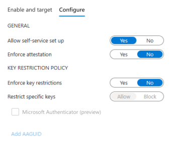

# Enable Microsoft Authenticator passkey sign in (Preview)

For enterprises that use passwords today and have a shared PC environment, passkeys provide a seamless way for workers to authenticate without entering a username or password. Passkeys provide improved security for workers because they can't be phished, stolen, or re-used.

This topic lists steps to enable and enforce Microsoft Authenticator passkey sign-in for Entra ID. At the end of this article. First, you'll update the Authentication methods policy to allow end users to sign in with Authenticaror passkey. Then you'll create a custom authentication strength to enforce passkey sign-in when users access a sensitive resource.

## Requirements

- [Microsoft Entra multifactor authentication (MFA)](howto-mfa-getstarted.md)
- Enable [Combined security information registration](concept-registration-mfa-sspr-combined.md)
- Compatible [FIDO2 security keys](concept-authentication-passwordless.md#fido2-security-keys)
- WebAuthN requires Windows 10 version 1903 or higher

To use security keys for logging in to web apps and services, you must have a browser that supports the WebAuthN protocol. 
These include Microsoft Edge, Chrome, Firefox, and Safari. For more information, see [Browser support of FIDO2 passwordless authentication](fido2-compatibility.md).

>[!NOTE]
>Passkeys (FIDO2) stored on computers and mobile devices along with registering and signing in via WebAuthn QR code is not yet supported by Entra ID.

## Prepare devices

For devices that are joined to Microsoft Entra ID, the best experience is on Windows 10 version 1903 or higher.

Hybrid-joined devices must run Windows 10 version 2004 or higher.

## Enable passwordless authentication method

### Enable the combined registration experience

Registration features for passwordless authentication methods rely on combined MFA/SSPR registration. [Learn more about combined registration](howto-registration-mfa-sspr-combined.md). 

### Enable Authenticator passkey

1. Sign in to the [Microsoft Entra admin center](https://entra.microsoft.com) as at least an [Authentication Policy Administrator](~/identity/role-based-access-control/permissions-reference.md#authentication-policy-administrator).
1. Browse to **Protection** > **Authentication methods** > **Authentication method policy**.
1. Under the method **Passkey (FIDO2)**, click **All users**, or click **Add groups** to select specific groups. *Only security groups are supported*.
1. **Save** the configuration.

   >[!NOTE]
   >If you see an error when you try to save, the cause might be due to the number of users or groups being added. As a workaround, replace the users and groups you are trying to add with a single group, in the same operation, and then click **Save** again.


On the **Configure** tab, there are more settings to help manage how passkeys can be used for sign-in. Here you need to add key restrictions that allow Authenticator passkey sign-in for Android and iOS. 

**General**

- **Allow self-service set up** should remain set to **Yes**. If set to no, your users won't be able to register a passkey through MySecurityInfo, even if enabled by Authentication Methods policy.  
- **Enforce attestation** setting to **Yes** requires the passkey metadata to be published and verified with the FIDO Alliance Metadata Service, and also pass Microsoft's additional set of validation testing. For more information, see [What is a Microsoft-compatible security key?](concept-authentication-passwordless.md#fido2-security-key-providers).

**Key Restriction Policy**

- **Enforce key restrictions** should be set to **Yes** only if your organization wants to only allow or disallow certain passkeys, which are identified by their Authenticator Attestation GUID (AAGUID). The following screenshot shows Authenticator passkey AAGUIDs for Android and iOS. 

  >[!WARNING]
  >Key restrictions set the usability of specific passkeys for both registration and authentication. If you change key restrictions and remove an AAGUID that you previously allowed, users who previously registered an allowed method can no longer use it for sign-in. 

 

### Enable FIDO2 security keys using Graph Explorer

In addition to using the Microsoft Entra admin center, you can also enable FIDO2 security keys by using Graph Explorer. To enable FIDO2 security keys, you must use the Authentication Methods Policy using Graph APIs. **Global Administrators** and **Authentication Policy Administrators** can update the policy. 

To configure the policy by using Graph Explorer:

1. Sign in to [Graph Explorer](https://aka.ms/ge) and consent to the **Policy.Read.All** and **Policy.ReadWrite.AuthenticationMethod** permissions.

1. Retrieve the Authentication methods policy: 

   ```json
   GET https://graph.microsoft.com/beta/authenticationMethodsPolicy/authenticationMethodConfigurations/FIDO2
   ```

1. To disable attestation enforcement and enforce key restrictions to only allow AAGUIDs for Microsoft Authenticator, perform a PATCH operation using the following request body:

   ```json
   PATCH https://graph.microsoft.com/beta/authenticationMethodsPolicy/authenticationMethodConfigurations/FIDO2
   
   Request Body:
   {
       "@odata.type": "#microsoft.graph.fido2AuthenticationMethodConfiguration",
       "isAttestationEnforced": false,
       "keyRestrictions": {
           "isEnforced": true,
           "enforcementType": "allow",
           "aaGuids": [
               "90a3ccdf-635c-4729-a248-9b709135078f",
               "de1e552d-db1d-4423-a619-566b625cdc84"
   
               <insert previous AAGUIDs here to keep them stored in policy>
           ]
       }
   }
   ```

1. Make sure that the passkey (FIDO2) policy has been updated properly.

   ```json
   GET https://graph.microsoft.com/beta/authenticationMethodsPolicy/authenticationMethodConfigurations/FIDO2
   ```


## Disable a passkey 

To remove a passkey associated with a user account, delete the key from the user’s authentication method.

1. Sign in to the [Microsoft Entra admin center](https://entra.microsoft.com) and search for the user account from which the FIDO key is to be removed.
1. Select **Authentication methods** > right-click **FIDO2 security key** and click **Delete**. 

    


## Enforce Authenticator passkey sign-in 

You can use either a built-in phishing-resistant authentication strength or create a custom authentication strength to make users sign in with a passkey when they access a sensitive resource. The following steps explain how to create a Conditional Access policy that 

1. Sign in to the [Microsoft Entra admin center](https://entra.microsoft.com) as a Conditional Access Administrator.
1. Browse to **Protection** > **Authentication methods** > **Authentication strengths**.
1. Select **New authentication strength**.
1. Provide a descriptive **Name** for your new authentication strength.
1. Optionally provide a **Description**.
1. Select **Passkeys (FIDO2)** and then click **Advanced options**.

   :::image type="content" border="true" source="media/concept-authentication-strengths/authentication-strength-custom.png" alt-text="Screenshot showing the creation of a custom authentication strength.":::

1. Set Enforce key restrictions to **Yes**.
1. Set Restrict specific keys to **Allow**.
1. Add AAGUIDs for Authenticator passkey:

   - Android: de1e552d-db1d-4423-a619-566b625cdc84
   - iOS: 90a3ccdf-635c-4729-a248-9b709135078f

   :::image type="content" border="true" source="media/how-to-enable-authenticator-passkey/optional-settings.png" alt-text="Screenshot showing the AAGUIDs for Authenticator.":::

1. Choose **Next** and review the policy configuration.

## Known issues

### Administrator passkey provisioning

Administrator provisioning and de-provisioning of passkey isn't available.

### UPN changes

If a user's UPN changes, you can no longer modify a passkey to account for the change. If the user has a passkey, they need to sign in to MySecurityInfo, delete the old key, and add a new one.

## Next steps

[Support for passkey in Windows 10](/windows/security/identity-protection/passkeys)

