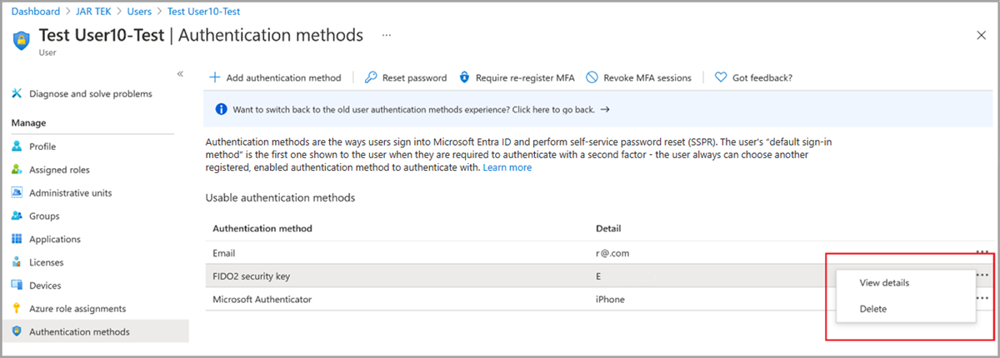

# Enable passkeys in Microsoft Authenticator sign in (preview)

This article lists steps to enable and enforce passkeys in Authenticator sign-in for Microsoft Entra ID. First, you update the Authentication methods policy to allow end users to sign in with passkeys in Authenticator. Then you create a custom authentication strength to enforce passkey sign-in when users access a sensitive resource.

## Requirements

- [Microsoft Entra multifactor authentication (MFA)](howto-mfa-getstarted.md)
- Android 14 and later or iOS 17 and later

> [!NOTE]
> Users need to install the latest version of Authenticator for Android or iOS to use a passkey. 

[!INCLUDE [Passkey roll out](~/includes/entra-authentication-passkey.md)]

To use any passkeys (FIDO2) for sign in to web apps and services, you need to use a browser that supports the WC3 WebAuthn standard. 

Supported browsers include Microsoft Edge, Chrome, Firefox, and Safari. For more information, see [Browser support of FIDO2 passwordless authentication](fido2-compatibility.md).

## Enable passkeys in Authenticator in the admin center

To enable passkeys in Authenticator, you edit the **Passkey (FIDO2)** method policy, the same way you enable another passkey provider. The **Microsoft Authenticator** policy doesn't give you the option to enable a passkey. 

1. Sign in to the [Microsoft Entra admin center](https://entra.microsoft.com) as at least an [Authentication Policy Administrator](~/identity/role-based-access-control/permissions-reference.md#authentication-policy-administrator).
1. Browse to **Protection** > **Authentication methods** > **Authentication method policy**.
1. Under the method **FIDO2 security key**, select **All users** or **Add groups** to select specific groups. *Only security groups are supported*.
1. On the **Configure** tab, set **Enforce key restrictions** to **Yes**, set **Restrict specific keys** to **Allow**. Select **Microsoft Authenticator (preview)** if the checkbox is displayed in the admin center. This setting automatically populates the Authenticator app AAGUIDs for you in the key restriction list. Otherwise, you can manually add the following AAGUIDs to enable the Authenticator passkey preview:

   - Authenticator for Android: de1e552d-db1d-4423-a619-566b625cdc84
   - Authenticator for iOS: 90a3ccdf-635c-4729-a248-9b709135078f

   :::image type="content" border="true" source="media/how-to-enable-authenticator-passkey/optional-settings.png" alt-text="Screenshot showing Microsoft Authenticator enabled for passkey."lightbox="media/how-to-enable-authenticator-passkey/optional-settings.png":::

The following list describes other optional settings:

**General**

- **Allow self-service set up** should remain set to **Yes**. If set to no, your users aren't able to register a passkey through MySecurityInfo, even if enabled by Authentication Methods policy.  
- **Enforce attestation** Should be set to **No** for preview. Attestation support is planned for General Availability.

**Key Restriction Policy**

- **Enforce key restrictions** should be set to **Yes** only if your organization wants to only allow or disallow certain passkeys, which are identified by their Authenticator Attestation GUID (AAGUID). If you want, you can manually enter the Authenticator app AAGUIDs or specifically restrict only Android or iOS devices. Otherwise, you can manually add the following AAGUIDs to enable the Authenticator passkey preview:

  - Authenticator for Android: de1e552d-db1d-4423-a619-566b625cdc84
  - Authenticator for iOS: 90a3ccdf-635c-4729-a248-9b709135078f

  >[!WARNING]
  >Key restrictions set the usability of specific passkeys for both registration and authentication. If you change key restrictions and remove an AAGUID that you previously allowed, users who previously registered an allowed method can no longer use it for sign-in. 

After you finish the configuration, select **Save**.

## Enable passkeys in Authenticator using Graph Explorer

In addition to using the Microsoft Entra admin center, you can also enable passkeys in Authenticator by using Graph Explorer. **Global Administrators** and **Authentication Policy Administrators** can update the Authentication methods policy to allow the AAGUIDs for Authenticator. 

To configure the policy by using Graph Explorer:

1. Sign in to [Graph Explorer](https://aka.ms/ge) and consent to the **Policy.Read.All** and **Policy.ReadWrite.AuthenticationMethod** permissions.

1. Retrieve the Authentication methods policy: 

   ```json
   GET https://graph.microsoft.com/beta/authenticationMethodsPolicy/authenticationMethodConfigurations/FIDO2
   ```

1. To disable attestation enforcement and enforce key restrictions to only allow AAGUIDs for Microsoft Authenticator, perform a PATCH operation using the following request body:

   ```json
   PATCH https://graph.microsoft.com/beta/authenticationMethodsPolicy/authenticationMethodConfigurations/FIDO2
   
   Request Body:
   {
       "@odata.type": "#microsoft.graph.fido2AuthenticationMethodConfiguration",
       "isAttestationEnforced": false,
       "keyRestrictions": {
           "isEnforced": true,
           "enforcementType": "allow",
           "aaGuids": [
               "90a3ccdf-635c-4729-a248-9b709135078f",
               "de1e552d-db1d-4423-a619-566b625cdc84"
   
               <insert previous AAGUIDs here to keep them stored in policy>
           ]
       }
   }
   ```

1. Make sure that the passkey (FIDO2) policy is updated properly.

   ```json
   GET https://graph.microsoft.com/beta/authenticationMethodsPolicy/authenticationMethodConfigurations/FIDO2
   ```


## Delete a passkey 

To remove a passkey associated with a user account, delete the key from the user’s authentication methods.

1. Sign in to the [Microsoft Entra admin center](https://entra.microsoft.com) and search for the user whose passkey needs to be removed.
1. Select **Authentication methods** > right-click **FIDO2 security key** and select **Delete**. 

    

> [!NOTE]
> Users also need to remove the passkey in Authenticator on their device.

## Enforce passkeys in Authenticator sign-in 

To make users sign in with a passkey when they access a sensitive resource, you must do one of the following: 

- Use the built-in phishing-resistant authentication strength, or
- Create a custom authentication strength

The following steps explain how to create a Conditional Access policy with a custom authentication strength.

1. Sign in to the [Microsoft Entra admin center](https://entra.microsoft.com) as a Conditional Access Administrator.
1. Browse to **Protection** > **Authentication methods** > **Authentication strengths**.
1. Select **New authentication strength**.
1. Provide a descriptive **Name** for your new authentication strength.
1. Optionally provide a **Description**.
1. Select **Passkeys (FIDO2)** and then select **Advanced options**.
1. Add AAGUIDs for passkeys in Authenticator:

   - Authenticator for Android: de1e552d-db1d-4423-a619-566b625cdc84
   - Authenticator for iOS: 90a3ccdf-635c-4729-a248-9b709135078f

1. Choose **Next** and review the policy configuration.

## Next steps

[Support for passkey in Windows](/windows/security/identity-protection/passkeys)

