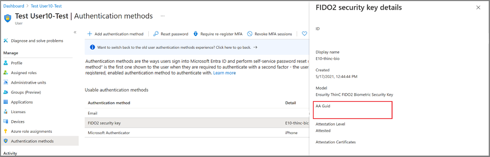
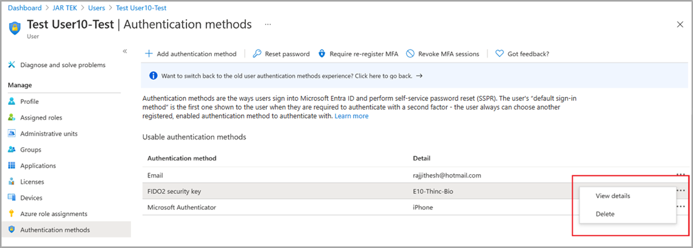

# Enable passkeys (FIDO2) for your organization

For enterprises that use passwords today, passkeys (FIDO2) provide a seamless way for workers to authenticate without entering a username or password. Passkeys provide improved productivity for workers, and have better security.

This article lists requirements and steps to enable passkeys in your organization. After completing these steps, users in your organization can then register and sign in to their Microsoft Entra account using a passkey stored on a FIDO2 security key or in Microsoft Authenticator.

For more information about enabling passkeys in Microsoft Authenticator, see [How to enable passkeys in Microsoft Authenticator](how-to-enable-authenticator-passkey.md).

For more information about passkey authentication, see [Support for FIDO2 authentication with Microsoft Entra ID](~/identity/authentication/concept-fido2-compatibility.md).

> [!NOTE]
> Microsoft Entra ID currently supports device-bound passkeys stored on FIDO2 security keys and in Microsoft Authenticator. Microsoft is committed to securing customers and users with passkeys. We are investing in both synced and device-bound passkeys for work accounts.

## Requirements

- [Microsoft Entra multifactor authentication (MFA)](howto-mfa-getstarted.md).
- [FIDO2 security keys eligible for attestation with Microsoft Entra ID](/entra/identity/authentication/concept-fido2-hardware-vendor) or Microsoft Authenticator.
- Devices that support passkey (FIDO2) authentication. For Windows devices that are joined to Microsoft Entra ID, the best experience is on Windows 10 version 1903 or higher. Hybrid-joined devices must run Windows 10 version 2004 or higher.

Passkeys are supported across major scenarios on Windows, macOS, Android, and iOS. For more information on supported scenarios, see [Support for FIDO2 authentication in Microsoft Entra ID](fido2-compatibility.md).

## Enable passkey authentication method 

1. Sign in to the [Microsoft Entra admin center](https://entra.microsoft.com) as at least an [Authentication Policy Administrator](~/identity/role-based-access-control/permissions-reference.md#authentication-policy-administrator).
1. Browse to **Protection** > **Authentication methods** > **Authentication method policy**.
1. Under the method **FIDO2 security key**, set the toggle to **Enable**. Select **All users** or **Add groups** to select specific groups. *Only security groups are supported*.
1. **Save** the configuration.

   >[!NOTE]
   >If you see an error when you try to save, the cause might be due to the number of users or groups being added. As a workaround, replace the users and groups you are trying to add with a single group, in the same operation, and then click **Save** again.


### Passkey optional settings 

There are some optional settings on the **Configure** tab to help manage how passkeys can be used for sign-in.

:::image type="content" border="true" source="media/howto-authentication-passwordless-security-key/optional-settings-with-aaguid.png" alt-text="Screenshot of FIDO2 security key options.":::

- **Allow self-service set up** should remain set to **Yes**. If set to no, your users can't register a passkey through MySecurityInfo, even if enabled by Authentication Methods policy.  
- **Enforce attestation** should be set to **Yes** if your organization wants to be assured that a FIDO2 security key model or passkey provider is genuine and comes from the legitimate vendor.
    - For FIDO2 security keys, we require security key metadata to be published and verified with the FIDO Alliance Metadata Service, and also pass Microsoft's another set of validation testing. For more information, see [Become a Microsoft-compatible FIDO2 security key vendor](/entra/identity/authentication/concept-fido2-hardware-vendor).
    - For passkeys in Microsoft Authenticator, we don't currently support attestation.

  >[!WARNING]
  >Attestation enforcement governs whether a passkey is allowed during registration only. Users who are able to register a passkey without attestation will not be blocked during sign-in if **Enforce attestation** is set to **Yes** at a later time.

**Key Restriction Policy**

- **Enforce key restrictions** should be set to **Yes** only if your organization wants to only allow or disallow certain security key models or passkey providers, which are identified by their Authenticator Attestation GUID (AAGUID). You can work with your security key vendor to determine the AAGUID of the passkey. If the passkey is already registered, you can find the AAGUID by viewing the authentication method details of the passkey for the user.
- When **Enforce key restrictions** is set to **Yes**, you can select **Microsoft Authenticator (preview)** if the checkbox is displayed in the admin center. This will automatically populate the Authenticator app AAGUIDs for you in the key restriction list. Otherwise, you can manually add the following AAGUIDs to enable the Authenticator passkey preview:
    - **Authenticator for Android:** de1e552d-db1d-4423-a619-566b625cdc84
    - **Authenticator for iOS:** 90a3ccdf-635c-4729-a248-9b709135078f

  >[!WARNING]
  >Key restrictions set the usability of specific models or providers for both registration and authentication. If you change key restrictions and remove an AAGUID that you previously allowed, users who previously registered an allowed method can no longer use it for sign-in. 

## Passkey Authenticator Attestation GUID (AAGUID)

The FIDO2 specification requires each security key vendor to provide an Authenticator Attestation GUID (AAGUID) during registration. An AAGUID is a 128-bit identifier indicating the key type, such as the make and model. Passkey providers on desktop and mobile devices are also expected to provide an AAGUID during registration.

>[!NOTE]
>The vendor must ensure that the AAGUID is identical across all substantially identical security keys or passkey providers made by that vendor, and different (with high probability) from the AAGUIDs of all other types of security keys or passkey providers. To ensure this, the AAGUID for a given security key model or passkey provider should be randomly generated. For more information, see [Web Authentication: An API for accessing Public Key Credentials - Level 2 (w3.org)](https://w3c.github.io/webauthn/).

There are two ways to get your AAGUID. You can either ask your security key or passkey provider vendor, or view the authentication method details of the key per user.




## Provision FIDO2 security keys using Microsoft Graph API (preview)

Currently in preview, administrators can use [Microsoft Graph and custom clients to provision FIDO2 security keys on behalf of users](https://aka.ms/passkeyprovision). Provisioning requires the [Authentication Administrator role](/entra/identity/role-based-access-control/permissions-reference#authentication-administrator) or a client application with UserAuthenticationMethod.ReadWrite.All permission. The provisioning improvements include:

- The ability to request WebAuthn **creation Options** from Entra ID
- The ability to register the provisioned security key directly with Entra ID

With these new APIs, organizations can build their own clients to provision passkey (FIDO2) credentials on security keys on behalf of a user. To simplify this process, three main steps are required. 

1. **Request** creationOptions for a user: Entra ID returns the necessary data for your client to provision a passkey (FIDO2) credential. This includes information such as user information, relying party ID, credential policy requirements, algorithms, registration challenge and more. 
2. **Provision** the passkey (FIDO2) credential with the creation Options: Use the `creationOptions` and a client that supports the Client to Authenticator Protocol (CTAP) to provision the credential. During this step, you need to insert you will need to insert the security key and set a PIN.
3. **Register** the provisioned credential with Entra ID: Use the formatted output from the provisioning process to provide Microsoft Entra ID the necessary data to register the passkey (FIDO2) credential for the targeted user. 

## Enable passkeys using Microsoft Graph API

In addition to using the Microsoft Entra admin center, you can also enable passkeys by using the Microsoft Graph API. To enable passkeys, you need to update the Authentication methods policy as at least an [Authentication Policy Administrator](../role-based-access-control/permissions-reference.md#authentication-policy-administrator). 

To configure the policy using Graph Explorer:

1. Sign in to [Graph Explorer](https://aka.ms/ge) and consent to the **Policy.Read.All** and **Policy.ReadWrite.AuthenticationMethod** permissions.

1. Retrieve the Authentication methods policy: 

   ```json
   GET https://graph.microsoft.com/beta/authenticationMethodsPolicy/authenticationMethodConfigurations/FIDO2
   ```

1. To disable attestation enforcement and enforce key restrictions to only allow the AAGUID for RSA DS100 for example, perform a PATCH operation using the following request body:

   ```json
   PATCH https://graph.microsoft.com/beta/authenticationMethodsPolicy/authenticationMethodConfigurations/FIDO2
   
   Request Body:
   {
       "@odata.type": "#microsoft.graph.fido2AuthenticationMethodConfiguration",
       "isAttestationEnforced": false,
       "keyRestrictions": {
           "isEnforced": true,
           "enforcementType": "allow",
           "aaGuids": [
               "7e3f3d30-3557-4442-bdae-139312178b39",
   
               <insert previous AAGUIDs here to keep them stored in policy>
           ]
       }
   }
   ```

1. Make sure that the passkey (FIDO2) policy is updated properly.

   ```json
   GET https://graph.microsoft.com/beta/authenticationMethodsPolicy/authenticationMethodConfigurations/FIDO2
   ```


## Delete a passkey 

To remove a passkey associated with a user account, delete the key from the user's authentication method.

1. Sign in to the [Microsoft Entra admin center](https://entra.microsoft.com) and search for the user whose passkey needs to be removed.
1. Select **Authentication methods** > right-click **Passkey (device-bound)** and select **Delete**. 

    

## Enforce passkey sign-in

To make users sign in with a passkey when they access a sensitive resource, you can: 

- Use a built-in phishing-resistant authentication strength 

  Or
  
- Create a custom authentication strength

The following steps show how to create a custom authentication strength Conditional Access policy that allows passkey sign-in for only a specific security key model or passkey provider. For a list of FIDO2 providers, see [FIDO2 security keys eligible for attestation with Microsoft Entra ID](/entra/identity/authentication/concept-fido2-hardware-vendor).

1. Sign in to the [Microsoft Entra admin center](https://entra.microsoft.com) as at least a [Conditional Access Administrator](../role-based-access-control/permissions-reference.md#conditional-access-administrator).
1. Browse to **Protection** > **Authentication methods** > **Authentication strengths**.
1. Select **New authentication strength**.
1. Provide a **Name** for your new authentication strength.
1. Optionally provide a **Description**.
1. Select **Passkeys (FIDO2)**.
1. Optionally, if you want to restrict by specific AAGUID(s), select **Advanced options** then **Add AAGUID**. Enter the AAGUID(s) that you allow. Select **Save**.
1. Choose **Next** and review the policy configuration.

## Known issues

### B2B collaboration users 

Registration of FIDO2 credentials isn't supported for B2B collaboration users in the resource tenant.

### Security key provisioning

Administrator provisioning and deprovisioning of security keys isn't available.

### UPN changes

If a user's UPN changes, you can no longer modify passkeys to account for the change. If the user has a passkey, they need to sign in to [My Security info](https://aka.ms/mysecurityinfo), delete the old passkey, and add a new one.

## Next steps

[Native app and browser support of passkey (FIDO2) passwordless authentication](fido2-compatibility.md)

[FIDO2 security key Windows 10 sign in](howto-authentication-passwordless-security-key-windows.md)

[Enable FIDO2 authentication to on-premises resources](howto-authentication-passwordless-security-key-on-premises.md)

[Register security keys on behalf of users](how-to-enable-passkey-fido2.md)

[Learn more about device registration](~/identity/devices/overview.md)

[Learn more about Microsoft Entra multifactor authentication](~/identity/authentication/howto-mfa-getstarted.md)
