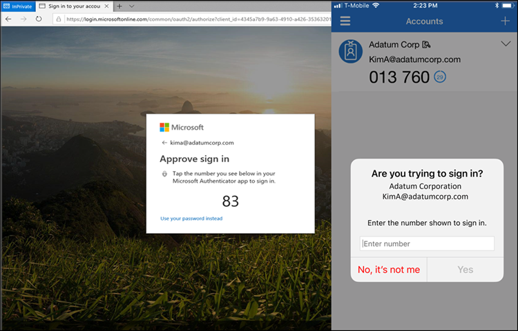

# How number matching works in MFA push notifications for Authenticator - Authentication methods policy

This article explains how number matching in Authenticator push notifications improves user sign-in security. Number matching is a key security upgrade to traditional second-factor notifications in Authenticator.

Number matching is enabled for all Authenticator push notifications.

## Number matching scenarios

Number matching is available for the following scenarios. When it's enabled, all scenarios support number matching:

- [MFA](#multifactor-authentication)
- [Self-service password reset (SSPR)](#sspr)
- [Combined SSPR and MFA registration during Authenticator app setup](#combined-registration)
- [Active Directory Federation Services (AD FS) adapter](#ad-fs-adapter)
- [Network Policy Server (NPS) extension](#nps-extension)

Number matching isn't supported for push notifications for Apple Watch or Android wearable devices. Wearable device users need to use their phone to approve notifications when number matching is enabled.

### Multifactor authentication

When users respond to an MFA push notification by using Authenticator, they see a number. They need to enter that number into the app to complete the approval. For more information about how to set up MFA, see [Tutorial: Secure user sign-in events with Microsoft Entra multifactor authentication](tutorial-enable-azure-mfa.md).

### SSPR

SSPR with Authenticator requires number matching when a user uses Authenticator. During SSPR, the sign-in page shows a number that the user needs to enter into the Authenticator notification. For more information about how to set up SSPR, see [Tutorial: Enable users to unlock their account or reset passwords](howto-sspr-deployment.md).

### Combined registration

Combined registration with Authenticator requires number matching. When a user goes through combined registration to set up Authenticator, the user needs to approve a notification to add the account. This notification shows a number that the user needs to enter into the Authenticator notification. For more information about how to set up combined registration, see [Enable combined security information registration](howto-registration-mfa-sspr-combined.md).

### AD FS adapter

The AD FS adapter requires number matching on supported versions of Windows Server. On earlier versions, users continue to see the **Approve**/**Deny** experience and don't see number matching until they upgrade. The AD FS adapter supports number matching only after they install one of the updates in the following table. For more information about how to set up the AD FS adapter, see [Configure Microsoft Entra Multifactor Authentication Server to work with AD FS in Windows Server](howto-mfaserver-adfs-windows-server.md).

> [!NOTE]
> Unpatched versions of Windows Server don't support number matching. Users continue to see the **Approve**/**Deny** experience and don't see number matching unless these updates are applied.

| Version | Update |
|---------|--------|
| Windows Server 2022 | [November 9, 2021—KB5007205 (OS Build 20348.350)](https://support.microsoft.com/topic/november-9-2021-kb5007205-os-build-20348-350-af102e6f-cc7c-4cd4-8dc2-8b08d73d2b31) |
| Windows Server 2019 | [November 9, 2021—KB5007206 (OS Build 17763.2300)](https://support.microsoft.com/topic/november-9-2021-kb5007206-os-build-17763-2300-c63b76fa-a9b4-4685-b17c-7d866bb50e48) |
| Windows Server 2016 | [October 12, 2021—KB5006669 (OS Build 14393.4704)](https://support.microsoft.com/topic/october-12-2021-kb5006669-os-build-14393-4704-bcc95546-0768-49ae-bec9-240cc59df384) |

### NPS extension

Although NPS doesn't support number matching, the latest NPS extension does support time-based one-time password (TOTP) methods such as the TOTP available in Authenticator, other software tokens, and hardware FOBs. TOTP sign-in provides better security than the alternative **Approve**/**Deny** experience. Make sure that you run the latest version of the [NPS extension](https://www.microsoft.com/download/details.aspx?id=54688).

Anyone who performs a RADIUS connection with NPS extension version 1.2.2216.1 or later is prompted to sign in with a TOTP method instead of **Approve**/**Deny**. Users must have a TOTP authentication method registered to see this behavior. Without a TOTP method registered, users continue to see **Approve**/**Deny**.

Organizations that run any of these earlier versions of the NPS extension can modify the registry to require users to enter a TOTP:

- 1.2.2131.2
- 1.2.1959.1
- 1.2.1916.2
- 1.1.1892.2
- 1.0.1850.1
- 1.0.1.41
- 1.0.1.40

> [!NOTE]
> NPS extensions versions earlier than 1.0.1.40 don't support TOTP enforced by number matching. These versions continue to use **Approve**/**Deny**.

To create the registry entry to override the **Approve**/**Deny** options in push notifications and require a TOTP instead:

1. On the NPS server, open the Registry Editor.
1. Go to `HKEY_LOCAL_MACHINE\SOFTWARE\Microsoft\AzureMfa`.
1. Create the following string/value pair:

   - Name: `OVERRIDE_NUMBER_MATCHING_WITH_OTP`
   - Value = `TRUE`
1. Restart the NPS service.

In addition:

- Users who perform TOTP must have either Authenticator registered as an authentication method or some other hardware or software OATH token. Users who can't use a TOTP method always see **Approve**/**Deny** options with push notifications if they use a version of the NPS extension earlier than 1.2.2216.1.
- The NPS server where the NPS extension is installed must be configured to use the Password Authentication Protocol (PAP). For more information, see [Determine which authentication methods your users can use](howto-mfa-nps-extension.md#determine-which-authentication-methods-your-users-can-use).

  > [!IMPORTANT]
  > MSCHAPv2 doesn't support TOTP. If the NPS server isn't configured to use PAP, user authorization fails with events in the **AuthZOptCh** log of the NPS extension server in Event Viewer:
  >
  > - NPS extension for Azure MFA: Challenge requested in the Authentication extension for the user `npstesting_ap`.
  >
  > You can configure the NPS server to support PAP. If PAP isn't an option, set `OVERRIDE_NUMBER_MATCHING_WITH_OTP = FALSE` to fall back to **Approve**/**Deny** push notifications.

If your organization uses Remote Desktop Gateway and the user registered for a TOTP code along with Authenticator push notifications, the user can't meet the Microsoft Entra MFA challenge and Remote Desktop Gateway sign-in fails. In this case, set `OVERRIDE_NUMBER_MATCHING_WITH_OTP = FALSE` to fall back to **Approve**/**Deny** push notifications with Authenticator.

## FAQs

This section provides answers to common questions.

### Can users opt out of number matching?

No, users can't opt out of number matching in Authenticator push notifications.

### Does number matching only apply if Authenticator push notifications are set as the default authentication method?

Yes. If the user has a different default authentication method, there's no change to their default sign-in. If the default method is Authenticator push notifications, they get number matching. If the default method is anything else, such as TOTP in Authenticator or another provider, there's no change.

Regardless of their default method, any user who is prompted to sign in with Authenticator push notifications sees number matching. If they're prompted for another method, they won't see any change.

### What happens for users who aren't specified in the Authentication methods policy but they're enabled for notifications through the mobile app in the legacy MFA tenant-wide policy?

Users who are enabled for MFA push notifications in the legacy MFA policy also see number match if the legacy MFA policy enabled **Notification through mobile app**. Users see number matching regardless of whether they're enabled for Authenticator in the Authentication methods policy.

:::image type="content" border="true" source="./media/how-to-mfa-number-match/notifications-through-mobile-app.png" alt-text="Screenshot that shows the setting Notification through mobile app.":::

### Is number matching supported with Azure Multi-Factor Authentication Server?

No, number matching isn't enforced because it's not a supported feature for Azure Multi-Factor Authentication Server, which is [deprecated](https://techcommunity.microsoft.com/t5/microsoft-entra-azure-ad-blog/microsoft-entra-change-announcements-september-2022-train/ba-p/2967454).

### What happens if a user runs an older version of Authenticator?

If a user runs an older version of Authenticator that doesn't support number matching, authentication won't work. They need to upgrade to the latest version of Authenticator to use it for sign-in.

### How can users recheck the number on mobile iOS devices after the match request appears?

During mobile iOS broker flows, the number match request appears over the number after a two-second delay. To recheck the number, select **Show me the number again**. This action occurs only in mobile iOS broker flows.

### Is Apple Watch supported for Authenticator?

In the Authenticator release in January 2023 for iOS, there's no companion app for watchOS because it's incompatible with Authenticator security features. You can't install or use Authenticator on Apple Watch. We recommend that you [delete Authenticator from your Apple Watch](https://support.apple.com/HT212064) and sign in with Authenticator on another device.

## Related content

- [Authentication methods in Microsoft Entra ID](concept-authentication-authenticator-app.md)
