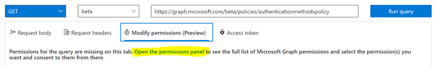
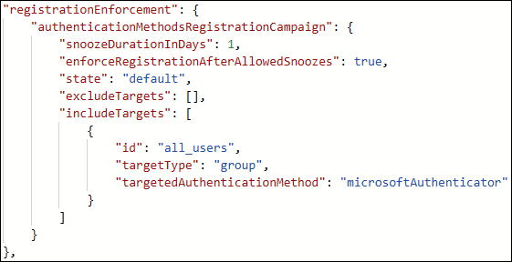
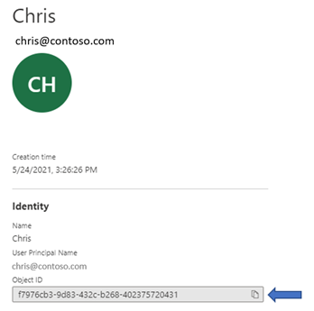
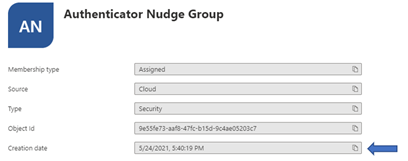

# Run a registration campaign to set up Microsoft Authenticator or passkey

You can nudge users to set up Microsoft Authenticator or a passkey during sign-in. Users go through their regular sign-in, perform multifactor authentication as usual, and then get prompted to set up the targeted authentication method. You can include or exclude users or groups to control who gets nudged, and create targeted campaigns to move users from less secure authentication methods to Authenticator or passkeys.

Registration campaigns support two authentication methods:

- **Microsoft Authenticator** — Nudge users to download and set up the Authenticator app for push notifications.
- **Passkey (FIDO2)** — Nudge users to register a passkey, which includes both sync passkeys and device-bound passkeys.

> [!NOTE]
> A registration campaign can only target one authentication method at a time. You can't run campaigns for both Microsoft Authenticator and passkeys simultaneously in the same tenant.

You can also define how many days a user can postpone, or "snooze," the nudge. If a user taps **Skip for now** to postpone setup, they get nudged again on the next MFA attempt after the snooze duration has elapsed. You can decide whether the user can snooze indefinitely or up to three times (after which registration is required).

> [!NOTE]
> As users go through their regular sign-in, Conditional Access policies that govern security info registration apply before the user is nudged to set up an authentication method. For example, if a Conditional Access policy requires that security info updates can only occur on an internal network, users won't be prompted unless they're on the internal network.

## Prerequisites 

- If you want to know the number of users who registered each authentication method before you configure the registration campaign, see [the Authentication methods activity report](howto-authentication-methods-activity.md#registration-details).
- Your organization must enable Microsoft Entra multifactor authentication. The registration campaign has no license requirements.
- **For Authenticator campaigns**: Users can't have already set up the Authenticator app for push notifications on their account. Admins need to enable users for the Authenticator app in the Authentication methods policy. The **Authentication mode** must be set to **Any** or **Push**. If the **Authentication mode** is set to **Passwordless**, users aren't eligible for the nudge. For more information about how to set the **Authentication mode**, see [Enable passwordless sign-in with Microsoft Authenticator](howto-authentication-passwordless-phone.md). 
- **For passkey campaigns**: The passkey (FIDO2) authentication method must be enabled in the Authentication methods policy. In addition, the **Allow self-service setup** toggle must be enabled in the passkey (FIDO2) method configuration. For more information, see [Enable passkeys](how-to-enable-passkey-fido2.md).

## User experience

### Authenticator campaign

1. First, successfully authenticate using Microsoft Entra multifactor authentication (MFA). 

1. If you're enabled for Authenticator push notifications and don't have it already set up, you get prompted to set up Authenticator to improve your sign-in experience. 

   > [!NOTE]
   > Other security features, such as passwordless passkey, self-service password reset, or security defaults, might also prompt you for setup.

    :::image type="content" source="./media/how-to-mfa-registration-campaign/user-prompt.png" alt-text="Screenshot showing the registration campaign prompt asking the user to set up Microsoft Authenticator.":::

1. Select **Next** and step through the Authenticator app setup. 
1. First download the app.  

    :::image type="content" source="./media/how-to-mfa-registration-campaign/user-downloads-microsoft-authenticator.png" alt-text="Screenshot showing the prompt to download Microsoft Authenticator from the app store."::: 

   1. See how to set up the Authenticator app. 

      :::image type="content" source="./media/how-to-mfa-registration-campaign/setup.png" alt-text="Screenshot showing the Authenticator app setup instructions with a QR code.":::

   1. Scan the QR Code. 

      :::image type="content" source="./media/how-to-mfa-registration-campaign/scan.png" alt-text="Screenshot showing a QR code to scan with the Authenticator app.":::

   1. Verify your identity.

      :::image type="content" source="./media/how-to-mfa-registration-campaign/approved.png" alt-text="Screenshot showing the Verify your identity screen during Authenticator setup."::: 

   1. Approve the test notification on your device.

      :::image type="content" source="./media/how-to-mfa-registration-campaign/test.png" alt-text="Screenshot showing a test notification sent to the Authenticator app for approval."::: 

   1. Authenticator app is now successfully set up.
   
      :::image type="content" source="./media/how-to-mfa-registration-campaign/finish.png" alt-text="Screenshot showing that Authenticator app setup completed successfully.":::

1. If you don't want to set up the Authenticator app, you can select **Skip for now** to snooze the prompt for up to 14 days, which can be set by an admin. Users with free and trial subscriptions can snooze the prompt up to three times.

    :::image type="content" source="./media/how-to-mfa-registration-campaign/snooze.png" alt-text="Screenshot showing the Skip for now option to snooze the registration campaign prompt.":::

### Passkey campaign

1. First, successfully authenticate using Microsoft Entra multifactor authentication (MFA).

1. If passkey is enabled for your account and you haven't already registered a passkey, you get prompted to set up a passkey.

   > [!NOTE]
   > Users who already have a passkey registered aren't nudged again. However, users who only have a Windows Hello for Business passkey or a Mac platform SSO passkey are still nudged to register an additional passkey.

1. If you don't want to set up a passkey, you can tap **Skip for now** to snooze the prompt.

## Enable the registration campaign policy using the Microsoft Entra admin center

To enable a registration campaign in the Microsoft Entra admin center, complete the following steps:

1. Sign in to the [Microsoft Entra admin center](https://entra.microsoft.com) as at least an [Authentication Policy Administrator](~/identity/role-based-access-control/permissions-reference.md#authentication-policy-administrator).
1. Browse to **Entra ID** > **Authentication methods** > **Registration campaign** and select **Edit**.
1. For **Authentication method**, select the method to target:

   - **Microsoft Authenticator** — Nudge users to set up the Authenticator app.
   - **Passkey** — Nudge users to register a passkey (includes both sync passkeys and device-bound passkeys).

1. For **State**:

   - Select **Enabled** to enable the registration campaign for all users. When the state is set to **Enabled**, you can configure the target authentication method, snooze duration, limited number of snoozes, and include/exclude targets.
   - Select **Microsoft managed** to enable the registration campaign with Microsoft-recommended defaults. When **Microsoft managed** is selected, the target authentication method, snooze duration, and limited number of snoozes are set automatically and can't be configured. You can still configure include/exclude targets. For more information, see [Protecting authentication methods in Microsoft Entra ID](concept-authentication-default-enablement.md).

   > [!NOTE]
   > When the state is set to **Microsoft managed**, Microsoft determines the optimal campaign settings based on best practices for your tenant. The following changes are incrementally rolled out to tenants:
   >
   > - **Targeted authentication method** changes from Microsoft Authenticator to passkeys (FIDO2).
   > - **Days allowed to snooze** changes to 1 day. This setting is no longer configurable.
   > - **Limited number of snoozes** changes to Disabled (unlimited snoozes). This setting is no longer configurable.
   > - **User targeting** changes from voice call or text message users to all multifactor authentication (MFA) capable users.
   >
   > If your tenant has AAGUID-specific key restrictions configured, the targeted authentication method won't update to passkeys under Microsoft managed mode. You can still switch to **Enabled** and configure passkey targeting manually. Once the changes take effect, targeted users receive passkey registration nudges during sign-in after they complete multifactor authentication.
   >
   > If you want passkeys enabled but don't want the registration campaign to target passkeys, you can switch the state to **Enabled** and target Microsoft Authenticator, or set the state to **Disabled**. For more information about how Microsoft managed values are set, see [Microsoft managed values](concept-authentication-default-enablement.md).

   If the registration campaign state is set to **Enabled**, you can configure the experience for end users by using **Limited number of snoozes**:
   - If **Limited number of snoozes** is Enabled, users can skip the interrupt prompt 3 times, after which they're forced to register the targeted authentication method.
   - If **Limited number of snoozes** is Disabled, users can snooze an unlimited number of times and avoid registration.
 
   **Days allowed to snooze** sets the period between two successive interrupt prompts. For example, if it's set to 3 days, users who skipped registration don't get prompted again until after 3 days.

   :::image type="content" border="true" source="media/how-to-mfa-registration-campaign/admin-experience.png" alt-text="Screenshot of enabling a registration campaign.":::

1. Select any users or groups to exclude from the registration campaign, and then select **Save**.

## Enable the registration campaign policy using Graph Explorer

In addition to using the Microsoft Entra admin center, you can also enable the registration campaign policy using Graph Explorer. To enable the registration campaign policy, you must use the Authentication Methods Policy using Graph APIs. Those assigned at least the [Authentication Policy Administrator](../role-based-access-control/permissions-reference.md#authentication-policy-administrator) role can update the policy. 

To configure the policy using Graph Explorer:

1. Sign in to Graph Explorer and ensure you've consented to the **Policy.Read.All** and **Policy.ReadWrite.AuthenticationMethod** permissions.

   To open the Permissions panel:

   
   
1. Retrieve the Authentication methods policy: 

   ```json
   GET https://graph.microsoft.com/v1.0/policies/authenticationmethodspolicy
   ```

1. Update the registrationEnforcement and authenticationMethodsRegistrationCampaign section of the policy to enable the nudge on a user or group.

   
   
   To update the policy, perform a PATCH on the Authentication Methods Policy with only the updated registrationEnforcement section: 

   ```json
   PATCH https://graph.microsoft.com/v1.0/policies/authenticationmethodspolicy
   ```


The following table lists **authenticationMethodsRegistrationCampaign** properties.

|Name|Possible values|Description|
|------|-----------------|-------------|
|snoozeDurationInDays|Range: 0 - 14|Defines the number of days before the user is nudged again.<br>If the value is 0, the user is nudged during every MFA attempt.<br>Default: 1 day|
|enforceRegistrationAfterAllowedSnoozes|"true"<br>"false"|Dictates whether a user is required to perform setup after 3 snoozes.<br>If true, user is required to register.<br>If false, user can snooze indefinitely.<br>Default: true|
|state|"enabled"<br>"disabled"<br>"default"|Allows you to enable or disable the feature.<br>Default value is used when the configuration hasn't been explicitly set and will use Microsoft Entra ID default value for this setting.<br>Change state to enabled (for all users) or disabled as needed.|
|excludeTargets|N/A|Allows you to exclude different users and groups that you want omitted from the feature. If a user is in a group that is excluded and a group that is included, the user will be excluded from the feature.|
|includeTargets|N/A|Allows you to include different users and groups that you want the feature to target.|

The following table lists **includeTargets** properties.

| Name | Possible values | Description |
|------|-----------------|-------------|
| targetType| "user"<br>"group" | The kind of entity targeted. |
| ID | A guid identifier | The ID of the user or group targeted. |
| targetedAuthenticationMethod | "microsoftAuthenticator"<br>"fido2" | The authentication method that the user is nudged to register. Use "microsoftAuthenticator" to nudge users to set up the Authenticator app, or "fido2" to nudge users to register a passkey. |

The following table lists **excludeTargets** properties.

| Name       | Possible values   | Description                           |
|------------|-------------------|---------------------------------------|
| targetType | "user"<br>"group" | The kind of entity targeted.          |
| ID         | A string          | The ID of the user or group targeted. |

### Examples

Here are a few sample JSON bodies you can use to get started.

- Include all users and target Authenticator
  
  If you want to include ALL users in your tenant and nudge them to set up Authenticator, update the following JSON example with the relevant GUIDs of your users and groups. Then paste it in Graph Explorer and run `PATCH` on the endpoint. 

  ```json
  {
  "registrationEnforcement": {
          "authenticationMethodsRegistrationCampaign": {
              "snoozeDurationInDays": 1,
              "enforceRegistrationAfterAllowedSnoozes": true,
              "state": "enabled",
              "excludeTargets": [],
              "includeTargets": [
                  {
                      "id": "all_users",
                      "targetType": "group",
                      "targetedAuthenticationMethod": "microsoftAuthenticator"
                  }
              ]
          }
      }
  }
  ```

- Include all users and target passkey
  
  > [!NOTE]
  > Passkey targeting via the Graph API isn't available yet. The following example is for future use when the API supports passkey as a `targetedAuthenticationMethod`. Use the Microsoft Entra admin center to configure passkey registration campaigns.

  If you want to include ALL users in your tenant and nudge them to register a passkey, update the following JSON example. Then paste it in Graph Explorer and run `PATCH` on the endpoint. 

  ```json
  {
  "registrationEnforcement": {
          "authenticationMethodsRegistrationCampaign": {
              "snoozeDurationInDays": 1,
              "enforceRegistrationAfterAllowedSnoozes": true,
              "state": "enabled",
              "excludeTargets": [],
              "includeTargets": [
                  {
                      "id": "all_users",
                      "targetType": "group",
                      "targetedAuthenticationMethod": "fido2"
                  }
              ]
          }
      }
  }
  ```

- Include specific users or groups of users

  If you want to include certain users or groups in your tenant, update the following JSON example with the relevant GUIDs of your users and groups. Then paste the JSON in Graph Explorer and run `PATCH` on the endpoint. 

  ```json
  {
  "registrationEnforcement": {
        "authenticationMethodsRegistrationCampaign": {
            "snoozeDurationInDays": 1,
            "enforceRegistrationAfterAllowedSnoozes": true,
            "state": "enabled",
            "excludeTargets": [],
            "includeTargets": [
                {
                    "id": "*********PLEASE ENTER GUID***********",
                    "targetType": "group",
                    "targetedAuthenticationMethod": "microsoftAuthenticator"
                },
                {
                    "id": "*********PLEASE ENTER GUID***********",
                    "targetType": "user",
                    "targetedAuthenticationMethod": "microsoftAuthenticator"
                }
            ]
        }
    }
  }  
  ```

- Include and exclude specific users or groups

  If you want to include AND exclude certain users or groups in your tenant, update the following JSON example with the relevant GUIDs of your users and groups. Then paste it in Graph Explorer and run `PATCH` on the endpoint. 

  ```json
  {
  "registrationEnforcement": {
          "authenticationMethodsRegistrationCampaign": {
              "snoozeDurationInDays": 1,
              "enforceRegistrationAfterAllowedSnoozes": true,
              "state": "enabled",
              "excludeTargets": [
                  {
                      "id": "*********PLEASE ENTER GUID***********",
                      "targetType": "group"
                  },
                {
                      "id": "*********PLEASE ENTER GUID***********",
                      "targetType": "user"
                  }
              ],
              "includeTargets": [
                  {
                      "id": "*********PLEASE ENTER GUID***********",
                      "targetType": "group",
                      "targetedAuthenticationMethod": "microsoftAuthenticator"
                  },
                  {
                      "id": "*********PLEASE ENTER GUID***********",
                      "targetType": "user",
                      "targetedAuthenticationMethod": "microsoftAuthenticator"
                  }
              ]
          }
      }
  }
  ```

### Identify the GUIDs of users to insert in the JSONs

1. Sign in to the [Microsoft Entra admin center](https://entra.microsoft.com) as at least an [Authentication Policy Administrator](~/identity/role-based-access-control/permissions-reference.md#authentication-policy-administrator).
1. In the **Manage** blade, select **Users**.
1. On the **Users** page, identify the specific user you want to target.
1. When you tap the specific user, you’ll see their **Object ID**, which is the user’s GUID.

   
   
### Identify the GUIDs of groups to insert in the JSONs

1. Sign in to the [Microsoft Entra admin center](https://entra.microsoft.com) as at least an [Authentication Policy Administrator](~/identity/role-based-access-control/permissions-reference.md#authentication-policy-administrator).
1. In the **Manage** blade, select **Groups**.
1. On the **Groups** page, identify the specific group you want to target.
1. Select the group to get the **Object ID**.

   
   
<!-- comment out PS until ready

### PowerShell

1. Install the module.
1. Ensure you pass the right roles:
   
   ```powershell
   Connect-MgGraph -Scopes "User.Read.All","Group.ReadWrite.All"
   ```

1. Select the beta profile.
1. Call `Update-MgPolicyAuthenticationMethod`.

-->

## Limitations

The nudge won't appear on mobile devices that run Android or iOS.

## Frequently asked questions

**Can users be nudged within an application?**

Yes, we support embedded browser views in certain applications. We don't nudge users in out-of-the-box experiences or in browser views embedded in Windows settings.

**Can users be nudged within a single sign-on (SSO) session?**
 
Nudge doesn't trigger if the user is already signed in with SSO. 

**Can users be nudged on a mobile device?** 

The registration campaign isn't available on mobile devices.

**How long does the campaign run for?** 

You can enable the campaign for as long as you like. Whenever you want to be done running the campaign, use the admin center or APIs to disable the campaign.  

**Can each group of users have a different snooze duration?** 

No. The snooze duration for the prompt is a tenant-wide setting and applies to all groups in scope. 

**Can users be nudged to set up passwordless phone sign-in?** 

The registration campaign feature supports nudging users to set up MFA using the Authenticator app or to register a passkey. Passwordless phone sign-in isn't a targeted method for registration campaigns.

**Will a user who signs in with a third-party authenticator app see the nudge?** 

Yes. If a user is enabled for the registration campaign and doesn't have the targeted authentication method set up (Microsoft Authenticator for push notifications, or a passkey), the user is nudged. 

**Will a user who has Authenticator set up only for TOTP codes see the nudge?**

Yes. If a user is enabled for an Authenticator registration campaign and the Authenticator app isn't set up for push notifications, the user is nudged to set up push notification with Authenticator.

**Will a user who already has a passkey see the nudge?**

No. If a user already has a registered passkey and the registration campaign targets passkeys, the user isn't nudged again. However, users who only have a Windows Hello for Business passkey or a Mac platform SSO passkey are still nudged to register an additional passkey.

**Can I run registration campaigns for both Authenticator and passkeys at the same time?**

No. A registration campaign can only target one authentication method at a time. You can either target Microsoft Authenticator or passkeys, but not both simultaneously in the same tenant.

**If a user just went through MFA registration, are they nudged in the same sign-in session?** 

No. To provide a good user experience, users won't be nudged to set up the Authenticator in the same session that they registered other authentication methods.  

**Can I nudge my users to register another authentication method?** 

Yes. Registration campaigns support nudging users to set up Microsoft Authenticator or to register a passkey (FIDO2). Select the targeted authentication method when you configure the campaign.

**Is there a way for me to hide the snooze option and force my users to set up the Authenticator app?**  

Set the **Limited number of snoozes** to **Enabled** such that users can postpone the app setup up to three times, after which setup is required.  

**Will I be able to nudge my users if I'm not using Microsoft Entra multifactor authentication?** 

No. The nudge only works for users who are doing MFA using the Microsoft Entra multifactor authentication service. 

**Will Guest/B2B users in my tenant be nudged?** 

Yes. If they have been scoped for the nudge using the policy. 

**What if the user closes the browser?** 

It's the same as snoozing. If setup is required for a user after they snoozed three times, the user is nudged when they next sign in.

**Why don't some users see a nudge when there is a Conditional Access policy for "Register security information"?**

A nudge won't appear if a user is in scope for a Conditional Access policy that blocks access to the **Register security information** page.

**Do users see a nudge when there is a terms of use (ToU) screen presented to the user during sign-in?**

A nudge won't appear if a user is presented with the [terms of use (ToU)](~/identity/conditional-access/terms-of-use.md) screen during sign-in.

**Do users see a nudge when Conditional Access custom controls are applicable to the sign-in?**

A nudge won't appear if a user is redirected during sign-in due to [Conditional Access custom controls](~/identity/conditional-access/controls.md) settings.

**Are there any plans to discontinue SMS and Voice as methods usable for MFA?**

No, there are no such plans.

## Next steps

- [Enable passwordless sign-in with Microsoft Authenticator](howto-authentication-passwordless-phone.md)
- [Enable passkeys (FIDO2)](how-to-enable-passkey-fido2.md)
- [Protecting authentication methods in Microsoft Entra ID](concept-authentication-default-enablement.md)
