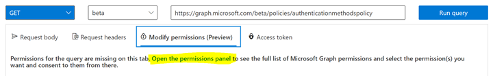
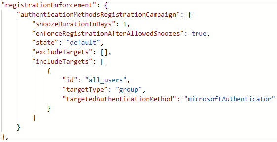
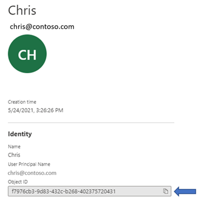
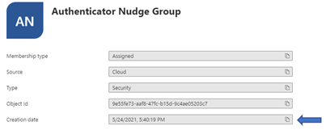

# Run a registration campaign to set up a passkey or Microsoft Authenticator

> [!NOTE]
> We're rolling out this version of the registration campaign. The rollout is expected to finish by the end of September 2026. Until then, the registration campaign experience in your tenant might differ from what's described in this article.

The registration campaign allows you to nudge users to set up a passkey or Microsoft Authenticator during sign-in. When a user performs an interactive sign-in with multifactor authentication (MFA), they can be prompted to set up the targeted authentication method. You can include or exclude users or groups to control who gets nudged and create targeted campaigns that move users from less secure authentication methods to passkeys or Authenticator.

The registration campaign supports two authentication methods:

- **Passkey (FIDO2)**: Nudges users to register a passkey.
- **Authenticator**: Nudges users to download and set up Authenticator for push notifications.

The registration campaign can target one authentication method at a time.

## Prerequisites

You can choose from two registration campaigns:

- **Authenticator campaign**: Target users who don't already have Authenticator push notifications set up on their account. Enable users for Authenticator in the authentication methods policy. **Authentication mode** must be set to **Any** or **Push**. If the mode is set to **Passwordless**, users aren't eligible for the nudge. For more information, see [Enable passwordless sign-in with Authenticator](howto-authentication-passwordless-phone.md). Users targeted by the registration campaign must also be in scope for this authentication method.
- **Passkey campaign**: Enable the passkey (FIDO2) authentication method in the authentication methods policy. Also enable **Allow self-service setup** in the passkey (FIDO2) method configuration. For more information, see [Enable passkeys](how-to-authentication-passkeys-fido2.md). Users targeted by the registration campaign must also be in scope for this authentication method.

Optionally, determine the number of users who registered each authentication method before you configure the registration campaign. See [Authentication methods activity report](howto-authentication-methods-activity.md#registration-details).

## How a registration campaign works

A registration campaign prompts users to set up a stronger authentication method—a passkey (FIDO2) or Microsoft Authenticator—after they complete multifactor authentication (MFA).

The following conditions apply:

| Targeted authentication method | When the user is prompted |
|---|---|
| Microsoft Authenticator | After the user successfully completes MFA by using SMS or voice call. |
| Passkey (FIDO2) | After the user successfully completes MFA by using any method. |

For either campaign, a user is prompted only if they're eligible. A user's eligibility depends on the campaign state and the targeted authentication method.

> [!NOTE]
> As users go through their regular sign-in, Microsoft Entra Conditional Access policies that govern security information registration apply before the user is nudged to set up an authentication method. For example, if a Conditional Access policy requires that security information updates can occur only on an internal network, users aren't prompted unless they're on the internal network.

## Choose a campaign state

The campaign state determines who configures and manages the campaign settings.

| State | Who configures the campaign |
|---|---|
| Microsoft managed | Microsoft selects the targeted authentication method and settings, and updates them to match the current best practices. You define which users are included. |
| Enabled | You select the targeted authentication method, snooze settings, and included users. |
| Disabled | The registration campaign is disabled. |

Use **Microsoft managed** to apply Microsoft's recommended settings. Use **Enabled** when you need to control the targeted method or the snooze behavior, or when you need to run a passkey campaign for users whose passkey profile isn't eligible under Microsoft managed. For more information, see [Passkey profile eligibility for Microsoft managed registration campaign](#passkey-profile-eligibility-for-microsoft-managed-registration-campaign).

The following table shows which settings you control in each state.

| Setting | Microsoft managed | Enabled |
|---|---|---|
| Targeted authentication method | Set by Microsoft | Passkey or Authenticator |
| Days allowed to snooze | Set by Microsoft | 0–14 |
| Limited number of snoozes | Set by Microsoft | On or off |
| Include and exclude users and groups | Configurable | Configurable |

## Microsoft managed state

In the **Microsoft managed** state, Microsoft selects the targeted authentication method based on your tenant's authentication method configuration and applies the corresponding recommended settings. Microsoft targets passkey (FIDO2) when included users are enabled for passkeys, and Microsoft Authenticator when they aren't enabled for passkeys but are enabled for Authenticator.

The following table shows the settings and eligibility that Microsoft applies for each method.

| Property | Microsoft Authenticator | Passkey (FIDO2) |
|---|---|---|
| Days allowed to snooze | 1 | 1 |
| Limited number of snoozes | Enabled: After 3 snoozes, registration is required | Disabled: Unlimited snoozes |
| Eligible users | Users who meet **all** of the following:<br>• Perform MFA by using voice call or text message (SMS)<br>• Are enabled for Authenticator push notifications in the authentication methods policy<br>• Don't already have Authenticator push set up | Users who meet **all** of the following:<br>• Sign in by using any MFA method<br>• Are in at least one eligible passkey profile (see [Passkey profile eligibility for Microsoft managed registration campaign](#passkey-profile-eligibility-for-microsoft-managed-registration-campaign)) |


### Passkey profile eligibility for Microsoft managed registration campaign

When your registration campaign is in the **Microsoft managed** state and targets passkeys, each scoped user's passkey profile is checked when they sign in. A user is nudged if they're in **at least one** passkey profile configuration that meets the following criteria. This check doesn't apply in the **Enabled** state.

| Passkey profile configuration | Details |
|---|---|
| Unrestricted | No passkey profile restrictions. |
| Synced-only | Synced passkeys only. No key restrictions. |
| Device-bound-only | Device-bound passkeys only. No key restrictions. |
| AAGUID-restricted | The allow list contains at least one AAGUID for the following providers:<br>• iCloud Keychain<br>• Google Password Manager (GPM)<br>• Microsoft Authenticator passkey<br>• Microsoft Entra passkey on Windows |
| Device-bound with attestation enforced | Key restrictions aren't evaluated. |


In AAGUID-restricted profiles:

- You can add other AAGUIDs as long as the allow list contains at least one AAGUID for a provider in the preceding table.
- **Exclude** and **Block** lists are ignored when campaign eligibility is determined. An admin can have entries in **Exclude** or **Block**, but the targeting logic doesn't evaluate them for eligibility.
- For iCloud Keychain or Google Password Manager AAGUIDs, select the **Synced** passkey profile type. For Microsoft Authenticator passkey or Microsoft Entra passkey on Windows AAGUIDs, select the **Device bound** passkey profile type. For a combination of synced and device-bound AAGUIDs, select both passkey profile types.

> [!NOTE]
> A user needs only **one** eligible passkey profile to be nudged. If a user is in multiple passkey profiles and any one of them meets the preceding criteria, the user is eligible.

## Enabled state

In the **Enabled** state, you select the targeted authentication method and configure the snooze settings and included users. The snooze settings (days allowed to snooze and whether snoozes are limited) are the same options for both methods; the eligibility rules differ by method.

The following table shows the configuration and eligibility for each method.

| Setting | Microsoft Authenticator | Passkey (FIDO2) |
|---|---|---|
| Days allowed to snooze | 0–14 | 0–14 |
| Limited number of snoozes | Enabled or disabled | Enabled or disabled |
| Eligible users | Users who meet **all** of the following:<br>• Sign in by using voice call or text message (SMS)<br>• Are enabled for Authenticator push notifications in the authentication methods policy<br>• Don't already have Authenticator push set up | Users who meet **all** of the following:<br>• Sign in by using any MFA method<br>• Are in **any** passkey profile configuration |

The **Enabled** state doesn't apply the Microsoft managed passkey-profile eligibility check. For example, use the Enabled state to deploy synced passkeys with AAGUID restrictions that aren't in scope for the Microsoft managed state.

## Snooze experience

A user can postpone setup of the targeted authentication method by selecting **Skip for now**. When snoozes are limited, a user can snooze up to three times before registration is required. When snoozes aren't limited, a user can snooze indefinitely. After the snooze duration elapses, the user is prompted again the next time they sign in and perform MFA.

When the registration campaign state is set to **Enabled**, configure the snooze experience by using the following settings:

| Setting | Description |
|---|---|
| **Days allowed to snooze** | Sets the period between successive prompts. For example, if the period is three days, users who skip registration aren't prompted again for three days. |
| **Limited number of snoozes** | **Enabled**: Users can skip the prompt three times, after which they must register the targeted authentication method.<br><br>**Disabled**: Users can snooze an unlimited number of times. |

> [!NOTE]
> When **Limited number of snoozes** is set to **Enabled**, the snooze count is tracked per user and persists across campaign restarts or configuration changes (including targeted method updates).

## User experience

### Authenticator campaign

When you're targeted for an Authenticator registration campaign, you experience the following flow:

1. You need to complete MFA.

1. If you're enabled for Authenticator push notifications and it isn't set up, you're prompted to set up Authenticator to improve your sign-in experience.

   Other security features, such as passwordless sign-in, self-service password reset, or security defaults, might also prompt you to set up an authentication method.

    :::image type="content" source="./media/how-to-mfa-registration-campaign/user-prompt.png" alt-text="Screenshot that shows the registration campaign prompt asking the user to set up Authenticator.":::

1. Select **Next** and step through Authenticator setup.

1. If you don't want to set up Authenticator, select **Skip for now** to snooze the prompt for the number of days configured by your administrator. Users with free and trial subscriptions can snooze the prompt up to three times.

    :::image type="content" source="./media/how-to-mfa-registration-campaign/snooze.png" alt-text="Screenshot that shows the Skip for now option to snooze the registration campaign prompt.":::

### Passkey campaign

When you're targeted for a passkey registration campaign, you experience the following flow:

1. You need to complete MFA.

1. If passkey registration is enabled for your account and a qualifying passkey isn't available for your current platform, you're prompted to set up a passkey.

   :::image type="content" source="./media/how-to-mfa-registration-campaign/passkey-campaign-prompt.png" alt-text="Screenshot that shows a passkey registration campaign prompt with Next and Other options." lightbox="./media/how-to-mfa-registration-campaign/passkey-campaign-prompt.png" border="true":::

   > [!NOTE]
   > The passkey nudge evaluation determines whether you have a local passkey for your current OS and browser combination. If you already have a local passkey for that experience, you aren't nudged. The nudge evaluation is based on each device-and-browser combination that you use, rather than what is registered for your user account. For more information about which passkey types satisfy the nudge on each platform, see the [Passkey nudge evaluation by platform](#passkey-nudge-evaluation-by-platform) section.

1. Select **Next**. Your device or browser displays the passkey creation prompt and shows where the passkey will be saved. Depending on your platform, you might be able to select a different passkey provider or save location.

   :::image type="content" source="./media/how-to-mfa-registration-campaign/passkey-campaign-create.png" alt-text="Screenshot that shows the Setting up your passkey screen while the device opens a security window." lightbox="./media/how-to-mfa-registration-campaign/passkey-campaign-create.png" border="true":::

1. Follow the device prompts to verify your identity by using your face, fingerprint, or PIN. After verification, the passkey is saved.

1. On the **Let's name your passkey** screen, enter a name that helps you identify the passkey, and then select **Next**.

   :::image type="content" source="./media/how-to-mfa-registration-campaign/passkey-campaign-name.png" alt-text="Screenshot that shows the Let's name your passkey screen with a passkey name field and Next button." lightbox="./media/how-to-mfa-registration-campaign/passkey-campaign-name.png" border="true":::

1. On the **Passkey created** screen, select **Done** to finish signing in.

   :::image type="content" source="./media/how-to-mfa-registration-campaign/passkey-campaign-success.png" alt-text="Screenshot that shows the Passkey created screen confirming that registration succeeded." lightbox="./media/how-to-mfa-registration-campaign/passkey-campaign-success.png" border="true":::

1. If you don't want to set up a passkey, select **Skip for now** to snooze the prompt.

1. If you encounter an error during passkey registration, you see an error screen with a **Skip** option. Skips from the error screen don't count toward your limited snooze count, so registration errors don't block your sign-in.

## Enable the registration campaign policy by using the Microsoft Entra admin center

To enable a registration campaign in the Microsoft Entra admin center, follow these steps:

1. Sign in to the [Microsoft Entra admin center](https://entra.microsoft.com) as at least an [Authentication Policy Administrator](~/identity/role-based-access-control/permissions-reference.md#authentication-policy-administrator).
1. Browse to **Entra ID** > **Authentication methods** > **Registration campaign**, and select **Edit**.
1. For **State**:

   - Select **Enabled** to enable and configure the registration campaign. When the state is set to **Enabled**, you can configure the target authentication method, snooze duration, limited number of snoozes, and included or excluded targets.
   - Select **Microsoft managed** to enable the registration campaign with Microsoft-recommended defaults. When **Microsoft managed** is selected, the target authentication method, snooze duration, and limited number of snoozes are set automatically and can't be configured. You can still configure included or excluded targets. For more information, see [Protecting authentication methods in Microsoft Entra ID](concept-authentication-default-enablement.md).

1. For **Authentication method**, select the method to target:

   - **Microsoft Authenticator**: Nudges users to set up Authenticator.
   - **Passkey**: Nudges users to register a passkey that meets the requirements of at least one passkey profile configuration they're scoped to.

1. Select the users or groups to include in or exclude from the registration campaign, and then select **Save**.

   :::image type="content" source="./media/how-to-mfa-registration-campaign/enabled-passkey-campaign.png" alt-text="Screenshot that shows the Registration campaign page in the Microsoft Entra admin center showing an enabled passkey campaign with authentication method, snooze settings, and include/exclude targets." lightbox="./media/how-to-mfa-registration-campaign/enabled-passkey-campaign.png" border="true":::

## Passkey nudge evaluation by platform

After a user is deemed eligible to enroll a passkey based on the registration campaign settings, the campaign performs a further evaluation before nudging them. The campaign checks whether the user already has a local passkey for their current OS and browser combination (platform).

The following table shows which platform passkey types suppress the nudge on each OS and browser combination. **A user needs at least one matching passkey type on an OS and browser combination for the nudge to be suppressed**. Otherwise, if all other campaign requirements are met, they're nudged to register a compatible passkey type.


| Available passkey type | Windows + Chrome | Windows + other browsers | macOS + Chrome | macOS + other browsers | iOS | Android |
|---|---|---|---|---|---|---|
| Windows Hello for Business | ✔️ | ✔️ | — | — | — | — |
| Microsoft Entra passkey on Windows | ✔️ | ✔️ | — | — | — | — |
| Google Password Manager | ✔️ | — | ✔️ | — | — | ✔️ |
| iCloud Keychain (including Managed) | — | — | ✔️ | ✔️ | ✔️ | — |
| macOS Platform SSO | — | — | ✔️ | ✔️ | — | — |
| Samsung Pass | — | — | — | — | — | ✔️ |
| Passkey in Microsoft Authenticator | — | — | — | — | ✔️ | ✔️ |
| Any cross-platform provider, such as a security key | ✔️ | ✔️ | ✔️ | ✔️ | ✔️ | ✔️ |

✔️  Nudge is suppressed in this combination

For example, if a user has a Windows Hello for Business credential and signs in on Windows with Chrome, the nudge is suppressed. But if the same user signs in on a Mac with Chrome browser, they're nudged because that credential is not available to be used on this OS and browser combination.

> [!NOTE]
> Linux users aren't nudged by passkey registration campaigns.

### How the passkey profile affects the nudge evaluation

The passkey nudge evaluation by platform applies when the campaign is in either the Enabled or Microsoft managed state. The evaluation also depends on the passkey profiles configured for the user. The following table describes the behavior for each passkey profile type the user is in scope for.

| Passkey profile configuration | How the nudge is evaluated |
|---|---|
| Unrestricted | Suppressed per OS and browser according to the preceding table, once the user has a qualifying local passkey for that platform. |
| Synced-only | The user is nudged to register a local **synced** passkey on each platform where one is possible. The nudge is suppressed on a platform after the user has a qualifying local synced passkey available. |
| Device-bound-only | The user is nudged to register a local **device-bound** passkey on each platform where one is possible. The nudge is suppressed on a platform after the user has a qualifying local device-bound passkey available. |
| AAGUID-restricted | The per-platform evaluation doesn't apply. After the user registers **one eligible** passkey, the nudge stops on all OS and browser combinations. |
| Device-bound with attestation enforced | The per-platform evaluation doesn't apply. After the user registers **one eligible** passkey, the nudge stops on all OS and browser combinations. |

## Enable the registration campaign policy by using Graph Explorer

In addition to using the Microsoft Entra admin center, you can enable the registration campaign policy by using Graph Explorer. You must use the authentication methods policy Graph APIs. Users who are assigned at least the [Authentication Policy Administrator](../role-based-access-control/permissions-reference.md#authentication-policy-administrator) role can update the policy.

To configure the policy by using Graph Explorer:

1. Sign in to [Graph Explorer](https://aka.ms/ge) and consent to the **Policy.Read.All** and **Policy.ReadWrite.AuthenticationMethod** permissions.

   

1. Retrieve the authentication methods policy:

   ```http
   GET https://graph.microsoft.com/v1.0/policies/authenticationmethodspolicy
   ```

1. Update the `registrationEnforcement` and `authenticationMethodsRegistrationCampaign` section of the policy to enable the nudge on a user or group.

   

   To update the policy, perform a `PATCH` on the authentication methods policy with only the updated `registrationEnforcement` section:

   ```http
   PATCH https://graph.microsoft.com/v1.0/policies/authenticationmethodspolicy
   ```

The following table lists `authenticationMethodsRegistrationCampaign` properties.

|Name|Possible values|Description|
|------|-----------------|-------------|
|`snoozeDurationInDays`|Range: 0 to 14|Defines the number of days before the user is nudged again.<br>If the value is `0`, the user is nudged during every MFA attempt.<br>Default: one day|
|`enforceRegistrationAfterAllowedSnoozes`|`true`<br>`false`|Dictates whether a user is required to perform setup after three snoozes.<br>If `true`, the user is required to register.<br>If `false`, the user can snooze indefinitely.<br>Default: `true`|
|`state`|`enabled`<br>`disabled`<br>`default`|Allows you to enable or disable the feature.<br>Default value is used when the configuration isn't explicitly set and uses the Microsoft Entra ID default value for this setting.<br>Change state to `enabled` (for all users) or `disabled` as needed.|
|`excludeTargets`|Doesn't apply|Allows you to exclude different users and groups that you want omitted from the feature. If a user is in an excluded group and an included group, the user is excluded from the feature.|
|`includeTargets`|Doesn't apply|Allows you to include different users and groups that you want the feature to target.|

The following table lists `includeTargets` properties.

| Name | Possible values | Description |
|------|-----------------|-------------|
| `targetType`| `user`<br>`group` | The kind of entity targeted. |
| `ID` | A globally unique identifier (GUID) | The ID of the user or group targeted. |
| `targetedAuthenticationMethod` | `microsoftAuthenticator`<br>`fido2` | The authentication method that the user is nudged to register. Use `microsoftAuthenticator` to nudge users to set up Authenticator, or use `fido2` to nudge users to register a passkey. |

The following table lists `excludeTargets` properties.

| Name       | Possible values   | Description                           |
|------------|-------------------|---------------------------------------|
| `targetType` | `user`<br>`group` | The kind of entity targeted.          |
| `ID`         | A string          | The ID of the user or group targeted. |

### Examples

You can use the following sample JSON bodies to get started:

- Include all users and target Authenticator.
  
  To include all users in your tenant and nudge them to set up Authenticator, paste the following JSON in Graph Explorer and run `PATCH` on the endpoint.

  ```json
  {
  "registrationEnforcement": {
          "authenticationMethodsRegistrationCampaign": {
              "snoozeDurationInDays": 1,
              "enforceRegistrationAfterAllowedSnoozes": true,
              "state": "enabled",
              "excludeTargets": [],
              "includeTargets": [
                  {
                      "id": "all_users",
                      "targetType": "group",
                      "targetedAuthenticationMethod": "microsoftAuthenticator"
                  }
              ]
          }
      }
  }
  ```

- Include all users and target passkeys.
  
  If you want to include all users in your tenant and nudge them to register a passkey, update the following JSON example. Then paste it in Graph Explorer and run `PATCH` on the endpoint.

  ```json
  {
  "registrationEnforcement": {
          "authenticationMethodsRegistrationCampaign": {
              "snoozeDurationInDays": 1,
              "enforceRegistrationAfterAllowedSnoozes": true,
              "state": "enabled",
              "excludeTargets": [],
              "includeTargets": [
                  {
                      "id": "all_users",
                      "targetType": "group",
                      "targetedAuthenticationMethod": "fido2"
                  }
              ]
          }
      }
  }
  ```

- Include specific users or groups of users.

  If you want to include certain users or groups in your tenant, update the following JSON example with the relevant GUIDs of your users and groups. Then paste the JSON in Graph Explorer and run `PATCH` on the endpoint.

  ```json
  {
  "registrationEnforcement": {
        "authenticationMethodsRegistrationCampaign": {
            "snoozeDurationInDays": 1,
            "enforceRegistrationAfterAllowedSnoozes": true,
            "state": "enabled",
            "excludeTargets": [],
            "includeTargets": [
                {
                    "id": "*********PLEASE ENTER GUID***********",
                    "targetType": "group",
                    "targetedAuthenticationMethod": "microsoftAuthenticator"
                },
                {
                    "id": "*********PLEASE ENTER GUID***********",
                    "targetType": "user",
                    "targetedAuthenticationMethod": "microsoftAuthenticator"
                }
            ]
        }
    }
  }  
  ```

- Include and exclude specific users or groups.

  If you want to include and exclude certain users or groups in your tenant, update the following JSON example with the relevant GUIDs of your users and groups. Then paste it in Graph Explorer and run `PATCH` on the endpoint.

  ```json
  {
  "registrationEnforcement": {
          "authenticationMethodsRegistrationCampaign": {
              "snoozeDurationInDays": 1,
              "enforceRegistrationAfterAllowedSnoozes": true,
              "state": "enabled",
              "excludeTargets": [
                  {
                      "id": "*********PLEASE ENTER GUID***********",
                      "targetType": "group"
                  },
                {
                      "id": "*********PLEASE ENTER GUID***********",
                      "targetType": "user"
                  }
              ],
              "includeTargets": [
                  {
                      "id": "*********PLEASE ENTER GUID***********",
                      "targetType": "group",
                      "targetedAuthenticationMethod": "microsoftAuthenticator"
                  },
                  {
                      "id": "*********PLEASE ENTER GUID***********",
                      "targetType": "user",
                      "targetedAuthenticationMethod": "microsoftAuthenticator"
                  }
              ]
          }
      }
  }
  ```

### Identify user GUIDs for the JSON request body

1. Sign in to the [Microsoft Entra admin center](https://entra.microsoft.com) as at least an [Authentication Policy Administrator](~/identity/role-based-access-control/permissions-reference.md#authentication-policy-administrator).
1. In the **Manage** pane, select **Users**.
1. On the **Users** page, identify the specific user that you want to target.
1. When you select the specific user, you see their object ID, which is the user's GUID.

   

### Identify group GUIDs for the JSON request body

1. Sign in to the [Microsoft Entra admin center](https://entra.microsoft.com) as at least an [Authentication Policy Administrator](~/identity/role-based-access-control/permissions-reference.md#authentication-policy-administrator).
1. In the **Manage** pane, select **Groups**.
1. On the **Groups** page, identify the specific group that you want to target.
1. Select the group to get the object ID.

   

<!-- comment out PS until ready

### PowerShell

1. Install the module.
1. Ensure that you pass the right roles:
   
   ```powershell
   Connect-MgGraph -Scopes "User.Read.All","Group.ReadWrite.All"
   ```

1. Select the beta profile.
1. Call `Update-MgPolicyAuthenticationMethod`.

-->


## Frequently asked questions

### What's the difference between the Enabled and Microsoft managed states?

In the **Enabled** state, you configure the campaign yourself: the targeted method, snooze duration, snooze limit, and who's included or excluded. In the **Microsoft managed** state, Microsoft sets the targeted method, snooze duration, and snooze limit for you based on best practices, and keeps them current. You can still set include/exclude targets in either state. For a full comparison, see [Choose a campaign state](#choose-a-campaign-state).

### Why isn't a user I scoped in getting nudged for passkeys under Microsoft managed?

Under Microsoft managed passkey targeting, a scoped user is nudged only if they're in at least one eligible passkey profile. If the user's only passkey profiles don't meet the criteria (for example, an AAGUID-restricted profile whose Allow list doesn't include any supported AAGUID), they aren't nudged. In the **Enabled** state, passkey targeting doesn't apply these profile checks. For the rules, see [Passkey profile eligibility for Microsoft managed registration campaign](#passkey-profile-eligibility-for-microsoft-managed-registration-campaign).

### Can users be nudged within an application?

Yes. Registration campaigns support embedded browser views in certain applications. The campaign doesn't nudge users in out-of-the-box experiences or in browser views embedded in Windows settings.

### Can users be nudged within an SSO session?

The nudge doesn't trigger if the user is already signed in with SSO.

### Can users be nudged on a mobile device?

It depends on the registration campaign:

- Microsoft Authenticator registration campaigns aren't supported on mobile devices.
- Passkey registration campaigns are supported on mobile devices, including:

    - Browser-based experiences on mobile devices.
    - Native iOS mobile apps. Native Android mobile app support isn't currently available.

### How long does the campaign run?

You can enable the campaign for as long as you want. Whenever you want to be finished running the campaign, use the admin center or APIs to disable the campaign.

### Can each group of users have a different snooze duration?

No. The snooze duration for the prompt is a tenant-wide setting and applies to all groups in scope.

### What if I don't want users to be able to skip registration?

Set **Days allowed to snooze** to `0` and set **Limited number of snoozes** to **Enabled**. Users can still snooze up to three times, but they're prompted again the next time they complete MFA. After the third snooze, registration is required. These settings are available in the **Enabled** state, where you control the campaign configuration.

### Can users be nudged to set up passwordless phone sign-in?

The registration campaign feature supports nudging users to set up MFA by using Authenticator or to register a passkey. Passwordless phone sign-in isn't a targeted method for registration campaigns.

### Does a user who signs in with a non-Microsoft authenticator app see the nudge?

It depends on the targeted authentication method. A passkey campaign can nudge the user after MFA with a non-Microsoft authenticator app if the user meets the other eligibility requirements. An Authenticator campaign prompts the user only after MFA by SMS or voice call.

### Does a user who has Authenticator set up only for time-based one-time password codes see the nudge?

The user is eligible for an Authenticator registration campaign if Authenticator isn't set up for push notifications. However, the prompt appears only after the user completes MFA by SMS or voice call, not after they use a time-based one-time password code.

### Does a user who already has a passkey see the nudge?

The passkey nudge evaluates whether a user has a local passkey for their current OS and browser combination. If the user already has a local passkey for that experience, they aren't nudged. For this reason, a user might be nudged on one device but not another. For platform-specific information, see the [Passkey nudge evaluation by platform](#passkey-nudge-evaluation-by-platform) section.

### Can I run registration campaigns for both Authenticator and passkeys at the same time?

No. A registration campaign can target only one authentication method at a time. You can target either Authenticator or passkeys, but not both simultaneously in the same tenant.

### If a user just went through MFA registration, are they nudged in the same sign-in session?

No. To provide a good user experience, users aren't nudged to set up Authenticator in the same session in which they registered other authentication methods.

### Can I nudge my users to register another authentication method?

Yes. Registration campaigns support nudging users to set up Authenticator or to register a passkey (FIDO2). Select the targeted authentication method when you configure the campaign.

### Can I hide the snooze option and require users to set up Authenticator?

You can't hide the snooze option immediately. Set **Limited number of snoozes** to **Enabled** so that users can postpone setup up to three times, after which setup is required.

### Can I nudge my users if I'm not using Microsoft Entra MFA?

No. The nudge works only for users who are doing MFA by using Microsoft Entra MFA.

### Are guest users in my tenant nudged?

They're nudged if they're included in a registration campaign for Authenticator. They're not nudged if they're included in a registration campaign for passkeys because passkey support for guest users isn't currently available.

### What if the user closes the browser?

Closing the browser is the same as snoozing. If setup is required for a user after they snoozed three times, the user is nudged when they next sign in.

### Why don't some users see a nudge when there's a Conditional Access policy for "Register security information"?

A nudge doesn't appear if a user is in scope for a Conditional Access policy that blocks access to the **Register security information** page.

### Do users see a nudge when a terms-of-use screen appears during sign-in?

A nudge doesn't appear if a [terms of use](~/identity/conditional-access/terms-of-use.md) screen appears during sign-in.

### Do users see a nudge when Conditional Access custom controls apply to the sign-in?

A nudge doesn't appear if a user is redirected during sign-in because of [Conditional Access custom controls](~/identity/conditional-access/controls.md) settings.

## Related content

- [Enable passwordless sign-in with Authenticator](howto-authentication-passwordless-phone.md)
- [Enable passkeys (FIDO2)](how-to-authentication-passkeys-fido2.md)
- [Protect authentication methods in Microsoft Entra ID](concept-authentication-default-enablement.md)
