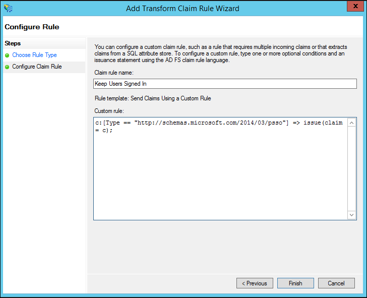

# Securing cloud resources with Microsoft Entra multifactor authentication and AD FS

If your organization is federated with Microsoft Entra ID, use Microsoft Entra multifactor authentication or Active Directory Federation Services (AD FS) to secure resources that are accessed by Microsoft Entra ID. Use the following procedures to secure Microsoft Entra resources with either Microsoft Entra multifactor authentication or Active Directory Federation Services.

>[!NOTE]
>Set the domain setting [federatedIdpMfaBehavior](/graph/api/resources/internaldomainfederation?view=graph-rest-beta&preserve-view=true#federatedidpmfabehavior-values) to `enforceMfaByFederatedIdp` (recommended) or **SupportsMFA** to `$True`. The **federatedIdpMfaBehavior** setting overrides **SupportsMFA** when both are set.

<a name='secure-azure-ad-resources-using-ad-fs'></a>

## Secure Microsoft Entra resources using AD FS

To secure your cloud resource, set up a claims rule so that Active Directory Federation Services emits the multipleauthn claim when a user performs two-step verification successfully. This claim is passed on to Microsoft Entra ID. Follow this procedure to walk through the steps:

1. Open AD FS Management.
2. On the left, select **Relying Party Trusts**.
3. Right-select on **Microsoft Office 365 Identity Platform** and select **Edit Claim Rules**.

   

4. On Issuance Transform Rules, select **Add Rule**.

   

5. On the Add Transform Claim Rule Wizard, select **Pass Through or Filter an Incoming Claim** from the drop-down and select **Next**.

   

6. Give your rule a name. 
7. Select **Authentication Methods References** as the Incoming claim type.
8. Select **Pass through all claim values**.

    

9. Select **Finish**. Close the AD FS Management console.

## Trusted IPs for federated users

Trusted IPs allow administrators to bypass two-step verification for specific IP addresses, or for federated users who have requests originating from within their own intranet. The following sections describe how to configure the bypass using Trusted IPs. This is achieved by configuring AD FS to use a pass-through or filter an incoming claim template with the Inside Corporate Network claim type.

This example uses Microsoft 365 for our Relying Party Trusts.

### Configure the AD FS claims rules

The first thing we need to do is to configure the AD FS claims. Create two claims rules, one for the Inside Corporate Network claim type and an additional one for keeping our users signed in.

1. Open AD FS Management.
2. On the left, select **Relying Party Trusts**.
3. Right-select on **Microsoft Office 365 Identity Platform** and select **Edit Claim Rules…**

   

4. On Issuance Transform Rules, select **Add Rule.**

   

5. On the Add Transform Claim Rule Wizard, select **Pass Through or Filter an Incoming Claim** from the drop-down and select **Next**.

   

6. In the box next to Claim rule name, give your rule a name. For example: InsideCorpNet.
7. From the drop-down, next to Incoming claim type, select **Inside Corporate Network**.

   

8. Select **Finish**.
9. On Issuance Transform Rules, select **Add Rule**.
10. On the Add Transform Claim Rule Wizard, select **Send Claims Using a Custom Rule** from the drop-down and select **Next**.
11. In the box under Claim rule name: enter *Keep Users Signed In*.
12. In the Custom rule box, enter:

    ```ad-fs-claim-rule
        c:[Type == "https://schemas.microsoft.com/2014/03/psso"]
            => issue(claim = c); 
    ```

    

13. Select **Finish**.
14. Select **Apply**.
15. Select **Ok**.
16. Close AD FS Management.

<a name='configure-azure-ad-multi-factor-authentication-trusted-ips-with-federated-users'></a>

### Configure Microsoft Entra multifactor authentication Trusted IPs with federated users


Now that the claims are in place, we can configure trusted IPs.

1. Sign in to the [Microsoft Entra admin center](https://entra.microsoft.com) as at least an [Authentication Policy Administrator](~/identity/role-based-access-control/permissions-reference.md#authentication-policy-administrator).
1. Browse to **Conditional Access** > **Named locations**.
3. From the **Conditional Access - Named locations** blade, select **Configure MFA trusted IPs**

   

4. On the Service Settings page, under **trusted IPs**, select **Skip multifactor-authentication for requests from federated users on my intranet**.  
5. Select **save**.

That's it! At this point, federated Microsoft 365 users should only have to use MFA when a claim originates from outside the corporate intranet.
