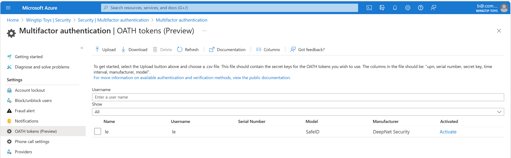

# Configure Microsoft Entra multifactor authentication settings

To customize the end-user experience for Microsoft Entra multifactor authentication (MFA), you can configure options for reporting suspicious activities. The following table describes Microsoft Entra MFA settings, and subsections cover each setting in more detail.

>[!NOTE]
>[Report suspicious activity](#report-suspicious-activity) replaces the Block/unblock users, Fraud alert, and Notifications legacy features. On March 1, 2025, the legacy features were removed. 

| Feature | Description |
| ------- | ----------- |
| [Report suspicious activity](#report-suspicious-activity) | Configure settings that allow users to report fraudulent verification requests. |
| [OATH tokens](concept-authentication-oath-tokens.md) | Used in cloud-based Microsoft Entra MFA environments to manage OATH tokens for users. |
| [Phone call settings](#phone-call-settings) | Configure settings related to phone calls and greetings for cloud and on-premises environments. |
| Providers | This will show any existing authentication providers that you've associated with your account. Adding new providers is disabled as of September 1, 2018. |

## Report suspicious activity

When an unknown and suspicious MFA prompt is received, users can report the activity by using Microsoft Authenticator or through their phone. **Report suspicious activity** is integrated with [Microsoft Entra ID Protection](~/id-protection/overview-identity-protection.md) for risk-driven remediation, reporting, and least-privileged administration. 

Users who report an MFA prompt as suspicious are set to **High User Risk**. Administrators can use risk-based policies to limit access for these users, or enable self-service password reset (SSPR) for users to remediate problems on their own. 

If you don't have a Microsoft Entra ID P2 license for risk-based policies, you can use risk detection events to either manually identify and disable impacted users, or set up automation by using custom workflows with Microsoft Graph. For more information about investigating and remediating user risk, see:

- [How to: Investigate risk](~/id-protection/howto-identity-protection-investigate-risk.md)
- [How to: Remediate risks and unblock users](~/id-protection/howto-identity-protection-remediate-unblock.md)

To enable **Report suspicious activity** from the Authentication methods policy **Settings**:   

1. Sign in to the [Microsoft Entra admin center](https://entra.microsoft.com) as at least an [Authentication Policy Administrator](~/identity/role-based-access-control/permissions-reference.md#authentication-policy-administrator).
1. Browse to **Entra ID** > **Authentication methods** > **Settings**. 
1. Set **Report suspicious activity** to **Enabled**. The feature remains disabled if you choose **Microsoft managed**. For more information about Microsoft managed values, see [Protecting authentication methods in Microsoft Entra ID](concept-authentication-default-enablement.md).
   :::image type="content" border="true" source="media/howto-mfa-mfasettings/report-suspicious-activity.png" alt-text="Screenshot of how to enable Report suspicious activity.":::
1. Select **All users** or a specific group. 
1. If you also upload custom greetings for your tenant, select a **Reporting code**. The reporting code is the number that users enter into their phone to report suspicious activity. The reporting code is only applicable if custom greetings are also uploaded by an [Authentication Policy Administrator](~/identity/role-based-access-control/permissions-reference.md#authentication-policy-administrator). Otherwise, the default code is 0, regardless of any value specified in the policy.
1. Click **Save**. 

### Remediating risk for tenants with Microsoft Entra ID P1 license

When a user reports an MFA prompt as suspicious, the event shows up in the sign-in logs (as a sign-in that was rejected by the user), in the Audit logs, and in the Risk detections report.   

| Report | Admin center | Details |
|--------------|--------|---------|
| Risk detections report | **ID Protection** > **Dashboard** > **Risk detection** | Detection type: **User Reported Suspicious Activity**<br>Risk level: **High**<br>Source **End user reported** |
| Sign-in logs | **Entra ID** > **Monitoring & health** > **Sign-in logs** > **Authentication details** | Result detail will show as **MFA denied** |
| Audit logs   | **Entra ID** > **Monitoring & health** > **Audit logs** | The suspicious activity appears under **Activity type** |

>[!NOTE]
>A user isn't reported as High Risk if they perform passwordless authentication.

You can also query for risk detections and users flagged as risky by using Microsoft Graph.

| API | Detail |
|-----|--------|
| [riskDetection resource type](/graph/api/resources/riskdetection) | riskEventType: `userReportedSuspiciousActivity` |
| [List riskyUsers](/graph/api/riskyuser-list) | riskLevel = **high** |

For manual remediation, administrators or helpdesk can ask the users to reset their password by using self-service password reset (SSPR), or do so on their behalf. For automated remediation, use the Microsoft Graph APIs, or use PowerShell to create a script that changes the user’s password, forces SSPR, revokes sign-in sessions, or temporarily disables the user account.

### Remediating risk for tenants with Microsoft Entra ID P2 license

Tenants with a Microsoft Entra ID P2 license can use risk-based Conditional Access policies to automatically remediate user risk, in addition to the options Microsoft Entra ID P2 license.

Configure a policy that looks at user risk under **Conditions** > **User risk**. Look for users where risk = high to either block them from sign in or require them to reset their password.

:::image type="content" border="true" source="media/howto-mfa-mfasettings/risk-based-conditional-access.png" alt-text="Screenshot of how to enable a risk-based Conditional Access policy.":::

For more information, see [Sign-in risk-based Conditional Access policy](~/id-protection/concept-identity-protection-policies.md#sign-in-risk-based-conditional-access-policy).

## OATH tokens

Microsoft Entra ID supports the use of OATH TOTP SHA-1 tokens that refresh codes every 30 or 60 seconds. You can purchase these tokens from the vendor of your choice.

OATH TOTP hardware tokens typically come with a secret key, or seed, pre-programmed in the token. You need to input these keys into Microsoft Entra ID as described in the following steps. Secret keys are limited to 128 characters, which might not be compatible with all tokens. The secret key can contain only the characters *a-z* or *A-Z* and digits *1-7*. It must be encoded in Base32.

Programmable OATH TOTP hardware tokens that can be reseeded can also be set up with Microsoft Entra ID in the software token setup flow.

OATH hardware tokens are supported as part of a public preview. For more information about previews, see [Supplemental Terms of Use for Microsoft Azure Previews](https://aka.ms/EntraPreviewsTermsOfUse).



After you acquire tokens, you need to upload them in a comma-separated values (CSV) file format. Include the UPN, serial number, secret key, time interval, manufacturer, and model, as shown in this example:

```csv
upn,serial number,secret key,time interval,manufacturer,model
Helga@contoso.com,1234567,1234567abcdef1234567abcdef,60,Contoso,HardwareKey
```

> [!NOTE]
> Be sure to include the header row in your CSV file.

1. Sign in to the [Microsoft Entra admin center](https://entra.microsoft.com) as a [Global Administrator](~/identity/role-based-access-control/permissions-reference.md#global-administrator).
1. Go to **Entra ID** > **Multifactor authentication** > **OATH tokens**, and upload the CSV file.

Depending on the size of the CSV file, it might take a few minutes to process. Select **Refresh** to get the status. If there are any errors in the file, you can download a CSV file that lists them. The field names in the downloaded CSV file are different from those in the uploaded version.

After any errors are addressed, the administrator can activate each key by selecting **Activate** for the token and entering the OTP displayed in the token.

Users can have a combination of up to five OATH hardware tokens or authenticator applications, such as the Microsoft Authenticator app, configured for use at any time. 

>[!IMPORTANT]
>Make sure to only assign each token to a single user.
>In the future, support for the assignment of a single token to multiple users will stop to prevent a security risk.

## Phone call settings

If users receive phone calls for MFA prompts, you can configure their experience, such as caller ID or the voice greeting they hear.

In the United States, if you haven't configured MFA caller ID, voice calls from Microsoft come from the following numbers. Users with spam filters should exclude these numbers.

Default numbers: *+1 (855) 330-8653*, *+1 (855) 336-2194*, *+1 (855) 341-5605*

The following table lists more numbers for different countries/regions.

| Country/Region       | Number(s)       |
|:---------------------|:----------------|
| Austria              | +43 6703062076  |
| Bangladesh           | +880 9604606026 |
| China                | +44 1235619418, +44 1235619536, +44 1235619537, +44 1235619538, +44 1235619539, +44 1235619535, +44 7897087681, +44 7897087690, +44 7897087692, +66 977832930, +861 052026902, +861 052026905, +861 052026907|
| Croatia              | +385 15507766   |
| Ecuador              | +593 964256042  |
| Estonia              | +372 6712726    |
| France               | +33 744081468   |
| Ghana                | +233 308250245  |
| Greece               | +30 2119902739  |
| Guatemala            | +502 23055056   |
| Hong Kong SAR        | +852 25716964   |
| India                | +91 3371568300, +91 1205089400, +91 4471566601, +91 2271897557, +91 1203524400, +91 3335105700, +91 2235544120, +91 4435279600|
| Jordan               | +962 797639442  |
| Kenya                | +254 709605276  |
| Netherlands          | +31 202490048   |
| Nigeria              | +234 7080627886 |
| Pakistan             | +92 4232618686, +44 7897087681, +44 7897087690, +44 7897087692, +66 977832930  |
| Poland               | +48 699740036   |
| Saudi Arabia         | +966 115122726  |
| South Africa         | +27 872405062   |
| Spain                | +34 913305144   |
| Sri Lanka            | +94 117750440   |
| Sweden               | +46 701924176   |
| Taiwan               | +886 277515260, +886 255686508  |
| Türkiye              | +90 8505404893  |
| Ukraine              | +380 443332393  |
| United Arab Emirates | +971 44015046   |
| Vietnam              | +84 2039990161  |

> [!NOTE]
> When Microsoft Entra multifactor authentication calls are placed through the public telephone network, sometimes the calls are routed through a carrier that doesn't support caller ID. Because of this, caller ID isn't guaranteed, even though Microsoft Entra multifactor authentication always sends it. This applies both to phone calls and text messages provided by Microsoft Entra multifactor authentication. If you need to validate that a text message is from Microsoft Entra multifactor authentication, see [What short codes are used for sending messages?](multi-factor-authentication-faq.yml#what-short-codes-are-used-for-sending-text-messages-to-my-users-).

To configure your own caller ID number, complete the following steps:

1. Go to **Entra ID** > **Multifactor authentication** > **Phone call settings**.
1. Set the **MFA caller ID number** to the number you want users to see on their phones. Only US-based numbers are allowed.
1. Select **Save**.

> [!NOTE]
> When Microsoft Entra multifactor authentication calls are placed through the public telephone network, sometimes the calls are routed through a carrier that doesn't support caller ID. Because of this, caller ID isn't guaranteed, even though Microsoft Entra multifactor authentication always sends it. This applies both to phone calls and text messages provided by Microsoft Entra multifactor authentication. If you need to validate that a text message is from Microsoft Entra multifactor authentication, see [What short codes are used for sending messages?](multi-factor-authentication-faq.yml#what-short-codes-are-used-for-sending-text-messages-to-my-users-).

### Custom voice messages

You can use your own recordings or greetings for Microsoft Entra multifactor authentication. These messages can be used in addition to the default Microsoft recordings or to replace them.

Before you begin, be aware of the following restrictions:

* The supported file formats are .wav and .mp3.
* The file size limit is 1 MB.
* Authentication messages should be shorter than 20 seconds. Messages that are longer than 20 seconds can cause the verification to fail. If the user doesn't respond before the message finishes, the verification times out.

### Custom message language behavior

When a custom voice message is played to the user, the language of the message depends on the following factors:

* The language of the user.
  * The language detected by the user's browser.
  * Other authentication scenarios might behave differently.
* The language of any available custom messages.
  * This language is chosen by the administrator when a custom message is added.

For example, if there's only one custom message, and it's in German:

* A user who authenticates in the German language will hear the custom German message.
* A user who authenticates in English will hear the standard English message.

### Custom voice message defaults

You can use the following sample scripts to create your own custom messages. These phrases are used by default if you don't configure your own custom messages.

Message name | Script
-------------|--------
OTP extension prompt | This is Microsoft. If you are trying to sign in, press the # key to continue. 
OTP fraud greeting | This is Microsoft. If you are trying to sign in, press the # key to continue. If you are not trying to sign in, press 0 and #.
OTP fraud confirm | If this was not you trying to sign in, protect your account by notifying your IT team by pressing 1.
OTP fraud confirmed | We have notified your IT team, no further action is required. For help, please contact your company's IT team. Goodbye.
OTP goodbye | Goodbye.
OTP greeting | This is Microsoft. If you are trying to sign in, press the # key to continue.
OTP last verification code | Again, your code is
Greeting | This is Microsoft. If you are trying to sign in, press the # key to finish signing in.
Fraud greeting | This is Microsoft. If you are trying to sign in, press the # key to finish signing in. If you are not trying to sign in, press 0 and #.
Fraud confirm | If this was not you trying to sign in, protect your account by notifying your IT team by pressing 1.
Fraud confirmed | We have notified your IT team, no further action is required. For help, please contact your company's IT team. Goodbye.
Extension prompt | This is Microsoft. If you are trying to sign in, press the # key to continue.
Authentication successful | Your sign-in was successful.
Authentication failed | I'm sorry we can't sign you in at this time. Please try again later.

### Set up a custom message

To use your own custom messages, complete the following steps:

1. Go to **Entra ID** > **Multifactor authentication** > **Phone call settings**.
1. Select **Add greeting**.
1. Choose the **Type** of greeting, such as **Greeting (standard)** or  **Authentication successful**.
1. Select the **Language**. See the previous section on [custom message language behavior](#custom-message-language-behavior).
1. Browse for and select an .mp3 or .wav sound file to upload.
1. Select **Add** and then **Save**.

## MFA service settings

Settings for app passwords, trusted IPs, verification options, and remembering multifactor authentication on trusted devices are available in the service settings. This is a legacy portal.

You can access service settings from the [Microsoft Entra admin center](https://entra.microsoft.com) by going to **Entra ID** > **Multifactor authentication** > **Getting started** > **Configure** > **Additional cloud-based MFA settings**. A window or tab opens with additional service settings options.

### Trusted IPs

Location conditions are the recommended way to configure MFA with Conditional Access because of IPv6 support and other improvements. For more information about location conditions, see [Using the location condition in a Conditional Access policy](/entra/identity/conditional-access/location-condition#location-condition-in-policy). For steps to define locations and create a Conditional Access policy, see [Conditional Access: Block access by location](/entra/identity/conditional-access/policy-block-by-location).

The trusted IPs feature of Microsoft Entra multifactor authentication also bypasses MFA prompts for users who sign in from a defined IP address range. You can set trusted IP ranges for your on-premises environments. When users are in one of these locations, there's no Microsoft Entra multifactor authentication prompt. The trusted IPs feature requires Microsoft Entra ID P1 edition. 

> [!NOTE]
> The trusted IPs can include private IP ranges only when you use MFA Server. For cloud-based Microsoft Entra multifactor authentication, you can use only public IP address ranges.
>
> IPv6 ranges are supported in [named locations](../conditional-access/concept-assignment-network.md#ipv4-and-ipv6-address-ranges).

If your organization uses the NPS extension to provide MFA to on-premises applications, the source IP address will always appear to be the NPS server that the authentication attempt flows through.

| Microsoft Entra tenant type | Trusted IP feature options |
|:--- |:--- |
| Managed |**Specific range of IP addresses**: Administrators specify a range of IP addresses that can bypass multifactor authentications for users who sign in from the company intranet. A maximum of 50 trusted IP ranges can be configured.|
| Federated |**All Federated Users**: All federated users who sign in from inside the organization can bypass multifactor authentications. Users bypass verifications by using a claim that's issued by Active Directory Federation Services (AD FS).<br/>**Specific range of IP addresses**: Administrators specify a range of IP addresses that can bypass multifactor authentication for users who sign in from the company intranet. |

Trusted IP bypass works only from inside the company intranet. If you select the **All Federated Users** option and a user signs in from outside the company intranet, the user has to authenticate by using multifactor authentication. The process is the same even if the user presents an AD FS claim.

>[!NOTE]
>If both per-user MFA and Conditional Access policies are configured in the tenant, you need to add trusted IPs to the Conditional Access policy and update the MFA service settings.

#### User experience inside the corporate network

When the trusted IPs feature is disabled, multifactor authentication is required for browser flows. App passwords are required for older rich-client applications.

When trusted IPs are used, multifactor authentication isn't required for browser flows. App passwords aren't required for older rich-client applications if the user hasn't created an app password. After an app password is in use, the password is required.

#### User experience outside the corporate network

Regardless of whether trusted IPs are defined, multifactor authentication is required for browser flows. App passwords are required for older rich-client applications.

#### Enable named locations by using Conditional Access

You can use Conditional Access rules to define named locations by using the following steps:

1. Sign in to the [Microsoft Entra admin center](https://entra.microsoft.com) as at least a [Conditional Access Administrator](~/identity/role-based-access-control/permissions-reference.md#conditional-access-administrator).
1. Browse to **Entra ID** > **Conditional Access** > **Named locations**.
1. Select **New location**.
1. Enter a name for the location.
1. Select **Mark as trusted location**.
1. Enter the IP range for your environment in CIDR notation. For example, *40.77.182.32/27*.
1. Select **Create**.

#### Enable the trusted IPs feature by using Conditional Access

To enable trusted IPs by using Conditional Access policies, complete the following steps:

1. Sign in to the [Microsoft Entra admin center](https://entra.microsoft.com) as at least a [Conditional Access Administrator](~/identity/role-based-access-control/permissions-reference.md#conditional-access-administrator).
1. Browse to **Entra ID** > **Conditional Access** > **Named locations**.
1. Select **Configure multifactor authentication trusted IPs**.
1. On the **Service Settings** page, under **Trusted IPs**, choose one of these options:

   * **For requests from federated users originating from my intranet**: To choose this option, select the checkbox. All federated users who sign in from the corporate network bypass multifactor authentications by using a claim that's issued by AD FS. Ensure that AD FS has a rule to add the intranet claim to the appropriate traffic. If the rule doesn't exist, create the following rule in AD FS:

      `c:[Type== "https://schemas.microsoft.com/ws/2012/01/insidecorporatenetwork"] => issue(claim = c);`

     >[!NOTE]
     >The **Skip multifactor authentication for requests from federated users on my intranet** option will affect the Conditional Access evaluation for locations. Any request with the **insidecorporatenetwork** claim would be treated as coming from a Trusted location if that option is selected.

   * **For requests from a specific range of public IPs**: To choose this option, enter the IP addresses in the text box, in CIDR notation.
      * For IP addresses that are in the range *xxx.xxx.xxx*.1 through *xxx.xxx.xxx*.254, use notation like ***xxx.xxx.xxx*.0/24**.
      * For a single IP address, use notation like ***xxx.xxx.xxx.xxx*/32**.
      * Enter up to 50 IP address ranges. Users who sign in from these IP addresses bypass multifactor authentications.

1. Select **Save**.

#### Enable the trusted IPs feature by using service settings

If you don't want to use Conditional Access policies to enable trusted IPs, you can configure the service settings for Microsoft Entra multifactor authentication by using the following steps:

1. Sign in to the [Microsoft Entra admin center](https://entra.microsoft.com) as at least an [Authentication Policy Administrator](~/identity/role-based-access-control/permissions-reference.md#authentication-policy-administrator).
1. Browse to **Entra ID** > **Multifactor authentication** > **Additional cloud-based MFA settings**. 
1. On the **Service settings** page, under **Trusted IPs**, choose one or both of the following options:

   * **For requests from federated users on my intranet**: To choose this option, select the checkbox. All federated users who sign in from the corporate network bypass multifactor authentication by using a claim that's issued by AD FS. Ensure that AD FS has a rule to add the intranet claim to the appropriate traffic. If the rule doesn't exist, create the following rule in AD FS:

      `c:[Type== "https://schemas.microsoft.com/ws/2012/01/insidecorporatenetwork"] => issue(claim = c);` 

   * **For requests from a specified range of IP address subnets**: To choose this option, enter the IP addresses in the text box, in CIDR notation.
      * For IP addresses that are in the range *xxx.xxx.xxx*.1 through *xxx.xxx.xxx*.254, use notation like ***xxx.xxx.xxx*.0/24**.
      * For a single IP address, use notation like ***xxx.xxx.xxx.xxx*/32**.
      * Enter up to 50 IP address ranges. Users who sign in from these IP addresses bypass multifactor authentications.

1. Select **Save**.

### Verification methods

You can choose the verification methods that are available for your users in the service settings portal. When your users enroll their accounts for Microsoft Entra multifactor authentication, they choose their preferred verification method from the options that you've enabled. Guidance for the user enrollment process is provided in [Set up my account for multifactor authentication](https://support.microsoft.com/account-billing/how-to-use-the-microsoft-authenticator-app-9783c865-0308-42fb-a519-8cf666fe0acc).

>[!IMPORTANT]
>In March 2023, we announced the deprecation of managing authentication methods in the legacy multifactor authentication and self-service password reset (SSPR) policies. Beginning September 30, 2025, authentication methods can't be managed in these legacy MFA and SSPR policies. We recommend customers use the manual migration control to migrate to the Authentication methods policy by the deprecation date. For help with the migration control, see [How to migrate MFA and SSPR policy settings to the Authentication methods policy for Microsoft Entra ID](/entra/identity/authentication/how-to-authentication-methods-manage).

The following verification methods are available:

| Method | Description |
|:--- |:--- |
| Call to phone |Places an automated voice call. The user answers the call and presses # on the phone to authenticate. The phone number isn't synchronized to on-premises Active Directory. |
| Text message to phone |Sends a text message that contains a verification code. The user is prompted to enter the verification code into the sign-in interface. This process is called one-way SMS. Two-way SMS means that the user must text back a particular code. Two-way SMS is deprecated and not supported after November 14, 2018. Administrators should enable another method for users who previously used two-way SMS.|
| Notification through mobile app |Sends a push notification to the user's phone or registered device. The user views the notification and selects **Verify** to complete verification. The Microsoft Authenticator app is available for [Windows Phone](https://www.microsoft.com/p/microsoft-authenticator/9nblgggzmcj6), [Android](https://go.microsoft.com/fwlink/?Linkid=825072), and [iOS](https://go.microsoft.com/fwlink/?Linkid=825073). |
| Verification code from mobile app or hardware token |The Microsoft Authenticator app generates a new OATH verification code every 30 seconds. The user enters the verification code into the sign-in interface. The Microsoft Authenticator app is available for [Windows Phone](https://www.microsoft.com/p/microsoft-authenticator/9nblgggzmcj6), [Android](https://go.microsoft.com/fwlink/?Linkid=825072), and [iOS](https://go.microsoft.com/fwlink/?Linkid=825073). |

For more information, see [What authentication and verification methods are available in Microsoft Entra ID?](concept-authentication-methods.md).

#### Enable and disable verification methods

To enable or disable verification methods, complete the following steps:

1. Sign in to the [Microsoft Entra admin center](https://entra.microsoft.com) as at least an [Authentication Policy Administrator](~/identity/role-based-access-control/permissions-reference.md#authentication-policy-administrator).
1. Browse to **Entra ID** > **Users**.
1. Select **Per-user MFA**.
1. Under **Multifactor authentication** at the top of the page, select **Service settings**.
1. On the **Service settings** page, under **Verification options**, select or clear the appropriate checkboxes.
1. Select **Save**.

<a name='remember-multi-factor-authentication'></a>

### Remember multifactor authentication

 The **remember multifactor authentication** feature lets users bypass subsequent verifications for a specified number of days, after they've successfully signed in to a device by using MFA. To enhance usability and minimize the number of times a user has to perform MFA on a given device, select a duration of 90 days or less.

> [!IMPORTANT]
> If an account or device is compromised, remembering MFA for trusted devices can affect security. If a corporate account becomes compromised or a trusted device is lost or stolen, you should [Revoke MFA Sessions](howto-mfa-userdevicesettings.yml).
>
> The revoke action revokes the trusted status from all devices, and the user is required to perform multifactor authentication again. You can also instruct your users to restore the original MFA status on their own devices as noted in [Manage your settings for multifactor authentication](https://support.microsoft.com/account-billing/change-your-two-step-verification-method-and-settings-c801d5ad-e0fc-4711-94d5-33ad5d4630f7#turn-on-two-factor-verification-prompts-on-a-trusted-device).

#### How the feature works

The **remember multifactor authentication** feature sets a persistent cookie on the browser when a user selects the **Don't ask again for *X* days** option at sign-in. The user isn't prompted again for MFA from that browser until the cookie expires. If the user opens a different browser on the same device or clears the cookies, they're prompted again to verify.

The **Don't ask again for *X* days** option isn't shown on non-browser applications, regardless of whether the app supports modern authentication. These apps use *refresh tokens* that provide new access tokens every hour. When a refresh token is validated, Microsoft Entra ID checks that the last multifactor authentication occurred within the specified number of days.

The feature reduces the number of authentications on web apps, which normally prompt every time. The feature can increase the number of authentications for modern authentication clients that normally prompt every 180 days, if a lower duration is configured. It might also increase the number of authentications when combined with Conditional Access policies.

> [!IMPORTANT]
> The **remember multifactor authentication** feature isn't compatible with the **keep me signed in** feature of AD FS, when users perform multifactor authentication for AD FS through MFA Server or a third-party multifactor authentication solution.
>
> If your users select **keep me signed in** on AD FS and also mark their device as trusted for MFA, the user isn't automatically verified after the **remember multifactor authentication** number of days expires. Microsoft Entra ID requests a fresh multifactor authentication, but AD FS returns a token with the original MFA claim and date, rather than performing multifactor authentication again. *This reaction sets off a verification loop between Microsoft Entra ID and AD FS.*
>
> The **remember multifactor authentication** feature isn't compatible with B2B users and won't be visible for B2B users when they sign in to the invited tenants.
>
> The **remember multifactor authentication** feature isn't compatible with the Sign-in frequency Conditional Access control. For more information, see [Configure authentication session management with Conditional Access](~/identity/conditional-access/concept-session-lifetime.md#configuring-authentication-session-controls).

<a name='enable-remember-multifactor-authentication'></a>

#### Enable remember multifactor authentication

To enable and configure the option to allow users to remember their MFA status and bypass prompts, complete the following steps:

1. Sign in to the [Microsoft Entra admin center](https://entra.microsoft.com) as at least an [Authentication Policy Administrator](~/identity/role-based-access-control/permissions-reference.md#authentication-policy-administrator).
1. Browse to **Entra ID** > **Users**.
1. Select **Per-user MFA**.
1. Under **Multifactor authentication** at the top of the page, select **service settings**.
1. On the **service settings** page, under **remember multifactor authentication**, select **Allow users to remember multifactor authentication on devices they trust**.
1. Set the number of days to allow trusted devices to bypass multifactor authentications. For the optimal user experience, extend the duration to 90 or more days.
1. Select **Save**.

#### Mark a device as trusted

After you enable the **remember multifactor authentication** feature, users can mark a device as trusted when they sign in by selecting **Don't ask again**.

## Next steps

To learn more, see [What authentication and verification methods are available in Microsoft Entra ID?](concept-authentication-methods.md)
