# Integrate your Remote Desktop Gateway infrastructure using the Network Policy Server (NPS) extension and Microsoft Entra ID

This article provides details for integrating your Remote Desktop Gateway infrastructure with Microsoft Entra multifactor authentication using the Network Policy Server (NPS) extension for Microsoft Azure.

The Network Policy Server (NPS) extension for Azure allows customers to safeguard Remote Authentication Dial-In User Service (RADIUS) client authentication using Azure's cloud-based [multifactor authentication](./concept-mfa-howitworks.md). This solution provides two-step verification for adding a second layer of security to user sign-ins and transactions.

This article provides step-by-step instructions for integrating the NPS infrastructure with Microsoft Entra multifactor authentication using the NPS extension for Azure. This enables secure verification for users attempting to sign in to a Remote Desktop Gateway.

> [!NOTE]
> This article should not be used with MFA Server deployments and should only be used with Microsoft Entra multifactor authentication (Cloud-based) deployments.

The Network Policy and Access Services (NPS) gives organizations the ability to do the following:

* Define central locations for the management and control of network requests by specifying who can connect, what times of day connections are allowed, the duration of connections, and the level of security that clients must use to connect, and so on. Rather than specifying these policies on each VPN or Remote Desktop (RD) Gateway server, these policies can be specified once in a central location. The RADIUS protocol provides the centralized Authentication, Authorization, and Accounting (AAA).
* Establish and enforce Network Access Protection (NAP) client health policies that determine whether devices are granted unrestricted or restricted access to network resources.
* Provide a means to enforce authentication and authorization for access to 802.1x-capable wireless access points and Ethernet switches.

Typically, organizations use NPS (RADIUS) to simplify and centralize the management of VPN policies. However, many organizations also use NPS to simplify and centralize the management of RD Desktop Connection Authorization Policies (RD CAPs).

Organizations can also integrate NPS with Microsoft Entra multifactor authentication to enhance security and provide a high level of compliance. This helps ensure that users establish two-step verification to sign in to the Remote Desktop Gateway. For users to be granted access, they must provide their username/password combination along with information that the user has in their control. This information must be trusted and not easily duplicated, such as a cell phone number, landline number, application on a mobile device, and so on. RDG currently supports phone call and **Approve**/**Deny** push notifications from Microsoft authenticator app methods for 2FA. For more information about supported authentication methods see the section [Determine which authentication methods your users can use](howto-mfa-nps-extension.md#determine-which-authentication-methods-your-users-can-use).

If your organization uses Remote Desktop Gateway and the user is registered for a TOTP code along with Authenticator push notifications, the user can't meet the MFA challenge and the Remote Desktop Gateway sign-in fails. In that case, you can set OVERRIDE_NUMBER_MATCHING_WITH_OTP = FALSE to fallback to push notifications to Approve/Deny with Authenticator.

In order for an NPS extension to continue working for Remote Desktop Gateway users, this registry key must be created on the NPS server. On the NPS server, open the registry editor. Navigate to:

HKEY_LOCAL_MACHINE\SOFTWARE\Microsoft\AzureMfa

Create the following String/Value pair:

Name: OVERRIDE_NUMBER_MATCHING_WITH_OTP

Value = FALSE

Prior to the availability of the NPS extension for Azure, customers who wished to implement two-step verification for integrated NPS and Microsoft Entra multifactor authentication environments had to configure and maintain a separate MFA Server in the on-premises environment as documented in [Remote Desktop Gateway and Azure Multi-Factor Authentication Server using RADIUS](howto-mfaserver-nps-rdg.md).

The availability of the NPS extension for Azure now gives organizations the choice to deploy either an on-premises based MFA solution or a cloud-based MFA solution to secure RADIUS client authentication.

## Authentication Flow

For users to be granted access to network resources through a Remote Desktop Gateway, they must meet the conditions specified in one RD Connection Authorization Policy (RD CAP) and one RD Resource Authorization Policy (RD RAP). RD CAPs specify who is authorized to connect to RD Gateways. RD RAPs specify the network resources, such as remote desktops or remote apps, that the user is allowed to connect to through the RD Gateway.

An RD Gateway can be configured to use a central policy store for RD CAPs. RD RAPs cannot use a central policy, as they are processed on the RD Gateway. An example of an RD Gateway configured to use a central policy store for RD CAPs is a RADIUS client to another NPS server that serves as the central policy store.

When the NPS extension for Azure is integrated with the NPS and Remote Desktop Gateway, the successful authentication flow is as follows:

1. The Remote Desktop Gateway server receives an authentication request from a remote desktop user to connect to a resource, such as a Remote Desktop session. Acting as a RADIUS client, the Remote Desktop Gateway server converts the request to a RADIUS Access-Request message and sends the message to the RADIUS (NPS) server where the NPS extension is installed.
1. The username and password combination is verified in Active Directory and the user is authenticated.
1. If all the conditions as specified in the NPS Connection Request and the Network Policies are met (for example, time of day or group membership restrictions), the NPS extension triggers a request for secondary authentication with Microsoft Entra multifactor authentication.
1. Microsoft Entra multifactor authentication communicates with Microsoft Entra ID, retrieves the user's details, and performs the secondary authentication using supported methods.
1. Upon success of the MFA challenge, Microsoft Entra multifactor authentication communicates the result to the NPS extension.
1. The NPS server, where the extension is installed, sends a RADIUS Access-Accept message for the RD CAP policy to the Remote Desktop Gateway server.
1. The user is granted access to the requested network resource through the RD Gateway.

## Prerequisites

This section details the prerequisites necessary before integrating Microsoft Entra multifactor authentication with the Remote Desktop Gateway. Before you begin, you must have the following prerequisites in place.  

* Remote Desktop Services (RDS) infrastructure
* Microsoft Entra multifactor authentication License
* Windows Server software
* Network Policy and Access Services (NPS) role
* Microsoft Entra synched with on-premises Active Directory
* Microsoft Entra GUID ID

### Remote Desktop Services (RDS) infrastructure

You must have a working Remote Desktop Services (RDS) infrastructure in place. If you do not, then you can quickly create this infrastructure in Azure using the following quickstart template: [Create Remote Desktop Session Collection deployment](https://github.com/Azure/azure-quickstart-templates/tree/ad20c78b36d8e1246f96bb0e7a8741db481f957f/rds-deployment).

If you wish to manually create an on-premises RDS infrastructure quickly for testing purposes, follow the steps to deploy one.
**Learn more**: [Deploy RDS with Azure quickstart](/windows-server/remote/remote-desktop-services/rds-in-azure) and [Basic RDS infrastructure deployment](/windows-server/remote/remote-desktop-services/rds-deploy-infrastructure).

### Windows Server software

The NPS extension requires Windows Server 2008 R2 SP1 or above with the NPS role service installed. All the steps in this section were performed using Windows Server 2016.

### Network Policy and Access Services (NPS) role

The NPS role service provides the RADIUS server and client functionality as well as Network Access Policy health service. This role must be installed on at least two computers in your infrastructure: The Remote Desktop Gateway and another member server or domain controller. By default, the role is already present on the computer configured as the Remote Desktop Gateway.  You must also install the NPS role on at least on another computer, such as a domain controller or member server.

For information on installing the NPS role service Windows Server 2012 or older, see [Install a NAP Health Policy Server](/previous-versions/windows/it-pro/windows-server-2008-R2-and-2008/dd296890(v=ws.10)). For a description of best practices for NPS, including the recommendation to install NPS on a domain controller, see [Best Practices for NPS](/previous-versions/windows/it-pro/windows-server-2008-R2-and-2008/cc771746(v=ws.10)).

### Microsoft Entra synched with on-premises Active Directory

To use the NPS extension, on-premises users must be synced with Microsoft Entra ID and enabled for MFA. This section assumes that on-premises users are synched with Microsoft Entra ID using AD Connect. For information on Microsoft Entra Connect, see [Integrate your on-premises directories with Microsoft Entra ID](~/identity/hybrid/whatis-hybrid-identity.md).

### Microsoft Entra GUID ID

To install NPS extension, you need to know the GUID of the Microsoft Entra ID. Instructions for finding the GUID of the Microsoft Entra ID are provided below.

## Configure multifactor authentication

This section provides instructions for integrating Microsoft Entra multifactor authentication with the Remote Desktop Gateway. As an administrator, you must configure the Microsoft Entra multifactor authentication service before users can self-register their multifactor devices or applications.

Follow the steps in [Getting started with Microsoft Entra multifactor authentication in the cloud](howto-mfa-getstarted.md) to enable MFA for your Microsoft Entra users.

### Configure accounts for two-step verification

Once an account has been enabled for MFA, you cannot sign in to resources governed by the MFA policy until you have successfully configured a trusted device to use for the second authentication factor and have authenticated using two-step verification.

Follow the steps in [What does Microsoft Entra multifactor authentication mean for me?](https://support.microsoft.com/account-billing/how-to-use-the-microsoft-authenticator-app-9783c865-0308-42fb-a519-8cf666fe0acc) to understand and properly configure your devices for MFA with your user account.

> [!IMPORTANT]
> The sign-in behavior for Remote Desktop Gateway doesn't provide the option to enter a verification code with Microsoft Entra multifactor authentication. A user account must be configured for phone verification or the Microsoft Authenticator App with **Approve**/**Deny** push notifications.
>
> If neither phone verification or the Microsoft Authenticator App with **Approve**/**Deny** push notifications is configured for a user, the user won't be able to complete the Microsoft Entra multifactor authentication challenge and sign in to Remote Desktop Gateway.
>
> The SMS text method doesn't work with Remote Desktop Gateway because it doesn't provide the option to enter a verification code.

## Install and configure NPS extension

This section provides instructions for configuring RDS infrastructure to use Microsoft Entra multifactor authentication for client authentication with the Remote Desktop Gateway.

### Obtain the directory tenant ID

[!INCLUDE [portal updates](~/includes/portal-update.md)]

As part of the configuration of the NPS extension, you must supply administrator credentials and the ID of your Microsoft Entra tenant. To get the tenant ID, complete the following steps:

1. Sign in to the [Microsoft Entra admin center](https://entra.microsoft.com) as at least an [Global Administrator](~/identity/role-based-access-control/permissions-reference.md#global-administrator).
1. Browse to **Identity** > **Overview**.

   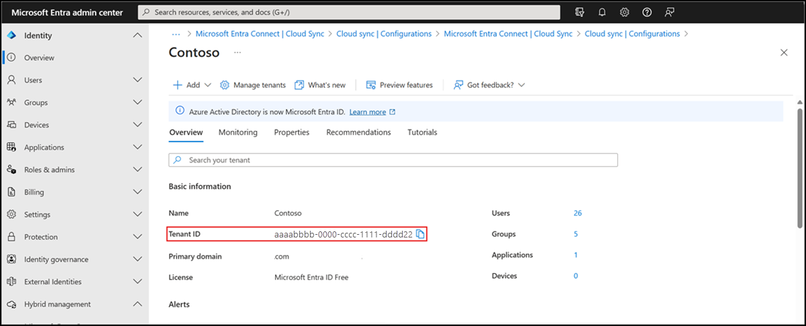

### Install the NPS extension

Install the NPS extension on a server that has the Network Policy and Access Services (NPS) role installed. This functions as the RADIUS server for your design.

> [!IMPORTANT]
> Don't install the NPS extension on your Remote Desktop Gateway (RDG) server. The RDG server doesn't use the RADIUS protocol with its client, so the extension can't interpret and perform the MFA.
>
> When the RDG server and NPS server with NPS extension are different servers, RDG uses NPS internally to talk to other NPS servers and uses RADIUS as the protocol to correctly communicate.

1. Download the [NPS extension](https://aka.ms/npsmfa).
1. Copy the setup executable file (NpsExtnForAzureMfaInstaller.exe) to the NPS server.
1. On the NPS server, double-click **NpsExtnForAzureMfaInstaller.exe**. If prompted, click **Run**.
1. In the NPS Extension For Microsoft Entra multifactor authentication Setup dialog box, review the software license terms, check **I agree to the license terms and conditions**, and click **Install**.
1. In the NPS Extension For Microsoft Entra multifactor authentication Setup dialog box, click **Close**.

### Configure certificates for use with the NPS extension using a PowerShell script

Next, you need to configure certificates for use by the NPS extension to ensure secure communications and assurance. The NPS components include a PowerShell script that configures a self-signed certificate for use with NPS.

The script performs the following actions:

* Creates a self-signed certificate
* Associates public key of certificate to service principal on Microsoft Entra ID
* Stores the cert in the local machine store
* Grants access to the certificate's private key to the network user
* Restarts Network Policy Server service

If you want to use your own certificates, you need to associate the public key of your certificate to the service principal on Microsoft Entra ID, and so on.

To use the script, provide the extension with your Microsoft Entra Admin credentials and the Microsoft Entra tenant ID that you copied earlier. Run the script on each NPS server where you installed the NPS extension. Then do the following:

1. Open an administrative Windows PowerShell prompt.
1. At the PowerShell prompt, type `cd 'c:\Program Files\Microsoft\AzureMfa\Config'`, and press **ENTER**.
1. Type `.\AzureMfaNpsExtnConfigSetup.ps1`, and press **ENTER**. The script checks to see if the PowerShell module is installed. If not installed, the script installs the module for you.

   
  
1. After the script verifies the installation of the PowerShell module, it displays the PowerShell module dialog box. In the dialog box, enter your Microsoft Entra admin credentials and password, and click **Sign In**.

1. When prompted, paste the *Tenant ID* you copied to the clipboard earlier, and press **ENTER**.

   

1. The script creates a self-signed certificate and performs other configuration changes. The output should be like the image shown below.

   

## Configure NPS components on Remote Desktop Gateway

In this section, you configure the Remote Desktop Gateway connection authorization policies and other RADIUS settings.

The authentication flow requires that RADIUS messages be exchanged between the Remote Desktop Gateway and the NPS server where the NPS extension is installed. This means that you must configure RADIUS client settings on both Remote Desktop Gateway and the NPS server where the NPS extension is installed.

### Configure Remote Desktop Gateway connection authorization policies to use central store

Remote Desktop connection authorization policies (RD CAPs) specify the requirements for connecting to a Remote Desktop Gateway server. RD CAPs can be stored locally (default) or they can be stored in a central RD CAP store that is running NPS. To configure integration of Microsoft Entra multifactor authentication with RDS, you need to specify the use of a central store.

1. On the RD Gateway server, open **Server Manager**.
1. On the menu, click **Tools**, point to **Remote Desktop Services**, and then click **Remote Desktop Gateway Manager**.
1. In the RD Gateway Manager, right-click **\[Server Name\] (Local)**, and click **Properties**.
1. In the Properties dialog box, select the **RD CAP Store** tab.
1. On the RD CAP Store tab, select **Central server running NPS**. 
1. In the **Enter a name or IP address for the server running NPS** field, type the IP address or server name of the server where you installed the NPS extension.

   
  
1. Click **Add**.
1. In the **Shared Secret** dialog box, enter a shared secret, and then click **OK**. Ensure you record this shared secret and store the record securely.

   >[!NOTE]
   >Shared secret is used to establish trust between the RADIUS servers and clients. Create a long and complex secret.
   >

   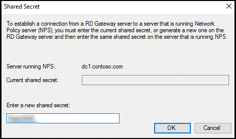

1. Click **OK** to close the dialog box.

### Configure RADIUS timeout value on Remote Desktop Gateway NPS

To ensure there is time to validate users' credentials, perform two-step verification, receive responses, and respond to RADIUS messages, it is necessary to adjust the RADIUS timeout value.

1. On the RD Gateway server, open Server Manager. On the menu, click **Tools**, and then click **Network Policy Server**.
1. In the **NPS (Local)** console, expand **RADIUS Clients and Servers**, and select **Remote RADIUS Server**.

   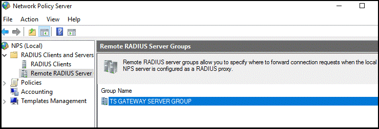

1. In the details pane, double-click **TS GATEWAY SERVER GROUP**.

   >[!NOTE]
   >This RADIUS Server Group was created when you configured the central server for NPS policies. The RD Gateway forwards RADIUS messages to this server or group of servers, if more than one in the group.
   >

1. In the **TS GATEWAY SERVER GROUP Properties** dialog box, select the IP address or name of the NPS server you configured to store RD CAPs, and then click **Edit**.

   

1. In the **Edit RADIUS Server** dialog box, select the **Load Balancing** tab.
1. In the **Load Balancing** tab, in the **Number of seconds without response before request is considered dropped** field, change the default value from 3 to a value between 30 and 60 seconds.
1. In the **Number of seconds between requests when server is identified as unavailable** field, change the default value of 30 seconds to a value that is equal to or greater than the value you specified in the previous step.

   

1. Click **OK** two times to close the dialog boxes.

### Verify Connection Request Policies

By default, when you configure the RD Gateway to use a central policy store for connection authorization policies, the RD Gateway is configured to forward CAP requests to the NPS server. The NPS server with the Microsoft Entra multifactor authentication extension installed, processes the RADIUS access request. The following steps show you how to verify the default connection request policy.  

1. On the RD Gateway, in the NPS (Local) console, expand **Policies**, and select **Connection Request Policies**.
1. Double-click **TS GATEWAY AUTHORIZATION POLICY**.
1. In the **TS GATEWAY AUTHORIZATION POLICY properties** dialog box, click the **Settings** tab.
1. On **Settings** tab, under Forwarding Connection Request, click **Authentication**. RADIUS client is configured to forward requests for authentication.

   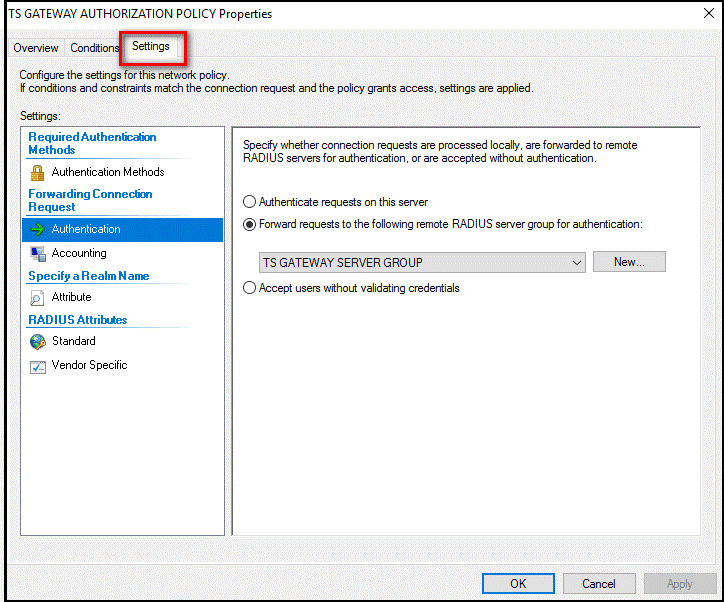

1. Click **Cancel**.

>[!NOTE]
> For more information about creating a connection request policy see the article, [Configure connection request policies](/windows-server/networking/technologies/nps/nps-crp-configure#add-a-connection-request-policy) documentation for the same. 

## Configure NPS on the server where the NPS extension is installed

The NPS server where the NPS extension is installed needs to be able to exchange RADIUS messages with the NPS server on the Remote Desktop Gateway. To enable this message exchange, you need to configure the NPS components on the server where the NPS extension service is installed.

### Register Server in Active Directory

To function properly in this scenario, the NPS server needs to be registered in Active Directory.

1. On the NPS server, open **Server Manager**.
1. In Server Manager, click **Tools**, and then click **Network Policy Server**.
1. In the Network Policy Server console, right-click **NPS (Local)**, and then click **Register server in Active Directory**.
1. Click **OK** two times.

   

1. Leave the console open for the next procedure.

### Create and configure RADIUS client

The Remote Desktop Gateway needs to be configured as a RADIUS client to the NPS server.

1. On the NPS server where the NPS extension is installed, in the **NPS (Local)** console, right-click **RADIUS Clients** and click **New**.

   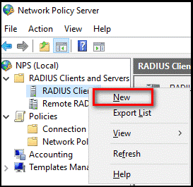

1. In the **New RADIUS Client** dialog box, provide a friendly name, such as _Gateway_, and the IP address or DNS name of the Remote Desktop Gateway server.
1. In the **Shared secret** and the **Confirm shared secret** fields, enter the same secret that you used before.

   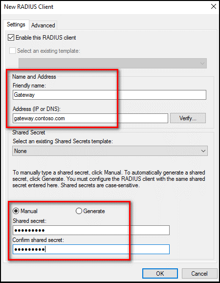

1. Click **OK** to close the New RADIUS Client dialog box.

### Configure Network Policy

Recall that the NPS server with the Microsoft Entra multifactor authentication extension is the designated central policy store for the Connection Authorization Policy (CAP). Therefore, you need to implement a CAP on the NPS server to authorize valid connections requests.  

1. On the NPS Server, open the NPS (Local) console, expand **Policies**, and click **Network Policies**.
1. Right-click **Connections to other access servers**, and click **Duplicate Policy**.

   

1. Right-click **Copy of Connections to other access servers**, and click **Properties**.
1. In the **Copy of Connections to other access servers** dialog box, in **Policy name**, enter a suitable name, such as _RDG_CAP_. Check **Policy enabled**, and select **Grant access**. Optionally, in **Type of network access server**, select **Remote Desktop Gateway**, or you can leave it as **Unspecified**.

   

1. Click the **Constraints** tab, and check **Allow clients to connect without negotiating an authentication method**.

   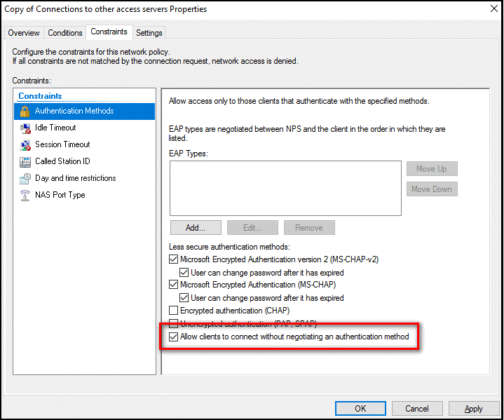

1. Optionally, click the **Conditions** tab and add conditions that must be met for the connection to be authorized, for example, membership in a specific Windows group.

   

1. Click **OK**. When prompted to view the corresponding Help topic, click **No**.
1. Ensure that your new policy is at the top of the list, that the policy is enabled, and that it grants access.

   

## Verify configuration

To verify the configuration, you need to sign in to the Remote Desktop Gateway with a suitable RDP client. Be sure to use an account that is allowed by your Connection Authorization Policies and is enabled for Microsoft Entra multifactor authentication.

As show in the image below, you can use the **Remote Desktop Web Access** page.

Upon successfully entering your credentials for primary authentication, the Remote Desktop Connect dialog box shows a status of Initiating remote connection, as shown below. 

If you successfully authenticate with the secondary authentication method you previously configured in Microsoft Entra multifactor authentication, you are connected to the resource. However, if the secondary authentication is not successful, you are denied access to the resource. 

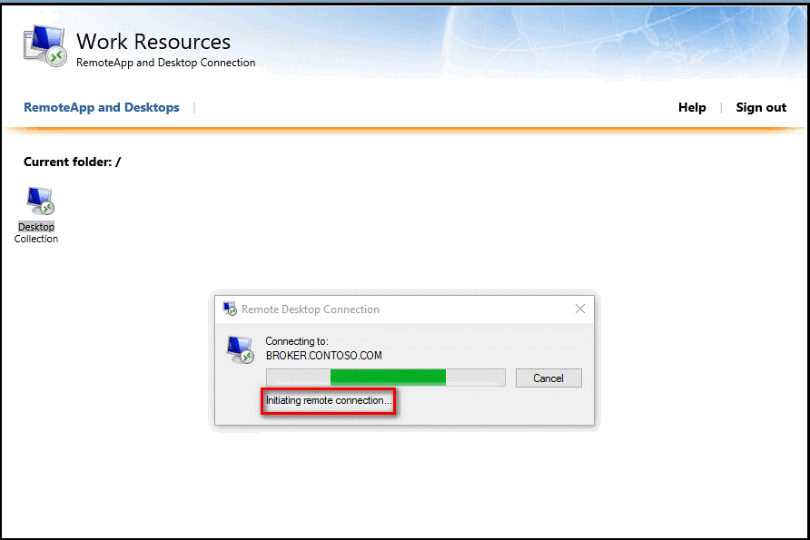

In the example below, the Authenticator app on a Windows phone is used to provide the secondary authentication.

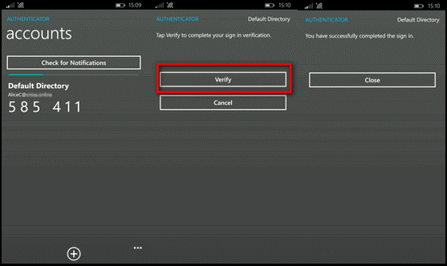

Once you have successfully authenticated using the secondary authentication method, you are logged into the Remote Desktop Gateway as normal. However, because you are required to use a secondary authentication method using a mobile app on a trusted device, the sign in process is more secure than it would be otherwise.

### View Event Viewer logs for successful logon events

To view the successful sign-in events in the Windows Event Viewer logs, you can issue the following PowerShell command to query the Windows Terminal Services and Windows Security logs.

To query successful sign-in events in the Gateway operational logs _(Event Viewer\Applications and Services Logs\Microsoft\Windows\TerminalServices-Gateway\Operational)_, use the following PowerShell commands:

* `Get-WinEvent -Logname Microsoft-Windows-TerminalServices-Gateway/Operational | where {$_.ID -eq '300'} | FL`
* This command displays Windows events that show the user met resource authorization policy requirements (RD RAP) and was granted access.

* `Get-WinEvent -Logname Microsoft-Windows-TerminalServices-Gateway/Operational | where {$_.ID -eq '200'} | FL`
* This command displays the events that show when user met connection authorization policy requirements.

You can also view this log and filter on event IDs, 300 and 200. To query successful logon events in the Security event viewer logs, use the following command:

* `Get-WinEvent -Logname Security | where {$_.ID -eq '6272'} | FL`
* This command can be run on either the central NPS or the RD Gateway Server.

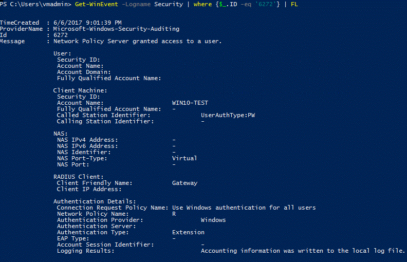

You can also view the Security log or the Network Policy and Access Services custom view, as shown below:

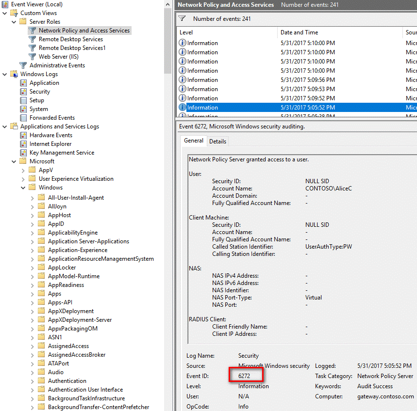

On the server where you installed the NPS extension for Microsoft Entra multifactor authentication, you can find Event Viewer application logs specific to the extension at _Application and Services Logs\Microsoft\AzureMfa_.

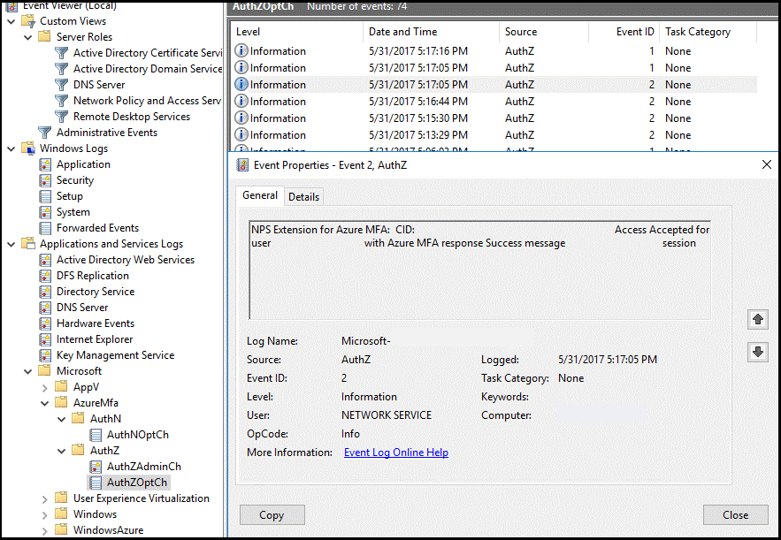

## Troubleshoot Guide

If the configuration is not working as expected, the first place to start to troubleshoot is to verify that the user is configured to use Microsoft Entra multifactor authentication. Have the user sign in to the [Microsoft Entra admin center](https://entra.microsoft.com). If users are prompted for secondary verification and can successfully authenticate, you can eliminate an incorrect configuration of Microsoft Entra multifactor authentication.

If Microsoft Entra multifactor authentication is working for the user(s), you should review the relevant Event logs. These include the Security Event, Gateway operational, and Microsoft Entra multifactor authentication logs that are discussed in the previous section.

Below is an example output of Security log showing a failed logon event (Event ID 6273).

Below is a related event from the AzureMFA logs:

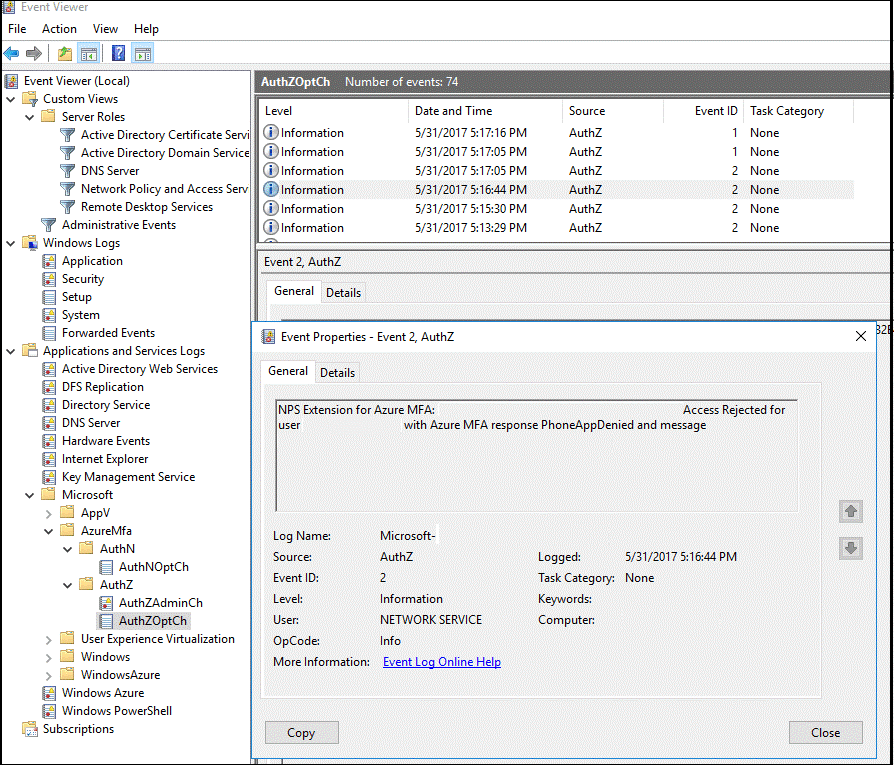

To perform advanced troubleshoot options, consult the NPS database format log files where the NPS service is installed. These log files are created in _%SystemRoot%\System32\Logs_ folder as comma-delimited text files.

For a description of these log files, see [Interpret NPS Database Format Log Files](/previous-versions/windows/it-pro/windows-server-2008-R2-and-2008/cc771748(v=ws.10)). The entries in these log files can be difficult to interpret without importing them into a spreadsheet or a database. You can find several IAS parsers online to assist you in interpreting the log files.

The image below shows the output of one such downloadable [shareware application](https://www.deepsoftware.com/iasviewer).

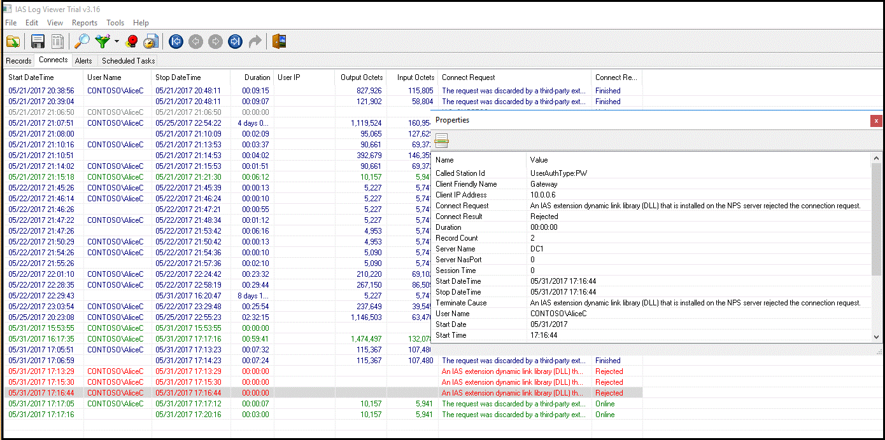

Finally, for additional troubleshoot options, you can use a protocol analyzer, such [Microsoft Message Analyzer](/message-analyzer/microsoft-message-analyzer-operating-guide).

The image below from Microsoft Message Analyzer shows network traffic filtered on RADIUS protocol that contains the user name **CONTOSO\AliceC**.

## Next steps

[How to get Microsoft Entra multifactor authentication](concept-mfa-licensing.md)

[Remote Desktop Gateway and Azure Multi-Factor Authentication Server using RADIUS](howto-mfaserver-nps-rdg.md)

[Integrate your on-premises directories with Microsoft Entra ID](~/identity/hybrid/whatis-hybrid-identity.md)
