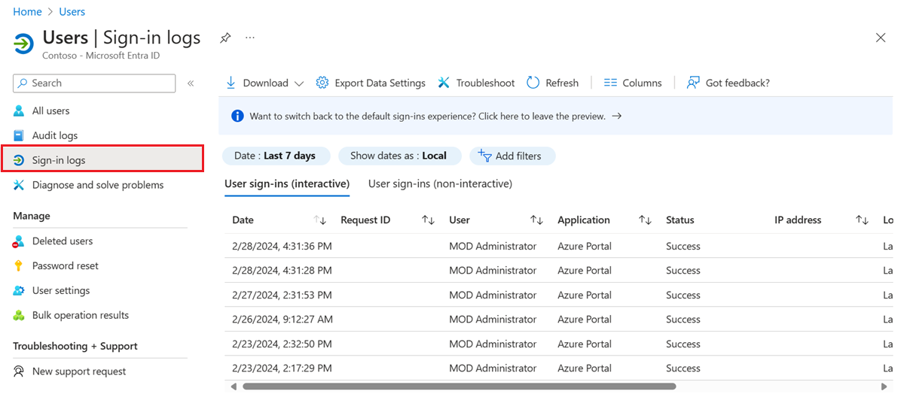
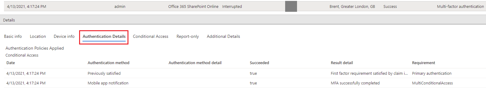

# Use the sign-in logs to review Microsoft Entra multifactor authentication events

To review and understand Microsoft Entra multifactor authentication events, you can use the Microsoft Entra sign-in logs. This report shows authentication details for events when a user is prompted for multifactor authentication, and if any Conditional Access policies were in use. For detailed information on the sign-in logs, see the [overview of sign-in activity reports in Microsoft Entra ID](~/identity/monitoring-health/concept-sign-ins.md).

<a name='view-the-azure-ad-sign-ins-report'></a>

## Note about interpreting MFA

When a user signs in interactively to Microsoft Entra for the first time, they can use any supported authentication method (including strong auth), even if it isn’t strictly required. If a user chooses to authenticate via passwordless or another strong auth method, the user receives an MFA claim. To reduce latency and unnecessary redirects between our applications and the authentication service, resource providers generally review any existing claims already given to a user authenticating instead of requesting a new set of claims each time. As a result, it's possible that certain sign-ins might appear as "single factor" despite having an MFA requirement on the application because the user's previous MFA claim was accepted. No MFA requirement was requested or logged for that particular authentication. For accurate understanding of the authentication context, it's important to always check both the MFA details and the root authentication method associated with each event. Don't rely only on the `authenticationRequirement` field as it doesn't take into account previously satisfied MFA claims due to not explicitly required strong authentication usage. 

## View the Microsoft Entra sign-in logs

The sign-in logs provides you with information about the usage of managed applications and user sign-in activities, which includes information about multifactor authentication usage. The MFA data gives you insights into how MFA is working in your organization. It answers questions like:

- Was the sign-in challenged with MFA?
- How did the user complete MFA?
- Which authentication methods were used during a sign-in?
- Why was the user unable to complete MFA?
- How many users are challenged for MFA?
- How many users are unable to complete the MFA challenge?
- What are the common MFA issues end users are running into?

To view the sign-in activity report in the [Microsoft Entra admin center](https://entra.microsoft.com), complete the following steps. You can also query data using the [reporting API](~/identity/monitoring-health/howto-configure-prerequisites-for-reporting-api.md).

1. Sign in to the [Microsoft Entra admin center](https://entra.microsoft.com) as at least an [Authentication Policy Administrator](~/identity/role-based-access-control/permissions-reference.md#authentication-policy-administrator).
1. Browse to **Entra ID** > **Users** from the menu on the left-hand side.
1. From the menu on the left-hand side, select **Sign-in logs**.
1. A list of sign-in events is shown, including the status. You can select an event to view more details.

    The **Conditional Access** tab of the event details shows you which policy triggered the MFA prompt.

    [](media/howto-mfa-reporting/sign-in-report.png#lightbox)
   
If available, the authentication is shown, such as text message, Microsoft Authenticator app notification, or phone call.

The **Authentication Details** tab provides the following information, for each authentication attempt:

- A list of authentication policies applied (such as Conditional Access, per-user MFA, Security Defaults)
- The sequence of authentication methods used to sign-in
- Whether or not the authentication attempt was successful
- Detail about why the authentication attempt succeeded or failed

This information allows admins to troubleshoot each step in a user’s sign-in, and track:

- Volume of sign-ins protected by multifactor authentication 
- Usage and success rates for each authentication method 
- Usage of passwordless authentication methods (such as Passwordless Phone Sign-in, FIDO2, and Windows Hello for Business) 
- How frequently authentication requirements are satisfied by token claims (where users aren't interactively prompted to enter a password, enter an SMS OTP, and so on)

While viewing the sign-in logs, select the **Authentication Details** tab: 



>[!NOTE]
>**OATH verification code** is logged as the authentication method for both OATH hardware and software tokens (such as the Microsoft Authenticator app).

>[!IMPORTANT]
>The **Authentication details** tab can initially show incomplete or inaccurate data, until log information is fully aggregated. Known examples include: 
>- A **satisfied by claim in the token** message is incorrectly displayed when sign-in events are initially logged. 
>- The **Primary authentication** row isn't initially logged. 

The following details are shown on the **Authentication Details** window for a sign-in event that show if the MFA request was satisfied or denied:

* If MFA was satisfied, this column provides more information about how MFA was satisfied.
   * completed in the cloud
   * has expired due to the policies configured on tenant
   * registration prompted
   * satisfied by claim in the token
   * satisfied by claim provided by external provider
   * satisfied by strong authentication
   * skipped as flow exercised was Windows broker logon flow
   * skipped due to app password
   * skipped due to location
   * skipped due to registered device
   * skipped due to remembered device
   * successfully completed

* If MFA was denied, this column would provide the reason for denial.
   * authentication in-progress
   * duplicate authentication attempt
   * entered incorrect code too many times
   * invalid authentication
   * invalid mobile app verification code
   * misconfiguration
   * phone call went to voicemail
   * phone number has an invalid format
   * service error
   * unable to reach the user's phone
   * unable to send the mobile app notification to the device
   * unable to send the mobile app notification
   * user declined the authentication
   * user didn't respond to mobile app notification
   * user doesn't have any verification methods registered
   * user entered incorrect code
   * user entered incorrect PIN
   * user hung up the phone call without succeeding the authentication
   * user is blocked
   * user never entered the verification code
   * user not found
   * verification code already used once

## PowerShell reporting on users registered for MFA

First, ensure that you have the [Install the Microsoft Graph PowerShell SDK](/powershell/microsoftgraph/installation) installed.

Identify users who have registered for MFA using the PowerShell that follows. This set of commands excludes disabled users since these accounts can't authenticate against Microsoft Entra ID:

```powershell
Get-MgUser -All | Where-Object {$_.StrongAuthenticationMethods -ne $null -and $_.BlockCredential -eq $False} | Select-Object -Property UserPrincipalName
```

Identify users who aren't registered for MFA by running the following PowerShell commands. This set of commands excludes disabled users since these accounts can't authenticate against Microsoft Entra ID:

```powershell
Get-MgUser -All | Where-Object {$_.StrongAuthenticationMethods.Count -eq 0 -and $_.BlockCredential -eq $False} | Select-Object -Property UserPrincipalName
```

Identify users and output methods registered:

```powershell
Get-MgUser -All | Select-Object @{N='UserPrincipalName';E={$_.UserPrincipalName}},@{N='MFA Status';E={if ($_.StrongAuthenticationRequirements.State){$_.StrongAuthenticationRequirements.State} else {"Disabled"}}},@{N='MFA Methods';E={$_.StrongAuthenticationMethods.methodtype}} | Export-Csv -Path c:\MFA_Report.csv -NoTypeInformation
```

## Additional MFA reports
NPS extension and AD FS adapter for cloud MFA activity are now included in the sign-in logs and not with a specific activity report.

Cloud MFA sign-in events from an on-premises AD FS adapter or NPS extension won't have all fields in the sign-in logs populated due to limited data returned by the on-premises component. You can identify these events by the resourceID *adfs* or *radius* in the event properties. They include:
- resultSignature
- appID
- deviceDetail
- conditionalAccessStatus
- authenticationContext
- isInteractive
- tokenIssuerName
- riskDetail, riskLevelAggregated,riskLevelDuringSignIn, riskState,riskEventTypes, riskEventTypes_v2
- authenticationProtocol
- incomingTokenType

Organizations that run the latest version of NPS extension or use Microsoft Entra Connect Health will have location IP address in events.

## Next steps

This article provided an overview of the sign-ins activity report. For more detailed information on what this report contains, see [sign-in activity reports in Microsoft Entra ID](~/identity/monitoring-health/concept-sign-ins.md).
