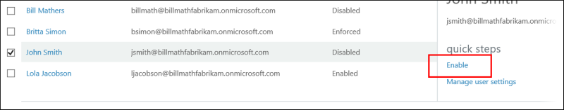

# Enable per-user Microsoft Entra multifactor authentication to secure sign-in events

To secure user sign-in events in Microsoft Entra ID, you can require multifactor authentication. Enabling Microsoft Entra multifactor authentication using Conditional Access policies is the recommended approach to protect users. Conditional Access is a Microsoft Entra ID P1 or P2 feature that lets you apply rules to require MFA as needed in certain scenarios. To get started using Conditional Access, see [Tutorial: Secure user sign-in events with Microsoft Entra multifactor authentication](tutorial-enable-azure-mfa.md).

For Microsoft Entra ID Free tenants without Conditional Access, you can [use security defaults to protect users](~/fundamentals/security-defaults.md). Users are prompted for MFA as needed, but you can't define your own rules to control the behavior.

If needed, you can instead enable each account for per-user Microsoft Entra multifactor authentication. When users are enabled individually, they perform multifactor authentication each time they sign in (with some exceptions, such as when they sign in from trusted IP addresses or when the *remember MFA on trusted devices* feature is turned on).

Changing [user states](#azure-ad-multi-factor-authentication-user-states) isn't recommended unless your Microsoft Entra ID licenses don't include Conditional Access and you don't want to use security defaults. For more information on the different ways to enable MFA, see [Features and licenses for Microsoft Entra multifactor authentication](concept-mfa-licensing.md).

> [!IMPORTANT]
>
> This article details how to view and change the status for per-user Microsoft Entra multifactor authentication. If you use Conditional Access or security defaults, you don't review or enable user accounts using these steps.
>
> Enabling Microsoft Entra multifactor authentication through a Conditional Access policy doesn't change the state of the user. Don't be alarmed if users appear disabled. Conditional Access doesn't change the state.
>
> **Don't enable or enforce per-user Microsoft Entra multifactor authentication if you use Conditional Access policies.**

<a name='azure-ad-multi-factor-authentication-user-states'></a>

## Microsoft Entra multifactor authentication user states

A user's state reflects whether an admin has enrolled them in per-user Microsoft Entra multifactor authentication. User accounts in Microsoft Entra multifactor authentication have the following three distinct states:

| State | Description | Legacy authentication affected | Browser apps affected | Modern authentication affected |
|:---:| --- |:---:|:--:|:--:|
| Disabled | The default state for a user not enrolled in per-user Microsoft Entra multifactor authentication. | No | No | No |
| Enabled | The user is enrolled in per-user Microsoft Entra multifactor authentication, but can still use their password for legacy authentication. If the user hasn't yet registered MFA authentication methods, they receive a prompt to register the next time they sign in using modern authentication (such as via a web browser). | No. Legacy authentication continues to work until the registration process is completed. | Yes. After the session expires, Microsoft Entra multifactor authentication registration is required.| Yes. After the access token expires, Microsoft Entra multifactor authentication registration is required. |
| Enforced | The user is enrolled per-user in Microsoft Entra multifactor authentication. If the user hasn't yet registered authentication methods, they receive a prompt to register the next time they sign in using modern authentication (such as via a web browser). Users who complete registration while in the *Enabled* state are automatically moved to the *Enforced* state. | Yes. Apps require app passwords. | Yes. Microsoft Entra multifactor authentication is required at sign-in. | Yes. Microsoft Entra multifactor authentication is required at sign-in. |

All users start out *Disabled*. When you enroll users in per-user Microsoft Entra multifactor authentication, their state changes to *Enabled*. When enabled users sign in and complete the registration process, their state changes to *Enforced*. Administrators may move users between states, including from *Enforced* to *Enabled* or *Disabled*.

> [!NOTE]
> If per-user MFA is re-enabled on a user and the user doesn't re-register, their MFA state doesn't transition from *Enabled* to *Enforced* in MFA management UI. The administrator must move the user directly to *Enforced*.

## View the status for a user

The per-user MFA administration experience in the Microsoft Entra admin center is recently improved. To view and manage user states, complete the following steps:

1. Sign in to the [Microsoft Entra admin center](https://entra.microsoft.com) as at least an [Authentication Administrator](~/identity/role-based-access-control/permissions-reference.md#authentication-administrator).
1. Browse to **Identity** > **Users** > **All users**.
1. Select a user account, and click **User MFA settings**.
1. After you make any changes, click **Save**.

   :::image type="content" border="true" source="./media/howto-mfa-userstates/user-states.png" alt-text="Screenshot that shows an example of MFA settings for a user.":::

During transition to the new per-user MFA experience, you can also access the lagacy per-user MFA experience. The format is:
 
`https://account.activedirectory.windowsazure.com/usermanagement/multifactorverification.aspx?tenantId=${userTenantID}`
 
To get the `userTenantID`, copy the tenant ID on the **Overview** page in the Microsoft Entra admin center. Then follow these steps to view status for a user with the legacy experience:

1. Sign in to the [Microsoft Entra admin center](https://entra.microsoft.com) as at least an [Authentication Administrator](~/identity/role-based-access-control/permissions-reference.md#authentication-administrator).
1. Browse to **Identity** > **Users** > **All users**.
1. Select **Per-user MFA**. 
   :::image type="content" border="true" source="./media/howto-mfa-userstates/selectmfa-cropped.png" alt-text="Screenshot of select per-user multifactor authentication.":::
1. A new page opens that displays the user state, as shown in the following example.
   :::image type="content" border="true" source="./media/howto-mfa-userstates/user-state.png" alt-text="Screenshot that shows example user state information for Microsoft Entra multifactor authentication.":::

## Change the status for a user

To change the per-user Microsoft Entra multifactor authentication state for a user, complete the following steps:

1. Use the previous steps to [view the status for a user](#view-the-status-for-a-user) to get to the Microsoft Entra multifactor authentication **users** page.
1. Find the user you want to enable for per-user Microsoft Entra multifactor authentication. You might need to change the view at the top to **users**.
   
1. Check the box next to the name(s) of the user(s) to change the state for.
1. On the right-hand side, under **quick steps**, choose **Enable** or **Disable**. In the following example, the user *John Smith* has a check next to their name and is being enabled for use:
   

   > [!TIP]
   > *Enabled* users are automatically switched to *Enforced* when they register for Microsoft Entra multifactor authentication. Don't manually change the user state to *Enforced* unless the user is already registered or if it is acceptable for the user to experience interruption in connections to legacy authentication protocols.

1. Confirm your selection in the pop-up window that opens.

After you enable users, notify them via email. Tell the users that a prompt is displayed to ask them to register the next time they sign in. Also, if your organization uses non-browser apps that don't support modern authentication, they need to create app passwords. For more information, see the [Microsoft Entra multifactor authentication end-user guide](https://support.microsoft.com/account-billing/how-to-use-the-microsoft-authenticator-app-9783c865-0308-42fb-a519-8cf666fe0acc) to help them get started.

## Use Microsoft Graph to manage per-user MFA

You can manage per-user MFA settings by using the Microsoft Graph REST API Beta. You can use the [authentication resource type](/graph/api/resources/authentication?view=graph-rest-beta) to expose authentication method states for users. 

To manage per-user MFA, use the perUserMfaState property within users/id/authentication/requirements. For more information, see [strongAuthenticationRequirements resource type](/graph/api/resources/strongauthenticationrequirements?view=graph-rest-beta).

### View per-user MFA state 

To retrieve the per-user multifactor authentication state for a user:

``` http
GET /users/{id | userPrincipalName}/authentication/requirements
```

For example:

``` http
GET https://graph.microsoft.com/beta/users/071cc716-8147-4397-a5ba-b2105951cc0b/authentication/requirements
```

If the user is enabled for per-user MFA, the response is:

``` http
HTTP/1.1 200 OK
Content-Type: application/json

{
  "perUserMfaState": "enforced"
}
```

For more information, see [Get authentication method states](/graph/api/authentication-get?view=graph-rest-beta).

### Change MFA state for a user

To change multifactor authentication state for a user, use the user's strongAuthenticationRequirements. For example:

``` http
PATCH https://graph.microsoft.com/beta/users/071cc716-8147-4397-a5ba-b2105951cc0b/authentication/requirements
Content-Type: application/json

{
  "perUserMfaState": "disabled"
}
```

If successful, the response is:

```http
HTTP/1.1 204 No Content
```

For more information, see [Update authentication method states](/graph/api/authentication-update?view=graph-rest-beta).

## Next steps

To configure Microsoft Entra multifactor authentication settings, see  [Configure Microsoft Entra multifactor authentication settings](howto-mfa-mfasettings.md).

To manage user settings for Microsoft Entra multifactor authentication, see [Manage user settings with Microsoft Entra multifactor authentication](howto-mfa-userdevicesettings.yml).

To understand why a user was prompted or not prompted to perform MFA, see [Microsoft Entra multifactor authentication reports](howto-mfa-reporting.md).
