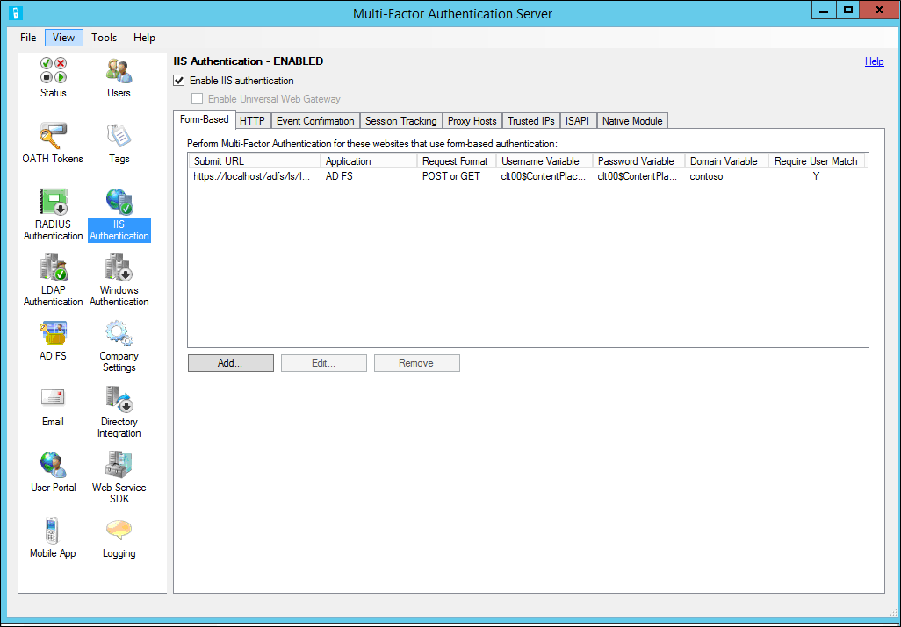

# Configure Microsoft Entra multifactor authentication Server for IIS web apps

Use the IIS Authentication section of the Microsoft Entra multifactor authentication (MFA) Server to enable and configure IIS authentication for integration with Microsoft IIS web applications. The Microsoft Entra multifactor authentication Server installs a plug-in that can filter requests being made to the IIS web server to add Microsoft Entra multifactor authentication. The IIS plug-in provides support for Form-Based Authentication and Integrated Windows HTTP Authentication. Trusted IPs can also be configured to exempt internal IP addresses from two-factor authentication.

> [!IMPORTANT]
> In September 2022, Microsoft announced deprecation of Azure Multi-Factor Authentication Server. Beginning September 30, 2024, Azure Multi-Factor Authentication Server deployments will no longer service multifactor authentication (MFA) requests, which could cause authentications to fail for your organization. To ensure uninterrupted authentication services and to remain in a supported state, organizations should [migrate their users’ authentication data](how-to-migrate-mfa-server-to-mfa-user-authentication.md) to the cloud-based Microsoft Entra multifactor authentication service by using the latest Migration Utility included in the most recent [Microsoft Entra multifactor authentication Server update](https://www.microsoft.com/download/details.aspx?id=55849). For more information, see [Microsoft Entra multifactor authentication Server Migration](how-to-migrate-mfa-server-to-azure-mfa.md).
>
> To get started with cloud-based MFA, see [Tutorial: Secure user sign-in events with Microsoft Entra multifactor authentication](tutorial-enable-azure-mfa.md).
>>
> When you use cloud-based Microsoft Entra multifactor authentication, there is no alternative to the IIS plugin provided by Microsoft Entra multifactor authentication (MFA) Server. Instead, use Web Application Proxy (WAP) with Active Directory Federation Services (AD FS) or Microsoft Entra application proxy.

## Using Form-Based IIS Authentication with Microsoft Entra multifactor authentication Server

To secure an IIS web application that uses form-based authentication, install the Microsoft Entra multifactor authentication Server on the IIS web server and configure the Server per the following procedure:

1. In the Microsoft Entra multifactor authentication Server, select the IIS Authentication icon in the left menu.
2. Select the **Form-Based** tab.
3. Select **Add**.
4. To detect username, password and domain variables automatically, enter the Login URL (like `https://localhost/contoso/auth/login.aspx`) within the Auto-Configure Form-Based Website dialog box and select **OK**.
5. Check the **Require Multi-Factor Authentication user match** box if all users have been or will be imported into the Server and subject to multifactor authentication. If a significant number of users haven't yet been imported into the Server and/or will be exempt from multifactor authentication, leave the box unchecked.
6. If the page variables can't be detected automatically, select **Specify Manually** in the Auto-Configure Form-Based Website dialog box.
7. In the Add Form-Based Website dialog box, enter the URL to the sign-in page in the Submit URL field and enter an Application name (optional). The Application name appears in Microsoft Entra multifactor authentication reports and may be displayed within SMS or Mobile App authentication messages.
8. Select the correct Request format. This is set to **POST or GET** for most web applications.
9. Enter the Username variable, Password variable, and Domain variable (if it appears on the sign-in page). To find the names of the input boxes, navigate to the sign-in page in a web browser, right-select on the page, and select **View Source**.
10. Check the **Require Microsoft Entra multifactor authentication user match** box if all users have been or will be imported into the Server and subject to multifactor authentication. If a significant number of users haven't yet been imported into the Server and/or will be exempt from multifactor authentication, leave the box unchecked.
11. Select **Advanced** to review advanced settings, including:

    - Select a custom denial page file
    - Cache successful authentications to the website for a period of time using cookies
    - Select whether to authenticate the primary credentials against a Windows Domain, LDAP directory. or RADIUS server.

12. Select **OK** to return to the Add Form-Based Website dialog box.
13. Select **OK**.
14. Once the URL and page variables have been detected or entered, the website data displays in the Form-Based panel.

## Using integrated Windows authentication with Microsoft Entra multifactor authentication Server

To secure an IIS web application that uses Integrated Windows HTTP authentication, install the Microsoft Entra multifactor authentication Server on the IIS web server, then configure the Server with the following steps:

1. In the Microsoft Entra multifactor authentication Server, select the IIS Authentication icon in the left menu.
2. Select the **HTTP** tab.
3. Select **Add**.
4. In the Add Base URL dialogue box, enter the URL for the website where HTTP authentication is performed (like `http://localhost/owa`) and provide an Application name (optional). The Application name appears in Microsoft Entra multifactor authentication reports and may be displayed within SMS or Mobile App authentication messages.
5. Adjust the Idle timeout and Maximum session times if the default isn't sufficient.
6. Check the **Require Multi-Factor Authentication user match** box if all users have been or will be imported into the Server and subject to multifactor authentication. If a significant number of users haven't yet been imported into the Server and/or will be exempt from multifactor authentication, leave the box unchecked.
7. Check the **Cookie cache** box if desired.
8. Select **OK**.

## Enable IIS Plug-ins for Microsoft Entra multifactor authentication Server

After configuring the Form-Based or HTTP authentication URLs and settings, select the locations where the Microsoft Entra multifactor authentication IIS plug-ins should be loaded and enabled in IIS. Use the following procedure:

1. If running on IIS 6, select the **ISAPI** tab. Select the website that the web application is running under (for example, Default Web Site) to enable the Microsoft Entra multifactor authentication ISAPI filter plug-in for that site.
2. If running on IIS 7 or higher, select the **Native Module** tab. Select the server, websites, or applications to enable the IIS plug-in at the desired levels.
3. Select the **Enable IIS authentication** box at the top of the screen. Microsoft Entra multifactor authentication is now securing the selected IIS application. Ensure that users have been imported into the Server.

## Trusted IPs

The Trusted IPs allows users to bypass Microsoft Entra multifactor authentication for website requests originating from specific IP addresses or subnets. For example, you may want to exempt users from Microsoft Entra multifactor authentication while logging in from the office. In that case, you can specify the office subnet as a Trusted IPs entry. To configure Trusted IPs, use the following procedure:

1. In the IIS Authentication section, select the **Trusted IPs** tab.
2. Select **Add**.
3. When the Add Trusted IPs dialog box appears, select the **Single IP**, **IP range**, or **Subnet** radio button.
4. Enter the IP address, range of IP addresses or subnet that should be allowed. If entering a subnet, select the appropriate Netmask and select **OK**.
