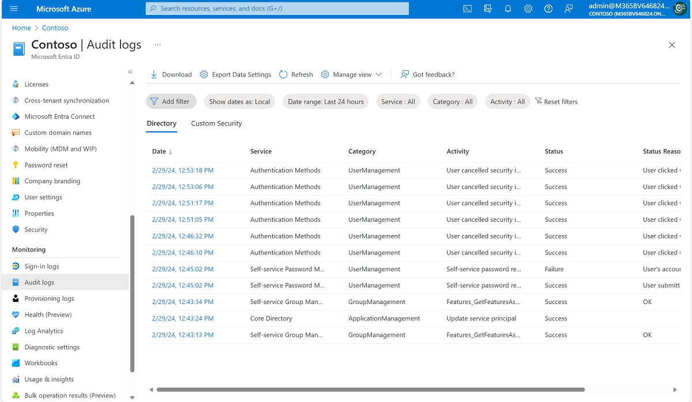

# Troubleshoot combined security information registration

The information in this article helps admins who are troubleshooting issues reported by users of the combined registration experience.

## Audit logs

The events logged for combined registration are listed in the Microsoft Entra audit logs. In the **Service** column, see **Authentication Methods**.

The following table lists all audit events generated by combined registration.

| Activity | Status | Reason | Description |
| --- | --- | --- | --- |
| User registered all required security information. | Success | User registered all required security information. | This event occurs after a user successfully finishes registration.|
| User registered all required security information. | Failure | User canceled security information registration. | This event occurs when a user cancels registration from interrupt mode.|
| User registered security information. | Success | User registered the method. | This event occurs when a user registers an individual method. The method can be Authenticator, phone, email, security questions, app password, alternate phone, and so on.| 
| User reviewed security information. | Success | User successfully reviewed security information. | This event occurs when a user selects **Looks good** on the security information review page.|
| User reviewed security information. | Failure | User failed to review security information. | This event occurs when a user selects **Looks good** on the security information review page but something fails on the back end.|
| User deleted security information. | Success | User deleted the method. | This event occurs when a user deletes an individual method. The method can be Authenticator, phone, email, security questions, app password, alternate phone, and so on.|
| User deleted security information. | Failure | User failed to delete the method. | This event occurs when a user tries to delete a method, but the attempt fails. The method can be Authenticator, phone, email, security questions, app password, alternate phone, and so on.|
| User changed default security information. | Success | User changed the default security information for the method. | This event occurs when a user changes the default method. The method can be an Authenticator notification or a code from Authenticator or a token. It can also be a call to +X XXXXXXXXXX or a text with a code to +X XXXXXXXXXX.|
| User changed default security information. | Failure | User failed to change the default security information for the method. | This event occurs when a user tries to change the default method, but the attempt fails. The method can be an Authenticator notification or a code from Authenticator or a token. It can also be a call to +X XXXXXXXXXX or a text with a code to +X XXXXXXXXXX.|

## Troubleshoot interrupt mode

| Symptom | Troubleshooting steps |
| --- | --- |
| I don't see the methods that I expected to see. | 1. Check if the user has a Microsoft Entra admin role. If yes, view the self-service password reset (SSPR) admin policy differences.   2. Determine whether the user is being interrupted because of multifactor authentication (MFA) registration enforcement or SSPR registration enforcement. To determine which methods should be shown, see the [flowchart](~/identity/authentication/concept-registration-mfa-sspr-combined.md#combined-registration-modes) under "Combined registration modes."   3. Determine how recently the MFA or SSPR policy was changed. If the change was recent, it might take some time for the updated policy to propagate.|

## Troubleshoot manage mode

| Symptom | Troubleshooting steps |
| --- | --- |
| I don't have a choice to add a particular method. | 1. Determine whether the method is enabled for MFA or SSPR.   2. If the method is enabled, save the policies again and wait one to two hours before you test again.   3. If the method is enabled, ensure that the user didn't set up the maximum number for the method that they're allowed to set up.|

## Require a user to reregister for MFA

1. Sign in to the [Microsoft Entra admin center](https://entra.microsoft.com) as at least an [Authentication Policy Administrator](~/identity/role-based-access-control/permissions-reference.md#authentication-policy-administrator).
1. Browse to **Users**, and select the user that you want to reregister for MFA.
1. Select **Authentication methods** > **Require re-register for multifactor authentication**.
1. Select **OK** to confirm.

## Next step
> [!div class="nextstepaction"]
> [Combined security information registration for Microsoft Entra](concept-registration-mfa-sspr-combined.md)
