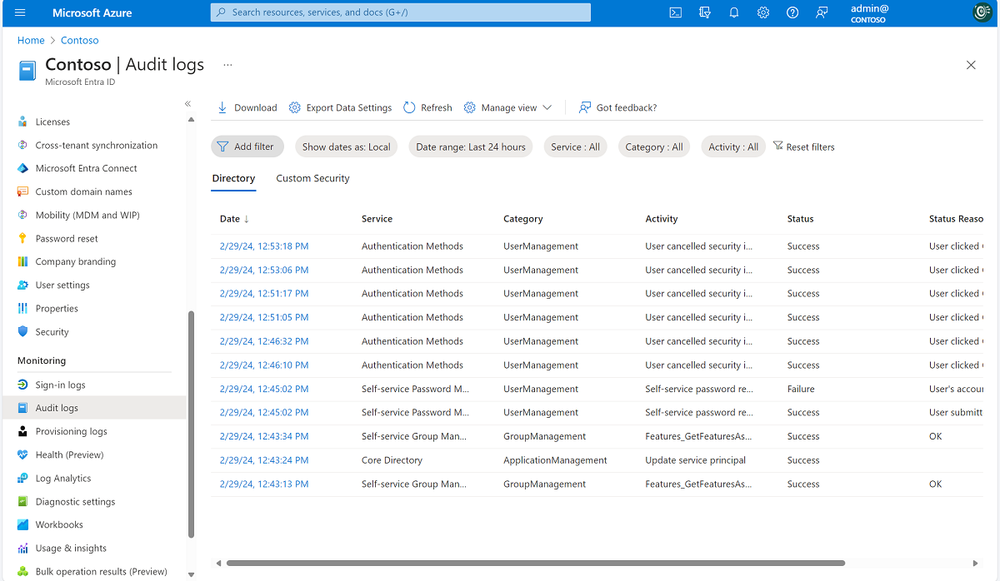

# Troubleshooting combined security information registration

The information in this article is meant to guide admins who are troubleshooting issues reported by users of the combined registration experience.

## Audit logs

The events logged for combined registration are in the Authentication Methods service in the Microsoft Entra audit logs.

The following table lists all audit events generated by combined registration:

| Activity | Status | Reason | Description |
| --- | --- | --- | --- |
| User registered all required security info | Success | User registered all required security info. | This event occurs when a user has successfully completed registration.|
| User registered all required security info | Failure | User canceled security info registration. | This event occurs when a user cancels registration from interrupt mode.|
| User registered security info | Success | User registered *method*. | This event occurs when a user registers an individual method. *Method* can be Authenticator app, Phone, Email, Security questions, App password, Alternate phone, and so on.| 
| User reviewed security info | Success | User successfully reviewed security info. | This event occurs when a user selects **Looks good** on the security info review page.|
| User reviewed security info | Failure | User failed to review security info. | This event occurs when a user selects **Looks good** on the security info review page but something fails on the backend.|
| User deleted security info | Success | User deleted *method*. | This event occurs when a user deletes an individual method. *Method* can be Authenticator app, Phone, Email, Security questions, App password, Alternate phone, and so on.|
| User deleted security info | Failure | User failed to delete *method*. | This event occurs when a user tries to delete a method but the attempt fails for some reason. *Method* can be Authenticator app, Phone, Email, Security questions, App password, Alternate phone, and so on.|
| User changed default security info | Success | User changed the default security info for *method*. | This event occurs when a user changes the default method. *Method* can be Authenticator app notification, A code from my authenticator app or token, Call +X XXXXXXXXXX, Text a code to +X XXXXXXXXX, and so on.|
| User changed default security info | Failure | User failed to change the default security info for *method*. | This event occurs when a user tries to change the default method but the attempt fails for some reason. *Method* can be Authenticator app notification, A code from my authenticator app or token, Call +X XXXXXXXXXX, Text a code to +X XXXXXXXXX, and so on.|

## Troubleshooting interrupt mode

| Symptom | Troubleshooting steps |
| --- | --- |
| I'm not seeing the methods I expected to see. | 1. Check if the user has a Microsoft Entra admin role. If yes, view the SSPR admin policy differences.   2. Determine whether the user is being interrupted because of multifactor authentication (MFA) registration enforcement or SSPR registration enforcement. See the [flowchart](~/identity/authentication/concept-registration-mfa-sspr-combined.md#combined-registration-modes) under "Combined registration modes" to determine which methods should be shown.   3. Determine how recently the MFA or SSPR policy was changed. If the change was recent, it might take some time for the updated policy to propagate.|

## Troubleshooting manage mode

| Symptom | Troubleshooting steps |
| --- | --- |
| I don't have the option to add a particular method. | 1. Determine whether the method is enabled for MFA or for SSPR.   2. If the method is enabled, save the policies again and wait 1-2 hours before testing again.   3. If the method is enabled, ensure that the user hasn't already set up the maximum number of that method that they're allowed to set up.|

## How to require user to re-register for multifactor authentication

1. Sign in to the [Microsoft Entra admin center](https://entra.microsoft.com) as at least an [Authentication Policy Administrator](~/identity/role-based-access-control/permissions-reference.md#authentication-policy-administrator).
1. Browse to **Users**, and select the user whom you want to re-register MFA. 
1. Click **Authentication methods**, and click **Require re-register for multifactor authentication**.
1. Click **OK** to confirm. 

## Next steps

* [Learn more about combined registration for self-service password reset and Microsoft Entra multifactor authentication](concept-registration-mfa-sspr-combined.md)
