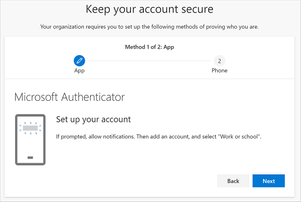
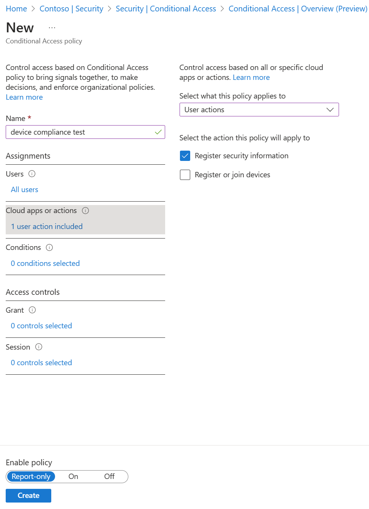

# Enable combined security information registration in Microsoft Entra ID

Before combined registration, users registered authentication methods for Microsoft Entra multifactor authentication and self-service password reset (SSPR) separately. Users were confused that similar methods were used for Microsoft Entra multifactor authentication and SSPR but they had to register for both features. Now, with combined registration, users can register once and get the benefits of both Microsoft Entra multifactor authentication and SSPR.

To help you understand the functionality and effects of the new experience, see the [Combined security information registration concepts](concept-registration-mfa-sspr-combined.md).

## Conditional Access policies for combined registration

To secure when and how users register for Microsoft Entra multifactor authentication and self-service password reset, you can use user actions in Conditional Access policy. This functionality may be enabled in organizations that want users to register for Microsoft Entra multifactor authentication and SSPR from a central location, such as a trusted network location during HR onboarding.

> [!NOTE]
> This policy applies only when a user accesses a combined registration page. This policy doesn't enforce MFA enrollment when a user accesses other applications.
>
> You can create an MFA registration policy by using [Microsoft Entra ID Protection - Configure MFA Policy](~/id-protection/howto-identity-protection-configure-mfa-policy.md).

For more information about creating trusted locations in Conditional Access, see [What is the location condition in Microsoft Entra Conditional Access?](../conditional-access/concept-assignment-network.md#trusted-locations).

### Create a policy to require registration from a trusted location

Complete the following steps to create a policy that applies to all selected users that attempt to register using the combined registration experience, and requires users connected on a non-trusted network to either perform MFA or sign in using a Temporary Access Pass (TAP) to register for MFA or reset their password using SSPR:

1. Sign in to the [Microsoft Entra admin center](https://entra.microsoft.com) as at least an [Conditional Access Administrator](~/identity/role-based-access-control/permissions-reference.md#conditional-access-administrator).
1. Browse to **Entra ID** > **Conditional Access**.
1. Select **+ New policy**.
1. Enter a name for this policy, such as *Combined Security Info Registration on Trusted Networks*.
1. Under **Assignments**, select **Users**. Choose the users and groups you want this policy to apply to.

   > [!WARNING]
   > Users must be enabled for combined registration.

1. Under **Cloud apps or actions**, select **User actions**. Check **Register security information**, then select **Done**.

    

1. Under **Conditions** > **Locations**, configure the following options:
   1. Configure **Yes**.
   1. Include **Any location**.
   1. Exclude **All trusted locations**.
1. Under **Access controls** > **Grant**, choose **Require multifactor authentication**, then **Select**.
1. Set **Enable policy** to **On**.
1. To finalize the policy, select **Create**.

## Next steps

If you need help, see [troubleshoot combined security info registration](howto-registration-mfa-sspr-combined-troubleshoot.md) or learn [What is the location condition in Microsoft Entra Conditional Access?](../conditional-access/concept-assignment-network.md)

Review how you can [enable self-service password reset](tutorial-enable-sspr.md) and [enable Microsoft Entra multifactor authentication](tutorial-enable-azure-mfa.md) in your tenant.

If needed, learn how to [force users to re-register authentication methods](howto-mfa-userdevicesettings.yml).
