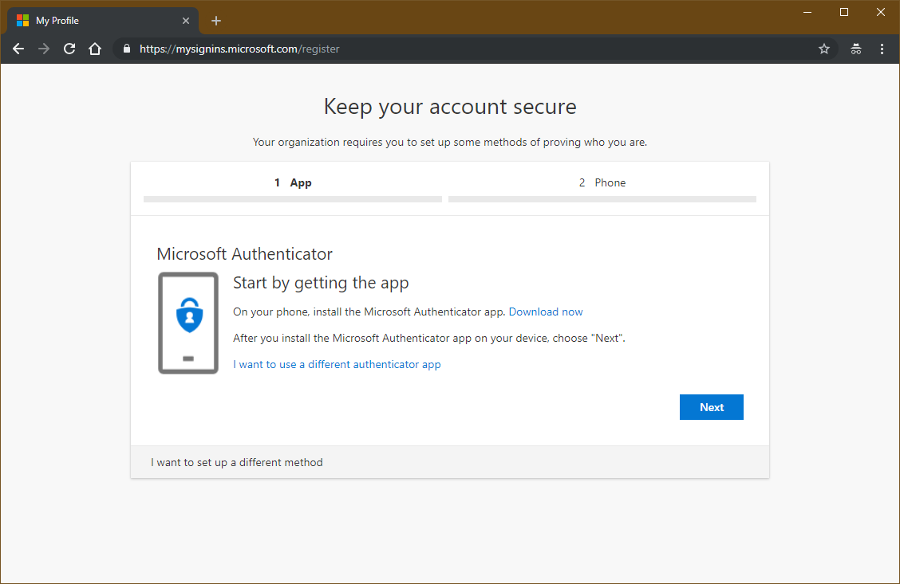
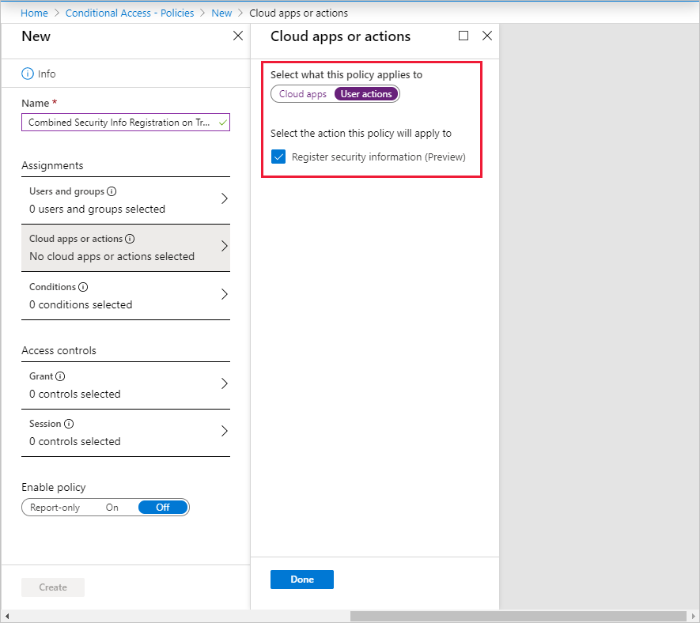

# Enable combined security information registration in Microsoft Entra ID

Before combined registration was introduced, users registered authentication methods for Microsoft Entra multifactor authentication (MFA) and self-service password reset (SSPR) separately. Users were confused that similar methods were used for Microsoft Entra MFA and SSPR, but they had to register for both features. Now, with combined registration, users can register once and get the benefits of both Microsoft Entra MFA and SSPR.

To help you understand the functionality and effects of the new experience, see [Combined security information registration concepts](concept-registration-mfa-sspr-combined.md).

## Conditional Access policies for combined registration

To secure when and how users register for Microsoft Entra MFA and SSPR, you can use user actions in a Microsoft Entra Conditional Access policy. Organizations can enable this functionality so that users can register for Microsoft Entra MFA and SSPR from a central location. For example, users can use a trusted network location that they access during human resources onboarding.

> [!NOTE]
> This policy applies only when a user accesses a combined registration page. This policy doesn't enforce MFA enrollment when a user accesses other applications.
>
> To create an MFA registration policy, see [Microsoft Entra ID Protection: Configure MFA policy](~/id-protection/howto-identity-protection-configure-mfa-policy.md).

For more information about how to create trusted locations in Conditional Access, see [What is the location condition in Microsoft Entra Conditional Access?](../conditional-access/concept-assignment-network.md#trusted-locations).

### Create a policy to require registration from a trusted location

In the following procedure, you create a policy that applies to all selected users who attempt to register by using the combined registration experience. Users connected on a nontrusted network must either perform MFA or sign in by using a temporary access pass to register for MFA or reset their password by using SSPR.

1. Sign in to the [Microsoft Entra admin center](https://entra.microsoft.com) as at least a [Conditional Access Administrator](~/identity/role-based-access-control/permissions-reference.md#conditional-access-administrator).
1. Browse to **Entra ID** > **Conditional Access**.
1. Select **+ New policy**.
1. Enter a name for this policy, such as **Combined Security Info Registration on Trusted Networks**.
1. Under **Assignments**, select **Users**. Choose the users and groups that must use this policy.

   > [!WARNING]
   > Users must be enabled for combined registration.

1. Under **Cloud apps or actions**, select **User actions**. Select the **Register security information** checkbox, and then select **Done**.

    

1. Under **Conditions** > **Locations**, configure the following options:
   1. Configure **Yes**.
   1. Include **Any location**.
   1. Exclude **All trusted locations**.
1. Under **Access controls** > **Grant**, select **Require multifactor authentication**, and then choose **Select**.
1. Set **Enable policy** to **On**.
1. To finalize the policy, select **Create**.

## Related content

- See [Troubleshoot combined security information registration](howto-registration-mfa-sspr-combined-troubleshoot.md) or [Conditional Access: Network assignment](../conditional-access/concept-assignment-network.md).
- Review how you can [enable SSPR](tutorial-enable-sspr.md) and [enable Microsoft Entra MFA](tutorial-enable-azure-mfa.md) in your tenant.
- Learn how to [force users to reregister authentication methods](howto-mfa-userdevicesettings.yml).
