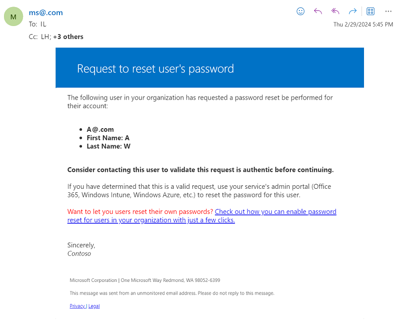

# Customize the user experience for Microsoft Entra self-service password reset

Self-service password reset (SSPR) gives users in Microsoft Entra ID the ability to change or reset their password, with no administrator or helpdesk involvement. If a user's account is locked or they forget their password, they can follow prompts to unblock themselves and get back to work. This ability reduces helpdesk calls and loss of productivity when a user can't sign in to their device or an application.

To improve the SSPR experience for users, you can customize the look and feel of the password reset page, email notifications, or sign-in pages. Customization options help to make it clear to users that they're in the right place and give them confidence that they're accessing company resources.

This article shows you how to customize the SSPR e-mail link for users, company branding, and the Active Directory Federation Services (AD FS) sign-in page link. Anyone who is assigned the [Authentication Policy Administrator](../role-based-access-control/permissions-reference.md#authentication-policy-administrator) role can customize most of these options.

## Customize the Contact your administrator link

To help users reach out for assistance with SSPR, a **Contact your administrator** link is shown in the password reset portal. If a user selects this link, it does one of two things:

* If this contact link is left in the default state, an email is sent to your administrators and asks them to help in changing the user's password. The following sample e-mail shows this default e-mail message:

    

* If this contact link is customized, it sends the user to a webpage or sends an email to the address specified by the administrator for assistance.
    * If you customize this link, we recommend that you set it to something that users are already familiar with for support.

    > [!WARNING]
    > If you customize this setting with an email address and account that needs a password reset, the user might be unable to ask for assistance.

### Default email behavior

The default contact email is sent to recipients in the following order:

1. If the Helpdesk Administrator role or Password Administrator role is assigned, administrators with these roles are notified.
1. If no Helpdesk Administrator or Password Administrator is assigned, then administrators with the User Administrator role are notified.
1. If none of the previous roles are assigned, then the Global Administrators are notified.

In all cases, a maximum of 100 recipients are notified.

To find out more about the different administrator roles and how to assign them, see [Assign administrator roles in Microsoft Entra ID](~/identity/role-based-access-control/permissions-reference.md).

### Disable Contact your administrator emails

If your organization doesn't want to notify administrators about password reset requests, you can use the following configuration options:

* Customize the helpdesk link to provide a web URL address that users can use to get assistance. This option is under **Password Reset** > **Customization** > **Custom helpdesk email or URL**.
* Enable self-service password reset for all users. This option is under **Password Reset** > **Properties**. If you don't want users to reset their own passwords, you can scope access to an empty group. *We don't recommend this option.*

## Customize the sign-in page and access panel

You can customize the sign-in page, for example, to add a logo that appears along with the image that fits your company branding. For more information on how to configure company branding, see [Add company branding to your sign-in page in Microsoft Entra ID](~/fundamentals/how-to-customize-branding.md).

The graphics that you choose appear in the following circumstances:

* After a user enters their username.
* If the user accesses the customized URL:
   * By passing the `whr` parameter to the password reset page, like `https://login.microsoftonline.com/?whr=contoso.com`.
   * By passing the `username` parameter to the password reset page, like `https://login.microsoftonline.com/?username=admin@contoso.com`.

SSPR honors browser language settings. When there's a customization for browser language, the page appears in the browser language customization. Otherwise, it falls to the default locale customization.

### Directory name

To make things look more personalized, you can change the organization name in the portal and in the automated communications.

To change the directory name attribute in the Microsoft Entra admin center:

[!INCLUDE [least-privilege-note](../../includes/definitions/least-privilege-note.md)]

1. Sign in to the [Microsoft Entra admin center](https://entra.microsoft.com) as a [Global Administrator](~/identity/role-based-access-control/permissions-reference.md#global-administrator).
1. Browse to **Entra ID** > **Overview** > **Properties**.
1. Update the name.
1. Select **Save**.

This organization name option is the most visible in automated emails, as in the following examples:

* **Email display name**: For example, *Microsoft on behalf of CONTOSO demo*
* **Email subject line**: For example, *CONTOSO demo account email verification code*

## Customize the AD FS sign-in page

If you use AD FS for user sign-in events, you can add a link to the sign-in page by using the guidance in the article to [Add a sign-in page description](/windows-server/identity/ad-fs/operations/add-sign-in-page-description).

Provide users with a link to the page for them to enter the SSPR workflow, such as `https://passwordreset.microsoftonline.com`. To add a link to the AD FS sign-in page, use the following command on your AD FS server:

``` powershell
Set-ADFSGlobalWebContent -SigninPageDescriptionText "<p><a href='https://passwordreset.microsoftonline.com' target='_blank'>Can't access your account?</a></p>"
```

## Related content

- To understand the use of SSPR in your environment, see [Reporting options for Microsoft Entra password management](howto-sspr-reporting.md).
- If you or users have problems with SSPR, see [Troubleshoot self-service password reset](./troubleshoot-sspr.md).
