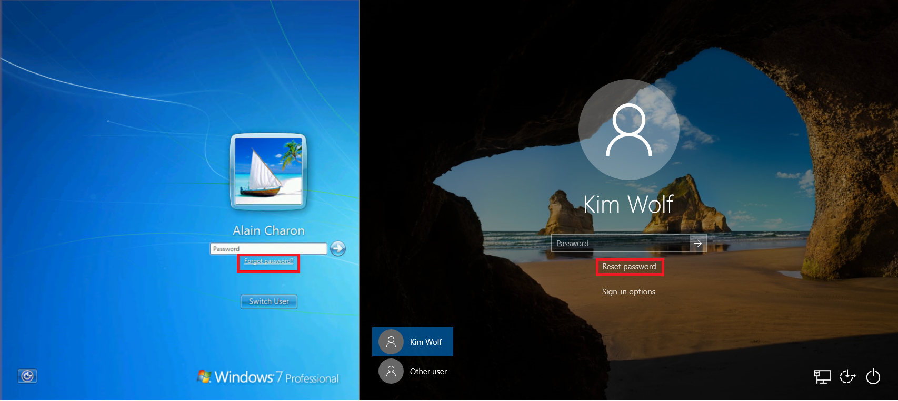
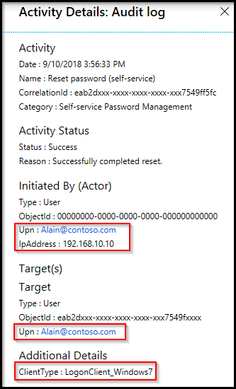
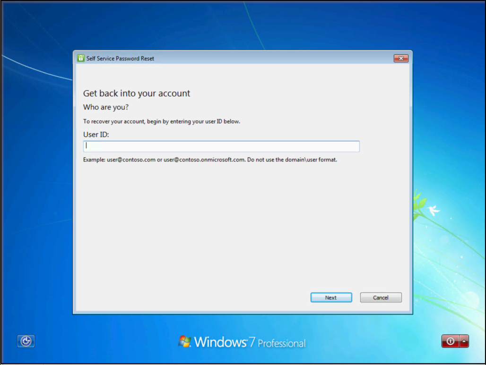

# Enable Microsoft Entra self-service password reset on the Windows sign-in screen

By using self-service password reset (SSPR) in Microsoft Entra ID, users can change or reset their password with no administrator or helpdesk involvement. Typically, users open a web browser on another device to access the [SSPR portal](https://aka.ms/sspr). To improve the experience on computers that run Windows 7, 8, 8.1, 10, and 11, you can enable users to reset their password on the Windows sign-in screen.



This article shows administrators how to enable SSPR for Windows devices in an enterprise.

If your IT team hasn't enabled the ability to use SSPR from your Windows device or you have problems during sign-in, reach out to your helpdesk for more assistance.

## General limitations

The following limitations apply to using SSPR from the Windows sign-in screen:

- Password reset isn't currently supported from a Remote Desktop or from Hyper-V enhanced sessions.
- Some non-Microsoft credential providers are known to cause problems with this feature.
- Disabling user account control via modification of the [EnableLUA registry key](/openspecs/windows_protocols/ms-gpsb/958053ae-5397-4f96-977f-b7700ee461ec) is known to cause issues.
- This feature doesn't work for networks with 802.1x network authentication deployed and the option **Perform immediately before user logon**. For networks with 802.1x network authentication deployed, we recommend that you use machine authentication to enable this feature.
- Microsoft Entra hybrid-joined machines must have network connectivity line of sight to a domain controller to use the new password and update cached credentials. The devices must either be on the organization's internal network or on a virtual private network with network access to an on-premises domain controller. If SSPR is the only requirement, the network connection line to the domain controller isn't required.
- If you use an image, before you run `sysprep` ensure that the web cache is cleared for the built-in administrator before you perform the `CopyProfile` step. For more information, see [Performance poor when using custom default user profile](https://support.microsoft.com/help/4056823/performance-issue-with-custom-default-user-profile).
- The following settings are known to interfere with the ability to use and reset passwords on Windows 10 devices:

    - If lock screen notifications are turned off, **Reset password** won't work.
    - `HideFastUserSwitching` is set to **Enabled** or **1**.
    - `DontDisplayLastUserName` is set to **Enabled** or **1**.
    - `NoLockScreen` is set to **Enabled** or **1**.
    - `BlockNonAdminUserInstall` is set to **Enabled** or **1**.
    - `EnableLostMode` is set on the device.
    - *Explorer.exe* is replaced with a custom shell.
    - **Interactive logon: Require smart card** is set to **Enabled** or **1**.
- The combination of the following specific three settings can cause this feature to not work.
    - **Interactive logon: Do not require CTRL+ALT+DEL** is set to **Disabled** (only for Windows 10 version 1710 and earlier).
    - `DisableLockScreenAppNotifications` is set to **Enabled** or **1**.
    - Windows version is the Home edition.

> [!NOTE]
> These limitations also apply to Windows Hello for Business PIN reset from the device lock screen.
>

## Windows 11 and Windows 10 password reset

To configure a Windows 11 or Windows 10 device for SSPR on the sign-in screen, review the following prerequisites and configuration steps.

### Windows 11 and Windows 10 prerequisites

- Sign in to the [Microsoft Entra admin center](https://entra.microsoft.com) as at least an [Authentication Policy Administrator](~/identity/role-based-access-control/permissions-reference.md#authentication-policy-administrator) and [enable Microsoft Entra SSPR](tutorial-enable-sspr.md).
- Users must register for SSPR before they use this feature on the [Windows sign-in screen](https://aka.ms/ssprsetup).
    - All users must provide authentication contact information before they can reset their password, which isn't unique to using SSPR from the Windows sign-in screen.
- Network proxy requirements:
    - Port 443 to `passwordreset.microsoftonline.com` and `ajax.aspnetcdn.com`.
    - Windows 10 devices require a machine-level proxy configuration or scoped proxy configuration for the temporary `defaultuser1` account that's used to perform SSPR. For more information, see the [Troubleshooting](#proxy-configurations-for-windows-password-reset) section.
- Run at least Windows 10, version April 2018 Update (v1803), and the devices must be either:
    - Microsoft Entra joined.
    - Microsoft Entra hybrid joined.

### Enable for Windows 11 and Windows 10 by using Intune

Deploying the configuration change to enable SSPR from the Windows sign-in screen by using Intune is the most flexible method. With Intune, you can deploy the configuration change to a specific group of machines that you define. This method requires Intune enrollment of the device.

#### Create a device configuration policy in Intune

1. Sign in to the [Microsoft Intune admin center](https://go.microsoft.com/fwlink/?linkid=2109431).
1. Create a new device configuration profile by going to **Device configuration** > **Profiles** and then selecting **+ Create Profile**:
   - For **Platform**, choose **Windows 10 and later**.
   - For **Profile type**, choose **Templates** and then select the **Custom** template.
1. Select **Create**, and then provide a meaningful name for the profile, such as **Windows 11 sign-in screen SSPR**.

    Optionally, provide a meaningful description of the profile, and then select **Next**.
1. Under **Configuration settings**, select **Add** and provide the following OMA-URI setting to enable the reset password link:
      - Enter a meaningful name to explain what the setting is doing, such as **Add SSPR link**.
      - Optionally, enter a meaningful description of the setting.
      - Set **OMA-URI** to `./Device/Vendor/MSFT/Policy/Config/Authentication/AllowAadPasswordReset`.
      - Set **Data type** to **Integer**.
      - Set **Value** to **1**.

    Select **Add**, and then select **Next**.
1. You can assign the policy to specific users, devices, or groups. Assign the profile that you want for your environment. Best practice is to assign it to a test group of devices first, and then select **Next**.

    For more information, see [Assign user and device profiles in Microsoft Intune](/mem/intune/configuration/device-profile-assign).

1. Configure the applicability rules that you want for your environment, such as **Assign profile if OS edition is Windows 10 Enterprise**, and then select **Next**.
1. Review your profile, and then select **Create**.

### Enable for Windows 11 and Windows 10 by using the registry

To enable SSPR on the Windows sign-in screen by using a registry key, follow these steps:

1. Sign in to the Windows PC by using administrative credentials.
1. Select **Windows** + **R** to open the **Run** dialog, and then run **regedit** as an administrator.
1. Set the following registry key:

    ```cmd
    HKEY_LOCAL_MACHINE\SOFTWARE\Policies\Microsoft\AzureADAccount
       "AllowPasswordReset"=dword:00000001
    ```

### Troubleshoot Windows 11 and Windows 10 password reset

If you have problems using SSPR from the Windows sign-in screen, the Microsoft Entra audit log includes information about the IP address and `ClientType`, where the password reset occurred, as shown in the following example output.



When users reset their password from the sign-in screen of a Windows 11 or 10 device, a low-privilege temporary account called `defaultuser1` is created. This account is used to keep the password reset process secure.

The account itself has a randomly generated password, which is validated against an organization's password policy. The password doesn't show up for device sign-in and is automatically removed after the user resets their password. Multiple `defaultuser` profiles might exist, but you can safely ignore them.

#### Proxy configurations for Windows password reset

During the password reset, SSPR creates a temporary local user account to connect to `https://passwordreset.microsoftonline.com/n/passwordreset`. When a proxy is configured for user authentication, it might fail with the error "Something went wrong. Please, try again later." This error occurs because the local user account isn't authorized to use the authenticated proxy.

In this case, use one of the following workarounds:

- Configure a machine-wide proxy setting that doesn't depend on the type of user signed in to the machine. For example, you can enable the Group Policy **Make proxy settings per-machine (rather than per-user)** for the workstations.
- You can also use per-user proxy configuration for SSPR if you modify the registry template for the default account. The commands are:
    
    ```cmd
    reg load "hku\Default" "C:\Users\Default\NTUSER.DAT"
    reg add "hku\Default\SOFTWARE\Microsoft\Windows\CurrentVersion\Internet Settings" /v ProxyEnable /t REG_DWORD /d "1" /f
    reg add "hku\Default\SOFTWARE\Microsoft\Windows\CurrentVersion\Internet Settings" /v ProxyServer /t REG_SZ /d "<your proxy:port>" /f
    reg unload "hku\Default"
    ```

- The error "Something went wrong" can also occur when anything interrupts connectivity to the URL `https://passwordreset.microsoftonline.com/n/passwordreset`. For example, this error can occur when antivirus software runs on the workstation without exclusions for the URLs `passwordreset.microsoftonline.com`, `ajax.aspnetcdn.com`, and `ocsp.digicert.com`. Disable this software temporarily to test if the issue is resolved or not.

## Windows 7, 8, and 8.1 password reset

To configure a Windows 7, 8, or 8.1 device for SSPR on the Windows sign-in screen, review the following prerequisites and configuration steps.

### Windows 7, 8, and 8.1 prerequisites

- Sign in to the [Microsoft Entra admin center](https://entra.microsoft.com) as at least an [Authentication Policy Administrator](~/identity/role-based-access-control/permissions-reference.md#authentication-policy-administrator) and [enable Microsoft Entra SSPR](tutorial-enable-sspr.md).
- Users must register for SSPR on the [Windows sign-in screen](https://aka.ms/ssprsetup) before they use this feature.
    - All users must provide authentication contact information before they can reset their password, which isn't unique to using SSPR from the Windows sign-in screen.
- Network proxy requirements:
    - Port 443 to `passwordreset.microsoftonline.com`.
- Patched Windows 7 or Windows 8.1 operating system.
- TLS 1.2 enabled by following the guidance in [Transport Layer Security (TLS) registry settings](/windows-server/security/tls/tls-registry-settings#tls-12).
- If more than one non-Microsoft credential provider is enabled on your machine, users see more than one user profile on the Windows sign-in screen.

> [!WARNING]
> TLS 1.2 must be enabled, not just set to autonegotiate.

### Install the SSPR component

For Windows 7, 8, and 8.1, a small component must be installed on the machine to enable SSPR on the Windows sign-in screen. To install this SSPR component, follow these steps:

1. Download the appropriate installer for the Windows version that you want to enable.

    The software installer is available on the [Microsoft Download Center](https://aka.ms/sspraddin).
1. Sign in to the machine where you want to install, and run the installer.
1. After installation, we recommend that you perform a reboot.
1. After the reboot, on the Windows sign-in screen, choose a user and select **Forgot password?** to initiate the password reset workflow.
1. Follow the steps to reset your password.

   

#### Silent installation

To install or uninstall the SSPR component without prompts, use the following commands:

- **Silent install**: Use `msiexec /i SsprWindowsLogon.PROD.msi /qn`.
- **Silent uninstall**: Use `msiexec /x SsprWindowsLogon.PROD.msi /qn`.

#### Troubleshoot Windows 7, 8, and 8.1 password reset

If you have problems when you use SSPR from the Windows sign-in screen, events are logged on the machine and in Microsoft Entra ID. Microsoft Entra events include information about the IP address and the `ClientType` parameter where the password reset occurred.


If more logging is required, change a registry key on the machine to enable verbose logging. Enable verbose logging for troubleshooting purposes only by using the following registry key value:

```cmd
HKLM\SOFTWARE\Microsoft\Windows\CurrentVersion\Authentication\Credential Providers\{86D2F0AC-2171-46CF-9998-4E33B3D7FD4F}
```

- To enable verbose logging, create `REG_DWORD: "EnableLogging"` and set it to **1**.
- To disable verbose logging, change `REG_DWORD: "EnableLogging"` to **0**.
- Review the debug logging in the Application event log under the source `AADPasswordResetCredentialProvider`.

## What do users see?

With SSPR configured for your Windows devices, what are the changes for the user? How do they know that they can reset their password on the sign-in screen? The following example screenshots show other options for a user to reset their password by using SSPR.


When users attempt to sign in, they see a **Reset password** or **Forgot password** link that opens the SSPR experience on the sign-in screen. Now users can reset their password without having to use another device to access a web browser.

For more information on how to use this feature, see [Reset your work or school password](https://support.microsoft.com/account-billing/reset-your-work-or-school-password-using-security-info-23dde81f-08bb-4776-ba72-e6b72b9dda9e).

## Related content

To simplify the user registration experience, you can [prepopulate user authentication contact information for SSPR](howto-sspr-authenticationdata.md).
